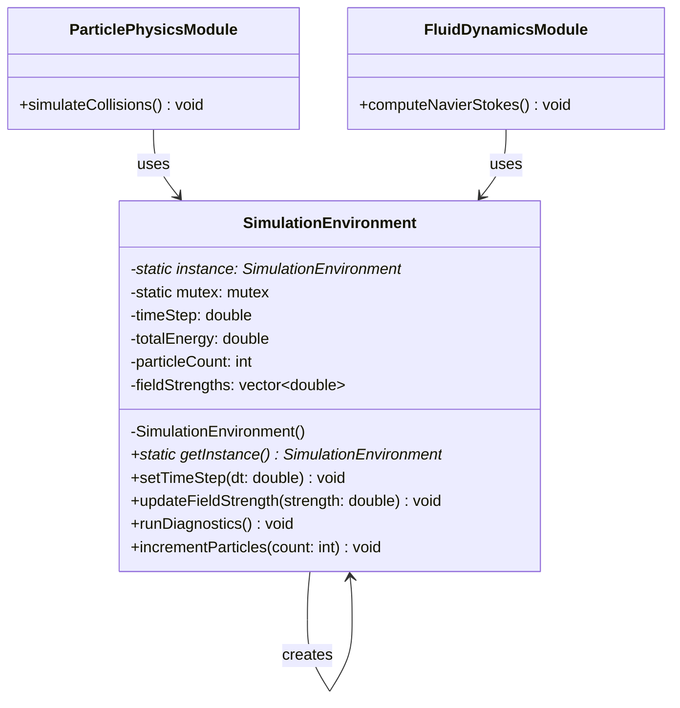

# Singleton Pattern - HPC Simulation Environment Manager

## Intent
Provide a single, globally accessible simulation environment for High-Performance Computing (HPC) applications, managing shared resources like GPU memory, MPI communicators, and field solvers across distributed computing nodes.

## Scientific Computing Context
In computational physics and HPC applications, certain resources must be globally managed:
- **MPI World Communicator**: Single instance across all processes
- **GPU Context Manager**: Shared CUDA/OpenCL contexts
- **Global Field Solver**: Unified electromagnetic field computation
- **Memory Pool Manager**: Centralized allocation for large simulations

## When to Use in Scientific Computing
- Managing global simulation parameters in molecular dynamics
- Coordinating distributed finite element method (FEM) solvers
- Maintaining single instance of numerical libraries (BLAS, LAPACK)
- Controlling access to specialized hardware (quantum processors, FPGAs)

## Structure



## Implementation Details

### Key Components
1. **Private Constructor**: Initializes MPI environment, GPU contexts, and memory pools
2. **Simulation Parameters**: Time step, energy tracking, particle counts
3. **Thread-Safe Access**: Critical for parallel HPC computations
4. **Resource Management**: Handles GPU allocation and field solver initialization

### Algorithm
```
1. HPC module requests SimulationEnvironment access
2. Lock mutex (critical in MPI environments)
3. If environment not initialized:
   - Initialize MPI communicators
   - Allocate GPU resources
   - Set up field solvers
   - Configure memory pools
4. Return environment instance
5. Release mutex
6. Module performs computations using shared resources
```

## Advantages in Scientific Computing
- **Resource Efficiency**: Single GPU context shared across modules
- **Consistency**: Unified simulation parameters across distributed nodes
- **Memory Management**: Centralized large array allocation
- **Performance**: Avoids duplicate initialization of numerical libraries

## Disadvantages in HPC Context
- **Scalability Bottleneck**: Can limit distributed computing performance
- **Testing Complexity**: Difficult to unit test parallel algorithms
- **MPI Challenges**: Synchronization across nodes adds latency
- **NUMA Effects**: Memory access patterns may not be optimal

## Example Output
```
=== Particle Physics Simulation Control ===

Initializing global simulation environment...
Setting up MPI communication channels...
Allocating GPU resources...
Time step updated to: 1e-09 seconds
Field strength recorded: 2.5 Tesla
Field strength recorded: 3.7 Tesla

Same simulation environment? Yes

=== Simulation Diagnostics ===
Total energy: 19.94 Joules
Particle count: 1000000
Field measurements: 2
Time step: 1e-09 seconds
```

## Scientific Computing Variations
1. **MPI Singleton**: Coordinated across all MPI ranks
2. **GPU Context Singleton**: CUDA/OpenCL resource management
3. **Solver Registry**: Single instance managing multiple numerical solvers
4. **Distributed Singleton**: Coherent state across compute clusters

## Related Patterns in Scientific Computing
- **Factory Method**: Creates specialized solvers (FEM, FVM, spectral)
- **Strategy**: Swappable numerical integration schemes
- **Observer**: Monitors convergence in iterative solvers
- **Object Pool**: Manages reusable matrix/vector objects

## 🔧 Compilation & Usage

### Prerequisites
- **C++ Standard**: C++11 or later
- **Compiler**: GCC 4.8+, Clang 3.4+, MSVC 2015+

### Basic Compilation

#### Linux/macOS
```bash
# Basic compilation
g++ -std=c++11 -o singleton singleton.cpp

# With threading support
g++ -std=c++11 -pthread -o singleton singleton.cpp

# Alternative with Clang
clang++ -std=c++11 -pthread -o singleton singleton.cpp
```

#### Windows (MinGW)
```batch
g++ -std=c++11 -o singleton.exe singleton.cpp
```

#### Windows (MSVC)
```batch
cl /EHsc /std:c++11 singleton.cpp
```

### Advanced Compilation Options

#### Debug Build
```bash
g++ -std=c++11 -pthread -g -O0 -DDEBUG -o singleton_debug singleton.cpp
```

#### Optimized Release Build
```bash
g++ -std=c++11 -pthread -O3 -DNDEBUG -o singleton_release singleton.cpp
```

#### With All Warnings
```bash
g++ -std=c++11 -pthread -Wall -Wextra -Wpedantic -o singleton singleton.cpp
```

#### Sanitizer Builds (Debug)
```bash
# Address sanitizer
g++ -std=c++11 -pthread -fsanitize=address -g -o singleton_asan singleton.cpp

# Thread sanitizer (for threading patterns)
g++ -std=c++11 -pthread -fsanitize=thread -g -o singleton_tsan singleton.cpp
```

### CMake Instructions

Create `CMakeLists.txt`:
```cmake
cmake_minimum_required(VERSION 3.10)
project(SingletonPattern)

# Set C++ standard
set(CMAKE_CXX_STANDARD 11)
set(CMAKE_CXX_STANDARD_REQUIRED ON)

# Find threads package
find_package(Threads REQUIRED)

# Create executable
add_executable(singleton singleton.cpp)

# Link threading library
target_link_libraries(singleton Threads::Threads)

# Compiler-specific options
if(MSVC)
    target_compile_options(singleton PRIVATE /W4)
else()
    target_compile_options(singleton PRIVATE -Wall -Wextra -Wpedantic)
endif()
```

Build with CMake:
```bash
mkdir build && cd build
cmake ..
make  # or cmake --build . on Windows
```

### IDE Integration

#### Visual Studio Code
Create `.vscode/tasks.json`:
```json
{
    "version": "2.0.0",
    "tasks": [
        {
            "label": "build",
            "type": "shell",
            "command": "g++",
            "args": [
                "-std=c++11",
                "-pthread",
                "-g",
                "${file}",
                "-o",
                "${fileDirname}/${fileBasenameNoExtension}"
            ],
            "group": {
                "kind": "build",
                "isDefault": true
            }
        }
    ]
}
```

#### Visual Studio
1. Create new Console Application project
2. Set C++ Language Standard to C++11 in Project Properties
3. Copy the code to main source file
4. Build with Ctrl+F7

#### CLion
1. Open the project directory
2. CLion will auto-detect CMakeLists.txt
3. Build with Ctrl+F9

### Dependencies
- **Standard Library**: `<iostream>`, `<memory>`, `<mutex>`
- **Threading**: pthread (Linux/macOS), Windows threading (Windows)
- **No external dependencies required**

### Platform-Specific Notes

#### Linux
- Install build tools: `sudo apt-get install build-essential`
- GCC recommended version: 7.0+ for better C++11 support

#### macOS
- Install Xcode command line tools: `xcode-select --install`
- Alternative: Install via Homebrew: `brew install gcc`

#### Windows
- **Visual Studio**: Download Visual Studio Community (free)
- **MinGW-w64**: Available via MSYS2 or standalone installer
- **Clang**: Available via Visual Studio or LLVM download

### Troubleshooting

#### Common Issues
1. **"mutex not found"**: Ensure C++11 standard is set
2. **Linking errors**: Add `-pthread` flag on Linux/macOS
3. **MSVC errors**: Use `/std:c++11` or later

#### Performance Tips
- Use `-O2` or `-O3` for production builds
- Consider `-march=native` for CPU-specific optimizations
- Profile with tools like `perf` (Linux) or Visual Studio Profiler