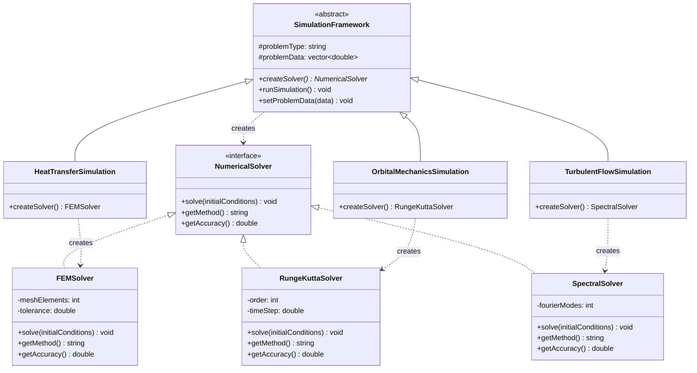

# Factory Method Pattern - Numerical Solver Factory

## Intent
Provide a framework for creating appropriate numerical solvers (FEM, spectral methods, Runge-Kutta) based on the type of scientific problem being solved, allowing simulation frameworks to defer solver selection to specialized subclasses.

## Scientific Computing Context
In computational science, different problems require different numerical methods:
- **Partial Differential Equations (PDEs)**: Heat equation, wave equation → FEM, FVM
- **Ordinary Differential Equations (ODEs)**: N-body problems, chemical kinetics → Runge-Kutta, Adams-Bashforth
- **Fluid Dynamics**: Navier-Stokes equations → Spectral methods, finite difference
- **Quantum Systems**: Schrödinger equation → Split-operator, DVR methods

## When to Use in Scientific Computing
- When the choice of numerical method depends on problem characteristics
- When switching between GPU and CPU implementations based on problem size
- When different accuracy requirements need different solver orders
- When supporting multiple backend libraries (LAPACK, cuBLAS, MKL)

## Structure



## Implementation Details

### Key Components
1. **NumericalSolver**: Abstract interface for all numerical methods
2. **Concrete Solvers**: FEM, Runge-Kutta, Spectral implementations
3. **SimulationFramework**: Abstract class containing factory method
4. **Concrete Simulations**: Heat transfer, orbital mechanics, fluid dynamics

### Algorithm
```
1. Researcher selects simulation type (heat transfer, orbital, etc.)
2. Framework's runSimulation() is called
3. createSolver() factory method selects appropriate numerical method
4. Solver is configured with problem-specific parameters
5. Initial conditions are passed to solver
6. Numerical integration/solution proceeds
7. Results are post-processed
```

## Advantages in Scientific Computing
- **Method Selection**: Automatically chooses optimal solver for problem type
- **Performance Optimization**: Can select GPU vs CPU implementations
- **Accuracy Control**: Different solvers for different precision requirements
- **Library Independence**: Easy to switch between BLAS/LAPACK implementations
- **Extensibility**: New solvers can be added without modifying framework

## Disadvantages in HPC Context
- **Overhead**: Virtual function calls can impact performance in tight loops
- **Memory Layout**: May not be cache-friendly for large-scale computations
- **Parallelization**: Factory pattern doesn't naturally support MPI/OpenMP
- **Compile-time Optimization**: Prevents some compiler optimizations

## Example Output
```
=== Scientific Computing Solver Factory Demo ===

=== Heat Transfer Simulation ===
Selected solver: Galerkin Finite Element Method
Expected accuracy: 1e-06

Preparing initial conditions...
Solving using Finite Element Method
Mesh elements: 1000
Initial temperature field: 473.15 K 373.15 K 323.15 K ...
Assembling stiffness matrix...
Applying boundary conditions...
Solving linear system with tolerance 1e-06

Post-processing results...
Simulation complete.

=== Orbital Mechanics Simulation ===
Selected solver: 4th Order Runge-Kutta
Expected accuracy: 1e-12

Preparing initial conditions...
Solving using Runge-Kutta Method (RK4)
Time step: 0.001 seconds
Initial state vector: 1 0 0 ...
Computing k1, k2, k3, k4 coefficients...
Advancing solution in time...

Post-processing results...
Simulation complete.

=== Turbulent Flow Simulation ===
Selected solver: Pseudo-spectral Method with FFT
Expected accuracy: 3.35463e-12

Preparing initial conditions...
Solving using Spectral Method
Fourier modes: 256
Initial vorticity distribution: 0.1 -0.2 0.15 ...
Performing FFT...
Computing nonlinear terms in spectral space...
Time-stepping with exponential integrator...

Post-processing results...
Simulation complete.
```

## Common Variations in Scientific Computing
1. **Adaptive Factory**: Selects solver based on problem size and available hardware
2. **Multi-physics Factory**: Creates coupled solver systems (fluid-structure interaction)
3. **Precision-based Factory**: Returns single/double/quad precision implementations
4. **Backend Factory**: Switches between cuBLAS, MKL, OpenBLAS at runtime

## Related Patterns in Scientific Computing
- **Abstract Factory**: Creates families of related solvers (linear + nonlinear)
- **Strategy**: Interchangeable numerical integration schemes
- **Builder**: Constructs complex solver configurations (preconditioners, multigrid)
- **Singleton**: Manages global solver resources (GPU contexts, MPI communicators)

## 🔧 Compilation & Usage

### Prerequisites
- **C++ Standard**: C++11 or later
- **Compiler**: GCC 4.8+, Clang 3.4+, MSVC 2015+

### Basic Compilation

#### Linux/macOS
```bash
# Basic compilation
g++ -std=c++11 -o factory_method factory_method.cpp

# Alternative with Clang
clang++ -std=c++11 -o factory_method factory_method.cpp
```

#### Windows (MinGW)
```batch
g++ -std=c++11 -o factory_method.exe factory_method.cpp
```

#### Windows (MSVC)
```batch
cl /EHsc /std:c++11 factory_method.cpp
```

### Advanced Compilation Options

#### Debug Build
```bash
g++ -std=c++11 -g -O0 -DDEBUG -o factory_method_debug factory_method.cpp
```

#### Optimized Release Build
```bash
g++ -std=c++11 -O3 -DNDEBUG -o factory_method_release factory_method.cpp
```

#### With All Warnings
```bash
g++ -std=c++11 -Wall -Wextra -Wpedantic -o factory_method factory_method.cpp
```

#### Sanitizer Builds (Debug)
```bash
# Address sanitizer
g++ -std=c++11 -fsanitize=address -g -o factory_method_asan factory_method.cpp

# Undefined behavior sanitizer
g++ -std=c++11 -fsanitize=undefined -g -o factory_method_ubsan factory_method.cpp
```

### CMake Instructions

Create `CMakeLists.txt`:
```cmake
cmake_minimum_required(VERSION 3.10)
project(FactoryMethodPattern)

# Set C++ standard
set(CMAKE_CXX_STANDARD 11)
set(CMAKE_CXX_STANDARD_REQUIRED ON)

# Create executable
add_executable(factory_method factory_method.cpp)

# Compiler-specific options
if(MSVC)
    target_compile_options(factory_method PRIVATE /W4)
else()
    target_compile_options(factory_method PRIVATE -Wall -Wextra -Wpedantic)
endif()
```

Build with CMake:
```bash
mkdir build && cd build
cmake ..
make  # or cmake --build . on Windows
```

### IDE Integration

#### Visual Studio Code
Create `.vscode/tasks.json`:
```json
{
    "version": "2.0.0",
    "tasks": [
        {
            "label": "build",
            "type": "shell",
            "command": "g++",
            "args": [
                "-std=c++11",
                "-g",
                "${file}",
                "-o",
                "${fileDirname}/${fileBasenameNoExtension}"
            ],
            "group": {
                "kind": "build",
                "isDefault": true
            }
        }
    ]
}
```

#### Visual Studio
1. Create new Console Application project
2. Set C++ Language Standard to C++11 in Project Properties
3. Copy the code to main source file
4. Build with Ctrl+F7

#### CLion
1. Open the project directory
2. CLion will auto-detect CMakeLists.txt
3. Build with Ctrl+F9

### Dependencies
- **Standard Library**: `<iostream>`, `<memory>`
- **No external dependencies required**

### Platform-Specific Notes

#### Linux
- Install build tools: `sudo apt-get install build-essential`
- GCC recommended version: 7.0+ for better C++11 support

#### macOS
- Install Xcode command line tools: `xcode-select --install`
- Alternative: Install via Homebrew: `brew install gcc`

#### Windows
- **Visual Studio**: Download Visual Studio Community (free)
- **MinGW-w64**: Available via MSYS2 or standalone installer
- **Clang**: Available via Visual Studio or LLVM download

### Troubleshooting

#### Common Issues
1. **"unique_ptr not found"**: Ensure C++11 standard is set
2. **"make_unique not found"**: Use GCC 4.9+ or implement make_unique manually
3. **MSVC errors**: Use `/std:c++11` or later

#### Performance Tips
- Use `-O2` or `-O3` for production builds
- Consider `-march=native` for CPU-specific optimizations
- Profile with tools like `perf` (Linux) or Visual Studio Profiler