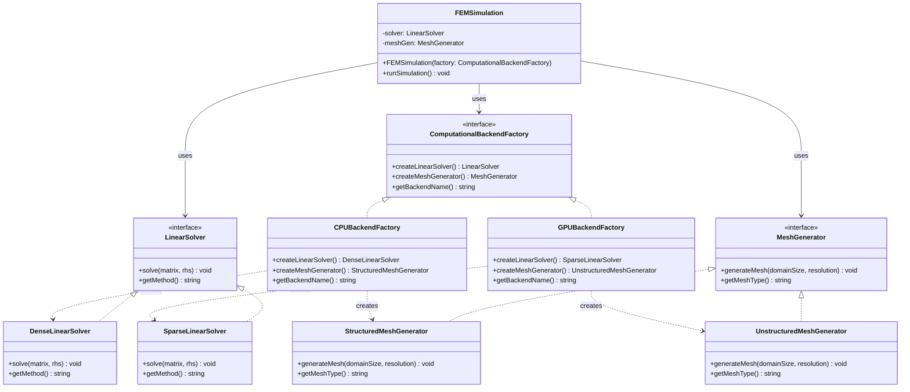

# Abstract Factory Pattern - Scientific Computing Backend Factory

## Intent
Provide an interface for creating families of related computational components (linear solvers, mesh generators, integrators) that work together efficiently on specific hardware architectures (CPU clusters, GPU accelerators, quantum processors).

## Scientific Computing Context
In HPC environments, different hardware backends require different implementations:
- **CPU Clusters**: Dense matrix operations, structured meshes, MPI communication
- **GPU Accelerators**: Sparse operations, unstructured meshes, CUDA/OpenCL
- **Quantum Processors**: Quantum circuit optimizers, variational solvers
- **FPGA Arrays**: Custom precision arithmetic, streaming algorithms

## When to Use in Scientific Computing
- Switching between CPU and GPU implementations based on problem size
- Supporting multiple numerical libraries (Intel MKL, cuBLAS, MAGMA)
- Creating consistent solver-preconditioner-mesh generator combinations
- Developing portable code across different HPC architectures

## Structure



## Implementation Details

### Key Components
1. **ComputationalBackendFactory**: Abstract interface for creating computational components
2. **Concrete Factories**: CPU and GPU backend implementations
3. **Abstract Products**: LinearSolver and MeshGenerator interfaces
4. **Concrete Products**: Specific implementations optimized for each backend
5. **FEMSimulation**: Client using abstract interfaces for portability

### Algorithm
```
1. Select appropriate backend based on:
   - Problem size and sparsity
   - Available hardware
   - Precision requirements
2. Factory creates compatible solver and mesh generator
3. Components are optimized to work together:
   - Matching data structures
   - Aligned memory layouts
   - Coordinated parallelization
4. Simulation runs using backend-specific optimizations
5. Results are hardware-independent
```

## Advantages in Scientific Computing
- **Performance Optimization**: Each backend fully utilizes hardware capabilities
- **Consistency**: Solver and mesh generator use compatible data structures
- **Portability**: Same simulation code runs on different architectures
- **Maintainability**: New backends can be added without changing client code
- **Testing**: Easy to test with mock factories

## Disadvantages in HPC Context
- **Compilation Complexity**: May need different build configurations per backend
- **Memory Overhead**: Abstract interfaces add indirection
- **Static Nature**: Difficult to switch backends at runtime for adaptive algorithms
- **Feature Parity**: Not all operations available on all backends

## Example Output
```
=== Scientific Computing Backend Factory Demo ===

--- Heat Conduction Analysis ---

Initializing Heat Conduction in Reactor Vessel simulation
Backend: CPU-Optimized Backend (Intel MKL)

=== Running Heat Conduction in Reactor Vessel ===
Step 1: Mesh Generation
Generating structured Cartesian mesh
Domain: [0, 1]^3
Grid points: 100^3
Creating uniform spacing...
Setting up connectivity matrix...
Mesh type: Structured Cartesian

Step 2: Solving Linear System
Solving linear system using Dense LU decomposition (LAPACK)
Matrix size: 1000x1000
Using optimized BLAS Level 3 operations
Factorizing matrix...
Forward/backward substitution...
Solver: Dense LU (LAPACK)

Simulation completed successfully!

--------------------------------------------------

--- Fluid Dynamics Analysis ---

Initializing Turbulent Flow in Combustion Chamber simulation
Backend: GPU-Accelerated Backend (CUDA)

=== Running Turbulent Flow in Combustion Chamber ===
Step 1: Mesh Generation
Generating unstructured tetrahedral mesh
Domain: Complex geometry, max dimension 1
Target elements: ~1000000
Delaunay triangulation in progress...
Optimizing mesh quality (aspect ratio)...
Mesh type: Unstructured Tetrahedral

Step 2: Solving Linear System
Solving sparse linear system using GPU-accelerated CG (cuSPARSE)
Matrix size: 1000x1000
Transferring data to GPU...
Preconditioning with incomplete Cholesky...
Iterating until convergence (tol=1e-10)...
Solver: GPU Sparse CG (cuSPARSE)

Simulation completed successfully!
```

## Common Variations in Scientific Computing
1. **Multi-Physics Factory**: Creates coupled solver families (fluid-structure, electromagnetics-heat)
2. **Precision-Based Factory**: Single/double/quad precision implementations
3. **Distributed Factory**: MPI-based components for cluster computing
4. **Adaptive Factory**: Switches between direct and iterative solvers based on conditioning

## Related Patterns in Scientific Computing
- **Strategy**: Interchangeable numerical algorithms within a solver
- **Builder**: Constructs complex solver configurations with preconditioners
- **Singleton**: Manages global GPU contexts or MPI communicators
- **Adapter**: Wraps different numerical libraries with common interface

## 🔧 Compilation & Usage

### Prerequisites
- **C++ Standard**: C++11 or later
- **Compiler**: GCC 4.8+, Clang 3.4+, MSVC 2015+

### Basic Compilation

#### Linux/macOS
```bash
# Basic compilation
g++ -std=c++11 -o abstract_factory abstract_factory.cpp

# Alternative with Clang
clang++ -std=c++11 -o abstract_factory abstract_factory.cpp
```

#### Windows (MinGW)
```batch
g++ -std=c++11 -o abstract_factory.exe abstract_factory.cpp
```

#### Windows (MSVC)
```batch
cl /EHsc /std:c++11 abstract_factory.cpp
```

### Advanced Compilation Options

#### Debug Build
```bash
g++ -std=c++11 -g -O0 -DDEBUG -o abstract_factory_debug abstract_factory.cpp
```

#### Optimized Release Build
```bash
g++ -std=c++11 -O3 -DNDEBUG -o abstract_factory_release abstract_factory.cpp
```

#### With All Warnings
```bash
g++ -std=c++11 -Wall -Wextra -Wpedantic -o abstract_factory abstract_factory.cpp
```

#### Sanitizer Builds (Debug)
```bash
# Address sanitizer
g++ -std=c++11 -fsanitize=address -g -o abstract_factory_asan abstract_factory.cpp

# Undefined behavior sanitizer
g++ -std=c++11 -fsanitize=undefined -g -o abstract_factory_ubsan abstract_factory.cpp
```

### CMake Instructions

Create `CMakeLists.txt`:
```cmake
cmake_minimum_required(VERSION 3.10)
project(AbstractFactoryPattern)

# Set C++ standard
set(CMAKE_CXX_STANDARD 11)
set(CMAKE_CXX_STANDARD_REQUIRED ON)

# Create executable
add_executable(abstract_factory abstract_factory.cpp)

# Compiler-specific options
if(MSVC)
    target_compile_options(abstract_factory PRIVATE /W4)
else()
    target_compile_options(abstract_factory PRIVATE -Wall -Wextra -Wpedantic)
endif()
```

Build with CMake:
```bash
mkdir build && cd build
cmake ..
make  # or cmake --build . on Windows
```

### IDE Integration

#### Visual Studio Code
Create `.vscode/tasks.json`:
```json
{
    "version": "2.0.0",
    "tasks": [
        {
            "label": "build",
            "type": "shell",
            "command": "g++",
            "args": [
                "-std=c++11",
                "-g",
                "${file}",
                "-o",
                "${fileDirname}/${fileBasenameNoExtension}"
            ],
            "group": {
                "kind": "build",
                "isDefault": true
            }
        }
    ]
}
```

#### Visual Studio
1. Create new Console Application project
2. Set C++ Language Standard to C++11 in Project Properties
3. Copy the code to main source file
4. Build with Ctrl+F7

#### CLion
1. Open the project directory
2. CLion will auto-detect CMakeLists.txt
3. Build with Ctrl+F9

### Dependencies
- **Standard Library**: `<iostream>`, `<memory>`, `<vector>`, `<string>`
- **No external dependencies required**

### Platform-Specific Notes

#### Linux
- Install build tools: `sudo apt-get install build-essential`
- GCC recommended version: 7.0+ for better C++11 support

#### macOS
- Install Xcode command line tools: `xcode-select --install`
- Alternative: Install via Homebrew: `brew install gcc`

#### Windows
- **Visual Studio**: Download Visual Studio Community (free)
- **MinGW-w64**: Available via MSYS2 or standalone installer
- **Clang**: Available via Visual Studio or LLVM download

### Troubleshooting

#### Common Issues
1. **"unique_ptr not found"**: Ensure C++11 standard is set
2. **"make_unique not found"**: Use GCC 4.9+ or implement make_unique manually
3. **MSVC errors**: Use `/std:c++11` or later

#### Performance Tips
- Use `-O2` or `-O3` for production builds
- Consider `-march=native` for CPU-specific optimizations
- Profile with tools like `perf` (Linux) or Visual Studio Profiler