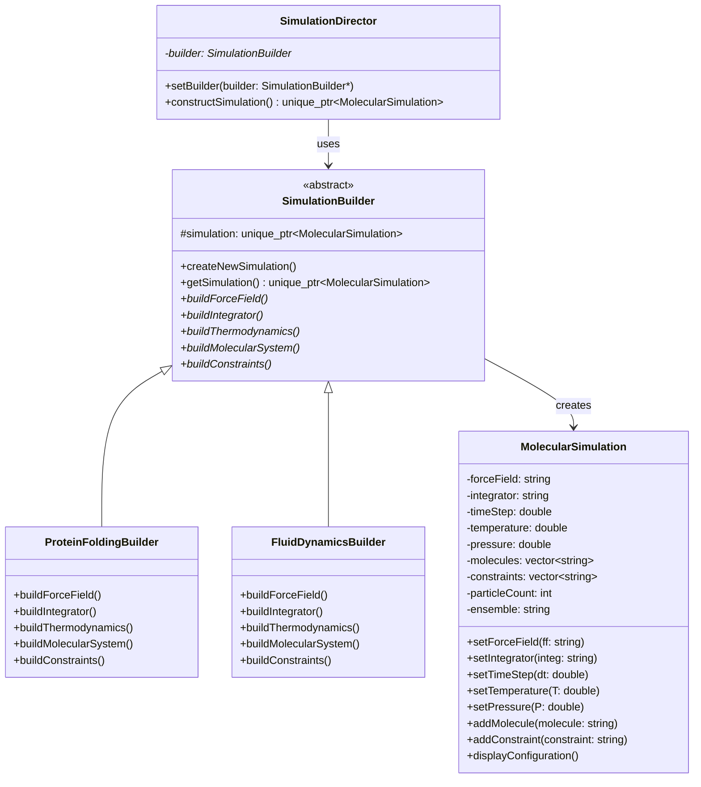

# Builder Pattern - Molecular Dynamics Simulation Builder

## Intent
Construct complex molecular dynamics simulations step-by-step, allowing different configurations for various scientific applications (protein folding, fluid dynamics, crystal structure analysis) while maintaining a consistent construction process.

## Scientific Computing Context
Molecular dynamics simulations require careful configuration of:
- **Force Fields**: AMBER, CHARMM, OPLS-AA, Lennard-Jones
- **Integrators**: Verlet, Leapfrog, Langevin dynamics, Nosé-Hoover
- **Thermodynamic Ensembles**: NVE, NVT, NPT, μVT
- **Constraints**: SHAKE, LINCS, periodic boundaries, PME electrostatics
- **System Composition**: Proteins, solvents, ions, ligands

## When to Use in Scientific Computing
- Setting up complex multi-component simulations
- Ensuring compatible parameter combinations (force field + water model)
- Creating reproducible simulation protocols
- Building simulations with different levels of complexity
- Generating input files for different MD engines (GROMACS, AMBER, NAMD)

## Structure



## Implementation Details

### Key Components
1. **MolecularSimulation**: Complex product representing complete MD simulation
2. **SimulationBuilder**: Abstract interface for building simulation components
3. **Concrete Builders**: Specialized builders for different simulation types
4. **SimulationDirector**: Orchestrates the construction process

### Algorithm
```
1. Select appropriate builder based on simulation type:
   - Protein folding → ProteinFoldingBuilder
   - Fluid dynamics → FluidDynamicsBuilder
   - Crystal dynamics → CrystalDynamicsBuilder
2. Director executes construction sequence:
   - Create force field configuration
   - Set up numerical integrator
   - Configure thermodynamic parameters
   - Build molecular system
   - Apply constraints and boundary conditions
3. Validate parameter compatibility
4. Return complete simulation configuration
```

## Advantages in Scientific Computing
- **Consistency**: Ensures compatible parameter combinations
- **Reproducibility**: Standardized construction process for papers
- **Flexibility**: Easy to create new simulation types
- **Validation**: Can validate parameters during construction
- **Abstraction**: Hides complexity of parameter interdependencies

## Disadvantages in HPC Context
- **Memory Overhead**: Builder objects add memory footprint
- **Performance**: Extra abstraction layers in setup phase
- **Static Configuration**: Difficult to modify during runtime
- **Learning Curve**: Requires understanding of builder hierarchy

## Example Output
```
=== Molecular Dynamics Simulation Builder Demo ===

Constructing Protein Folding Simulation...

=== Molecular Dynamics Simulation Configuration ===
Force Field: AMBER ff14SB
Integrator: Langevin Dynamics
Time Step: 2 fs
Temperature: 310.15 K
Pressure: 1 atm
Ensemble: NPT
Total Particles: 31416
Molecular Species: Protein (1UBQ) TIP3P Water (10000) Na+ ions (20) Cl- ions (20) 
Constraints: SHAKE (H-bonds) Periodic Boundary Conditions Long-range Electrostatics (PME) 

Initializing simulation...
Loading crystal structure from PDB...
Solvating protein in water box...
Adding counterions for neutralization...
Energy minimization in progress...

Constructing Fluid Dynamics Simulation...

=== Molecular Dynamics Simulation Configuration ===
Force Field: Lennard-Jones 12-6
Integrator: Velocity Verlet
Time Step: 0.005 fs
Temperature: 298.15 K
Pressure: 100 atm
Ensemble: NVE
Total Particles: 100000
Molecular Species: Argon atoms (100000) 
Constraints: Neighbor Lists (Verlet) Cutoff 2.5σ Tail Corrections 

Initializing simulation...
Creating FCC lattice of Argon atoms...
Assigning Maxwell-Boltzmann velocities...
Equilibrating system for 100 ps...
Ready for production run...
```

## Common Variations in Scientific Computing
1. **Parameter Sweep Builder**: Creates multiple simulations with varying parameters
2. **Replica Exchange Builder**: Sets up parallel tempering simulations
3. **Coarse-Grained Builder**: Builds simplified molecular representations
4. **Quantum/Classical Builder**: Combines QM and MM regions

## Related Patterns in Scientific Computing
- **Factory Method**: Creates specific force field implementations
- **Strategy**: Interchangeable integration algorithms
- **Template Method**: Defines simulation workflow
- **Prototype**: Clones existing simulation configurations

## 🔧 Compilation & Usage

### Prerequisites
- **C++ Standard**: C++11 or later
- **Compiler**: GCC 4.8+, Clang 3.4+, MSVC 2015+

### Basic Compilation

#### Linux/macOS
```bash
# Basic compilation
g++ -std=c++11 -o builder builder.cpp

# Alternative with Clang
clang++ -std=c++11 -o builder builder.cpp
```

#### Windows (MinGW)
```batch
g++ -std=c++11 -o builder.exe builder.cpp
```

#### Windows (MSVC)
```batch
cl /EHsc /std:c++11 builder.cpp
```

### Advanced Compilation Options

#### Debug Build
```bash
g++ -std=c++11 -g -O0 -DDEBUG -o builder_debug builder.cpp
```

#### Optimized Release Build
```bash
g++ -std=c++11 -O3 -DNDEBUG -o builder_release builder.cpp
```

#### With All Warnings
```bash
g++ -std=c++11 -Wall -Wextra -Wpedantic -o builder builder.cpp
```

#### Sanitizer Builds (Debug)
```bash
# Address sanitizer (recommended for memory leak detection)
g++ -std=c++11 -fsanitize=address -g -o builder_asan builder.cpp

# Undefined behavior sanitizer
g++ -std=c++11 -fsanitize=undefined -g -o builder_ubsan builder.cpp
```

### CMake Instructions

Create `CMakeLists.txt`:
```cmake
cmake_minimum_required(VERSION 3.10)
project(BuilderPattern)

# Set C++ standard
set(CMAKE_CXX_STANDARD 11)
set(CMAKE_CXX_STANDARD_REQUIRED ON)

# Create executable
add_executable(builder builder.cpp)

# Compiler-specific options
if(MSVC)
    target_compile_options(builder PRIVATE /W4)
else()
    target_compile_options(builder PRIVATE -Wall -Wextra -Wpedantic)
endif()
```

Build with CMake:
```bash
mkdir build && cd build
cmake ..
make  # or cmake --build . on Windows
```

### IDE Integration

#### Visual Studio Code
Create `.vscode/tasks.json`:
```json
{
    "version": "2.0.0",
    "tasks": [
        {
            "label": "build",
            "type": "shell",
            "command": "g++",
            "args": [
                "-std=c++11",
                "-g",
                "${file}",
                "-o",
                "${fileDirname}/${fileBasenameNoExtension}"
            ],
            "group": {
                "kind": "build",
                "isDefault": true
            }
        }
    ]
}
```

#### Visual Studio
1. Create new Console Application project
2. Set C++ Language Standard to C++11 in Project Properties
3. Copy the code to main source file
4. Build with Ctrl+F7

#### CLion
1. Open the project directory
2. CLion will auto-detect CMakeLists.txt
3. Build with Ctrl+F9

### Dependencies
- **Standard Library**: `<iostream>`, `<string>`, `<vector>`, `<memory>`
- **No external dependencies required**

### Platform-Specific Notes

#### Linux
- Install build tools: `sudo apt-get install build-essential`
- GCC recommended version: 7.0+ for better C++11 support

#### macOS
- Install Xcode command line tools: `xcode-select --install`
- Alternative: Install via Homebrew: `brew install gcc`

#### Windows
- **Visual Studio**: Download Visual Studio Community (free)
- **MinGW-w64**: Available via MSYS2 or standalone installer
- **Clang**: Available via Visual Studio or LLVM download

### Troubleshooting

#### Common Issues
1. **"unique_ptr not found"**: Ensure C++11 standard is set
2. **"make_unique not found"**: Use GCC 4.9+ or implement make_unique manually
3. **Memory management**: Uses smart pointers for automatic cleanup
4. **MSVC errors**: Use `/std:c++11` or later

#### Performance Tips
- Use `-O2` or `-O3` for production builds
- Consider `-march=native` for CPU-specific optimizations
- Profile with tools like `perf` (Linux) or Visual Studio Profiler

#### Memory Management Notes
- This example uses `std::unique_ptr` for automatic memory management
- No manual delete required with smart pointers
- Use address sanitizer during development to verify memory safety