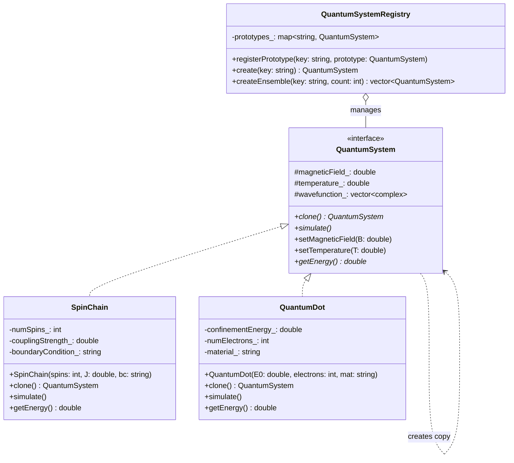

# Prototype Pattern - Quantum System State Cloning

## Intent
Create new quantum system configurations by cloning existing prototypical states, enabling efficient parameter sweeps, ensemble generation for Monte Carlo simulations, and parallel computation setup in quantum physics and condensed matter simulations.

## Scientific Computing Context
In quantum simulations, creating system variations is essential for:
- **Parameter Sweeps**: Varying magnetic field, temperature, coupling strengths
- **Ensemble Averages**: Multiple copies for statistical mechanics
- **Parallel Tempering**: Different temperature replicas
- **Disorder Averaging**: Multiple realizations of random potentials
- **Quantum Monte Carlo**: Independent Markov chains

## When to Use in Scientific Computing
- Setting up parameter scans for phase diagrams
- Creating thermal ensembles for canonical averages
- Initializing parallel quantum Monte Carlo walkers
- Generating disorder realizations in condensed matter
- Replicating successful configurations for optimization

## Structure



## Implementation Details

### Key Components
1. **QuantumSystem**: Abstract interface with clone() method
2. **Concrete Systems**: SpinChain, QuantumDot with specific physics
3. **QuantumSystemRegistry**: Manages prototype instances
4. **Clone Method**: Deep copies quantum states and parameters

### Algorithm
```
1. Create prototype quantum systems:
   - Initialize Hamiltonians
   - Set default parameters
   - Prepare ground states
2. Register prototypes by descriptive keys
3. For parameter sweeps:
   - Clone prototype
   - Modify parameters (B-field, temperature)
   - Run simulation
4. For ensemble generation:
   - Create multiple clones
   - Assign different random seeds
   - Run parallel simulations
```

## Advantages in Scientific Computing
- **Efficiency**: Avoid re-initializing complex Hamiltonians
- **Consistency**: All copies start from validated states
- **Parallelization**: Easy distribution across compute nodes
- **Memory Optimization**: Shared read-only data structures
- **Reproducibility**: Exact state replication for debugging

## Disadvantages in HPC Context
- **Memory Overhead**: Large wavefunctions require deep copying
- **Cache Inefficiency**: Cloned objects may have poor locality
- **Synchronization**: Managing many copies requires coordination
- **State Drift**: Numerical errors can accumulate differently

## Example Output
```
=== Quantum System Prototype Registry Demo ===

=== Magnetic Field Parameter Sweep ===

Simulating Heisenberg Spin Chain:
  Spins: 10
  Coupling J: -1 meV
  Boundary: periodic
  Magnetic Field: 0 T
  Temperature: 300 K
  Ground State Energy: 9 meV

Simulating Heisenberg Spin Chain:
  Spins: 10
  Coupling J: -1 meV
  Boundary: periodic
  Magnetic Field: 5 T
  Temperature: 300 K
  Ground State Energy: -16 meV

Simulating Heisenberg Spin Chain:
  Spins: 10
  Coupling J: -1 meV
  Boundary: periodic
  Magnetic Field: 10 T
  Temperature: 300 K
  Ground State Energy: -41 meV

=== Temperature Ensemble Generation ===

Ensemble member 1:
Simulating Quantum Dot System:
  Material: GaAs
  Electrons: 2
  Confinement E0: 5 meV
  Magnetic Field: 2 T
  Temperature: 4.2 K
  Total Energy: 12.32 meV

Ensemble member 2:
Simulating Quantum Dot System:
  Material: GaAs
  Electrons: 2
  Confinement E0: 5 meV
  Magnetic Field: 2 T
  Temperature: 77 K
  Total Energy: 12.32 meV

Ensemble member 3:
Simulating Quantum Dot System:
  Material: GaAs
  Electrons: 2
  Confinement E0: 5 meV
  Magnetic Field: 2 T
  Temperature: 300 K
  Total Energy: 12.32 meV

=== Parallel Computation Setup ===

Creating 4 copies for parallel Monte Carlo...
Thread 0: Initialized quantum dot
Thread 1: Initialized quantum dot
Thread 2: Initialized quantum dot
Thread 3: Initialized quantum dot

Ready for distributed quantum Monte Carlo simulation
```

## Common Variations in Scientific Computing
1. **Lazy Clone**: Defer wavefunction copying until modification
2. **Shallow Clone**: Share immutable Hamiltonian data
3. **Hierarchical Prototype**: Base systems with specialized variants
4. **Checkpoint Prototype**: Clone from saved simulation states

## Related Patterns in Scientific Computing
- **Factory Method**: Creates initial quantum states
- **Builder**: Constructs complex many-body systems
- **Flyweight**: Shares common Hamiltonian matrices
- **Memento**: Saves/restores quantum states during evolution

## 🔧 Compilation & Usage

### Prerequisites
- **C++ Standard**: C++11 or later
- **Compiler**: GCC 4.8+, Clang 3.4+, MSVC 2015+

### Basic Compilation

#### Linux/macOS
```bash
# Basic compilation
g++ -std=c++11 -o prototype prototype.cpp

# Alternative with Clang
clang++ -std=c++11 -o prototype prototype.cpp
```

#### Windows (MinGW)
```batch
g++ -std=c++11 -o prototype.exe prototype.cpp
```

#### Windows (MSVC)
```batch
cl /EHsc /std:c++11 prototype.cpp
```

### Advanced Compilation Options

#### Debug Build
```bash
g++ -std=c++11 -g -O0 -DDEBUG -o prototype_debug prototype.cpp
```

#### Optimized Release Build
```bash
g++ -std=c++11 -O3 -DNDEBUG -o prototype_release prototype.cpp
```

#### With All Warnings
```bash
g++ -std=c++11 -Wall -Wextra -Wpedantic -o prototype prototype.cpp
```

#### Sanitizer Builds (Debug)
```bash
# Address sanitizer
g++ -std=c++11 -fsanitize=address -g -o prototype_asan prototype.cpp

# Undefined behavior sanitizer
g++ -std=c++11 -fsanitize=undefined -g -o prototype_ubsan prototype.cpp
```

### CMake Instructions

Create `CMakeLists.txt`:
```cmake
cmake_minimum_required(VERSION 3.10)
project(PrototypePattern)

# Set C++ standard
set(CMAKE_CXX_STANDARD 11)
set(CMAKE_CXX_STANDARD_REQUIRED ON)

# Create executable
add_executable(prototype prototype.cpp)

# Compiler-specific options
if(MSVC)
    target_compile_options(prototype PRIVATE /W4)
else()
    target_compile_options(prototype PRIVATE -Wall -Wextra -Wpedantic)
endif()
```

Build with CMake:
```bash
mkdir build && cd build
cmake ..
make  # or cmake --build . on Windows
```

### IDE Integration

#### Visual Studio Code
Create `.vscode/tasks.json`:
```json
{
    "version": "2.0.0",
    "tasks": [
        {
            "label": "build",
            "type": "shell",
            "command": "g++",
            "args": [
                "-std=c++11",
                "-g",
                "${file}",
                "-o",
                "${fileDirname}/${fileBasenameNoExtension}"
            ],
            "group": {
                "kind": "build",
                "isDefault": true
            }
        }
    ]
}
```

#### Visual Studio
1. Create new Console Application project
2. Set C++ Language Standard to C++11 in Project Properties
3. Copy the code to main source file
4. Build with Ctrl+F7

#### CLion
1. Open the project directory
2. CLion will auto-detect CMakeLists.txt
3. Build with Ctrl+F9

### Dependencies
- **Standard Library**: `<iostream>`, `<memory>`, `<unordered_map>`, `<string>`, `<vector>`, `<complex>`
- **No external dependencies required**

### Platform-Specific Notes

#### Linux
- Install build tools: `sudo apt-get install build-essential`
- GCC recommended version: 7.0+ for better C++11 support

#### macOS
- Install Xcode command line tools: `xcode-select --install`
- Alternative: Install via Homebrew: `brew install gcc`

#### Windows
- **Visual Studio**: Download Visual Studio Community (free)
- **MinGW-w64**: Available via MSYS2 or standalone installer
- **Clang**: Available via Visual Studio or LLVM download

### Troubleshooting

#### Common Issues
1. **"complex not found"**: Include `<complex>` header
2. **"make_unique not found"**: Use GCC 4.9+ or implement make_unique manually
3. **Deep copy performance**: Consider copy-on-write for large wavefunctions
4. **Memory usage**: Monitor when creating many ensemble copies
5. **MSVC errors**: Use `/std:c++11` or later

#### Performance Tips
- Use `-O2` or `-O3` for production builds
- Consider `-march=native` for CPU-specific optimizations
- Profile with tools like `perf` (Linux) or Visual Studio Profiler

#### Design Considerations
- **Wavefunction Copying**: Implement efficient deep copy for large arrays
- **Parameter Independence**: Ensure cloned systems evolve independently
- **Memory Pool**: Consider pre-allocating for ensemble generation