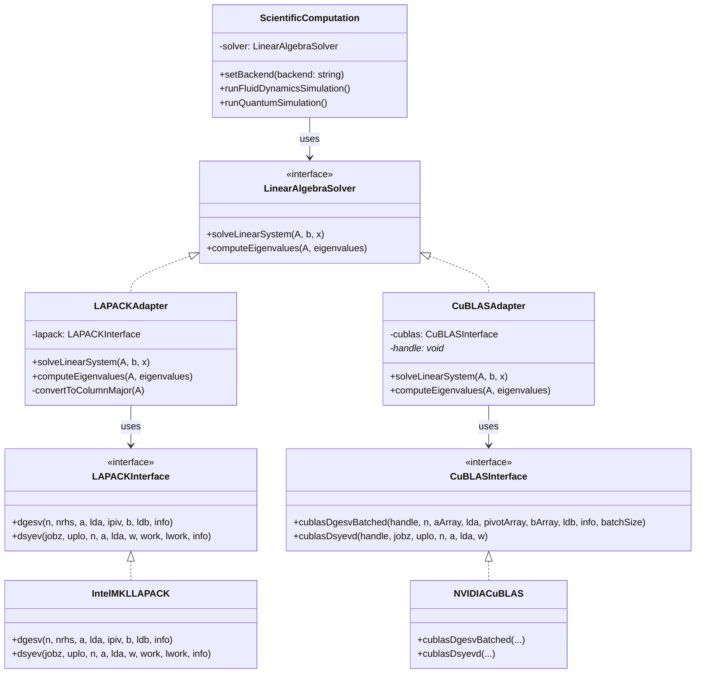

# Adapter Pattern - Numerical Library Interface Adapter

## Intent
Enable seamless integration of different scientific computing libraries (Intel MKL, OpenBLAS, cuBLAS, MAGMA) with incompatible interfaces into a unified computational framework, allowing researchers to switch between CPU and GPU backends without modifying their scientific code.

## Scientific Computing Context
Scientific computing relies on various numerical libraries:
- **LAPACK/BLAS**: CPU-based linear algebra (column-major, Fortran interface)
- **Intel MKL**: Optimized CPU library (AVX-512, parallel algorithms)
- **cuBLAS/cuSOLVER**: NVIDIA GPU libraries (device memory, CUDA handles)
- **MAGMA**: Hybrid CPU-GPU library (heterogeneous computing)
- **Eigen**: C++ template library (expression templates, row-major)

## When to Use in Scientific Computing
- Integrating legacy Fortran libraries into modern C++ frameworks
- Switching between CPU and GPU implementations based on problem size
- Supporting multiple hardware vendors (Intel, AMD, NVIDIA)
- Migrating from one numerical library to another
- Building portable scientific applications

## Structure



## Implementation Details

### Key Components
1. **LinearAlgebraSolver**: Unified interface for scientific computations
2. **ScientificComputation**: Client using the unified interface
3. **Library Interfaces**: LAPACK, cuBLAS with specific conventions
4. **Adapters**: Convert between unified interface and library-specific calls

### Algorithm
```
1. Client selects computational backend (CPU/GPU)
2. Appropriate adapter is instantiated
3. Scientific computation calls unified interface
4. Adapter performs necessary conversions:
   - Data layout (row-major ↔ column-major)
   - Memory location (host ↔ device)
   - API conventions (C++ ↔ Fortran)
5. Native library performs computation
6. Results converted back to expected format
```

## Advantages in Scientific Computing
- **Portability**: Same code runs on different hardware
- **Performance**: Choose optimal backend for problem size
- **Legacy Support**: Use well-tested Fortran libraries
- **Flexibility**: Easy to add new numerical libraries
- **Testing**: Mock adapters for unit testing

## Disadvantages in HPC Context
- **Overhead**: Data conversion costs (row/column major)
- **Memory**: Extra copies for format conversion
- **Features**: Lowest common denominator of features
- **Optimization**: May miss library-specific optimizations

## Example Output
```
=== Scientific Computing Library Adapter Demo ===

--- CPU-based Computations ---
Selected CPU backend (Intel MKL)

=== Fluid Dynamics Pressure Solver ===

Adapting unified interface to LAPACK format...
Intel MKL: Solving linear system Ax=b
  Matrix size: 4x4
  Using optimized LU decomposition (dgesv)
  Utilizing AVX-512 instructions
Solution computed successfully

=== Quantum System Energy Levels ===

Adapting unified interface to LAPACK format...
Intel MKL: Computing eigenvalues
  Symmetric matrix size: 3x3
  Using divide-and-conquer algorithm (dsyev)
Eigenvalues computed successfully

--- GPU-accelerated Computations ---
Selected GPU backend (NVIDIA cuBLAS)

=== Fluid Dynamics Pressure Solver ===

Adapting unified interface to cuBLAS GPU format...
Allocating GPU memory...
Transferring data to GPU...
NVIDIA cuBLAS: Batch solving linear systems on GPU
  Batch size: 1
  Matrix size per system: 4x4
  Using parallel LU decomposition on CUDA cores
  Memory transfer: Host -> Device
Transferring results back to CPU...
GPU computation completed

=== Quantum System Energy Levels ===

Adapting unified interface to cuBLAS GPU format...
NVIDIA cuBLAS: GPU eigenvalue computation
  Matrix size: 3x3
  Using Jacobi algorithm on GPU
  Tensor cores acceleration enabled
GPU eigenvalue computation completed

Adapter pattern allows switching between CPU and GPU
backends without changing the scientific code!
```

## Common Variations in Scientific Computing
1. **Multi-Backend Adapter**: Dynamically selects CPU vs GPU based on matrix size
2. **Precision Adapter**: Converts between single/double/quad precision
3. **Distributed Adapter**: Adapts to MPI-based libraries (ScaLAPACK)
4. **Expression Template Adapter**: Interfaces with Eigen, Armadillo

## Related Patterns in Scientific Computing
- **Strategy**: Different numerical algorithms for same operation
- **Bridge**: Separates abstraction from implementation
- **Facade**: Simplifies complex numerical library APIs
- **Decorator**: Adds logging/profiling to computations

## 🔧 Compilation & Usage

### Prerequisites
- **C++ Standard**: C++11 or later
- **Compiler**: GCC 4.8+, Clang 3.4+, MSVC 2015+

### Basic Compilation

#### Linux/macOS
```bash
# Basic compilation
g++ -std=c++11 -o adapter adapter.cpp

# Alternative with Clang
clang++ -std=c++11 -o adapter adapter.cpp
```

#### Windows (MinGW)
```batch
g++ -std=c++11 -o adapter.exe adapter.cpp
```

#### Windows (MSVC)
```batch
cl /EHsc /std:c++11 adapter.cpp
```

### Advanced Compilation Options

#### Debug Build
```bash
g++ -std=c++11 -g -O0 -DDEBUG -o adapter_debug adapter.cpp
```

#### Optimized Release Build
```bash
g++ -std=c++11 -O3 -DNDEBUG -o adapter_release adapter.cpp
```

#### With All Warnings
```bash
g++ -std=c++11 -Wall -Wextra -Wpedantic -o adapter adapter.cpp
```

#### Sanitizer Builds (Debug)
```bash
# Address sanitizer
g++ -std=c++11 -fsanitize=address -g -o adapter_asan adapter.cpp

# Undefined behavior sanitizer
g++ -std=c++11 -fsanitize=undefined -g -o adapter_ubsan adapter.cpp
```

### CMake Instructions

Create `CMakeLists.txt`:
```cmake
cmake_minimum_required(VERSION 3.10)
project(AdapterPattern)

# Set C++ standard
set(CMAKE_CXX_STANDARD 11)
set(CMAKE_CXX_STANDARD_REQUIRED ON)

# Create executable
add_executable(adapter adapter.cpp)

# Compiler-specific options
if(MSVC)
    target_compile_options(adapter PRIVATE /W4)
else()
    target_compile_options(adapter PRIVATE -Wall -Wextra -Wpedantic)
endif()
```

Build with CMake:
```bash
mkdir build && cd build
cmake ..
make  # or cmake --build . on Windows
```

### IDE Integration

#### Visual Studio Code
Create `.vscode/tasks.json`:
```json
{
    "version": "2.0.0",
    "tasks": [
        {
            "label": "build",
            "type": "shell",
            "command": "g++",
            "args": [
                "-std=c++11",
                "-g",
                "${file}",
                "-o",
                "${fileDirname}/${fileBasenameNoExtension}"
            ],
            "group": {
                "kind": "build",
                "isDefault": true
            }
        }
    ]
}
```

#### Visual Studio
1. Create new Console Application project
2. Set C++ Language Standard to C++11 in Project Properties
3. Copy the code to main source file
4. Build with Ctrl+F7

#### CLion
1. Open the project directory
2. CLion will auto-detect CMakeLists.txt
3. Build with Ctrl+F9

### Dependencies
- **Standard Library**: `<iostream>`, `<memory>`, `<vector>`, `<string>`
- **No external dependencies required**

### Platform-Specific Notes

#### Linux
- Install build tools: `sudo apt-get install build-essential`
- GCC recommended version: 7.0+ for better C++11 support

#### macOS
- Install Xcode command line tools: `xcode-select --install`
- Alternative: Install via Homebrew: `brew install gcc`

#### Windows
- **Visual Studio**: Download Visual Studio Community (free)
- **MinGW-w64**: Available via MSYS2 or standalone installer
- **Clang**: Available via Visual Studio or LLVM download

### Troubleshooting

#### Common Issues
1. **"vector not found"**: Include `<vector>` header
2. **"make_unique not found"**: Use GCC 4.9+ or implement make_unique manually
3. **Data layout issues**: Verify row-major vs column-major conversions
4. **Performance**: Profile data conversion overhead
5. **MSVC errors**: Use `/std:c++11` or later

#### Performance Tips
- Use `-O2` or `-O3` for production builds
- Consider `-march=native` for CPU-specific optimizations
- Minimize data conversions by caching transformed data
- Use zero-copy techniques where possible

#### Design Considerations
- **Memory Layout**: Be aware of performance implications of data conversion
- **Error Handling**: Propagate library-specific error codes appropriately
- **Thread Safety**: Ensure adapters handle library threading requirements