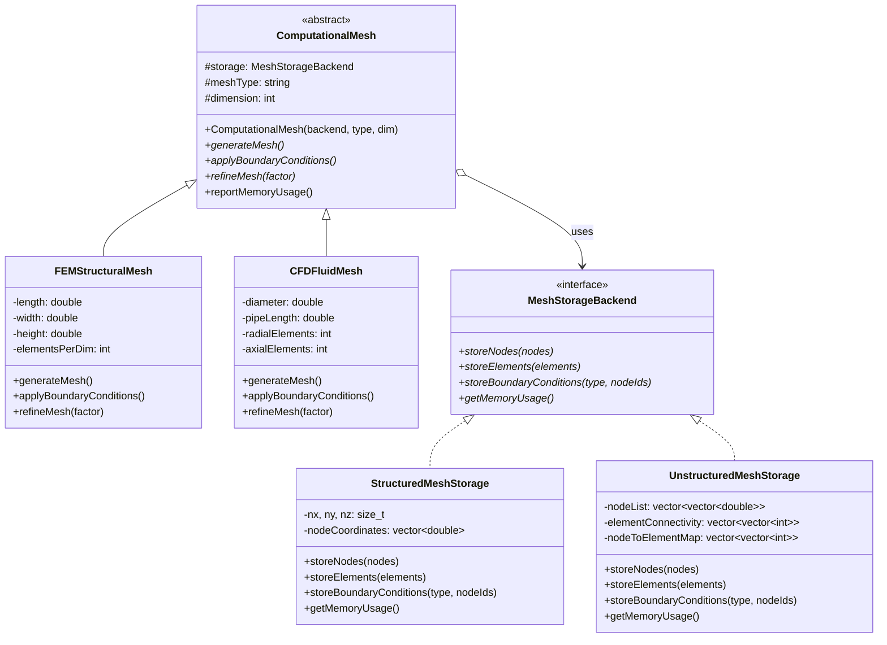

# Bridge Pattern - Computational Mesh Framework

## Intent
Decouple mesh abstraction (FEM, CFD, molecular dynamics) from storage implementation (structured arrays, unstructured graphs, octrees), allowing both to vary independently for optimal performance across different scientific computing scenarios.

## Scientific Computing Context
Computational meshes vary in both physics abstraction and storage:
- **Mesh Types**: Structured grids, unstructured tetrahedral, adaptive octrees
- **Storage Backends**: Array-based (cache-friendly), graph-based (flexible), compressed
- **Physics Domains**: Structural FEM, fluid CFD, electromagnetic, molecular
- **Memory Patterns**: Row-major, column-major, sparse, hierarchical

## When to Use in Scientific Computing
- Supporting both structured and unstructured mesh algorithms
- Optimizing storage for different hardware (CPU cache vs GPU memory)
- Switching between in-core and out-of-core storage
- Building multi-physics frameworks with varied mesh requirements
- Developing portable simulation codes across HPC systems

## Structure



## Implementation Details

### Key Components
1. **ComputationalMesh**: Abstract mesh interface for physics simulations
2. **Refined Meshes**: FEM structural, CFD fluid, molecular dynamics meshes
3. **MeshStorageBackend**: Interface for storage implementations
4. **Concrete Storage**: Structured (array), unstructured (graph), adaptive

### Algorithm
```
1. Select mesh type based on physics (FEM, CFD, MD)
2. Choose storage backend based on:
   - Mesh topology (structured vs unstructured)
   - Hardware target (CPU vs GPU)
   - Memory constraints (in-core vs out-of-core)
3. Generate mesh through abstraction interface
4. Storage backend handles data layout optimization
5. Apply physics-specific boundary conditions
6. Storage adapts to access patterns
```

## Advantages in Scientific Computing
- **Performance**: Optimal storage for each mesh type
- **Flexibility**: Mix structured/unstructured in same simulation
- **Scalability**: Switch storage for problem size
- **Hardware Adaptation**: CPU-optimized vs GPU-optimized storage
- **Code Reuse**: Physics algorithms independent of storage

## Disadvantages in HPC Context
- **Indirection Overhead**: Virtual function calls in hot loops
- **Memory Fragmentation**: Multiple storage strategies
- **Complexity**: Two hierarchies to maintain
- **Cache Effects**: Abstraction may hurt locality

## Example Output
```
=== Computational Mesh Bridge Pattern Demo ===

Creating computational meshes with different storage backends:

=== Generating FEM Structural Mesh ===
Domain: 10m x 1m x 1m
Elements: 20^3 = 8000

Structured Storage: Storing nodes in 3D array format
  Using implicit indexing (i,j,k) -> linear index
  Memory layout: Contiguous for cache efficiency
Structured Storage: Elements implicitly defined by grid
  Hexahedral elements from regular connectivity
  No explicit storage needed - computed on demand

Applying structural boundary conditions:
Structured Storage: Boundary condition 'Fixed_Displacement'
  Storing as face indices (6 faces per hex)
  Nodes: 4 boundary points
Structured Storage: Boundary condition 'Applied_Force'
  Storing as face indices (6 faces per hex)
  Nodes: 4 boundary points

Memory usage: 0 bytes

=== Generating CFD Pipe Flow Mesh ===
Domain: D=0.1m, L=2m
Mesh density: 10 radial x 50 axial

Unstructured Storage: Storing nodes in coordinate list
  Flexible positioning for complex geometries
  Building spatial hash for fast neighbor queries
Unstructured Storage: Explicit element connectivity
  Supporting mixed element types (tet, hex, prism)
  Building element adjacency graph

Applying CFD boundary conditions:
Unstructured Storage: Boundary condition 'Velocity_Inlet'
  Marking nodes with boundary flags
  Creating boundary element list
Unstructured Storage: Boundary condition 'No_Slip_Wall'
  Marking nodes with boundary flags
  Creating boundary element list
Unstructured Storage: Boundary condition 'Pressure_Outlet'
  Marking nodes with boundary flags
  Creating boundary element list

Memory usage: 118448 bytes

=== Adaptive Mesh Refinement ===

Mesh refined by factor 1.5
New resolution: 30 elements per dimension

CFD mesh refined by factor 2
New density: 20 x 100

=== Storage Backend Comparison ===
Creating same mesh with different storage:

=== Generating FEM Structural Mesh ===
Domain: 10m x 1m x 1m
Elements: 20^3 = 8000

Unstructured Storage: Storing nodes in coordinate list
  Flexible positioning for complex geometries
  Building spatial hash for fast neighbor queries
Unstructured Storage: Explicit element connectivity
  Supporting mixed element types (tet, hex, prism)
  Building element adjacency graph

Memory usage: 76128 bytes

Bridge pattern allows switching between structured and
unstructured storage without changing mesh algorithms!
```

## Common Variations in Scientific Computing
1. **Hierarchical Storage**: Octree/AMR mesh backends
2. **Distributed Storage**: MPI-partitioned mesh storage
3. **Compressed Storage**: Wavelet-compressed mesh data
4. **GPU Storage**: Device-optimized memory layouts
5. **Hybrid Storage**: Mixed structured/unstructured regions

## Related Patterns in Scientific Computing
- **Strategy**: Different refinement algorithms
- **Adapter**: Interface with external mesh libraries
- **Composite**: Hierarchical mesh structures
- **Flyweight**: Share common mesh elements

## 🔧 Compilation & Usage

### Prerequisites
- **C++ Standard**: C++11 or later
- **Compiler**: GCC 4.8+, Clang 3.4+, MSVC 2015+

### Basic Compilation

#### Linux/macOS
```bash
# Basic compilation
g++ -std=c++11 -o bridge bridge.cpp

# Alternative with Clang
clang++ -std=c++11 -o bridge bridge.cpp
```

#### Windows (MinGW)
```batch
g++ -std=c++11 -o bridge.exe bridge.cpp
```

#### Windows (MSVC)
```batch
cl /EHsc /std:c++11 bridge.cpp
```

### Advanced Compilation Options

#### Debug Build
```bash
g++ -std=c++11 -g -O0 -DDEBUG -o bridge_debug bridge.cpp
```

#### Optimized Release Build
```bash
g++ -std=c++11 -O3 -DNDEBUG -o bridge_release bridge.cpp
```

#### With All Warnings
```bash
g++ -std=c++11 -Wall -Wextra -Wpedantic -o bridge bridge.cpp
```

#### Sanitizer Builds (Debug)
```bash
# Address sanitizer
g++ -std=c++11 -fsanitize=address -g -o bridge_asan bridge.cpp

# Undefined behavior sanitizer
g++ -std=c++11 -fsanitize=undefined -g -o bridge_ubsan bridge.cpp
```

### CMake Instructions

Create `CMakeLists.txt`:
```cmake
cmake_minimum_required(VERSION 3.10)
project(BridgePattern)

# Set C++ standard
set(CMAKE_CXX_STANDARD 11)
set(CMAKE_CXX_STANDARD_REQUIRED ON)

# Create executable
add_executable(bridge bridge.cpp)

# Compiler-specific options
if(MSVC)
    target_compile_options(bridge PRIVATE /W4)
else()
    target_compile_options(bridge PRIVATE -Wall -Wextra -Wpedantic)
endif()
```

Build with CMake:
```bash
mkdir build && cd build
cmake ..
make  # or cmake --build . on Windows
```

### IDE Integration

#### Visual Studio Code
Create `.vscode/tasks.json`:
```json
{
    "version": "2.0.0",
    "tasks": [
        {
            "label": "build",
            "type": "shell",
            "command": "g++",
            "args": [
                "-std=c++11",
                "-g",
                "${file}",
                "-o",
                "${fileDirname}/${fileBasenameNoExtension}"
            ],
            "group": {
                "kind": "build",
                "isDefault": true
            }
        }
    ]
}
```

#### Visual Studio
1. Create new Console Application project
2. Set C++ Language Standard to C++11 in Project Properties
3. Copy the code to main source file
4. Build with Ctrl+F7

#### CLion
1. Open the project directory
2. CLion will auto-detect CMakeLists.txt
3. Build with Ctrl+F9

### Dependencies
- **Standard Library**: `<iostream>`, `<memory>`, `<vector>`, `<string>`
- **Math Library**: `<cmath>` for trigonometric functions
- **No external dependencies required**

### Platform-Specific Notes

#### Linux
- Install build tools: `sudo apt-get install build-essential`
- GCC recommended version: 7.0+ for better C++11 support

#### macOS
- Install Xcode command line tools: `xcode-select --install`
- Alternative: Install via Homebrew: `brew install gcc`

#### Windows
- **Visual Studio**: Download Visual Studio Community (free)
- **MinGW-w64**: Available via MSYS2 or standalone installer
- **Clang**: Available via Visual Studio or LLVM download

### Troubleshooting

#### Common Issues
1. **"shared_ptr not found"**: Ensure C++11 standard is set
2. **Math functions**: Link with `-lm` on some systems
3. **Memory calculations**: Check for integer overflow with large meshes
4. **Virtual function overhead**: Profile in performance-critical sections
5. **MSVC errors**: Use `/std:c++11` or later

#### Performance Tips
- Use `-O2` or `-O3` for production builds
- Consider `-march=native` for CPU-specific optimizations
- Profile virtual function overhead in tight loops
- Consider template-based static polymorphism for hot paths

#### Design Considerations
- **Storage Selection**: Choose based on access patterns and hardware
- **Memory Efficiency**: Monitor memory usage for large-scale simulations
- **Parallelization**: Ensure storage backend is thread-safe for OpenMP/MPI