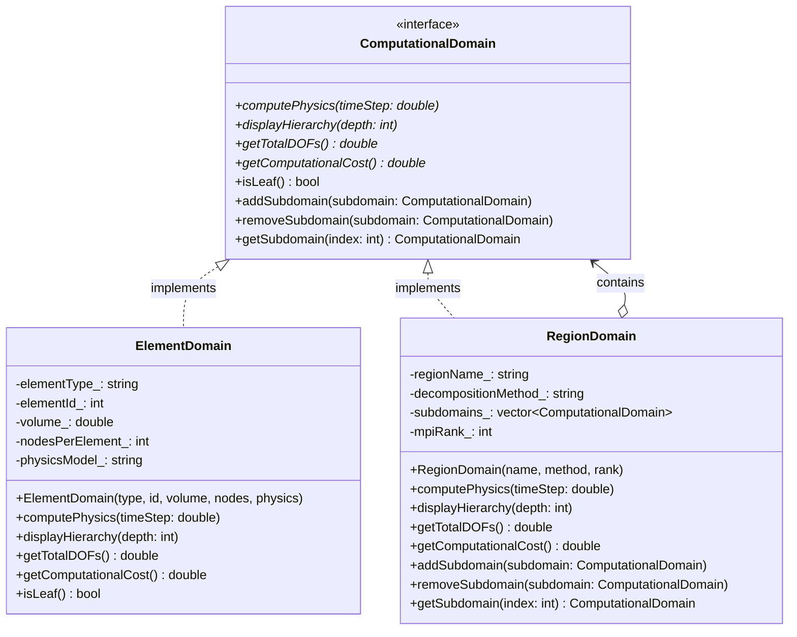

# Composite Pattern - Hierarchical Simulation Domain Decomposition

## Intent
Create tree structures of computational domains for multi-scale physics simulations, enabling uniform treatment of individual elements and complex hierarchical regions in parallel scientific computing environments.

## Scientific Computing Context
Multi-scale simulations require hierarchical domain decomposition:
- **Global Models**: Earth system, climate, ocean circulation
- **Regional Refinement**: Nested grids, adaptive mesh refinement (AMR)
- **Local Physics**: Turbulence, chemical reactions, micro-scale phenomena
- **Parallel Decomposition**: MPI domains, load balancing, ghost cells
- **Multi-Physics Coupling**: Different equations at different scales

## When to Use in Scientific Computing
- Building adaptive mesh refinement (AMR) hierarchies
- Creating multi-scale ocean/atmosphere models
- Implementing domain decomposition for parallel computing
- Developing nested grid systems for weather prediction
- Managing hierarchical particle-mesh structures

## Structure



## Implementation Details

### Key Components
1. **ComputationalDomain**: Abstract interface for all domains
2. **ElementDomain**: Leaf nodes where actual physics computation occurs
3. **RegionDomain**: Composite nodes managing subdomains
4. **MPI Integration**: Process assignment for parallel execution

### Algorithm
```
1. Build hierarchical domain tree:
   - Global domain at root
   - Regional subdivisions
   - Element-level leaves
2. Assign MPI ranks to regions
3. Recursively compute physics:
   - Composite delegates to children
   - Leaves perform actual computation
4. Exchange boundary data between siblings
5. Aggregate results up the tree
```

## Advantages in Scientific Computing
- **Scalability**: Natural parallel decomposition
- **Flexibility**: Mix different physics at different scales
- **Load Balancing**: Redistribute subtrees to balance computation
- **Adaptive Refinement**: Add/remove regions dynamically
- **Code Reuse**: Uniform interface for all scales

## Disadvantages in HPC Context
- **Communication Overhead**: Tree traversal costs
- **Memory Hierarchy**: May not match hardware topology
- **Synchronization**: Implicit barriers between levels
- **Load Imbalance**: Uneven trees cause idle processors

## Example Output
```
=== Multi-Scale Domain Decomposition Demo ===

Domain Decomposition Hierarchy:
===============================
[Global Ocean Model] (Recursive Coordinate Bisection, Rank 0)
  [Atlantic Basin] (Graph Partitioning, Rank 1)
    [Gulf Stream Region] (Adaptive Refinement, Rank 1)
      └─ Hexahedral[1001]: Navier-Stokes + Heat Transport (27 DOFs)
      └─ Hexahedral[1002]: Navier-Stokes + Heat Transport (27 DOFs)
      └─ Tetrahedral[1003]: Turbulence Model (LES) (10 DOFs)
    [Sargasso Sea] (Uniform Decomposition, Rank 1)
      └─ Hexahedral[2001]: Hydrostatic Approximation (27 DOFs)
      └─ Hexahedral[2002]: Hydrostatic Approximation (27 DOFs)
  [Pacific Basin] (Graph Partitioning, Rank 2)
    └─ Prism[3001]: Shallow Water Equations (18 DOFs)
    └─ Prism[3002]: Shallow Water Equations (18 DOFs)

Computational Statistics:
========================
Total DOFs in system: 474
Atlantic region DOFs: 366
Gulf Stream DOFs: 192

Estimated computational cost: 117964 FLOPS

=== Running Multi-Scale Ocean Simulation ===

Region 'Global Ocean Model' (MPI Rank 0):
Decomposition: Recursive Coordinate Bisection

Region 'Atlantic Basin' (MPI Rank 1):
Decomposition: Graph Partitioning

Region 'Gulf Stream Region' (MPI Rank 1):
Decomposition: Adaptive Refinement
Element 1001: Computing Navier-Stokes + Heat Transport (dt=300s)
  Solving on 27 nodes
  Volume: 1e+06 m³
Element 1002: Computing Navier-Stokes + Heat Transport (dt=300s)
  Solving on 27 nodes
  Volume: 1e+06 m³
Element 1003: Computing Turbulence Model (LES) (dt=300s)
  Solving on 10 nodes
  Volume: 500000 m³
Exchanging boundary data between 3 subdomains

Region 'Sargasso Sea' (MPI Rank 1):
Decomposition: Uniform Decomposition
Element 2001: Computing Hydrostatic Approximation (dt=300s)
  Solving on 27 nodes
  Volume: 8e+06 m³
Element 2002: Computing Hydrostatic Approximation (dt=300s)
  Solving on 27 nodes
  Volume: 8e+06 m³
Exchanging boundary data between 2 subdomains
Exchanging boundary data between 2 subdomains

Region 'Pacific Basin' (MPI Rank 2):
Decomposition: Graph Partitioning
Element 3001: Computing Shallow Water Equations (dt=300s)
  Solving on 18 nodes
  Volume: 4e+06 m³
Element 3002: Computing Shallow Water Equations (dt=300s)
  Solving on 18 nodes
  Volume: 4e+06 m³
Exchanging boundary data between 2 subdomains
Exchanging boundary data between 2 subdomains

Composite pattern enables hierarchical domain decomposition
for efficient parallel computation in Earth system models!
```

## Common Variations in Scientific Computing
1. **Adaptive Composite**: Dynamic refinement based on error estimates
2. **Load-Balanced Composite**: Redistributes elements for even workload
3. **Multi-Physics Composite**: Different physics models at each level
4. **Ghost Cell Composite**: Manages halo exchange automatically
5. **Temporal Composite**: Different time steps at different scales

## Related Patterns in Scientific Computing
- **Visitor**: Apply analysis operations to entire hierarchy
- **Iterator**: Traverse domains in specific orders
- **Strategy**: Different decomposition methods per region
- **Observer**: Monitor convergence at each level

## 🔧 Compilation & Usage

### Prerequisites
- **C++ Standard**: C++11 or later
- **Compiler**: GCC 4.8+, Clang 3.4+, MSVC 2015+
- **Features Used**: `shared_ptr`, `make_shared`, `vector`, range-based for loops, `override`

### Basic Compilation

#### Linux/macOS
```bash
# Basic compilation
g++ -std=c++11 -o composite composite.cpp

# Alternative with Clang
clang++ -std=c++11 -o composite composite.cpp
```

#### Windows (MinGW)
```batch
g++ -std=c++11 -o composite.exe composite.cpp
```

#### Windows (MSVC)
```batch
cl /EHsc /std:c++11 composite.cpp
```

### Advanced Compilation Options

#### Debug Build
```bash
g++ -std=c++11 -g -O0 -DDEBUG -o composite_debug composite.cpp
```

#### Optimized Release Build
```bash
g++ -std=c++11 -O3 -DNDEBUG -o composite_release composite.cpp
```

#### With All Warnings
```bash
g++ -std=c++11 -Wall -Wextra -Wpedantic -o composite composite.cpp
```

#### Sanitizer Builds (Debug)
```bash
# Address sanitizer
g++ -std=c++11 -fsanitize=address -g -o composite_asan composite.cpp

# Undefined behavior sanitizer
g++ -std=c++11 -fsanitize=undefined -g -o composite_ubsan composite.cpp

# Memory leak detection
g++ -std=c++11 -fsanitize=leak -g -o composite_lsan composite.cpp
```

### CMake Instructions

Create `CMakeLists.txt`:
```cmake
cmake_minimum_required(VERSION 3.10)
project(CompositePattern)

# Set C++ standard
set(CMAKE_CXX_STANDARD 11)
set(CMAKE_CXX_STANDARD_REQUIRED ON)

# Create executable
add_executable(composite composite.cpp)

# Compiler-specific options
if(MSVC)
    target_compile_options(composite PRIVATE /W4)
else()
    target_compile_options(composite PRIVATE -Wall -Wextra -Wpedantic)
endif()

# Enable debug symbols in debug mode
if(CMAKE_BUILD_TYPE STREQUAL "Debug")
    target_compile_options(composite PRIVATE -g)
endif()
```

Build with CMake:
```bash
mkdir build && cd build
cmake ..
make  # or cmake --build . on Windows
```

### IDE Integration

#### Visual Studio Code
Create `.vscode/tasks.json`:
```json
{
    "version": "2.0.0",
    "tasks": [
        {
            "label": "build",
            "type": "shell",
            "command": "g++",
            "args": [
                "-std=c++11",
                "-g",
                "${file}",
                "-o",
                "${fileDirname}/${fileBasenameNoExtension}"
            ],
            "group": {
                "kind": "build",
                "isDefault": true
            }
        }
    ]
}
```

#### Visual Studio
1. Create new Console Application project
2. Set C++ Language Standard to C++11 in Project Properties
3. Copy the code to main source file
4. Build with Ctrl+F7

#### CLion
1. Open the project directory
2. CLion will auto-detect CMakeLists.txt
3. Build with Ctrl+F9

### Dependencies
- **Standard Library**: `<iostream>`, `<vector>`, `<memory>`, `<algorithm>`, `<string>`
- **No external dependencies required**

### Platform-Specific Notes

#### Linux
- Install build tools: `sudo apt-get install build-essential`
- GCC recommended version: 7.0+ for better C++11 support
- For shared_ptr debugging: `sudo apt-get install libc6-dbg`

#### macOS
- Install Xcode command line tools: `xcode-select --install`
- Alternative: Install via Homebrew: `brew install gcc`
- Apple Clang has full C++11 support from Xcode 5.0+

#### Windows
- **Visual Studio**: Download Visual Studio Community (free)
- **MinGW-w64**: Available via MSYS2 or standalone installer
- **Clang**: Available via Visual Studio or LLVM download

### Troubleshooting

#### Common Issues
1. **"shared_ptr not found"**: 
   - Ensure C++11 standard is set
   - Include `<memory>` header
   - Use GCC 4.4+ or equivalent

2. **"make_shared not found"**: 
   - Use GCC 4.6+ or implement make_shared manually
   - Ensure `<memory>` header is included

3. **Tree depth issues**: 
   - Monitor stack usage for deep hierarchies
   - Consider iterative traversal for very large trees

4. **Memory management**: 
   - Use weak_ptr for parent pointers to avoid cycles
   - Monitor with valgrind or address sanitizer

5. **MSVC errors**: 
   - Use `/std:c++11` or later
   - Check for Windows-specific includes

#### Performance Tips
- Use `-O2` or `-O3` for production builds
- Consider `-march=native` for CPU-specific optimizations
- Profile tree traversal overhead
- Optimize for cache locality in element ordering

#### Design Considerations
- **Parallel Traversal**: Consider OpenMP for independent subtrees
- **Load Balancing**: Monitor computation per subtree
- **Memory Layout**: Group elements by access pattern
- **MPI Integration**: Align tree structure with process topology