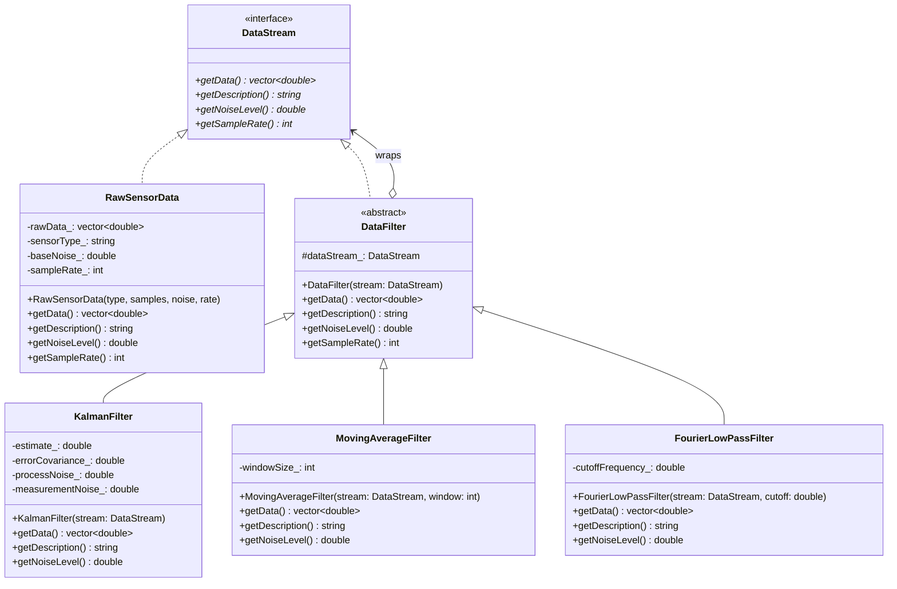

# Decorator Pattern - Scientific Data Filter Pipeline

## Intent
Dynamically compose data processing filters for scientific instruments, allowing flexible combinations of noise reduction, signal processing, and data cleaning algorithms without modifying the core data acquisition system.

## Scientific Computing Context
Scientific data processing requires layered filtering:
- **Noise Reduction**: Kalman filters, moving averages, median filters
- **Signal Processing**: FFT, wavelets, bandpass filters, detrending
- **Outlier Detection**: Statistical methods, isolation forests
- **Data Smoothing**: Savitzky-Golay, splines, LOESS
- **Feature Extraction**: Peak detection, edge detection, derivatives

## When to Use in Scientific Computing
- Building configurable data processing pipelines
- Applying multiple filters to sensor data streams
- Creating reusable signal processing components
- Implementing real-time data cleaning for experiments
- Developing adaptive filtering based on data characteristics

## Structure



## Implementation Details

### Key Components
1. **DataStream**: Interface for all data sources and filters
2. **RawSensorData**: Original data from scientific instruments
3. **DataFilter**: Base decorator maintaining reference to wrapped stream
4. **Concrete Filters**: Kalman, moving average, FFT, outlier removal

### Algorithm
```
1. Acquire raw sensor data
2. Wrap with first filter decorator
3. Each filter:
   - Retrieves data from wrapped component
   - Applies its transformation
   - Updates metadata (noise level, description)
4. Chain multiple filters as needed
5. Final filtered data available through same interface
```

## Advantages in Scientific Computing
- **Flexibility**: Combine filters in any order
- **Reusability**: Share filters across different experiments
- **Runtime Configuration**: Adjust pipeline based on data quality
- **Testing**: Easy to test individual filters
- **Non-invasive**: Add processing without modifying sensors

## Disadvantages in HPC Context
- **Memory Overhead**: Each filter may copy data
- **Performance**: Multiple passes over data
- **Debugging**: Complex chains hard to trace
- **Ordering**: Some filters must be applied in specific order

## Example Output
```
=== Scientific Data Filter Pipeline Demo ===

--- Pipeline 1: Raw Data ---

Pipeline: Raw Seismometer Data
Sample Rate: 100 Hz
Noise Level: 2
Data samples: 200
Mean value: 0.0923701
First 5 values: -0.835987 -0.61788 1.36242 -0.106756 0.477984 

--- Pipeline 2: Moving Average Filter ---

Pipeline: Raw Seismometer Data -> Moving Average(5)
Sample Rate: 100 Hz
Noise Level: 0.894427
Data samples: 200
Mean value: 0.0923701
First 5 values: -0.835987 -0.726933 -0.0300766 -0.175226 0.477016 

--- Pipeline 3: Kalman Filter ---

Pipeline: Raw Seismometer Data -> Kalman Filter
Sample Rate: 100 Hz
Noise Level: 0.6
Data samples: 200
Mean value: 0.136427
First 5 values: -0.557324 -0.576867 -0.10645 -0.107522 0.117677 

--- Pipeline 4: Multi-Stage Filtering ---
  Outlier detected and removed: 14.0951
  Outlier detected and removed: -12.9653
  Applying FFT low-pass filter (cutoff: 10 Hz)

Pipeline: Raw Magnetometer Data -> Moving Average(3) -> Outlier Removal(2.5σ) -> Kalman Filter -> FFT Low-Pass(10.000000Hz)
Sample Rate: 50 Hz
Noise Level: 0.2
Data samples: 200
Mean value: -0.0321906
First 5 values: -0.910323 -0.754928 -0.303627 -0.283643 -0.0822297 

--- Pipeline 5: Double Kalman Filter ---

Pipeline: Raw Gravitational Wave Detector Data -> Kalman Filter -> Kalman Filter
Sample Rate: 1000 Hz
Noise Level: 0.9
Data samples: 200
Mean value: 0.147261
First 5 values: -0.629363 -0.628738 -0.335018 -0.335066 -0.190957 

Decorator pattern enables flexible composition of
data processing filters for scientific instruments!
```

## Common Variations in Scientific Computing
1. **Adaptive Filters**: Adjust parameters based on signal characteristics
2. **Parallel Filters**: Apply multiple filters and combine results
3. **Conditional Filters**: Apply only when certain conditions met
4. **Streaming Filters**: Process data in chunks for real-time systems
5. **GPU Filters**: Offload computation to accelerators

## Related Patterns in Scientific Computing
- **Chain of Responsibility**: Sequential processing steps
- **Strategy**: Alternative filtering algorithms
- **Composite**: Hierarchical filter trees
- **Pipeline**: Similar but focuses on stages

## 🔧 Compilation & Usage

### Prerequisites
- **C++ Standard**: C++11 or later (required for `std::unique_ptr` and smart pointers)
- **Compiler**: GCC 4.9+, Clang 3.4+, MSVC 2015+
- **Math Library**: Link with `-lm` on Unix systems

### Basic Compilation

#### Linux/macOS
```bash
# Basic compilation
g++ -std=c++11 -o decorator decorator.cpp -lm

# Alternative with Clang
clang++ -std=c++11 -o decorator decorator.cpp -lm
```

#### Windows (MinGW)
```batch
g++ -std=c++11 -o decorator.exe decorator.cpp
```

#### Windows (MSVC)
```batch
cl /EHsc /std:c++11 decorator.cpp
```

### Advanced Compilation Options

#### Debug Build
```bash
g++ -std=c++11 -g -O0 -DDEBUG -o decorator_debug decorator.cpp -lm
```

#### Optimized Release Build
```bash
g++ -std=c++11 -O3 -DNDEBUG -o decorator_release decorator.cpp -lm
```

#### With All Warnings
```bash
g++ -std=c++11 -Wall -Wextra -Wpedantic -o decorator decorator.cpp -lm
```

#### Sanitizer Builds (Debug)
```bash
# Address sanitizer (detects memory leaks and use-after-free)
g++ -std=c++11 -fsanitize=address -g -o decorator_asan decorator.cpp -lm

# Undefined behavior sanitizer
g++ -std=c++11 -fsanitize=undefined -g -o decorator_ubsan decorator.cpp -lm

# Memory sanitizer (Clang only)
clang++ -std=c++11 -fsanitize=memory -g -o decorator_msan decorator.cpp -lm
```

### CMake Instructions

Create `CMakeLists.txt`:
```cmake
cmake_minimum_required(VERSION 3.10)
project(DecoratorPattern)

# Set C++ standard
set(CMAKE_CXX_STANDARD 11)
set(CMAKE_CXX_STANDARD_REQUIRED ON)

# Create executable
add_executable(decorator decorator.cpp)

# Link math library
target_link_libraries(decorator m)

# Compiler-specific options
if(MSVC)
    target_compile_options(decorator PRIVATE /W4)
else()
    target_compile_options(decorator PRIVATE -Wall -Wextra -Wpedantic)
endif()

# Enable debug symbols for Debug builds
if(CMAKE_BUILD_TYPE STREQUAL "Debug")
    target_compile_options(decorator PRIVATE -g)
endif()
```

Build with CMake:
```bash
mkdir build && cd build
cmake ..
make  # or cmake --build . on Windows

# For Release build
cmake -DCMAKE_BUILD_TYPE=Release ..
make
```

### IDE Integration

#### Visual Studio Code
Create `.vscode/tasks.json`:
```json
{
    "version": "2.0.0",
    "tasks": [
        {
            "label": "build",
            "type": "shell",
            "command": "g++",
            "args": [
                "-std=c++11",
                "-g",
                "-Wall",
                "${file}",
                "-o",
                "${fileDirname}/${fileBasenameNoExtension}",
                "-lm"
            ],
            "group": {
                "kind": "build",
                "isDefault": true
            },
            "problemMatcher": ["$gcc"]
        }
    ]
}
```

#### Visual Studio
1. Create new Console Application project
2. Set C++ Language Standard to C++11 or later in Project Properties
3. Copy the code to main source file
4. Build with Ctrl+F7

#### CLion
1. Open the project directory
2. CLion will auto-detect CMakeLists.txt
3. Build with Ctrl+F9
4. Run with Shift+F10

### Dependencies
- **Standard Library**: `<iostream>`, `<memory>`, `<string>`, `<vector>`, `<cmath>`, `<numeric>`
- **C++11 Features**: `std::unique_ptr`, `std::make_unique`, `std::move`, `override`
- **Math Functions**: `sin`, `sqrt`, `abs` from `<cmath>`
- **No external dependencies required**

### Platform-Specific Notes

#### Linux
- Install build tools: `sudo apt-get install build-essential`
- GCC recommended version: 4.9+ for full C++11 support
- Math library usually linked automatically

#### macOS
- Install Xcode command line tools: `xcode-select --install`
- Alternative: Install via Homebrew: `brew install gcc`
- Math library included in system libraries

#### Windows
- **Visual Studio**: Download Visual Studio Community with C++ workload
- **MinGW-w64**: Available via MSYS2 or standalone
- Math functions included in standard library

### Troubleshooting

#### Common Issues
1. **"M_PI undefined"**: 
   - Define `_USE_MATH_DEFINES` before `<cmath>`
   - Or define manually: `const double M_PI = 3.14159265358979323846;`

2. **Math function errors**:
   - Ensure `-lm` flag on Unix systems
   - Check for proper `<cmath>` inclusion

3. **Memory issues with filters**:
   - Use smart pointers consistently
   - Profile with valgrind or sanitizers

4. **Performance with deep chains**:
   - Consider combining filters
   - Profile to identify bottlenecks

5. **Numerical stability**:
   - Monitor filter coefficients
   - Use appropriate data types (double vs float)

#### Performance Tips
- Use `-O2` or `-O3` for production builds
- Consider SIMD instructions for vector operations
- Minimize data copies between filters
- Use in-place algorithms where possible

#### Design Considerations
- **Filter Order**: Some filters must be applied in specific sequence
- **State Management**: Filters like Kalman maintain internal state
- **Thread Safety**: Consider thread-local storage for parallel processing
- **Memory Efficiency**: Stream processing for large datasets