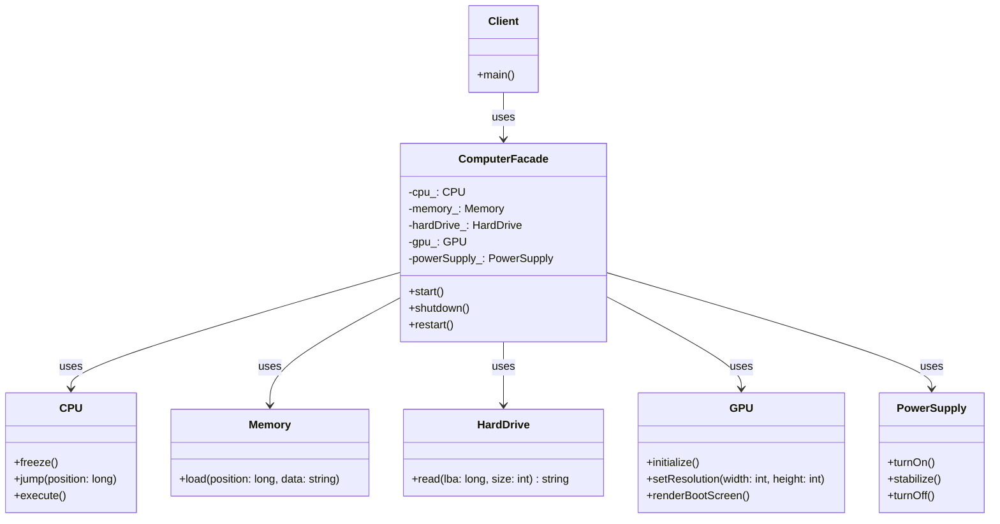

# Facade Pattern

## Intent
Provide a unified interface to a set of interfaces in a subsystem. Facade defines a higher-level interface that makes the subsystem easier to use.

## When to Use
- Want to provide simple interface to complex subsystem
- Many dependencies between clients and implementation classes
- Want to layer subsystems
- Decouple subsystem from clients

## Structure



## Implementation Details

### Key Components
1. **Facade**: Provides simple interface to complex subsystem (ComputerFacade)
2. **Subsystem Classes**: Implement subsystem functionality (CPU, Memory, etc.)
3. **Client**: Uses facade instead of subsystem directly

### Algorithm
```
1. Client calls simple method on Facade
2. Facade orchestrates subsystem objects:
   - Creates/manages subsystem instances
   - Translates client request to subsystem calls
   - Coordinates subsystem interactions
   - Returns unified result
3. Subsystem objects perform actual work
4. Client remains unaware of subsystem complexity
```

## Advantages
- Simplifies client interface
- Decouples client from subsystem
- Promotes weak coupling
- Can provide different facades for different clients

## Disadvantages
- Can become a god object
- May hide important functionality
- Adds extra layer of abstraction
- May limit advanced usage

## Example Output
```
User: Pressing power button

=== Starting Computer ===
PowerSupply: Turning on
PowerSupply: Voltage stabilized
CPU: Freezing processor
GPU: Initializing graphics processor
GPU: Setting resolution to 1920x1080
HardDrive: Reading 512 bytes from sector 0
Memory: Loading data 'boot_data' at position 0
CPU: Jumping to position 0
GPU: Rendering boot screen
CPU: Executing instructions
=== Computer Started Successfully ===

User: Working on computer...

User: Requesting restart

=== Restarting Computer ===
=== Shutting Down Computer ===
CPU: Freezing processor
Saving state...
PowerSupply: Turning off
=== Computer Shut Down ===

Waiting before restart...

=== Starting Computer ===
[... boot sequence repeats ...]
```

## Common Variations
1. **Transparent Facade**: Allows direct subsystem access
2. **Opaque Facade**: Completely hides subsystem
3. **Static Facade**: All methods static
4. **Singleton Facade**: Single instance facade

## Related Patterns
- **Abstract Factory**: Can be used with Facade
- **Mediator**: Similar but Mediator's purpose is different
- **Singleton**: Facade often implemented as singleton
- **Adapter**: Adapts one interface, Facade simplifies many

## 🔧 Compilation & Usage

### Prerequisites
- **C++ Standard**: C++11 or later (required for smart pointers, threading, chrono)
- **Compiler**: GCC 4.8+, Clang 3.4+, MSVC 2015+
- **Threading Support**: POSIX threads (Linux/macOS) or Win32 threads (Windows)

### Basic Compilation

#### Linux/macOS
```bash
# Basic compilation with threading support
g++ -std=c++11 -pthread -o facade facade.cpp

# Alternative with Clang
clang++ -std=c++11 -pthread -o facade facade.cpp
```

#### Windows (MinGW)
```batch
g++ -std=c++11 -pthread -o facade.exe facade.cpp
```

#### Windows (MSVC)
```batch
cl /EHsc /std:c++11 facade.cpp
```

### Advanced Compilation Options

#### Debug Build
```bash
g++ -std=c++11 -pthread -g -O0 -DDEBUG -o facade_debug facade.cpp
```

#### Optimized Release Build
```bash
g++ -std=c++11 -pthread -O3 -DNDEBUG -o facade_release facade.cpp
```

#### With All Warnings
```bash
g++ -std=c++11 -pthread -Wall -Wextra -Wpedantic -o facade facade.cpp
```

#### Sanitizer Builds (Debug)
```bash
# Address sanitizer
g++ -std=c++11 -pthread -fsanitize=address -g -o facade_asan facade.cpp

# Thread sanitizer (recommended for threading code)
g++ -std=c++11 -pthread -fsanitize=thread -g -o facade_tsan facade.cpp

# Undefined behavior sanitizer
g++ -std=c++11 -pthread -fsanitize=undefined -g -o facade_ubsan facade.cpp
```

### CMake Instructions

Create `CMakeLists.txt`:
```cmake
cmake_minimum_required(VERSION 3.10)
project(FacadePattern)

# Set C++ standard
set(CMAKE_CXX_STANDARD 11)
set(CMAKE_CXX_STANDARD_REQUIRED ON)

# Find threading library
find_package(Threads REQUIRED)

# Create executable
add_executable(facade facade.cpp)

# Link threading library
target_link_libraries(facade Threads::Threads)

# Compiler-specific options
if(MSVC)
    target_compile_options(facade PRIVATE /W4)
else()
    target_compile_options(facade PRIVATE -Wall -Wextra -Wpedantic)
endif()
```

Build with CMake:
```bash
mkdir build && cd build
cmake ..
make  # or cmake --build . on Windows
```

### IDE Integration

#### Visual Studio Code
Create `.vscode/tasks.json`:
```json
{
    "version": "2.0.0",
    "tasks": [
        {
            "label": "build",
            "type": "shell",
            "command": "g++",
            "args": [
                "-std=c++11",
                "-pthread",
                "-g",
                "${file}",
                "-o",
                "${fileDirname}/${fileBasenameNoExtension}"
            ],
            "group": {
                "kind": "build",
                "isDefault": true
            }
        }
    ]
}
```

#### Visual Studio
1. Create new Console Application project
2. Set C++ Language Standard to C++11 or later in Project Properties
3. Copy the code to main source file
4. Build with Ctrl+F7

#### CLion
1. Open the project directory
2. CLion will auto-detect CMakeLists.txt
3. Build with Ctrl+F9

### Dependencies
- **Standard Library**: `<iostream>`, `<memory>`, `<thread>`, `<chrono>`, `<string>`
- **Threading Library**: Usually linked automatically, may need `-pthread` flag
- **No external dependencies required**

### Platform-Specific Notes

#### Linux
- Install build tools: `sudo apt-get install build-essential`
- GCC recommended version: 7.0+ for better C++11 support
- Threading support via pthreads (usually included)

#### macOS
- Install Xcode command line tools: `xcode-select --install`
- Alternative: Install via Homebrew: `brew install gcc`
- Threading support included in system libraries

#### Windows
- **Visual Studio**: Download Visual Studio Community (free)
- **MinGW-w64**: Available via MSYS2 or standalone installer
- **Clang**: Available via Visual Studio or LLVM download
- Threading support included in runtime libraries

### Troubleshooting

#### Common Issues
1. **"unique_ptr not found"**: Ensure C++11 standard is set
2. **"make_unique not found"**: Use GCC 4.9+ or implement make_unique manually
3. **"thread not found"**: Link with `-pthread` flag on Linux/macOS
4. **"chrono not found"**: Ensure C++11 standard is set
5. **Threading errors on Windows**: Ensure proper runtime library linkage
6. **MSVC errors**: Use `/std:c++11` or later

#### Performance Tips
- Use `-O2` or `-O3` for production builds
- Consider `-march=native` for CPU-specific optimizations
- Profile threading performance with tools like `perf` (Linux) or Intel VTune
- Monitor thread contention with thread sanitizer

#### Design Considerations
- Thread safety: Current implementation is not thread-safe
- Resource management: Smart pointers ensure proper cleanup
- Timing dependencies: Sleep calls simulate real hardware delays
- Error handling: Add proper error handling for hardware failures

#### Threading Notes
- This example uses `std::this_thread::sleep_for()` for demonstration
- Real implementations should use proper synchronization primitives
- Consider thread-safe patterns if facade will be used concurrently
- Thread sanitizer build recommended for development