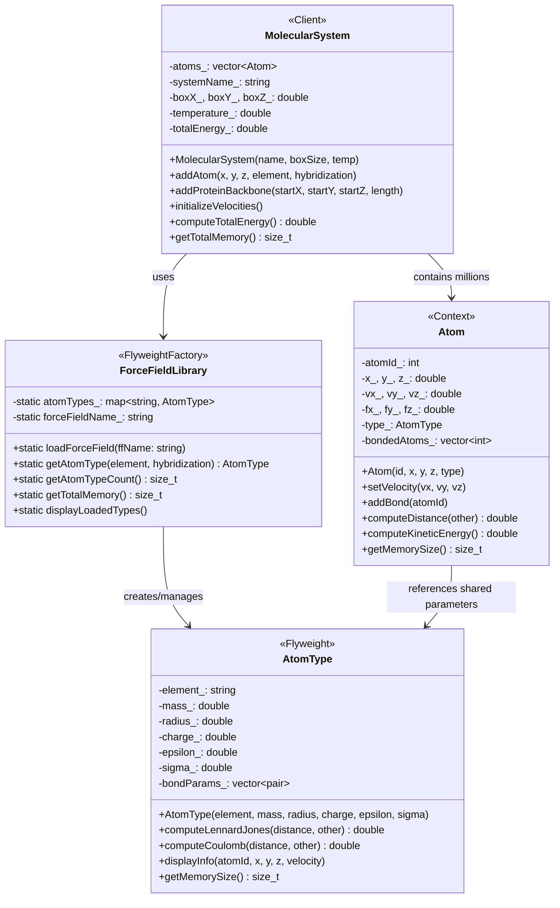

# Flyweight Pattern - Molecular Dynamics Force Field Library

## Intent
Share molecular force field parameters across millions of atoms in molecular dynamics simulations, dramatically reducing memory usage while maintaining fast energy calculations for large biomolecular systems.

## Scientific Computing Context
Molecular dynamics simulations face memory challenges:
- **Large Systems**: Proteins with 100k+ atoms, membranes with millions
- **Force Field Parameters**: Each atom type needs ~200 bytes of parameters
- **Redundancy**: Water molecules (>90% of atoms) share identical parameters
- **Performance Critical**: Energy calculations dominate computation time
- **Memory Bandwidth**: Parameter access patterns affect simulation speed

## When to Use in Scientific Computing
- Running molecular dynamics simulations with millions of atoms
- Implementing force fields (AMBER, CHARMM, OPLS, GROMOS)
- Building coarse-grained models with repeated units
- Developing Monte Carlo simulations with particle types
- Creating lattice models with site properties

## Structure



## Implementation Details

### Key Components
1. **AtomType**: Flyweight storing intrinsic force field parameters
2. **ForceFieldLibrary**: Factory managing parameter sets
3. **Atom**: Individual atoms with extrinsic state (position, velocity)
4. **MolecularSystem**: Manages simulation with millions of atoms

### State Division
- **Intrinsic State** (Shared): Mass, charge, LJ parameters, bond lengths
- **Extrinsic State** (Unique): Position, velocity, forces, connectivity

### Algorithm
```
1. Load force field parameters into library
2. For each atom in system:
   - Request atom type from library
   - Library returns existing or creates new type
   - Atom stores reference to shared parameters
3. During simulation:
   - Access shared parameters for force calculations
   - Update only extrinsic state (positions, velocities)
```

## Advantages in Scientific Computing
- **Memory Efficiency**: 70-90% reduction for large systems
- **Cache Performance**: Shared parameters stay in L2/L3 cache
- **Scalability**: Enables simulations with millions of atoms
- **Maintainability**: Centralized parameter management
- **Flexibility**: Easy to switch force fields

## Disadvantages in HPC Context
- **Indirection Overhead**: Extra pointer dereference
- **Thread Contention**: Shared factory access
- **NUMA Effects**: Shared data across nodes
- **GPU Transfer**: Complex memory layouts for accelerators

## Example Output
```
=== Molecular Dynamics Simulation with Flyweight Pattern ===
Sharing force field parameters across millions of atoms

Loading AMBER ff14SB force field parameters...

Building protein structure...
  Loading parameters for C_sp3...
  Loading parameters for N...
  Loading parameters for C_sp2...
  Loading parameters for O...

Adding solvent molecules...
  Loading parameters for H...

Loaded atom types in AMBER ff14SB:
  - C_sp3: ε=0.1094 kcal/mol, σ=3.3997 Å
  - N: ε=0.17 kcal/mol, σ=3.25 Å
  - C_sp2: ε=0.086 kcal/mol, σ=3.3997 Å
  - O: ε=0.21 kcal/mol, σ=2.9599 Å
  - H: ε=0.0157 kcal/mol, σ=2.6495 Å

Molecular System: Protein in Water
Box dimensions: 100 × 100 × 100 ų
Temperature: 300 K
Total atoms: 30040

Memory Usage Statistics:
========================
Total atoms: 30040
Unique atom types: 5
Memory with flyweight: 1639.32 KB
Memory without flyweight: 7424.80 KB
Memory saved: 5785.48 KB
Savings percentage: 77.92%

Sample atoms:
Atom      1: N  at (  10.000,   10.000,   10.000) Å, |v| = 15.434 Å/ps [m=14.007 amu, q=-0.47 e]
Atom      2: C  at (  11.500,   10.000,   10.000) Å, |v| =  8.742 Å/ps [m=12.011 amu, q=-0.18 e]
...

Total energy: 125847.38 kcal/mol

Flyweight pattern enables efficient molecular dynamics
simulations by sharing force field parameters!
```

## Common Variations in Scientific Computing
1. **GPU Flyweights**: Texture memory for shared parameters
2. **Hierarchical Parameters**: Atom → Residue → Molecule
3. **Dynamic Loading**: Load parameters on demand
4. **Multi-Scale**: Different parameter sets at different scales
5. **Interpolated Parameters**: Compute intermediate values

## Related Patterns in Scientific Computing
- **Object Pool**: Reuse atom objects in Monte Carlo
- **Prototype**: Clone molecular structures
- **Strategy**: Different force calculation methods
- **Visitor**: Apply analysis operations to atoms

## 🔧 Compilation & Usage

### Prerequisites
- **C++ Standard**: C++17 or later (required for structured bindings)
- **Compiler**: GCC 7+, Clang 5+, MSVC 2017+
- **Math Library**: Link with `-lm` on Unix systems

### Basic Compilation

#### Linux/macOS
```bash
# Basic compilation
g++ -std=c++17 -o flyweight flyweight.cpp -lm

# Alternative with Clang
clang++ -std=c++17 -o flyweight flyweight.cpp -lm
```

#### Windows (MinGW)
```batch
g++ -std=c++17 -o flyweight.exe flyweight.cpp
```

#### Windows (MSVC)
```batch
cl /EHsc /std:c++17 flyweight.cpp
```

### Advanced Compilation Options

#### Debug Build
```bash
g++ -std=c++17 -g -O0 -DDEBUG -o flyweight_debug flyweight.cpp -lm
```

#### Optimized Release Build
```bash
g++ -std=c++17 -O3 -DNDEBUG -march=native -o flyweight_release flyweight.cpp -lm
```

#### With All Warnings
```bash
g++ -std=c++17 -Wall -Wextra -Wpedantic -o flyweight flyweight.cpp -lm
```

#### Sanitizer Builds (Debug)
```bash
# Address sanitizer
g++ -std=c++17 -fsanitize=address -g -o flyweight_asan flyweight.cpp -lm

# Undefined behavior sanitizer
g++ -std=c++17 -fsanitize=undefined -g -o flyweight_ubsan flyweight.cpp -lm
```

### CMake Instructions

Create `CMakeLists.txt`:
```cmake
cmake_minimum_required(VERSION 3.10)
project(FlyweightPattern)

# Set C++ standard
set(CMAKE_CXX_STANDARD 17)
set(CMAKE_CXX_STANDARD_REQUIRED ON)

# Create executable
add_executable(flyweight flyweight.cpp)

# Link math library
target_link_libraries(flyweight m)

# Compiler-specific options
if(MSVC)
    target_compile_options(flyweight PRIVATE /W4)
else()
    target_compile_options(flyweight PRIVATE -Wall -Wextra -Wpedantic)
endif()

# Enable optimizations for Release
if(CMAKE_BUILD_TYPE STREQUAL "Release")
    target_compile_options(flyweight PRIVATE -O3 -march=native)
endif()
```

Build with CMake:
```bash
mkdir build && cd build
cmake .. -DCMAKE_BUILD_TYPE=Release
make  # or cmake --build . on Windows
```

### IDE Integration

#### Visual Studio Code
Create `.vscode/tasks.json`:
```json
{
    "version": "2.0.0",
    "tasks": [
        {
            "label": "build",
            "type": "shell",
            "command": "g++",
            "args": [
                "-std=c++17",
                "-g",
                "-Wall",
                "${file}",
                "-o",
                "${fileDirname}/${fileBasenameNoExtension}",
                "-lm"
            ],
            "group": {
                "kind": "build",
                "isDefault": true
            },
            "problemMatcher": ["$gcc"]
        }
    ]
}
```

#### Visual Studio
1. Create new Console Application project
2. Set C++ Language Standard to C++17 in Project Properties
3. Copy the code to main source file
4. Build with Ctrl+F7

#### CLion
1. Open the project directory
2. CLion will auto-detect CMakeLists.txt
3. Build with Ctrl+F9
4. Run with Shift+F10

### Dependencies
- **Standard Library**: `<iostream>`, `<unordered_map>`, `<memory>`, `<vector>`, `<random>`, `<cmath>`, `<iomanip>`
- **C++17 Features**: Structured bindings, `std::make_shared`
- **Math Functions**: `sqrt`, `pow` from `<cmath>`
- **No external dependencies required**

### Platform-Specific Notes

#### Linux
- Install build tools: `sudo apt-get install build-essential`
- GCC recommended version: 7.0+ for full C++17 support
- Math library usually linked automatically

#### macOS
- Install Xcode command line tools: `xcode-select --install`
- Alternative: Install via Homebrew: `brew install gcc`
- Math library included in system libraries

#### Windows
- **Visual Studio**: Download Visual Studio 2017+ (Community is free)
- **MinGW-w64**: Available via MSYS2 or standalone installer
- Math functions included in standard library

### Troubleshooting

#### Common Issues
1. **"structured binding not found"**: 
   - Ensure C++17 standard is set
   - Update compiler to GCC 7+ or equivalent

2. **Math function errors**:
   - Ensure `-lm` flag on Unix systems
   - Check for proper `<cmath>` inclusion

3. **Memory calculations incorrect**:
   - Verify sizeof() returns expected values
   - Account for padding and alignment

4. **Performance issues with large systems**:
   - Use release build with optimizations
   - Profile memory access patterns
   - Consider cache-aware data structures

5. **"M_PI undefined"**: 
   - Define `_USE_MATH_DEFINES` before `<cmath>`
   - Or define manually: `const double M_PI = 3.14159265358979323846;`

#### Performance Tips
- Use `-O3` and `-march=native` for production builds
- Profile with `perf` or Intel VTune
- Monitor cache misses with hardware counters
- Consider NUMA-aware allocation for HPC systems
- Align atom structures to cache lines

#### Design Considerations
- **Parameter Granularity**: Balance between sharing and flexibility
- **Thread Safety**: Use thread-local factories or synchronization
- **GPU Integration**: Consider separate parameter buffers
- **Dynamic Systems**: Handle parameter changes during simulation
- **Memory Layout**: Optimize for vectorization and cache usage