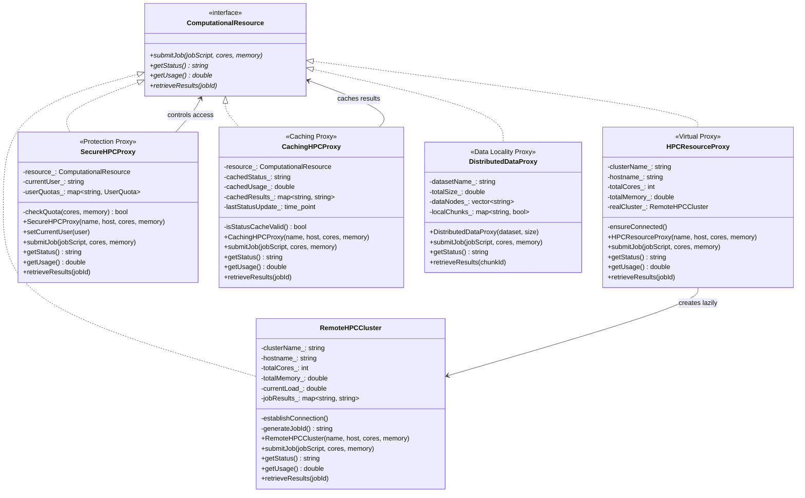

# Proxy Pattern - Remote HPC Cluster Resource Manager

## Intent
Provide controlled access to remote high-performance computing resources, managing authentication, quotas, caching, and efficient data transfer while hiding the complexity of distributed computing infrastructure.

## Scientific Computing Context
HPC resource management faces several challenges:
- **Remote Access**: SSH connections, authentication, latency
- **Resource Quotas**: CPU hours, memory limits, storage allocations
- **Data Transfer**: Large datasets (TB-PB), GridFTP, parallel I/O
- **Job Scheduling**: Queue management, resource allocation
- **Cost Control**: Expensive compute time, efficient utilization

## When to Use in Scientific Computing
- Managing access to remote supercomputers and clusters
- Implementing usage quotas and accounting systems
- Caching cluster status to reduce query overhead
- Controlling access to expensive computational resources
- Managing distributed scientific datasets across multiple sites

## Structure



## Implementation Details

### Types of Scientific Computing Proxies
1. **Virtual Proxy**: Lazy connection to remote clusters
2. **Protection Proxy**: Quota management and access control
3. **Caching Proxy**: Performance optimization for status queries
4. **Data Locality Proxy**: Manages distributed dataset access

### Algorithm
```
1. Client requests HPC resource through proxy
2. Proxy performs pre-processing:
   - Authentication and authorization
   - Connection establishment (if needed)
   - Cache checking
   - Quota verification
3. Proxy delegates to real resource if appropriate
4. Proxy performs post-processing:
   - Update usage statistics
   - Cache results
   - Log access
5. Results returned to client
```

## Advantages in Scientific Computing
- **Resource Protection**: Prevents quota overruns
- **Performance**: Caching reduces network overhead
- **Flexibility**: Switch between clusters transparently
- **Cost Control**: Monitor and limit resource usage
- **Fault Tolerance**: Handle connection failures gracefully

## Disadvantages in HPC Context
- **Latency**: Additional layer adds overhead
- **Complexity**: More components to manage
- **Cache Coherency**: Stale data in distributed environment
- **Debugging**: Harder to trace issues through proxies

## Example Output
```
=== HPC Resource Proxy Pattern Demo ===

1. Virtual Proxy (Lazy Connection) Demo:
=========================================
Resource proxy created for: Frontera (connection deferred)
Resource proxy created for: Summit (connection deferred)

Note: No connections established yet

First job submission to Frontera:

Proxy: Establishing connection on first use...
Establishing SSH connection to frontera.tacc.edu...
  Authenticating with Kerberos...
  Loading environment modules...
  Connected to Frontera (448000 cores, 2300 TB RAM)

Submitting job to Frontera:
  Job ID: JOB_1000
  Requested: 512 cores, 1024.00 GB RAM
  Script: cfd_simulation.slurm
  Transferring input files...
  Job queued in partition 'gpu-v100'

Second job to Frontera (already connected):

Submitting job to Frontera:
  Job ID: JOB_1001
  Requested: 256 cores, 512.00 GB RAM
  Script: molecular_dynamics.slurm
  Transferring input files...
  Job queued in partition 'gpu-v100'

Note: Summit still not connected (lazy loading)

2. Protection Proxy (Access Control) Demo:
==========================================

Authenticated as: guest
Quota: 16 cores, 128 GB RAM
CPU hours: 0.0 / 100.0 used

Access denied: guest - Insufficient quota or permissions
Requested: 64 cores, 256 GB

Authenticated as: grad_student
Quota: 64 cores, 512 GB RAM
CPU hours: 1000.0 / 5000.0 used

Proxy: Establishing connection on first use...
[Connection details...]

Submitting job to Perlmutter:
  Job ID: JOB_1002
  Requested: 64 cores, 256.00 GB RAM
  Script: quantum_espresso.slurm
  Transferring input files...
  Job queued in partition 'gpu-v100'

3. Caching Proxy (Performance) Demo:
====================================
Caching proxy enabled for HPC resource

First status request:
[Cache miss] Fetching fresh cluster status
Cluster: Stampede3 @ stampede3.tacc.edu
Total Resources: 560000 cores, 2900.00 TB
Current Load: 30.0%
Queue: 42 jobs pending, 18 running

Second status request (should be cached):
[Cache hit] Returning cached cluster status
[Same output as above]

Multiple usage queries:
[Cache miss] Querying current cluster usage
[Cache hit] Returning cached usage: 30.0%
[Cache miss] Querying current cluster usage
[Cache hit] Returning cached usage: 30.0%

Retrieving results (with caching):

Retrieving results for JOB_1002:
  Downloading output files via GridFTP...
  Transferring 2.4 GB of simulation data...
  Results: Simulation completed: 1.2M timesteps, convergence achieved
  Files saved to: /scratch/results/JOB_1002/
[Cache hit] Results already downloaded for JOB_1002
  Using local copy from cache

4. Distributed Data Proxy Demo:
===============================

Distributed data proxy for: CMIP6_Historical_Data (850.0 TB across 3 nodes)
Dataset: CMIP6_Historical_Data (850 TB)
Distributed across: node1.hpc.edu node2.hpc.edu node3.hpc.edu 

Accessing data chunks:
  Streaming chunk chunk_001 from remote node...
  Using parallel GridFTP for 283.333 TB transfer
  Streaming chunk chunk_002 from remote node...
  Using parallel GridFTP for 283.333 TB transfer
  Chunk chunk_001 already cached locally

Proxy pattern enables efficient management of
remote HPC resources and large scientific datasets!
```

## Common Variations in Scientific Computing
1. **Fault-Tolerant Proxy**: Automatic failover to backup clusters
2. **Load-Balancing Proxy**: Distributes jobs across multiple clusters
3. **Monitoring Proxy**: Collects performance metrics
4. **Compression Proxy**: Compresses data transfers
5. **Scheduling Proxy**: Optimizes job placement

## Related Patterns in Scientific Computing
- **Adapter**: Interface to different schedulers (SLURM, PBS, LSF)
- **Facade**: Simplified interface to complex HPC systems
- **Chain of Responsibility**: Multi-level authorization
- **Observer**: Monitor job status changes

## 🔧 Compilation & Usage

### Prerequisites
- **C++ Standard**: C++11 or later (required for chrono, thread, unique_ptr)
- **Compiler**: GCC 4.9+, Clang 3.4+, MSVC 2015+
- **Threading**: POSIX threads or Windows threads

### Basic Compilation

#### Linux/macOS
```bash
# Basic compilation
g++ -std=c++11 -pthread -o proxy proxy.cpp

# Alternative with Clang
clang++ -std=c++11 -pthread -o proxy proxy.cpp
```

#### Windows (MinGW)
```batch
g++ -std=c++11 -o proxy.exe proxy.cpp
```

#### Windows (MSVC)
```batch
cl /EHsc /std:c++11 proxy.cpp
```

### Advanced Compilation Options

#### Debug Build
```bash
g++ -std=c++11 -pthread -g -O0 -DDEBUG -o proxy_debug proxy.cpp
```

#### Optimized Release Build
```bash
g++ -std=c++11 -pthread -O3 -DNDEBUG -march=native -o proxy_release proxy.cpp
```

#### With All Warnings
```bash
g++ -std=c++11 -pthread -Wall -Wextra -Wpedantic -o proxy proxy.cpp
```

#### Sanitizer Builds (Debug)
```bash
# Address sanitizer
g++ -std=c++11 -pthread -fsanitize=address -g -o proxy_asan proxy.cpp

# Thread sanitizer (important for concurrent access)
g++ -std=c++11 -pthread -fsanitize=thread -g -o proxy_tsan proxy.cpp

# Undefined behavior sanitizer
g++ -std=c++11 -pthread -fsanitize=undefined -g -o proxy_ubsan proxy.cpp
```

### CMake Instructions

Create `CMakeLists.txt`:
```cmake
cmake_minimum_required(VERSION 3.10)
project(ProxyPattern)

# Set C++ standard
set(CMAKE_CXX_STANDARD 11)
set(CMAKE_CXX_STANDARD_REQUIRED ON)

# Create executable
add_executable(proxy proxy.cpp)

# Find threading library
find_package(Threads REQUIRED)
target_link_libraries(proxy Threads::Threads)

# Compiler-specific options
if(MSVC)
    target_compile_options(proxy PRIVATE /W4)
else()
    target_compile_options(proxy PRIVATE -Wall -Wextra -Wpedantic)
endif()

# Enable optimizations for Release
if(CMAKE_BUILD_TYPE STREQUAL "Release")
    target_compile_options(proxy PRIVATE -O3 -march=native)
endif()
```

Build with CMake:
```bash
mkdir build && cd build
cmake .. -DCMAKE_BUILD_TYPE=Release
make  # or cmake --build . on Windows
```

### IDE Integration

#### Visual Studio Code
Create `.vscode/tasks.json`:
```json
{
    "version": "2.0.0",
    "tasks": [
        {
            "label": "build",
            "type": "shell",
            "command": "g++",
            "args": [
                "-std=c++11",
                "-pthread",
                "-g",
                "-Wall",
                "${file}",
                "-o",
                "${fileDirname}/${fileBasenameNoExtension}"
            ],
            "group": {
                "kind": "build",
                "isDefault": true
            },
            "problemMatcher": ["$gcc"]
        }
    ]
}
```

#### Visual Studio
1. Create new Console Application project
2. Set C++ Language Standard to C++11 or later in Project Properties
3. Copy the code to main source file
4. Build with Ctrl+F7

#### CLion
1. Open the project directory
2. CLion will auto-detect CMakeLists.txt
3. Build with Ctrl+F9
4. Run with Shift+F10

### Dependencies
- **Standard Library**: `<iostream>`, `<memory>`, `<unordered_map>`, `<chrono>`, `<thread>`, `<vector>`, `<iomanip>`, `<sstream>`
- **Threading**: `-pthread` flag on Unix systems
- **No external dependencies required**

### Platform-Specific Notes

#### Linux
- Install build tools: `sudo apt-get install build-essential`
- GCC recommended version: 4.9+ for complete C++11 support
- Threading: `-pthread` flag required

#### macOS
- Install Xcode command line tools: `xcode-select --install`
- Alternative: Install via Homebrew: `brew install gcc`
- Threading support built-in

#### Windows
- **Visual Studio**: Download Visual Studio 2015+ (Community is free)
- **MinGW-w64**: Available via MSYS2 or standalone installer
- Threading support varies by compiler

### Troubleshooting

#### Common Issues
1. **Threading errors**: 
   - Ensure `-pthread` flag on Unix
   - Check thread support on Windows

2. **"make_unique not found"**: 
   - Use GCC 4.9+ or implement manually
   - Or use C++14 standard

3. **Connection timeouts**:
   - Adjust timeout values for slow networks
   - Implement retry logic

4. **Cache coherency**:
   - Set appropriate cache durations
   - Implement cache invalidation

5. **Memory leaks with proxies**:
   - Use smart pointers consistently
   - Profile with valgrind

#### Performance Tips
- Use connection pooling for multiple requests
- Implement async job submission
- Cache authentication tokens
- Compress large data transfers
- Monitor proxy overhead with profiling tools

#### Design Considerations
- **Security**: Implement proper authentication
- **Scalability**: Consider proxy farms for high load
- **Monitoring**: Add logging and metrics
- **Failover**: Implement backup resource selection
- **Data Transfer**: Optimize for large scientific datasets