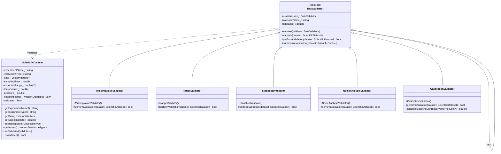

# Chain of Responsibility Pattern - Scientific Data Validation Pipeline

## Intent
Create a flexible validation pipeline for experimental data where multiple validators check different aspects of data quality, each passing the dataset along the chain until all validations are complete, ensuring data integrity before scientific analysis.

## Scientific Computing Context
Scientific experiments require rigorous data validation:
- **Missing Data**: NaN values, sensor dropouts, incomplete measurements
- **Physical Constraints**: Values outside physically possible ranges
- **Statistical Anomalies**: Outliers that may indicate errors or discoveries
- **Instrument Issues**: Calibration drift, noise, systematic errors
- **Quality Assurance**: Multi-stage validation before publication

## When to Use in Scientific Computing
- Building data quality assurance pipelines
- Implementing multi-stage validation for experimental data
- Creating flexible validation rules for different instruments
- Developing automated data cleaning workflows
- Ensuring reproducibility through consistent validation

## Structure



## Implementation Details

### Key Components
1. **DataValidator**: Abstract base for all validators
2. **Concrete Validators**: Specific validation checks (missing values, range, statistics, noise, calibration)
3. **ScientificDataset**: Contains experimental data and metadata
4. **ValidationPipeline**: Orchestrates the validation chain

### Validation Process
```
1. Dataset enters validation pipeline
2. Each validator in chain:
   - Performs its specific checks
   - Records any issues found
   - Passes dataset to next validator
3. All validators run regardless of failures
4. Final summary shows all detected issues
5. Dataset marked as validated or requiring attention
```

## Advantages in Scientific Computing
- **Modularity**: Add/remove validators without changing others
- **Flexibility**: Reorder validators based on priority
- **Completeness**: All checks run, providing comprehensive report
- **Reusability**: Share validators across different experiments
- **Traceability**: Clear record of validation steps

## Disadvantages in HPC Context
- **Sequential Processing**: May not utilize parallel hardware
- **Memory Overhead**: Each validator may copy data
- **Configuration Complexity**: Managing validator parameters
- **Performance**: Multiple passes over large datasets

## Example Output
```
=== Scientific Data Validation Pipeline ===
Chain: Missing Values → Physical Range → Statistical Analysis
       → Noise Level → Calibration Check

Dataset: UV-Vis Absorption Spectrum
Instrument: Spectrometer
Data points: 1000
Starting validation pipeline...

[Missing Value Validator] Starting validation...
  Checking for missing values...
  Found: 0 NaN, 0 Inf, 0 sentinel values
  Missing data ratio: 0.00%
  ✓ Passed Missing Value Validator validation

[Physical Range Validator] Starting validation...
  Checking physical range constraints...
  Expected range: [70, 130]
  Actual range: [79.0832, 120.448]
  Out of range values: 0
  ✓ Passed Physical Range Validator validation

[Statistical Outlier Validator] Starting validation...
  Performing statistical analysis...
  Mean: 100.0157, Std Dev: 11.5552
  Z-score threshold: 3 sigma
  Outliers detected: 0 (0.0%)
  ✓ Passed Statistical Outlier Validator validation

[Noise Level Validator] Starting validation...
  Analyzing noise characteristics...
  Sampling rate: 1000 Hz
  Signal-to-Noise Ratio: 26.02 dB
  Noise level: 2.5% of signal
  ✓ Passed Noise Level Validator validation

[Calibration Validator] Starting validation...
  Checking calibration for Spectrometer...
  Verifying spectral peak positions...
  Checking baseline stability...
  Baseline drift: 0.01325 units
  ✓ Calibration within specifications
  ✓ Passed Calibration Validator validation

=== Validation Summary ===
✓ Dataset passed all validations!

✅ Dataset approved for analysis!

Test Case 2: Data with missing values
======================================
[Missing Value Validator] Starting validation...
  Checking for missing values...
  Found: 155 NaN, 0 Inf, 0 sentinel values
  Missing data ratio: 15.50%
  ⚠️  Issues detected by Missing Value Validator

[Additional validators run...]

=== Validation Summary ===
⚠️  Dataset has 1 issue(s):
   - Missing Values

❌ Dataset requires attention before analysis.
```

## Common Variations in Scientific Computing
1. **Parallel Validation Chain**: Run independent validators concurrently
2. **Conditional Chain**: Skip validators based on data type
3. **Weighted Validation**: Some issues more critical than others
4. **Auto-Correction Chain**: Validators that can fix issues
5. **Machine Learning Validators**: Use trained models for anomaly detection

## Related Patterns in Scientific Computing
- **Strategy**: Different validation algorithms for different data types
- **Visitor**: Apply validation operations to data structures
- **Observer**: Monitor validation progress
- **Command**: Record validation steps for replay

## 🔧 Compilation & Usage

### Prerequisites
- **C++ Standard**: C++11 or later (required for shared_ptr, isnan, isinf)
- **Compiler**: GCC 4.8+, Clang 3.4+, MSVC 2015+
- **Math Library**: Link with `-lm` on Unix systems

### Basic Compilation

#### Linux/macOS
```bash
# Basic compilation
g++ -std=c++11 -o chain_of_responsibility chain_of_responsibility.cpp -lm

# Alternative with Clang
clang++ -std=c++11 -o chain_of_responsibility chain_of_responsibility.cpp -lm
```

#### Windows (MinGW)
```batch
g++ -std=c++11 -o chain_of_responsibility.exe chain_of_responsibility.cpp
```

#### Windows (MSVC)
```batch
cl /EHsc /std:c++11 chain_of_responsibility.cpp
```

### Advanced Compilation Options

#### Debug Build
```bash
g++ -std=c++11 -g -O0 -DDEBUG -o chain_of_responsibility_debug chain_of_responsibility.cpp -lm
```

#### Optimized Release Build
```bash
g++ -std=c++11 -O3 -DNDEBUG -march=native -o chain_of_responsibility_release chain_of_responsibility.cpp -lm
```

#### With All Warnings
```bash
g++ -std=c++11 -Wall -Wextra -Wpedantic -o chain_of_responsibility chain_of_responsibility.cpp -lm
```

#### Sanitizer Builds (Debug)
```bash
# Address sanitizer
g++ -std=c++11 -fsanitize=address -g -o chain_of_responsibility_asan chain_of_responsibility.cpp -lm

# Undefined behavior sanitizer
g++ -std=c++11 -fsanitize=undefined -g -o chain_of_responsibility_ubsan chain_of_responsibility.cpp -lm
```

### CMake Instructions

Create `CMakeLists.txt`:
```cmake
cmake_minimum_required(VERSION 3.10)
project(ChainOfResponsibilityPattern)

# Set C++ standard
set(CMAKE_CXX_STANDARD 11)
set(CMAKE_CXX_STANDARD_REQUIRED ON)

# Create executable
add_executable(chain_of_responsibility chain_of_responsibility.cpp)

# Link math library
target_link_libraries(chain_of_responsibility m)

# Compiler-specific options
if(MSVC)
    target_compile_options(chain_of_responsibility PRIVATE /W4)
else()
    target_compile_options(chain_of_responsibility PRIVATE -Wall -Wextra -Wpedantic)
endif()

# Enable optimizations for Release
if(CMAKE_BUILD_TYPE STREQUAL "Release")
    target_compile_options(chain_of_responsibility PRIVATE -O3 -march=native)
endif()
```

Build with CMake:
```bash
mkdir build && cd build
cmake .. -DCMAKE_BUILD_TYPE=Release
make  # or cmake --build . on Windows
```

### IDE Integration

#### Visual Studio Code
Create `.vscode/tasks.json`:
```json
{
    "version": "2.0.0",
    "tasks": [
        {
            "label": "build",
            "type": "shell",
            "command": "g++",
            "args": [
                "-std=c++11",
                "-g",
                "-Wall",
                "${file}",
                "-o",
                "${fileDirname}/${fileBasenameNoExtension}",
                "-lm"
            ],
            "group": {
                "kind": "build",
                "isDefault": true
            },
            "problemMatcher": ["$gcc"]
        }
    ]
}
```

#### Visual Studio
1. Create new Console Application project
2. Set C++ Language Standard to C++11 or later in Project Properties
3. Copy the code to main source file
4. Build with Ctrl+F7

#### CLion
1. Open the project directory
2. CLion will auto-detect CMakeLists.txt
3. Build with Ctrl+F9
4. Run with Shift+F10

### Dependencies
- **Standard Library**: `<iostream>`, `<memory>`, `<string>`, `<vector>`, `<cmath>`, `<limits>`, `<iomanip>`
- **C++11 Features**: `shared_ptr`, `make_shared`, `enum class`, `override`, `isnan`, `isinf`
- **Math Functions**: `sqrt`, `log10`, `sin`, `abs` from `<cmath>`
- **No external dependencies required**

### Platform-Specific Notes

#### Linux
- Install build tools: `sudo apt-get install build-essential`
- GCC recommended version: 7.0+ for better C++11 support
- Math library usually linked automatically

#### macOS
- Install Xcode command line tools: `xcode-select --install`
- Alternative: Install via Homebrew: `brew install gcc`
- Math library included in system libraries

#### Windows
- **Visual Studio**: Download Visual Studio 2015+ (Community is free)
- **MinGW-w64**: Available via MSYS2 or standalone installer
- Math functions included in standard library

### Troubleshooting

#### Common Issues
1. **"isnan not found"**: 
   - Include `<cmath>` header
   - Use `std::isnan` with C++11
   - Define `_USE_MATH_DEFINES` before `<cmath>` on Windows

2. **Math linking errors**:
   - Add `-lm` flag on Unix systems
   - Check math library installation

3. **"M_PI undefined"**: 
   - Define `_USE_MATH_DEFINES` before `<cmath>`
   - Or define manually: `const double M_PI = 3.14159265358979323846;`

4. **Large dataset performance**:
   - Use release build with optimizations
   - Consider parallel validation for independent checks
   - Profile to identify bottlenecks

5. **Memory issues with large datasets**:
   - Process data in chunks
   - Use move semantics where possible

#### Performance Tips
- Place most common failure validators first
- Use `-O3` and `-march=native` for production
- Consider OpenMP for parallel validation
- Minimize data copies between validators
- Profile with tools like valgrind or perf

#### Design Considerations
- **Validator Order**: Critical checks first vs. fast checks first
- **Data Modification**: Validators should not modify data
- **Error Recovery**: Consider validators that can suggest corrections
- **Logging**: Add detailed logging for audit trails
- **Configuration**: External configuration for validator parameters