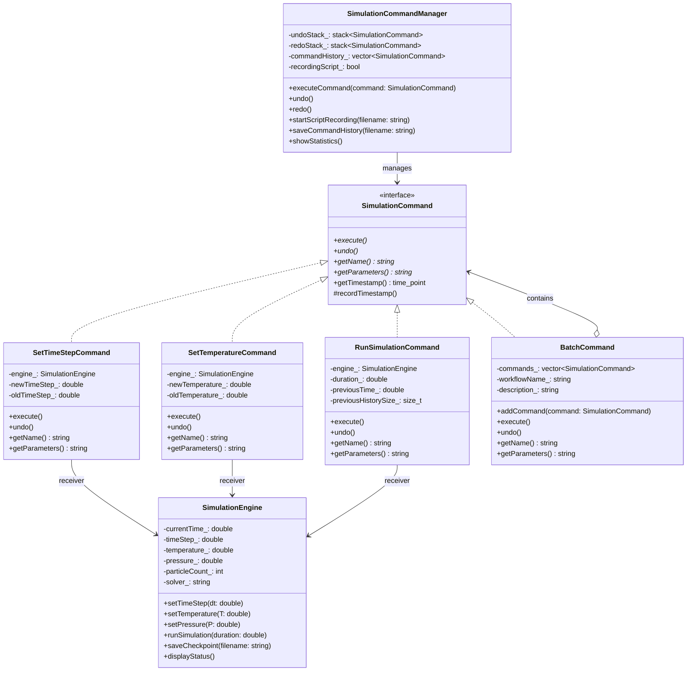

# Command Pattern - Scientific Simulation Control System

## Intent
Encapsulate simulation operations as command objects, enabling batch processing, undo/redo capabilities, workflow automation, and reproducible scientific experiments through recorded command sequences.

## Scientific Computing Context
Scientific simulations require careful control and reproducibility:
- **Parameter Studies**: Systematic variation of simulation parameters
- **Reproducibility**: Record exact sequence of operations for papers
- **Workflow Automation**: Complex multi-step simulation protocols
- **Checkpoint/Restart**: Save and restore simulation states
- **Batch Processing**: Queue simulations on HPC clusters

## When to Use in Scientific Computing
- Building reproducible computational experiments
- Creating simulation workflows and pipelines
- Implementing undo/redo for interactive simulations
- Recording simulation protocols for publication
- Automating parameter sweeps and sensitivity analysis

## Structure



## Implementation Details

### Key Components
1. **SimulationCommand**: Base interface for all simulation operations
2. **Concrete Commands**: Specific operations (SetTimeStep, RunSimulation, etc.)
3. **SimulationEngine**: Receiver that performs actual computations
4. **BatchCommand**: Composite for workflows
5. **CommandManager**: Handles execution, history, and reproducibility

### Algorithm
```
1. Create command with simulation parameters
2. Command manager receives and logs command
3. Execute command:
   - Record timestamp
   - Save previous state for undo
   - Perform simulation operation
4. Store in history for reproducibility
5. For undo: restore previous state
6. For workflows: execute commands in sequence
7. Export command sequence for publication
```

## Advantages in Scientific Computing
- **Reproducibility**: Exact replay of experiments
- **Automation**: Build complex workflows
- **Flexibility**: Modify workflows without code changes
- **Validation**: Undo incorrect operations
- **Documentation**: Commands serve as experiment log

## Disadvantages in HPC Context
- **Memory Overhead**: Storing command history
- **State Management**: Complex undo for large simulations
- **Serialization**: Commands must be serializable
- **Performance**: Command indirection overhead

## Example Output
```
=== Scientific Simulation Command System ===

=== Simulation Status ===
Time: 0.000e+00 s
Time step: 1.000e-15 s
Temperature: 300.00 K
Pressure: 1.013e+05 Pa
Particles: 1000
Solver: Velocity-Verlet
History points: 0
Status: Idle
=======================

[RECORDING] Started recording commands to experiment_2024_01.sim
Setting up simulation parameters...
Temperature changed from 300.00 to 350.00 K

[EXECUTED] SetTemperature (T=350.00K)
Pressure changed from 1.01e+05 to 2.00e+05 Pa

[EXECUTED] SetPressure (P=2.00e+05Pa)
Time step changed from 1.00e-15 to 5.00e-16 seconds

[EXECUTED] SetTimeStep (dt=5.00e-16s)

--- Running simulation for 1.00e-12 seconds ---
Parameters: T=350.00K, P=2.00e+05Pa, N=1000
Using Velocity-Verlet integrator
  Step 0: E=-1.00e+03 J, T=350.00 K
  Step 3: E=-9.95e+02 J, T=350.30 K
  Step 6: E=-9.91e+02 J, T=349.70 K
  Step 9: E=-9.88e+02 J, T=350.10 K
Simulation completed. Total time: 5.00e-15 s

[EXECUTED] RunSimulation (duration=1.00e-12s)

=== Testing Undo/Redo ===

[UNDO] RunSimulation (duration=1.00e-12s)
Undoing simulation run (reverting to previous state)
  Restored to time: 0.00e+00 s

[UNDO] SetTimeStep (dt=5.00e-16s)
Time step changed from 5.00e-16 to 1.00e-15 seconds

[REDO] SetTimeStep (dt=5.00e-16s)
Time step changed from 1.00e-15 to 5.00e-16 seconds

=== Creating Temperature Scan Workflow ===

=== Executing Workflow: Temperature Scan ===
Description: Scan temperatures from 300K to 400K
Steps: 9

Step 1/9: SetTemperature (T=300.00K)
Temperature changed from 350.00 to 300.00 K

Step 2/9: RunSimulation (duration=1.00e-12s)
[Simulation output...]

Step 3/9: SaveCheckpoint (file=T300K.chk)
Saving checkpoint to T300K.chk
  Current time: 5.00e-15 s
  Energy history points: 10
  Checkpoint saved successfully

[Additional steps...]

=== Workflow Complete ===

[SAVE] Saving command history to simulation_history.log
Total commands: 15
  1: SetTemperature (T=350.00K)
  2: SetPressure (P=2.00e+05Pa)
  3: SetTimeStep (dt=5.00e-16s)
  4: RunSimulation (duration=1.00e-12s)
  5: ChangeSolver (solver=Leapfrog)
  6: SaveCheckpoint (file=checkpoint_001.chk)
  7: Workflow (Temperature Scan (9 steps))
History saved successfully

=== Command Statistics ===
Total commands executed: 15
Undo stack size: 7
Redo stack size: 0

Command frequency:
  ChangeSolver: 1
  RunSimulation: 4
  SaveCheckpoint: 4
  SetPressure: 1
  SetTemperature: 4
  SetTimeStep: 1
  Workflow: 1
========================

Command pattern enables reproducible scientific simulations
with full undo/redo capability and workflow automation!
```

## Common Variations in Scientific Computing
1. **Async Commands**: Non-blocking simulation operations
2. **Parallel Commands**: Commands that utilize MPI/OpenMP
3. **Remote Commands**: Execute on HPC clusters
4. **Conditional Commands**: Execute based on results
5. **Scheduled Commands**: Time-based execution

## Related Patterns in Scientific Computing
- **Memento**: Save complete simulation states
- **Observer**: Monitor command execution progress
- **Chain of Responsibility**: Command validation pipeline
- **Strategy**: Different execution strategies per command

## 🔧 Compilation & Usage

### Prerequisites
- **C++ Standard**: C++11 or later (required for chrono, shared_ptr)
- **Compiler**: GCC 4.8+, Clang 3.4+, MSVC 2015+
- **Optional**: MPI for distributed commands

### Basic Compilation

#### Linux/macOS
```bash
# Basic compilation
g++ -std=c++11 -o command command.cpp

# Alternative with Clang
clang++ -std=c++11 -o command command.cpp
```

#### Windows (MinGW)
```batch
g++ -std=c++11 -o command.exe command.cpp
```

#### Windows (MSVC)
```batch
cl /EHsc /std:c++11 command.cpp
```

### Advanced Compilation Options

#### Debug Build
```bash
g++ -std=c++11 -g -O0 -DDEBUG -o command_debug command.cpp
```

#### Optimized Release Build
```bash
g++ -std=c++11 -O3 -DNDEBUG -march=native -o command_release command.cpp
```

#### With All Warnings
```bash
g++ -std=c++11 -Wall -Wextra -Wpedantic -o command command.cpp
```

#### Sanitizer Builds (Debug)
```bash
# Address sanitizer
g++ -std=c++11 -fsanitize=address -g -o command_asan command.cpp

# Undefined behavior sanitizer
g++ -std=c++11 -fsanitize=undefined -g -o command_ubsan command.cpp
```

### CMake Instructions

Create `CMakeLists.txt`:
```cmake
cmake_minimum_required(VERSION 3.10)
project(CommandPattern)

# Set C++ standard
set(CMAKE_CXX_STANDARD 11)
set(CMAKE_CXX_STANDARD_REQUIRED ON)

# Create executable
add_executable(command command.cpp)

# Compiler-specific options
if(MSVC)
    target_compile_options(command PRIVATE /W4)
else()
    target_compile_options(command PRIVATE -Wall -Wextra -Wpedantic)
endif()

# Enable optimizations for Release
if(CMAKE_BUILD_TYPE STREQUAL "Release")
    target_compile_options(command PRIVATE -O3 -march=native)
endif()
```

Build with CMake:
```bash
mkdir build && cd build
cmake .. -DCMAKE_BUILD_TYPE=Release
make  # or cmake --build . on Windows
```

### IDE Integration

#### Visual Studio Code
Create `.vscode/tasks.json`:
```json
{
    "version": "2.0.0",
    "tasks": [
        {
            "label": "build",
            "type": "shell",
            "command": "g++",
            "args": [
                "-std=c++11",
                "-g",
                "-Wall",
                "${file}",
                "-o",
                "${fileDirname}/${fileBasenameNoExtension}"
            ],
            "group": {
                "kind": "build",
                "isDefault": true
            },
            "problemMatcher": ["$gcc"]
        }
    ]
}
```

#### Visual Studio
1. Create new Console Application project
2. Set C++ Language Standard to C++11 or later in Project Properties
3. Copy the code to main source file
4. Build with Ctrl+F7

#### CLion
1. Open the project directory
2. CLion will auto-detect CMakeLists.txt
3. Build with Ctrl+F9
4. Run with Shift+F10

### Dependencies
- **Standard Library**: `<iostream>`, `<memory>`, `<vector>`, `<stack>`, `<string>`, `<algorithm>`, `<chrono>`, `<fstream>`, `<iomanip>`, `<cmath>`, `<map>`
- **C++11 Features**: `shared_ptr`, `make_shared`, `chrono`, range-based for
- **No external dependencies required**

### Platform-Specific Notes

#### Linux
- Install build tools: `sudo apt-get install build-essential`
- GCC recommended version: 7.0+ for better C++11 support
- For HPC integration: Install MPI libraries

#### macOS
- Install Xcode command line tools: `xcode-select --install`
- Alternative: Install via Homebrew: `brew install gcc`
- For OpenMP support: Use GCC instead of Apple Clang

#### Windows
- **Visual Studio**: Download Visual Studio 2015+ (Community is free)
- **MinGW-w64**: Available via MSYS2 or standalone installer
- For HPC: Install MS-MPI or Intel MPI

### Troubleshooting

#### Common Issues
1. **"chrono not found"**: 
   - Ensure C++11 standard is set
   - Include `<chrono>` header

2. **Timestamp formatting**:
   - Use `<iomanip>` for formatting
   - Consider platform-specific time functions

3. **Large simulation states**:
   - Implement efficient state serialization
   - Consider compression for checkpoints

4. **Memory usage with long histories**:
   - Implement command history pruning
   - Save to disk periodically

5. **Parallel execution**:
   - Ensure thread safety for commands
   - Use atomic operations for shared state

#### Performance Tips
- Batch small commands to reduce overhead
- Use move semantics for large data
- Profile command execution time
- Consider command pooling for frequent operations
- Optimize state capture for undo

#### Design Considerations
- **Granularity**: Balance between fine and coarse commands
- **State Management**: Efficient capture and restore
- **Serialization**: For saving/loading workflows
- **Error Handling**: Robust recovery from failed commands
- **Concurrency**: Thread-safe command execution