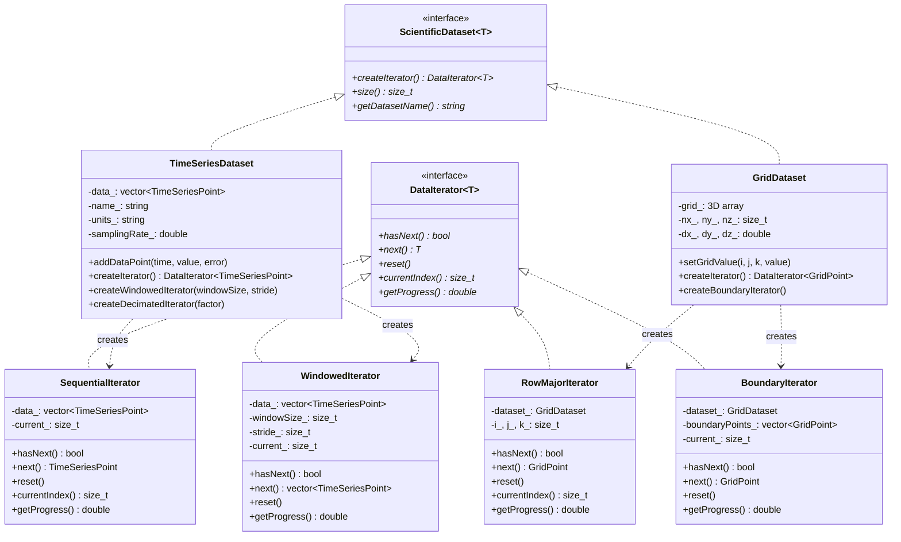

# Iterator Pattern - Scientific Dataset Traversal

## Intent
Provide uniform access methods for traversing heterogeneous scientific datasets (time series, grids, sparse matrices) without exposing their internal structure, enabling efficient analysis algorithms that work across different data organizations.

## Scientific Computing Context
Scientific data comes in many forms requiring different access patterns:
- **Time Series**: Sequential sensor data, experimental measurements
- **3D Grids**: CFD/FEM meshes, volumetric imaging data
- **Sparse Data**: Large matrices with few non-zero elements
- **Hierarchical**: Multi-resolution data, adaptive mesh refinement
- **Streaming**: Real-time data that arrives continuously

## When to Use in Scientific Computing
- Processing different dataset types with uniform algorithms
- Implementing data analysis pipelines
- Building visualization tools for scientific data
- Creating data export/import utilities
- Developing parallel processing frameworks

## Structure



## Implementation Details

### Key Components
1. **DataIterator**: Enhanced iterator with progress tracking
2. **ScientificDataset**: Base interface for all dataset types
3. **Specialized Iterators**: Different traversal patterns for each data type
4. **Progress Tracking**: Essential for long-running scientific computations

### Iterator Types
- **Sequential**: Process all data points in order
- **Windowed**: Sliding window for signal processing
- **Decimated**: Downsampled data for visualization
- **Boundary**: Only boundary elements for PDE solvers
- **Row/Column Major**: Cache-efficient grid traversal

### Algorithm
```
1. Dataset creates appropriate iterator
2. Analysis algorithm uses iterator interface:
   while (iterator.hasNext()) {
       if (iterator.getProgress() > threshold) {
           updateProgressBar()
       }
       dataPoint = iterator.next()
       processDataPoint(dataPoint)
   }
3. Iterator maintains state and access pattern
4. Multiple iterators can traverse same dataset
```

## Advantages in Scientific Computing
- **Uniformity**: Same algorithm works on different data structures
- **Efficiency**: Optimized access patterns for each data type
- **Flexibility**: Easy to add new traversal patterns
- **Progress Monitoring**: Essential for long computations
- **Memory Efficiency**: Stream large datasets without loading all

## Disadvantages in HPC Context
- **Virtual Function Overhead**: May impact tight loops
- **Cache Misses**: Iterator indirection can hurt locality
- **Parallelization**: Sequential iterators don't parallelize well
- **Type Erasure**: Templates better than virtual functions for performance

## Example Output
```
=== Scientific Dataset Iterator Pattern Demo ===

1. Time Series Dataset
======================

Analyzing: Temperature Measurements (1000 points)
  Progress: 100.0%
  Statistics:
    Mean: -0.0006
    Std Dev: 0.7938
    Range: [-1.4117, 1.4115]

  Windowed analysis (window=50):
    Window 0: t=[0.000, 0.490], mean=0.0567
    Window 1: t=[0.250, 0.740], mean=0.5230
    Window 2: t=[0.500, 0.990], mean=0.8414
    Window 3: t=[0.750, 1.240], mean=0.9487
    Window 4: t=[1.000, 1.490], mean=0.8427

  Decimated data (factor=100):
    t=0.000s, value=0.0000 ± 0.0177
    t=1.000s, value=0.8414 ± 0.0383
    t=2.000s, value=0.0000 ± 0.0306
    t=3.000s, value=-0.8415 ± 0.0118
    t=4.000s, value=-0.0000 ± 0.0401


2. 3D Grid Dataset
==================

Analyzing: Heat Transfer Simulation - Temperature (20×20×20 grid)
  Grid statistics:
    Total cells: 8000
    Average value: 6.76418
    Maximum value: 100 at (10, 10, 10)
  Boundary statistics:
    Boundary cells: 2648
    Average boundary value: 0.238512

  Sample grid points (row-major order):
    (0,0,0) at (0.0,0.0,0.0) = 0.367
    (0,0,1) at (0.0,0.0,0.1) = 0.406
    (0,0,2) at (0.0,0.0,0.2) = 0.449
    (0,0,3) at (0.0,0.0,0.3) = 0.497
    (0,0,4) at (0.0,0.0,0.4) = 0.549


3. Iterator Performance Comparison
==================================
  Sequential iteration (100k points): 2453 μs
  Decimated iteration (10k points): 245 μs
  Speedup: 10.01x

Iterator pattern provides flexible traversal
of scientific datasets with different access patterns!
```

## Common Variations in Scientific Computing
1. **Parallel Iterator**: OpenMP/TBB compatible iteration
2. **Chunk Iterator**: Process data in cache-sized chunks
3. **Filtered Iterator**: Skip data based on criteria
4. **Multi-Dataset Iterator**: Synchronized iteration over multiple datasets
5. **Hierarchical Iterator**: Navigate multi-resolution data

## Related Patterns in Scientific Computing
- **Visitor**: Apply operations to dataset elements
- **Strategy**: Different analysis algorithms per iterator
- **Composite**: Hierarchical dataset structures
- **Factory Method**: Create appropriate iterator types

## 🔧 Compilation & Usage

### Prerequisites
- **C++ Standard**: C++11 or later (required for auto, chrono, smart pointers)
- **Compiler**: GCC 4.8+, Clang 3.4+, MSVC 2015+
- **Math Library**: Link with `-lm` on Unix systems

### Basic Compilation

#### Linux/macOS
```bash
# Basic compilation
g++ -std=c++11 -o iterator iterator.cpp -lm

# Alternative with Clang
clang++ -std=c++11 -o iterator iterator.cpp -lm
```

#### Windows (MinGW)
```batch
g++ -std=c++11 -o iterator.exe iterator.cpp
```

#### Windows (MSVC)
```batch
cl /EHsc /std:c++11 iterator.cpp
```

### Advanced Compilation Options

#### Debug Build
```bash
g++ -std=c++11 -g -O0 -DDEBUG -o iterator_debug iterator.cpp -lm
```

#### Optimized Release Build
```bash
g++ -std=c++11 -O3 -DNDEBUG -march=native -o iterator_release iterator.cpp -lm
```

#### With All Warnings
```bash
g++ -std=c++11 -Wall -Wextra -Wpedantic -o iterator iterator.cpp -lm
```

#### Sanitizer Builds (Debug)
```bash
# Address sanitizer
g++ -std=c++11 -fsanitize=address -g -o iterator_asan iterator.cpp -lm

# Undefined behavior sanitizer
g++ -std=c++11 -fsanitize=undefined -g -o iterator_ubsan iterator.cpp -lm
```

### CMake Instructions

Create `CMakeLists.txt`:
```cmake
cmake_minimum_required(VERSION 3.10)
project(IteratorPattern)

# Set C++ standard
set(CMAKE_CXX_STANDARD 11)
set(CMAKE_CXX_STANDARD_REQUIRED ON)

# Create executable
add_executable(iterator iterator.cpp)

# Link math library
target_link_libraries(iterator m)

# Compiler-specific options
if(MSVC)
    target_compile_options(iterator PRIVATE /W4)
else()
    target_compile_options(iterator PRIVATE -Wall -Wextra -Wpedantic)
endif()

# Enable optimizations for Release
if(CMAKE_BUILD_TYPE STREQUAL "Release")
    target_compile_options(iterator PRIVATE -O3 -march=native)
endif()
```

Build with CMake:
```bash
mkdir build && cd build
cmake .. -DCMAKE_BUILD_TYPE=Release
make  # or cmake --build . on Windows
```

### IDE Integration

#### Visual Studio Code
Create `.vscode/tasks.json`:
```json
{
    "version": "2.0.0",
    "tasks": [
        {
            "label": "build",
            "type": "shell",
            "command": "g++",
            "args": [
                "-std=c++11",
                "-g",
                "-Wall",
                "${file}",
                "-o",
                "${fileDirname}/${fileBasenameNoExtension}",
                "-lm"
            ],
            "group": {
                "kind": "build",
                "isDefault": true
            },
            "problemMatcher": ["$gcc"]
        }
    ]
}
```

#### Visual Studio
1. Create new Console Application project
2. Set C++ Language Standard to C++11 or later in Project Properties
3. Copy the code to main source file
4. Build with Ctrl+F7

#### CLion
1. Open the project directory
2. CLion will auto-detect CMakeLists.txt
3. Build with Ctrl+F9
4. Run with Shift+F10

### Dependencies
- **Standard Library**: `<iostream>`, `<memory>`, `<vector>`, `<string>`, `<stdexcept>`, `<cmath>`, `<iomanip>`, `<algorithm>`, `<chrono>`
- **C++11 Features**: `auto`, range-based for loops, smart pointers, `chrono`
- **Math Functions**: `sin`, `exp`, `sqrt` from `<cmath>`
- **No external dependencies required**

### Platform-Specific Notes

#### Linux
- Install build tools: `sudo apt-get install build-essential`
- GCC recommended version: 7.0+ for better C++11 support
- Math library usually linked automatically

#### macOS
- Install Xcode command line tools: `xcode-select --install`
- Alternative: Install via Homebrew: `brew install gcc`
- Math library included in system libraries

#### Windows
- **Visual Studio**: Download Visual Studio 2015+ (Community is free)
- **MinGW-w64**: Available via MSYS2 or standalone installer
- **M_PI**: May need to define `_USE_MATH_DEFINES` before `<cmath>`

### Troubleshooting

#### Common Issues
1. **"M_PI undefined"**: 
   - Define `_USE_MATH_DEFINES` before `<cmath>`
   - Or define manually: `const double M_PI = 3.14159265358979323846;`

2. **Template compilation errors**:
   - Ensure C++11 standard is set
   - Check template syntax carefully

3. **Performance issues**:
   - Use release build with optimizations
   - Consider inlining iterator methods
   - Profile virtual function overhead

4. **Memory usage with large datasets**:
   - Use streaming iterators
   - Implement lazy evaluation
   - Consider memory-mapped files

5. **Progress tracking overhead**:
   - Update progress less frequently
   - Use integer counters instead of floating-point

#### Performance Tips
- Use compile-time polymorphism (templates) for tight loops
- Prefetch data for predictable access patterns
- Align data structures to cache lines
- Consider SIMD operations for vectorizable loops
- Use OpenMP for parallel iteration where possible

#### Design Considerations
- **Iterator Invalidation**: Handle dataset modifications
- **Thread Safety**: Make iterators thread-local or immutable
- **Exception Safety**: Ensure iterator state consistency
- **Memory Efficiency**: Avoid copying large datasets
- **Const Correctness**: Provide const and non-const iterators