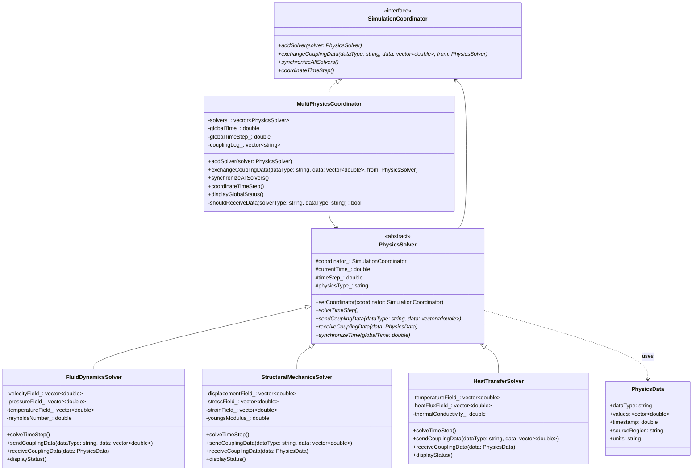
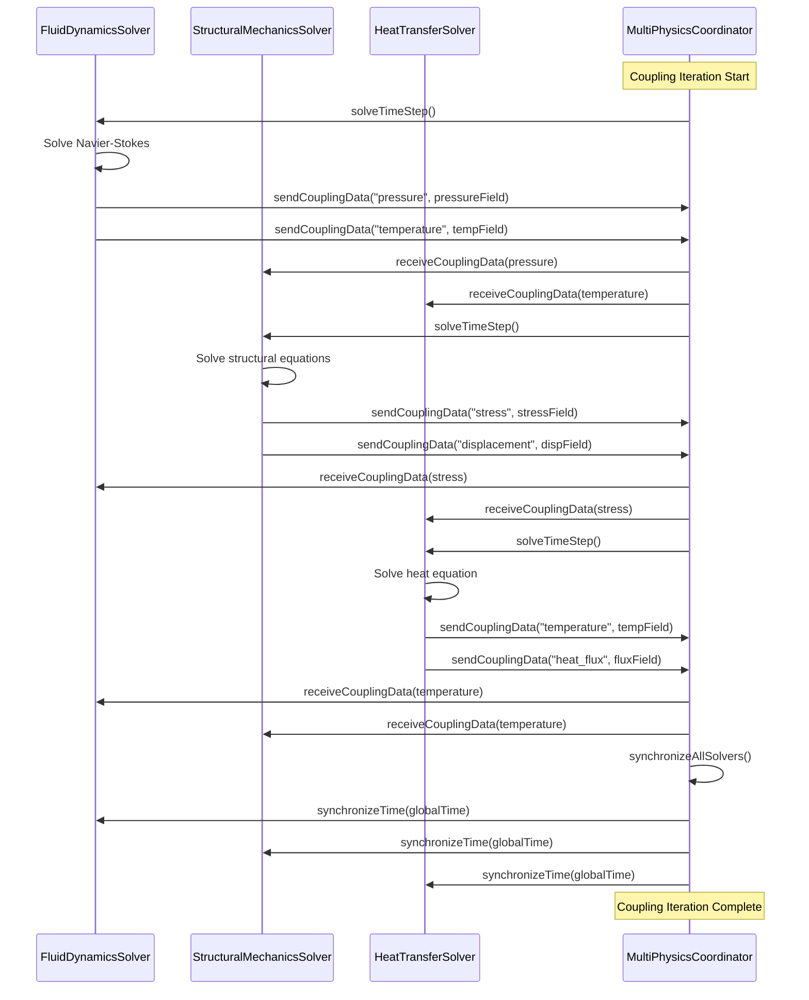

# Mediator Pattern - Multi-Physics Simulation Coordination

## Intent
Coordinate data exchange and synchronization between coupled physics solvers in multi-physics simulations, promoting loose coupling by preventing solvers from directly communicating with each other and centralizing the complex coupling logic.

## Scientific Computing Context
Multi-physics simulations require careful coordination:
- **Fluid-Structure Interaction**: CFD and structural mechanics coupling
- **Thermal-Mechanical Coupling**: Heat transfer affecting material properties
- **Electromagnetic-Thermal**: Joule heating and temperature-dependent conductivity
- **Chemical-Flow Coupling**: Reactive transport in porous media
- **Time Synchronization**: Different physics may have different time scales

## When to Use in Scientific Computing
- Building coupled multi-physics simulation frameworks
- Coordinating data exchange between different solvers
- Implementing partitioned coupling strategies
- Managing complex solver dependencies and interactions
- Synchronizing time stepping across multiple physics domains

## Structure



### Multi-Physics Coupling Structure



## Implementation Details

### Key Components
1. **SimulationCoordinator**: Interface for managing multi-physics coupling
2. **MultiPhysicsCoordinator**: Implements coupling strategy and data exchange protocols
3. **PhysicsSolver**: Abstract base for all physics solvers (CFD, FEM, Heat Transfer)
4. **PhysicsData**: Structured data container for inter-solver communication
5. **ControlComponents**: UI elements for simulation parameter control

### Coupling Algorithm
```
1. Each solver advances one time step
2. Solver sends coupling data to coordinator
3. Coordinator determines which solvers need this data
4. Coordinator distributes data to appropriate receivers
5. Solvers update their boundary conditions/source terms
6. Coordinator synchronizes global time across all solvers
7. Process repeats until simulation completion
```

### Data Exchange Patterns
- **CFD → FEM**: Pressure loads, thermal expansion
- **FEM → CFD**: Structural deformation, surface boundary updates
- **HEAT → CFD/FEM**: Temperature fields for material properties
- **CFD/FEM → HEAT**: Viscous/plastic dissipation heat sources

## Advantages in Scientific Computing
- **Modular Coupling**: Add/remove physics without modifying existing solvers
- **Centralized Coordination**: Single point for managing complex coupling logic
- **Flexible Coupling Strategies**: Easy to change coupling algorithms
- **Time Synchronization**: Unified time stepping across different physics
- **Data Consistency**: Ensures all solvers receive consistent coupling data
- **Monitoring**: Central location for coupling diagnostics and logging

## Disadvantages in HPC Context
- **Performance Bottleneck**: Centralized communication may limit parallel efficiency
- **Memory Overhead**: Storing and routing large field data between solvers
- **Complexity**: Coordinator can become complex with many physics
- **Scalability**: May not scale well to hundreds of coupled solvers
- **Load Balancing**: Difficult to balance computational loads optimally

## Example Output
```
=== Multi-Physics Simulation Coordinator ===

[COORD] NavierStokes_3D (Computational Fluid Dynamics) added to simulation
[COORD] Global time step adjusted to 1.00e-05 s

[COORD] StructuralFEM (Structural Mechanics) added to simulation
[COORD] Global time step adjusted to 1.00e-05 s

[COORD] ThermalAnalysis (Heat Transfer) added to simulation
[COORD] Global time step adjusted to 1.00e-05 s

=== Global Simulation Status ===
Global time: 0.00e+00 s
Global time step: 1.00e-05 s
Coupling iterations: 0
Active solvers: 3
Coupling exchanges: 3
==============================

=== Multi-Physics Coupling Simulation ===

=== Coupling Iteration 1 (t = 0.00e+00 s) ===
[CFD] NavierStokes_3D solving Navier-Stokes equations...
  Re = 1000.0, max velocity = 10.123 m/s
[FEM] StructuralFEM solving structural equations...
  E = 2.00e+11 Pa, max stress = 1.234e+06 Pa
[HEAT] ThermalAnalysis solving heat equation...
  k = 50.0 W/m·K, avg temp = 294.85 K

[COORD] Synchronizing all solvers to time 1.00e-05 s
[COORD] Coupling iteration 1 completed

=== Coupling Iteration 2 (t = 1.00e-05 s) ===
[CFD] NavierStokes_3D solving Navier-Stokes equations...
  [CFD] Received structural stress data: avg = 1.234e+06 Pa
  [CFD] Received thermal data for fluid properties update
  Re = 1000.0, max velocity = 10.098 m/s
[FEM] StructuralFEM solving structural equations...
  [FEM] Received fluid pressure for load application
  [FEM] Received temperature field for thermal stress analysis
  E = 2.00e+11 Pa, max stress = 1.189e+06 Pa
[HEAT] ThermalAnalysis solving heat equation...
  [HEAT] Received stress data for dissipative heating calculation
  k = 50.0 W/m·K, avg temp = 295.12 K

[COORD] Synchronizing all solvers to time 2.00e-05 s
[COORD] Coupling iteration 2 completed

=== Mid-simulation Status Check ===
Global time: 3.00e-05 s
Global time step: 1.00e-05 s
Coupling iterations: 3
Active solvers: 3
Coupling exchanges: 21
==============================

=== Multi-Physics Coupling Log ===
[COORD] NavierStokes_3D (Computational Fluid Dynamics) added to simulation
[COORD] StructuralFEM (Structural Mechanics) added to simulation
[COORD] ThermalAnalysis (Heat Transfer) added to simulation
NavierStokes_3D sent temperature data
NavierStokes_3D sent pressure data
StructuralFEM sent stress data
StructuralFEM sent displacement data
[Additional coupling exchanges...]

=== Final Solver Status ===
[CFD Status] NavierStokes_3D:
  Physics: Computational Fluid Dynamics
  Time: 5.00e-05 s
  Time step: 1.00e-05 s
  Reynolds number: 1000.00
  Grid points: 100
  Coupling data received: 10 datasets

[FEM Status] StructuralFEM:
  Physics: Structural Mechanics
  Time: 5.00e-05 s
  Time step: 1.00e-04 s
  Young's modulus: 2.00e+11 Pa
  Poisson's ratio: 0.30
  Nodes: 500
  Coupling data received: 10 datasets

[HEAT Status] ThermalAnalysis:
  Physics: Heat Transfer
  Time: 5.00e-05 s
  Time step: 1.00e-03 s
  Thermal conductivity: 50.00 W/m·K
  Density: 7800.00 kg/m³
  Nodes: 200
  Coupling data received: 10 datasets

=== Simulation Control Interface ===

--- User adjusts parameters ---
[UI] Slider 'TimeStepControl' set to 5.00e-05
  [CTRL] Time step updated to 5.00e-05 s
[UI] Slider 'CouplingTolerance' set to 1.00e-07
  [CTRL] Coupling tolerance updated to 1.00e-07

--- User starts simulation ---
[UI] Button 'StartSimulation' clicked
  [CTRL] Starting multi-physics simulation...
[UI] Status 'SimulationStatus': Running
  [CTRL] Status display updated

[Additional coupling iterations...]

--- User stops simulation ---
[UI] Button 'StopSimulation' clicked
  [CTRL] Stopping simulation...
[UI] Status 'SimulationStatus': Stopped
  [CTRL] Status display updated
```

## Common Variations in Scientific Computing
1. **Partitioned Coupling**: Separate coordinators for different physics groups
2. **Hierarchical Coordination**: Multi-level mediators for complex simulations
3. **Adaptive Coupling**: Dynamic adjustment of coupling frequency and data
4. **Parallel Coordination**: Distributed coordination across multiple nodes
5. **Event-Driven Coupling**: Coupling triggered by specific simulation events

## Related Patterns in Scientific Computing
- **Observer**: Monitor coupling convergence and simulation progress
- **Strategy**: Different coupling algorithms (explicit, implicit, iterative)
- **Command**: Record coupling operations for reproducibility
- **Bridge**: Separate coupling interface from specific solver implementations
- **Facade**: Simplify complex multi-physics simulation setup

## 🔧 Compilation & Usage

### Prerequisites
- **C++ Standard**: C++11 or later (required for smart pointers, chrono, auto)
- **Compiler**: GCC 4.8+, Clang 3.4+, MSVC 2015+
- **Math Library**: Link with `-lm` on Unix systems
- **Optional**: MPI for distributed multi-physics simulations

### Basic Compilation

#### Linux/macOS
```bash
# Basic compilation
g++ -std=c++11 -o mediator mediator.cpp -lm

# Alternative with Clang
clang++ -std=c++11 -o mediator mediator.cpp -lm
```

#### Windows (MinGW)
```batch
g++ -std=c++11 -o mediator.exe mediator.cpp
```

#### Windows (MSVC)
```batch
cl /EHsc /std:c++11 mediator.cpp
```

### Advanced Compilation Options

#### Debug Build
```bash
g++ -std=c++11 -g -O0 -DDEBUG -o mediator_debug mediator.cpp -lm
```

#### Optimized Release Build
```bash
g++ -std=c++11 -O3 -DNDEBUG -march=native -o mediator_release mediator.cpp -lm
```

#### With All Warnings
```bash
g++ -std=c++11 -Wall -Wextra -Wpedantic -o mediator mediator.cpp -lm
```

#### Sanitizer Builds (Debug)
```bash
# Address sanitizer
g++ -std=c++11 -fsanitize=address -g -o mediator_asan mediator.cpp -lm

# Undefined behavior sanitizer
g++ -std=c++11 -fsanitize=undefined -g -o mediator_ubsan mediator.cpp -lm
```

### CMake Instructions

Create `CMakeLists.txt`:
```cmake
cmake_minimum_required(VERSION 3.10)
project(MediatorPattern)

# Set C++ standard
set(CMAKE_CXX_STANDARD 11)
set(CMAKE_CXX_STANDARD_REQUIRED ON)

# Create executable
add_executable(mediator mediator.cpp)

# Link math library
target_link_libraries(mediator m)

# Compiler-specific options
if(MSVC)
    target_compile_options(mediator PRIVATE /W4)
else()
    target_compile_options(mediator PRIVATE -Wall -Wextra -Wpedantic)
endif()

# Enable optimizations for Release
if(CMAKE_BUILD_TYPE STREQUAL "Release")
    target_compile_options(mediator PRIVATE -O3 -march=native)
endif()
```

Build with CMake:
```bash
mkdir build && cd build
cmake .. -DCMAKE_BUILD_TYPE=Release
make  # or cmake --build . on Windows
```

### IDE Integration

#### Visual Studio Code
Create `.vscode/tasks.json`:
```json
{
    "version": "2.0.0",
    "tasks": [
        {
            "label": "build",
            "type": "shell",
            "command": "g++",
            "args": [
                "-std=c++11",
                "-g",
                "${file}",
                "-o",
                "${fileDirname}/${fileBasenameNoExtension}",
                "-lm"
            ],
            "group": {
                "kind": "build",
                "isDefault": true
            }
        }
    ]
}
```

#### Visual Studio
1. Create new Console Application project
2. Set C++ Language Standard to C++11 in Project Properties
3. Copy the code to main source file
4. Build with Ctrl+F7

#### CLion
1. Open the project directory
2. CLion will auto-detect CMakeLists.txt
3. Build with Ctrl+F9

### Dependencies
- **Standard Library**: `<iostream>`, `<memory>`, `<vector>`, `<string>`, `<unordered_map>`, `<algorithm>`, `<cmath>`, `<iomanip>`, `<chrono>`
- **C++11 Features**: `shared_ptr`, `make_shared`, smart pointers, `auto`, range-based for loops
- **Math Functions**: `sin`, `cos`, `exp`, `sqrt`, `abs` from `<cmath>`
- **No external dependencies required**

### Platform-Specific Notes

#### Linux
- Install build tools: `sudo apt-get install build-essential`
- GCC recommended version: 7.0+ for better C++11 support
- Math library usually linked automatically
- For HPC: Install MPI libraries for distributed simulations

#### macOS
- Install Xcode command line tools: `xcode-select --install`
- Alternative: Install via Homebrew: `brew install gcc`
- Math library included in system libraries
- For OpenMP: Use GCC instead of Apple Clang

#### Windows
- **Visual Studio**: Download Visual Studio Community (free)
- **MinGW-w64**: Available via MSYS2 or standalone installer
- Math functions included in standard library
- For HPC: Install MS-MPI or Intel MPI

### Troubleshooting

#### Common Issues
1. **"shared_ptr not found"**: Ensure C++11 standard is set and `<memory>` is included
2. **"chrono not found"**: Include `<chrono>` header for timing operations
3. **Math linking errors**: Add `-lm` flag on Unix systems
4. **Large data transfer overhead**: Consider data compression or selective coupling
5. **Convergence issues**: Implement coupling relaxation and convergence checking

#### Performance Tips for Multi-Physics
- Use `-O3` and `-march=native` for production simulations
- Consider parallel execution of independent physics
- Implement efficient data structures for field data exchange
- Profile coupling overhead vs. physics computation time
- Use memory-mapped files for very large datasets

#### Scientific Computing Considerations
- **Coupling Stability**: Ensure stable coupling algorithms for all physics combinations
- **Conservation**: Verify conservation of mass, momentum, energy across interfaces
- **Time Step Selection**: Use adaptive time stepping based on coupling stability
- **Convergence Monitoring**: Implement coupling residual monitoring
- **Load Balancing**: Distribute physics computations effectively across cores

#### Design Considerations for HPC
- **Scalability**: Design for hundreds of coupled physics domains
- **Fault Tolerance**: Handle solver failures gracefully
- **Checkpointing**: Implement coordinated checkpoint/restart capability
- **Communication Optimization**: Minimize data movement between solvers
- **Domain Decomposition**: Consider spatial partitioning for parallel efficiency