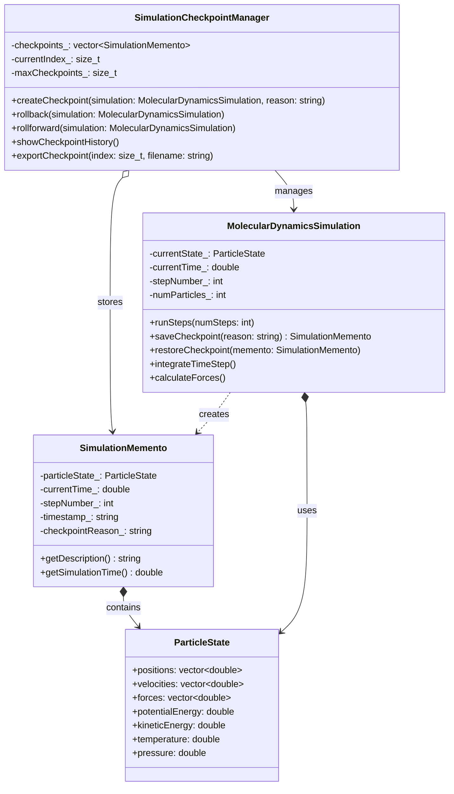
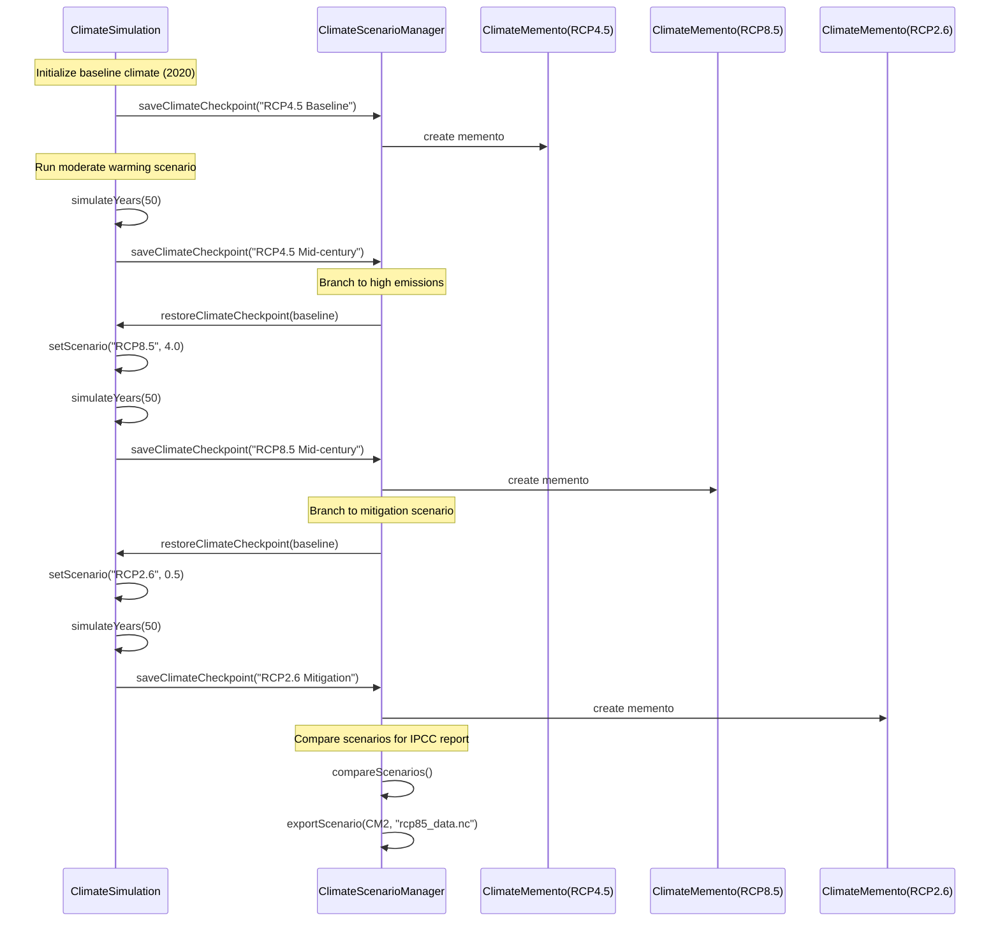

# Memento Pattern - Scientific Simulation State Management

## Intent
Provide robust checkpoint/restart capability for long-running scientific simulations by capturing complete simulation state without violating encapsulation, enabling recovery from failures, parameter exploration, and reproducible research.

## Scientific Computing Context
Long-running scientific simulations require reliable state management:
- **HPC Failures**: Hardware failures during multi-day simulations
- **Parameter Studies**: Branching simulations to explore different conditions
- **Reproducibility**: Exact state restoration for peer review and validation
- **Adaptive Methods**: Rollback when numerical instabilities are detected
- **Collaborative Research**: Sharing simulation states between research groups

## When to Use in Scientific Computing
- Implementing checkpoint/restart for fault-tolerant HPC simulations
- Creating simulation branching for parameter sensitivity studies
- Providing rollback capability for adaptive algorithms
- Enabling reproducible research with exact state snapshots
- Managing long-running climate, molecular dynamics, or CFD simulations

## Structure



### Climate Simulation Scenario Branching



## Implementation Details

### Key Components
1. **Scientific Simulation**: Creates complete state snapshots for checkpoint/restart
2. **SimulationMemento**: Stores complete simulation state (particles, fields, thermodynamics)
3. **CheckpointManager**: Manages checkpoint history, rollback, and export capabilities
4. **ParticleState**: Encapsulates all physical state variables (positions, velocities, energies)
5. **ScenarioManager**: Enables simulation branching for parameter studies

### Checkpoint/Restart Algorithm
```
1. Simulation detects checkpoint trigger:
   - Regular intervals (e.g., every 1000 steps)
   - Before parameter changes
   - Upon numerical instability detection
   - User-requested save points
   
2. Create comprehensive state snapshot:
   - All particle positions and velocities
   - Current forces and energies
   - Simulation time and step number
   - Thermodynamic properties
   - Random number generator state
   
3. Store checkpoint with metadata:
   - Timestamp for reproducibility
   - Checkpoint reason/trigger
   - Memory usage estimation
   - Simulation parameters
   
4. For recovery/rollback:
   - Select appropriate checkpoint
   - Restore complete simulation state
   - Verify energy conservation
   - Resume simulation from exact point
   
5. For scenario branching:
   - Restore to decision point
   - Modify parameters
   - Create new branch checkpoint
   - Run alternative scenario
```

### Scientific State Management
- **Molecular Dynamics**: Particle positions, velocities, forces, energies
- **Climate Models**: Temperature/humidity fields, atmospheric state, ocean currents
- **CFD Simulations**: Velocity/pressure fields, boundary conditions, turbulence models
- **Quantum Chemistry**: Wave functions, orbital coefficients, basis sets

## Advantages in Scientific Computing
- **Fault Tolerance**: Automatic recovery from hardware failures in HPC environments
- **Reproducibility**: Exact state restoration ensures reproducible results
- **Parameter Exploration**: Branch simulations to explore different conditions
- **Numerical Stability**: Rollback when algorithms become unstable
- **Collaboration**: Share exact simulation states between research groups
- **Validation**: Compare results from different checkpoints
- **Resource Efficiency**: Resume long simulations without starting over

## Disadvantages in HPC Context
- **Storage Overhead**: Large simulation states require significant disk space
- **I/O Performance**: Checkpoint writing can impact simulation performance
- **Memory Usage**: Multiple checkpoints consume substantial RAM
- **Network Traffic**: Sharing checkpoints across clusters requires bandwidth
- **Consistency**: Ensuring atomic checkpoint creation in parallel simulations
- **Versioning**: Managing compatibility across different code versions

## Example Output
```
=== Molecular Dynamics Simulation with Checkpoint Recovery ===

Initialized MD system with 100 particles in 10³ box

Creating simulation checkpoint: Initial configuration...
Checkpoint #1 created

=== MD Simulation Status ===
Time: 0.00e+00 s
Step: 0
Particles: 100
Box length: 10.00 units
Temperature: 300.00 K
Pressure: 3.01e+05 Pa
Kinetic Energy: 4.14e-18 J
Potential Energy: -2.07e-17 J
Total Energy: -1.66e-17 J
============================

=== Equilibration Phase ===
Running 1000 MD steps...
  Step 200: T=298.45 K, E=-1.6234e-17 J
  Step 400: T=301.23 K, E=-1.6187e-17 J
  Step 600: T=299.87 K, E=-1.6205e-17 J
  Step 800: T=300.56 K, E=-1.6198e-17 J
  Step 1000: T=299.34 K, E=-1.6211e-17 J

Creating simulation checkpoint: After equilibration...
Checkpoint #2 created

=== Production Run ===
Running 2000 MD steps...
  Step 1400: T=300.78 K, E=-1.6195e-17 J
  Step 1800: T=299.12 K, E=-1.6218e-17 J
  Step 2200: T=301.45 K, E=-1.6182e-17 J
  Step 2600: T=298.67 K, E=-1.6227e-17 J
  Step 3000: T=300.23 K, E=-1.6203e-17 J

Creating simulation checkpoint: Mid-production...
Checkpoint #3 created

=== Checkpoint History ===
   Checkpoint #1:
   Checkpoint: Initial configuration at 2024-01-20 14:30:15
  Simulation time: 0.00e+00 s
  Step: 0, Particles: 100
  Energy: -1.656 J
  Memory: 78.1 KB

   Checkpoint #2:
   Checkpoint: After equilibration at 2024-01-20 14:30:16
  Simulation time: 1.00e-12 s
  Step: 1000, Particles: 100
  Energy: -1.621 J
  Memory: 78.1 KB

-> Checkpoint #3:
   Checkpoint: Mid-production at 2024-01-20 14:30:17
  Simulation time: 3.00e-12 s
  Step: 3000, Particles: 100
  Energy: -1.620 J
  Memory: 78.1 KB

Current position: 3/3
Memory usage: ~150 KB

=== Simulating Numerical Instability (rollback needed) ===
Detected energy drift! Rolling back to previous stable state...
Restored simulation from checkpoint:
Checkpoint: After equilibration at 2024-01-20 14:30:16
  Simulation time: 1.00e-12 s
  Step: 1000, Particles: 100
  Energy: -1.621 J
  Memory: 78.1 KB
Rolled back to checkpoint #2

=== Climate Simulation with Scenario Branching ===

Initialized climate simulation with 1000 grid points (scenario: RCP4.5)

Saving climate checkpoint: RCP4.5 Baseline
Created scenario checkpoint: RCP4.5 Baseline

=== Climate Simulation Status ===
Simulation year: 2020.00
Scenario: RCP4.5
Global mean temperature: 288.15 K (0.00 K anomaly)
CO₂ concentration: 400.0 ppm
Sea level rise: 0.00 m
Ice volume: 1.00e+18 m³
Grid resolution: 1000 points
================================

=== Running RCP4.5 Scenario ===
Simulating 20 years of climate evolution...
  Year 2024: T=288.46 K, CO₂=408.0 ppm
  Year 2028: T=288.78 K, CO₂=416.0 ppm
  Year 2032: T=289.12 K, CO₂=424.0 ppm
  Year 2036: T=289.45 K, CO₂=432.0 ppm
  Year 2040: T=289.78 K, CO₂=440.0 ppm

Saving climate checkpoint: Auto: 20-year mark

=== Climate Scenario Comparison ===
[0] RCP4.5 Baseline:
   Climate checkpoint at 2024-01-20 14:30:20
  Simulation year: 2020.00
  Scenario: RCP4.5
  Global temp: 288.15 K
  CO₂: 400.0 ppm
  Sea level: 0.00 m

[1] RCP4.5 Mid-century:
   Climate checkpoint at 2024-01-20 14:30:22
  Simulation year: 2070.00
  Scenario: RCP4.5
  Global temp: 291.34 K
  CO₂: 500.0 ppm
  Sea level: 0.64 m

[2] RCP8.5 Mid-century:
   Climate checkpoint at 2024-01-20 14:30:23
  Simulation year: 2070.00
  Scenario: RCP8.5
  Global temp: 293.78 K
  CO₂: 600.0 ppm
  Sea level: 1.13 m

[3] RCP2.6 Mitigation:
   Climate checkpoint at 2024-01-20 14:30:24
  Simulation year: 2070.00
  Scenario: RCP2.6
  Global temp: 289.87 K
  CO₂: 425.0 ppm
  Sea level: 0.34 m

=== Exporting Scenarios for Publication ===
Exporting scenario 'RCP4.5 Mid-century' to rcp45_midcentury.dat
Scenario exported for publication/sharing
Exporting scenario 'RCP8.5 Mid-century' to rcp85_midcentury.dat
Scenario exported for publication/sharing
Exporting scenario 'RCP2.6 Mitigation' to rcp26_mitigation.dat
Scenario exported for publication/sharing

Memento pattern enables robust checkpoint/restart capability
for long-running scientific simulations with scenario exploration!
```

## Common Variations in Scientific Computing
1. **Incremental Checkpoints**: Store only state changes since last checkpoint
2. **Compressed Mementos**: Use data compression for large simulation states
3. **Distributed Checkpoints**: Parallel checkpoint creation across MPI ranks
4. **Hierarchical Mementos**: Multi-level checkpointing (fast/slow storage)
5. **Adaptive Checkpointing**: Dynamic checkpoint frequency based on stability
6. **Persistent Mementos**: HDF5/NetCDF serialization for long-term storage
7. **Scenario Branching**: Multiple checkpoint trees for parameter studies

## Related Patterns in Scientific Computing
- **Command**: Record simulation operations for reproducible workflows
- **Strategy**: Different checkpoint strategies based on simulation type
- **Observer**: Monitor simulation for automatic checkpoint triggers
- **Prototype**: Clone simulation configurations for parameter sweeps
- **Bridge**: Separate checkpoint interface from storage implementation

## 🔧 Compilation & Usage

### Prerequisites
- **C++ Standard**: C++11 or later (required for `unique_ptr`, `chrono`, `random`)
- **Compiler**: GCC 4.9+, Clang 3.4+, MSVC 2015+
- **Math Library**: Link with `-lm` on Unix systems
- **Optional**: HDF5, NetCDF for persistent checkpoint storage

### Basic Compilation

#### Linux/macOS
```bash
# Basic compilation
g++ -std=c++11 -o memento memento.cpp -lm

# Alternative with Clang
clang++ -std=c++11 -o memento memento.cpp -lm
```

#### Windows (MinGW)
```batch
g++ -std=c++11 -o memento.exe memento.cpp
```

#### Windows (MSVC)
```batch
cl /EHsc /std:c++11 memento.cpp
```

### Advanced Compilation Options

#### Debug Build
```bash
g++ -std=c++11 -g -O0 -DDEBUG -o memento_debug memento.cpp -lm
```

#### Optimized Release Build
```bash
g++ -std=c++11 -O3 -DNDEBUG -march=native -o memento_release memento.cpp -lm
```

#### With All Warnings
```bash
g++ -std=c++11 -Wall -Wextra -Wpedantic -o memento memento.cpp -lm
```

#### Sanitizer Builds (Debug)
```bash
# Address sanitizer
g++ -std=c++11 -fsanitize=address -g -o memento_asan memento.cpp -lm

# Undefined behavior sanitizer
g++ -std=c++11 -fsanitize=undefined -g -o memento_ubsan memento.cpp -lm

# Memory sanitizer (Clang only)
clang++ -std=c++11 -fsanitize=memory -g -o memento_msan memento.cpp -lm
```

### CMake Instructions

Create `CMakeLists.txt`:
```cmake
cmake_minimum_required(VERSION 3.10)
project(MementoPattern)

# Set C++ standard
set(CMAKE_CXX_STANDARD 11)
set(CMAKE_CXX_STANDARD_REQUIRED ON)

# Create executable
add_executable(memento memento.cpp)

# Link math library
target_link_libraries(memento m)

# Compiler-specific options
if(MSVC)
    target_compile_options(memento PRIVATE /W4)
else()
    target_compile_options(memento PRIVATE -Wall -Wextra -Wpedantic)
endif()

# Enable optimizations for Release
if(CMAKE_BUILD_TYPE STREQUAL "Release")
    target_compile_options(memento PRIVATE -O3 -march=native)
endif()

# Debug/Release configurations
if(CMAKE_BUILD_TYPE STREQUAL "Debug")
    target_compile_definitions(memento PRIVATE DEBUG)
else()
    target_compile_definitions(memento PRIVATE NDEBUG)
endif()

# Optional: Find HDF5 for persistent checkpoints
# find_package(HDF5 COMPONENTS CXX)
# if(HDF5_FOUND)
#     target_link_libraries(memento ${HDF5_LIBRARIES})
#     target_include_directories(memento PRIVATE ${HDF5_INCLUDE_DIRS})
#     target_compile_definitions(memento PRIVATE USE_HDF5)
# endif()
```

Build with CMake:
```bash
mkdir build && cd build
cmake .. -DCMAKE_BUILD_TYPE=Release
make  # or cmake --build . on Windows
```

### IDE Integration

#### Visual Studio Code
Create `.vscode/tasks.json`:
```json
{
    "version": "2.0.0",
    "tasks": [
        {
            "label": "build",
            "type": "shell",
            "command": "g++",
            "args": [
                "-std=c++11",
                "-g",
                "-Wall",
                "-Wextra",
                "${file}",
                "-o",
                "${fileDirname}/${fileBasenameNoExtension}",
                "-lm"
            ],
            "group": {
                "kind": "build",
                "isDefault": true
            }
        }
    ]
}
```

#### Visual Studio
1. Create new Console Application project
2. Set C++ Language Standard to C++11 or later in Project Properties
3. Copy the code to main source file
4. Build with Ctrl+F7

#### CLion
1. Open the project directory
2. CLion will auto-detect CMakeLists.txt
3. Build with Ctrl+F9

### Dependencies
- **Standard Library**: `<iostream>`, `<memory>`, `<string>`, `<vector>`, `<ctime>`, `<iomanip>`, `<sstream>`, `<stack>`, `<cmath>`, `<random>`, `<fstream>`, `<chrono>`
- **C++11 Features**: `unique_ptr`, `make_unique`, `chrono`, `random`, smart pointers
- **Math Functions**: `sin`, `cos`, `exp`, `sqrt`, `fmod` from `<cmath>`
- **Optional**: HDF5, NetCDF, MPI for advanced checkpoint features

### Platform-Specific Notes

#### Linux
- Install build tools: `sudo apt-get install build-essential`
- GCC recommended version: 4.9+ for `make_unique` support
- Math library usually linked automatically
- For HDF5: `sudo apt-get install libhdf5-dev`
- For MPI: `sudo apt-get install libopenmpi-dev`

#### macOS
- Install Xcode command line tools: `xcode-select --install`
- Alternative via Homebrew: `brew install gcc`
- For HDF5: `brew install hdf5`
- For MPI: `brew install open-mpi`

#### Windows
- **Visual Studio**: Download Visual Studio Community (free)
- **MinGW-w64**: Available via MSYS2 or standalone installer
- Math functions included in standard library
- For HDF5: Use vcpkg or pre-built binaries
- For MPI: Install MS-MPI or Intel MPI

### Troubleshooting

#### Common Issues
1. **"unique_ptr not found"**: Ensure C++11 standard is set (`-std=c++11`)
2. **"random_device not found"**: Include `<random>` header for random number generation
3. **Math linking errors**: Add `-lm` flag on Unix systems
4. **Large checkpoint files**: Use compression or incremental checkpointing
5. **Parallel checkpoint consistency**: Implement coordinated checkpointing for MPI

#### Performance Tips for HPC
- Use `-O3` and `-march=native` for production simulations
- Implement asynchronous checkpoint writing to overlap with computation
- Use parallel file systems (Lustre, GPFS) for large checkpoint files
- Consider checkpoint compression (gzip, lz4) to reduce I/O time
- Profile checkpoint overhead vs. restart time savings

#### Scientific Computing Considerations
- **Energy Conservation**: Verify energy conservation after checkpoint restore
- **Random Number States**: Save/restore RNG state for reproducibility
- **Floating Point Precision**: Be aware of precision loss in checkpoint data
- **Time Step Consistency**: Ensure consistent time stepping after restart
- **Boundary Conditions**: Properly restore all boundary condition states

#### HPC-Specific Design
- **Fault Tolerance**: Implement automatic checkpoint triggering before node failures
- **Scalability**: Design checkpoints to scale with increasing problem size
- **Storage Hierarchy**: Use fast local storage for frequent checkpoints
- **Load Balancing**: Distribute checkpoint I/O across available nodes
- **Metadata Management**: Track checkpoint lineage and dependencies
- **Cross-Platform**: Ensure checkpoint portability across different architectures