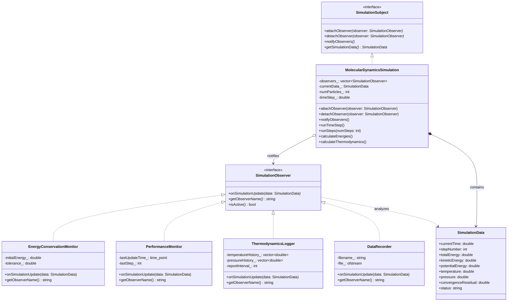
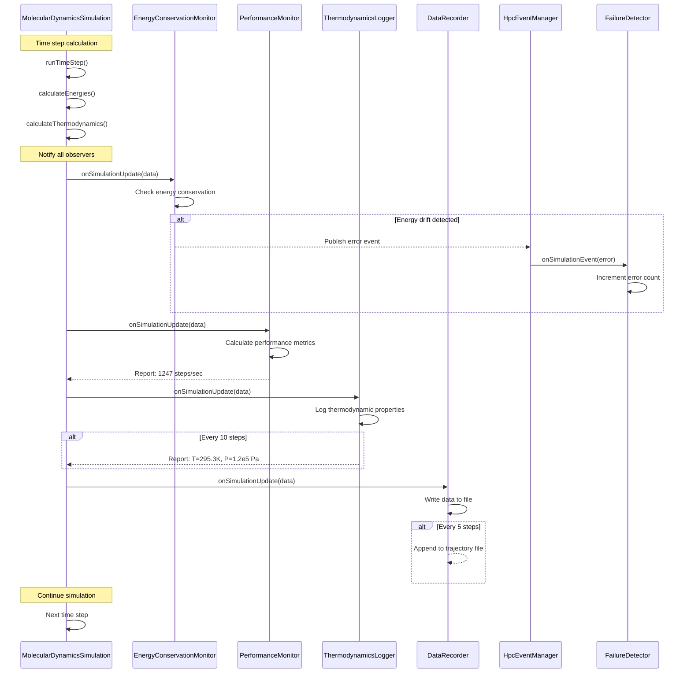

# Observer Pattern - Scientific Simulation Monitoring and Analysis

## Intent
Enable real-time monitoring and analysis of scientific simulations by defining a one-to-many dependency between simulations and their monitoring systems, automatically notifying all monitors when simulation state changes.

## Scientific Computing Context
Long-running scientific simulations require comprehensive monitoring:
- **Real-time Analysis**: Monitor energy conservation, convergence, stability
- **Performance Tracking**: Measure computational efficiency and resource usage
- **Failure Detection**: Detect numerical instabilities and hardware failures
- **Data Recording**: Automated logging and checkpoint creation
- **HPC Monitoring**: Track distributed computation across cluster nodes

## When to Use in Scientific Computing
- Implementing real-time simulation monitoring and analysis
- Creating automated data collection and logging systems
- Building failure detection and recovery mechanisms
- Developing performance optimization tools
- Enabling distributed monitoring across HPC clusters

## Structure



### HPC Event Monitoring System



## Implementation Details

### Key Components
1. **SimulationSubject**: Observable simulation providing state change notifications
2. **SimulationObserver**: Monitor interface for real-time analysis and data collection
3. **SimulationData**: Comprehensive simulation state container
4. **Specialized Monitors**: Energy conservation, performance, thermodynamics, data recording
5. **Event System**: HPC-specific event handling for distributed monitoring

### Scientific Monitoring Algorithm
```
1. Simulation registers monitoring systems:
   - Energy conservation monitors
   - Performance trackers
   - Data recorders
   - Failure detectors
   
2. During simulation execution:
   - Calculate physics (forces, energies, thermodynamics)
   - Update simulation state data structure
   - Notify all active observers
   
3. Each observer receives state update:
   - Energy monitor: Check conservation laws
   - Performance monitor: Measure computational efficiency
   - Data recorder: Write trajectory/analysis data
   - Failure detector: Identify numerical instabilities
   
4. Observers can trigger actions:
   - Emergency checkpointing
   - Simulation parameter adjustment
   - Resource allocation changes
   - Alert notifications
   
5. Event system handles distributed monitoring:
   - Cross-node communication
   - Centralized logging
   - Failure coordination
```

### Monitoring Types
- **Energy Conservation**: Verify fundamental physics laws
- **Performance Metrics**: Track computational efficiency
- **Thermodynamic Properties**: Monitor temperature, pressure, density
- **Convergence Analysis**: Check iterative solver convergence
- **Resource Usage**: Monitor memory, CPU, network utilization
- **Data Recording**: Automated trajectory and analysis data collection

## Advantages in Scientific Computing
- **Real-time Monitoring**: Immediate analysis of simulation progress and stability
- **Modular Analysis**: Independent monitoring systems for different physics aspects
- **Automated Data Collection**: Systematic recording without manual intervention
- **Failure Detection**: Early warning systems for numerical instabilities
- **Distributed Monitoring**: Coordinated observation across HPC clusters
- **Flexible Configuration**: Dynamic attachment/detachment of monitoring systems
- **Performance Optimization**: Real-time identification of computational bottlenecks

## Disadvantages in HPC Context
- **Performance Overhead**: Monitoring can impact simulation performance
- **Memory Usage**: Multiple observers storing historical data
- **I/O Bottlenecks**: Simultaneous data recording by multiple observers
- **Network Traffic**: Observer notifications in distributed systems
- **Synchronization**: Coordinating observers across parallel processes
- **Data Consistency**: Ensuring consistent state across all monitors

## Example Output
```
=== Scientific Simulation Monitoring System ===

[SIM] Initialized MD system with 100 particles
[SIM] Attached monitor: Energy Conservation Monitor
[SIM] Attached monitor: Performance Monitor
[SIM] Attached monitor: Thermodynamics Logger
[SIM] Attached monitor: Data Recorder
[Data Recorder] Started recording to md_simulation.dat

=== Running Molecular Dynamics Simulation ===
[SIM] Running 50 MD steps...
[Energy Conservation Monitor] Initial energy: -1.656e-17 J
[Performance Monitor] Performance: 1247.3 steps/sec (step 10)
[Thermodynamics Logger] Step 10: T=298.45 K, P=3.01e+05 Pa (avg: T=299.12 K)
[Thermodynamics Logger] Step 20: T=301.23 K, P=2.98e+05 Pa (avg: T=299.84 K)
[Performance Monitor] Performance: 1189.7 steps/sec (step 20)
[Thermodynamics Logger] Step 30: T=299.87 K, P=3.03e+05 Pa (avg: T=299.85 K)
[Thermodynamics Logger] Step 40: T=300.56 K, P=2.99e+05 Pa (avg: T=300.03 K)
[Performance Monitor] Performance: 1203.1 steps/sec (step 40)
[Thermodynamics Logger] Step 50: T=299.34 K, P=3.02e+05 Pa (avg: T=299.89 K)

=== Detaching Performance Monitor ===
[SIM] Detached monitor: Performance Monitor

=== Climate Simulation Monitoring ===
[CLIMATE] Initialized RCP4.5 climate simulation
[CLIMATE] Attached climate monitor: Climate Impact Monitor
[CLIMATE] Attached climate monitor: CO2 Emission Tracker

--- RCP4.5 Moderate Warming Scenario ---
[CLIMATE] Simulating 50 years...
[CO2 Emission Tracker] ⚠️  CO2 level: 450.2 ppm (+50.2 ppm)
[Climate Impact Monitor] ⚠️  Paris Agreement threshold exceeded: +1.68°C
[CO2 Emission Tracker] ⚠️  CO2 level: 500.0 ppm (+100.0 ppm)
[Climate Impact Monitor] 🚨 CRITICAL: Dangerous warming level: +2.34°C

--- RCP8.5 High Emissions Scenario ---
[CLIMATE] Simulating 50 years...
[CO2 Emission Tracker] 🚨 CO2 DOUBLING: 560.1 ppm!
[Climate Impact Monitor] 🚨 CRITICAL: Dangerous warming level: +3.78°C
[CO2 Emission Tracker] ⚠️  CO2 level: 600.0 ppm (+200.0 ppm)

=== HPC Event Monitoring System ===
[HPC-EVENTS] Subscribed HPC System Logger to simulation_started
[HPC-EVENTS] Subscribed HPC System Logger to step_completed
[HPC-EVENTS] Subscribed HPC Resource Monitor to step_completed
[HPC-EVENTS] Subscribed HPC System Logger to error_detected
[HPC-EVENTS] Subscribed HPC Failure Detector to error_detected

--- Simulating HPC Simulation Events ---
[HPC System Logger] 15:42:33 simulation_started
[HPC System Logger] 15:42:33 step_completed step=1 energy=-1.5e-17
[HPC Resource Monitor] Resources: Memory 47%, CPU 85%
[HPC System Logger] 15:42:34 step_completed step=5 energy=-1.48e-17
[HPC Failure Detector] 🚨 ERROR #1: Node 23 communication timeout
[HPC System Logger] 15:42:34 error_detected
[HPC Failure Detector] 🚨 ERROR #2: Memory allocation failed on node 45
[HPC System Logger] 15:42:35 error_detected
[HPC Failure Detector] 🚨 ERROR #3: Numerical instability detected
[HPC System Logger] 15:42:35 error_detected
[HPC Failure Detector] 🚨 CRITICAL: Multiple failures detected! Recommending simulation abort.
[HPC Failure Detector] Triggering emergency checkpoint...
[HPC System Logger] 15:42:35 convergence_achieved
[HPC System Logger] 15:42:36 simulation_completed

Observer pattern enables comprehensive real-time monitoring
of scientific simulations with automated analysis and alerts!
```

## Common Variations in Scientific Computing
1. **Push vs Pull Models**: Complete state push vs. on-demand data queries
2. **Hierarchical Observers**: Multi-level monitoring (local, regional, global)
3. **Filtered Notifications**: Observers subscribe to specific data types or events
4. **Asynchronous Observers**: Non-blocking notifications for performance
5. **Distributed Observers**: Cross-node monitoring in HPC environments
6. **Temporal Observers**: Time-based observation windows and intervals
7. **Conditional Observers**: Trigger-based monitoring (threshold crossings)

## Related Patterns in Scientific Computing
- **Strategy**: Different monitoring strategies for different simulation phases
- **Command**: Record monitoring actions for reproducibility
- **Memento**: Combine with checkpointing for simulation state management
- **Visitor**: Apply complex analysis operations to simulation data
- **Publisher-Subscriber**: Distributed event systems in HPC clusters

## 🔧 Compilation & Usage

### Prerequisites
- **C++ Standard**: C++11 or later (required for smart pointers, chrono, random)
- **Compiler**: GCC 4.8+, Clang 3.4+, MSVC 2015+
- **Math Library**: Link with `-lm` on Unix systems
- **Optional**: MPI for distributed monitoring, HDF5 for data recording

### Basic Compilation

#### Linux/macOS
```bash
# Basic compilation
g++ -std=c++11 -o observer observer.cpp -lm

# Alternative with Clang
clang++ -std=c++11 -o observer observer.cpp -lm
```

#### Windows (MinGW)
```batch
g++ -std=c++11 -o observer.exe observer.cpp
```

#### Windows (MSVC)
```batch
cl /EHsc /std:c++11 observer.cpp
```

### Advanced Compilation Options

#### Debug Build
```bash
g++ -std=c++11 -g -O0 -DDEBUG -o observer_debug observer.cpp -lm
```

#### Optimized Release Build
```bash
g++ -std=c++11 -O3 -DNDEBUG -march=native -o observer_release observer.cpp -lm
```

#### With All Warnings
```bash
g++ -std=c++11 -Wall -Wextra -Wpedantic -o observer observer.cpp -lm
```

#### Sanitizer Builds (Debug)
```bash
# Address sanitizer (detects memory leaks and errors)
g++ -std=c++11 -fsanitize=address -g -o observer_asan observer.cpp -lm

# Undefined behavior sanitizer
g++ -std=c++11 -fsanitize=undefined -g -o observer_ubsan observer.cpp -lm

# Thread sanitizer (for multi-threaded observer patterns)
g++ -std=c++11 -fsanitize=thread -g -o observer_tsan observer.cpp -lm
```

### CMake Instructions

Create `CMakeLists.txt`:
```cmake
cmake_minimum_required(VERSION 3.10)
project(ObserverPattern)

# Set C++ standard (C++11 minimum for smart pointers)
set(CMAKE_CXX_STANDARD 11)
set(CMAKE_CXX_STANDARD_REQUIRED ON)

# Create executable
add_executable(observer observer.cpp)

# Link math library
target_link_libraries(observer m)

# Compiler-specific options
if(MSVC)
    target_compile_options(observer PRIVATE /W4)
else()
    target_compile_options(observer PRIVATE -Wall -Wextra -Wpedantic)
endif()

# Enable optimizations for Release
if(CMAKE_BUILD_TYPE STREQUAL "Release")
    target_compile_options(observer PRIVATE -O3 -march=native)
endif()

# Optional: Find MPI for distributed monitoring
# find_package(MPI)
# if(MPI_FOUND)
#     target_link_libraries(observer ${MPI_LIBRARIES})
#     target_include_directories(observer PRIVATE ${MPI_INCLUDE_DIRS})
#     target_compile_definitions(observer PRIVATE USE_MPI)
# endif()
```

Build with CMake:
```bash
mkdir build && cd build
cmake .. -DCMAKE_BUILD_TYPE=Release
make  # or cmake --build . on Windows
```

### IDE Integration

#### Visual Studio Code
Create `.vscode/tasks.json`:
```json
{
    "version": "2.0.0",
    "tasks": [
        {
            "label": "build",
            "type": "shell",
            "command": "g++",
            "args": [
                "-std=c++11",
                "-g",
                "-Wall",
                "-Wextra",
                "${file}",
                "-o",
                "${fileDirname}/${fileBasenameNoExtension}",
                "-lm"
            ],
            "group": {
                "kind": "build",
                "isDefault": true
            },
            "presentation": {
                "echo": true,
                "reveal": "always",
                "panel": "new"
            }
        }
    ]
}
```

#### Visual Studio
1. Create new Console Application project
2. Set C++ Language Standard to C++11 or later in Project Properties
3. Copy the code to main source file
4. Build with Ctrl+F7

#### CLion
1. Open the project directory
2. CLion will auto-detect CMakeLists.txt
3. Set C++ standard to C++11 in CMake configuration
4. Build with Ctrl+F9

### Dependencies
- **Standard Library Headers**:
  - `<iostream>` - Input/output operations
  - `<memory>` - Smart pointers (shared_ptr, weak_ptr, make_shared)
  - `<vector>` - Dynamic arrays for observer lists
  - `<string>` - String operations
  - `<algorithm>` - STL algorithms (find, etc.)
  - `<unordered_map>` - Hash maps for event system
  - `<iomanip>` - I/O manipulators for formatting
  - `<ctime>` - Time functions for logging
  - `<sstream>` - String stream operations
  - `<cmath>` - Mathematical functions
  - `<fstream>` - File operations for data recording
  - `<chrono>` - High-resolution timing
  - `<random>` - Random number generation
- **C++11 Features**: smart pointers, auto, range-based for loops, chrono
- **Math Functions**: `sin`, `cos`, `exp`, `fmod` from `<cmath>`
- **Optional**: MPI for distributed monitoring, HDF5 for scientific data formats

### Platform-Specific Notes

#### Linux
- Install build tools: `sudo apt-get install build-essential`
- GCC recommended version: 7.0+ for better C++11 support
- Math library usually linked automatically
- For MPI: `sudo apt-get install libopenmpi-dev`
- For HDF5: `sudo apt-get install libhdf5-dev`

#### macOS
- Install Xcode command line tools: `xcode-select --install`
- Alternative: Install via Homebrew: `brew install gcc`
- For MPI: `brew install open-mpi`
- For HDF5: `brew install hdf5`

#### Windows
- **Visual Studio**: Download Visual Studio Community (free)
- **MinGW-w64**: Available via MSYS2 or standalone installer
- Math functions included in standard library
- For MPI: Install MS-MPI or Intel MPI
- For HDF5: Use vcpkg or pre-built binaries

### Troubleshooting

#### Common Issues
1. **"shared_ptr not found"**: Ensure C++11 standard is set (`-std=c++11`)
2. **"chrono not found"**: Include `<chrono>` header for timing operations
3. **Math linking errors**: Add `-lm` flag on Unix systems
4. **High-frequency monitoring overhead**: Use asynchronous notifications
5. **Distributed monitoring issues**: Implement proper MPI synchronization

#### Performance Tips for Scientific Computing
- Use `-O3` and `-march=native` for production simulations
- Implement batched notifications for high-frequency updates
- Use asynchronous observers for non-critical monitoring
- Profile observer overhead vs. simulation performance
- Consider observer priority levels for critical vs. diagnostic monitoring

#### Scientific Computing Considerations
- **Data Consistency**: Ensure observers see consistent simulation state
- **Timing Precision**: Use high-resolution timing for performance monitoring
- **Memory Efficiency**: Manage historical data storage in observers
- **Fault Tolerance**: Implement observer failure recovery mechanisms
- **Scalability**: Design observers to scale with simulation size

#### HPC-Specific Design
- **Distributed Monitoring**: Coordinate observers across MPI ranks
- **I/O Optimization**: Aggregate data writes to reduce file system load
- **Resource Monitoring**: Track memory, CPU, and network usage
- **Load Balancing**: Distribute monitoring overhead across nodes
- **Event Correlation**: Synchronize events across distributed observers
- **Checkpoint Integration**: Coordinate observers with simulation checkpointing