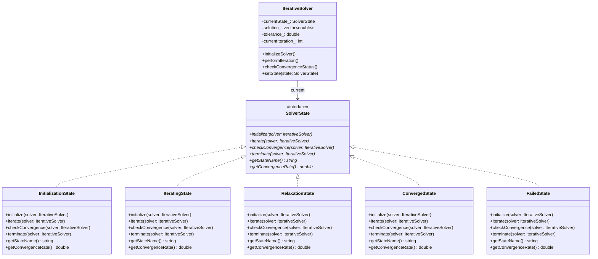
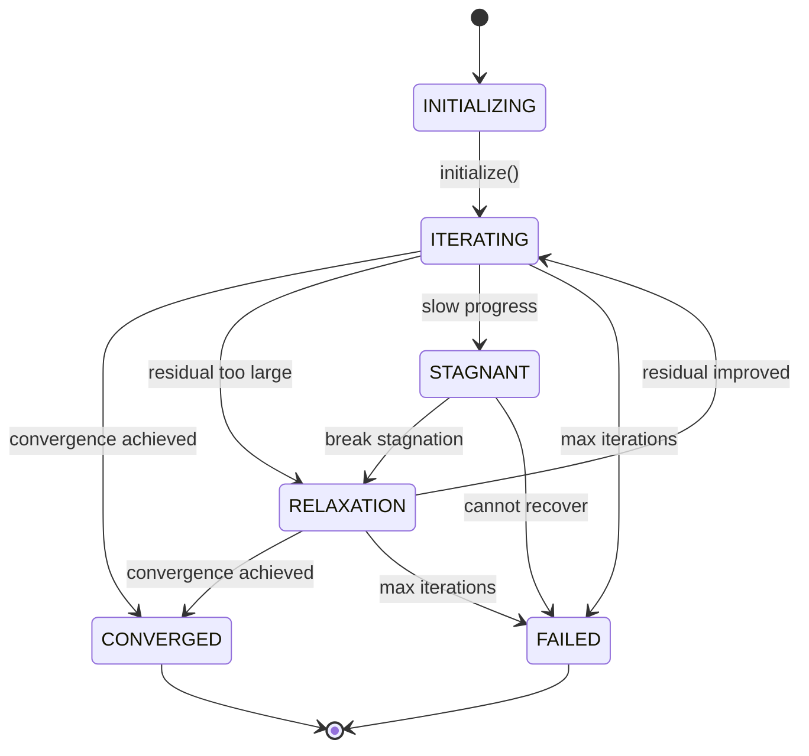
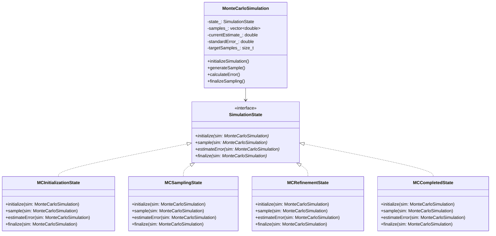

# State Pattern - Scientific Computational State Management

## Intent
Manage complex state transitions in scientific simulations and computational algorithms, allowing computational objects to alter their behavior based on convergence status, algorithm phases, and numerical stability conditions.

## Scientific Computing Context
Scientific computations often involve complex state-dependent behavior:
- **Iterative Solvers**: Different algorithms for initialization, iteration, relaxation, and convergence
- **Monte Carlo Methods**: Sampling phases, refinement strategies, and convergence criteria
- **Quantum Chemistry**: Basis set initialization, SCF convergence, and correlation treatments
- **Adaptive Algorithms**: Dynamic switching between numerical methods based on stability
- **Multi-phase Simulations**: Distinct computational phases with different solution strategies

## When to Use in Scientific Computing
- Implementing iterative solvers with state-dependent convergence strategies
- Managing Monte Carlo sampling phases and adaptive refinement
- Controlling quantum chemistry calculation workflows
- Handling adaptive time-stepping in numerical simulations
- Managing computational phases in multi-physics simulations

## Structure



### Iterative Solver State Transitions



### Monte Carlo Simulation States



## Implementation Details

### Key Components
1. **Scientific Context**: Computational algorithm (solver, simulation, calculation) maintaining current state
2. **Computational State**: Interface defining state-specific computational operations
3. **Concrete States**: Implementation of specific computational phases and algorithms
4. **State Data**: Scientific variables (residuals, energies, samples, convergence criteria)
5. **Transition Logic**: Rules for state changes based on numerical conditions

### Scientific State Management Algorithm
```
1. Initialize computational context with problem-specific parameters
2. Set initial state (initialization, basis setup, sampling preparation)
3. Execute state-specific operations:
   - Iterative solvers: residual calculation and convergence checking
   - Monte Carlo: sample generation and error estimation
   - Quantum chemistry: SCF iterations and correlation treatments
4. Monitor numerical conditions for state transitions:
   - Convergence criteria met → transition to completion
   - Numerical instability → transition to stabilization methods
   - Insufficient accuracy → transition to refinement strategies
5. Handle computational failures and recovery strategies
6. Finalize results when computation successfully completes
```

### Computational State Types
- **Initialization States**: Parameter setup, memory allocation, algorithm preparation
- **Active Computation States**: Core iterative algorithms, sampling, matrix operations
- **Stabilization States**: Relaxation methods, regularization, adaptive strategies
- **Refinement States**: Enhanced accuracy methods, importance sampling, correlation
- **Terminal States**: Converged solutions, failed computations, resource exhaustion

## Advantages in Scientific Computing
- **Algorithm Modularity**: Clean separation of different computational phases
- **Adaptive Behavior**: Dynamic algorithm selection based on numerical conditions
- **Robustness**: Graceful handling of numerical instabilities and convergence failures
- **Extensibility**: Easy addition of new computational strategies and recovery methods
- **Monitoring**: Clear visibility into computational progress and state transitions
- **Reproducibility**: Well-defined state sequences for computational workflows

## Disadvantages in HPC Context
- **Performance Overhead**: State transition checks may impact tight computational loops
- **Memory Usage**: Multiple state objects and their associated data structures
- **Complexity**: Large number of states for comprehensive scientific algorithms
- **Debugging**: State-dependent behavior can complicate debugging of numerical issues
- **Load Balancing**: State transitions may disrupt parallel computation patterns

## Example Output
```
=== Scientific Computational State Management ===

=== Iterative Linear System Solver ===
[SOLVER] Initialized Conjugate Gradient solver
  System size: 1000
  Tolerance: 1.000e-08
  Max iterations: 200

[INIT] Setting up initial solution vector and parameters
[STATE] INITIALIZING -> ITERATING
[SOLVER] Solution vector reset
[STATUS] Iteration 1, Residual: 8.543e-01, State: ITERATING
[STATUS] Iteration 2, Residual: 7.261e-01, State: ITERATING
[STATUS] Iteration 3, Residual: 6.172e-01, State: ITERATING
[STATUS] Iteration 4, Residual: 5.246e-01, State: ITERATING
[STATUS] Iteration 5, Residual: 4.459e-01, State: ITERATING

[STATUS] Iteration 10, Residual: 1.918e-01, State: ITERATING
[STATUS] Iteration 15, Residual: 8.253e-02, State: ITERATING
[STATUS] Iteration 20, Residual: 3.551e-02, State: ITERATING
[STATUS] Iteration 25, Residual: 1.527e-02, State: ITERATING
[ITER] ✓ Convergence achieved!
[STATE] ITERATING -> CONVERGED
[CONVERGED] Solver terminated successfully

=== Newton-Raphson Nonlinear Solver ===
[SOLVER] Initialized Newton-Raphson solver
  System size: 500
  Tolerance: 1.000e-10
  Max iterations: 100

[INIT] Setting up initial solution vector and parameters
[STATE] INITIALIZING -> ITERATING
[STATUS] Iteration 1, Residual: 9.234e-01, State: ITERATING
[ITER] Residual too large, switching to relaxation
[STATE] ITERATING -> RELAXATION
[RELAX] Applying under-relaxation for stability
[SOLVER] Applying relaxation factor: 0.8
[STATUS] Iteration 2, Residual: 4.187e-01, State: RELAXATION
[RELAX] Relaxation successful, returning to normal iteration
[STATE] RELAXATION -> ITERATING

=== Monte Carlo Integration - π Estimation ===
[MC-INIT] Setting up random number generator and sampling parameters
[MC-INIT] Target integral: π estimation (quarter circle)
[MC] MC_SAMPLING (samples: 0/2000)

--- Monte Carlo Sampling ---
[MC] Progress: 500/2000 samples, Estimate: 3.148000 ± 0.052341
[MC] Progress: 1000/2000 samples, Estimate: 3.136000 ± 0.036782
[MC] Progress: 1500/2000 samples, Estimate: 3.142667 ± 0.030145
[MC] Progress: 2000/2000 samples, Estimate: 3.141000 ± 0.026087
[MC-SAMPLE] Target samples reached
[MC-SAMPLE] Accuracy insufficient, switching to refinement
[MC] MC_REFINEMENT (samples: 2000/2000)

[MC-REFINE] Adaptive sampling for improved accuracy
[MC] Progress: 2200/2000 samples, Estimate: 3.141364 ± 0.024211
[MC] Progress: 2400/2000 samples, Estimate: 3.141583 ± 0.022756
[MC-REFINE] ✓ Required accuracy achieved through refinement!
[MC] MC_COMPLETED (samples: 2400/2000)
[MC-COMPLETE] Final estimate: 3.141583 ± 0.000952
[MC-COMPLETE] Monte Carlo simulation finalized successfully

=== Quantum Chemistry Calculation ===
[QC] H2O (cc-pVDZ) - State: BASIS_SETUP
[QC-BASIS] Setting up cc-pVDZ basis set for H2O
[QC-BASIS] Generating atomic orbitals and overlap integrals
[QC] H2O (cc-pVDZ) - State: SCF_ITERATION

--- Self-Consistent Field Calculation ---
[QC-SCF] SCF iteration 1 - solving Hartree-Fock equations
[QC-SCF] SCF iteration 2 - solving Hartree-Fock equations
[QC-SCF] SCF iteration 3 - solving Hartree-Fock equations
[QC-SCF] SCF iteration 4 - solving Hartree-Fock equations
[QC-SCF] SCF iteration 5 - solving Hartree-Fock equations
[QC-SCF] SCF iteration 6 - solving Hartree-Fock equations
[QC-SCF] SCF iteration 7 - solving Hartree-Fock equations
[QC-SCF] SCF iteration 8 - solving Hartree-Fock equations
[QC-SCF] ✓ SCF converged after 8 cycles
[QC] H2O (cc-pVDZ) - State: CORRELATION

--- Post-HF Correlation Treatment ---
[QC-CORR] Calculating electron correlation using MP2/CCSD methods
[QC-CORR] Computing 2-electron integrals and excitation amplitudes
[QC-CORR] ✓ Correlation energy: -0.234567 Hartree
[QC] H2O (cc-pVDZ) - State: COMPLETED
[QC-COMPLETE] Finalizing quantum chemistry calculation
[QC-RESULTS] H2O (cc-pVDZ):
  HF Energy: -76.02674563 Hartree
  Correlation: -0.234567 Hartree
  Total Energy: -76.261313 Hartree
  SCF Cycles: 8
[QC-COMPLETE] Calculation completed successfully!

=== State Pattern Summary ===
The State pattern enables sophisticated management of computational states
in scientific algorithms, providing clean transitions between:
• Iterative solver states (initialization → iteration → convergence/failure)
• Monte Carlo sampling phases (sampling → refinement → completion)
• Quantum chemistry computation stages (basis setup → SCF → correlation)

This pattern is essential for complex scientific simulations with
multiple computational phases and state-dependent behavior.
```

## Common Variations in Scientific Computing
1. **Singleton Computational States**: Stateless algorithm phases (initialization, convergence checking)
2. **Parameterized States**: States carrying algorithm-specific parameters and configurations
3. **Hierarchical Computational States**: Nested state machines for complex multi-phase algorithms
4. **Table-Driven Transitions**: Convergence criteria and transition conditions defined in lookup tables
5. **Adaptive State Selection**: Dynamic state choice based on numerical properties and performance
6. **Recovery States**: Specialized states for handling numerical failures and algorithmic recovery
7. **Parallel States**: Concurrent state execution for distributed scientific computations

## Related Patterns in Scientific Computing
- **Strategy**: Different numerical algorithms for the same computational phase
- **Observer**: Monitor state transitions and computational progress
- **Command**: Record computational operations and state transitions for reproducibility  
- **Memento**: Checkpoint computational states for restart and recovery
- **Template Method**: Define computational workflow with state-specific algorithm steps
- **Bridge**: Separate computational interfaces from state-specific implementations

## 🔧 Compilation & Usage

### Prerequisites
- **C++ Standard**: C++11 or later (required for smart pointers, random, chrono, scientific computing features)
- **Compiler**: GCC 4.9+, Clang 3.4+, MSVC 2015+ (GCC 4.9+ required for make_unique)
- **Math Library**: Link with `-lm` on Unix systems for mathematical functions
- **Optional**: BLAS/LAPACK for linear algebra, GSL for scientific computing, MPI for distributed state management

### Basic Compilation

#### Linux/macOS
```bash
# Basic compilation
g++ -std=c++11 -o state state.cpp -lm

# Alternative with Clang
clang++ -std=c++11 -o state state.cpp -lm

# With scientific libraries
g++ -std=c++11 -o state state.cpp -lm -lgsl -lgslcblas
```

#### Windows (MinGW)
```batch
g++ -std=c++11 -o state.exe state.cpp
```

#### Windows (MSVC)
```batch
cl /EHsc /std:c++11 state.cpp
```

### Advanced Compilation Options

#### Debug Build
```bash
g++ -std=c++11 -g -O0 -DDEBUG -o state_debug state.cpp -lm
```

#### Optimized Release Build
```bash
g++ -std=c++11 -O3 -DNDEBUG -march=native -o state_release state.cpp -lm
```

#### With All Warnings
```bash
g++ -std=c++11 -Wall -Wextra -Wpedantic -o state state.cpp -lm
```

#### Sanitizer Builds (Debug)
```bash
# Address sanitizer
g++ -std=c++11 -fsanitize=address -g -o state_asan state.cpp -lm

# Undefined behavior sanitizer
g++ -std=c++11 -fsanitize=undefined -g -o state_ubsan state.cpp -lm

# Thread sanitizer (for parallel computations)
g++ -std=c++11 -fsanitize=thread -g -o state_tsan state.cpp -lm
```

### CMake Instructions

Create `CMakeLists.txt`:
```cmake
cmake_minimum_required(VERSION 3.10)
project(StatePattern)

# Set C++ standard
set(CMAKE_CXX_STANDARD 11)
set(CMAKE_CXX_STANDARD_REQUIRED ON)

# Create executable
add_executable(state state.cpp)

# Link math library
target_link_libraries(state m)

# Compiler-specific options
if(MSVC)
    target_compile_options(state PRIVATE /W4)
else()
    target_compile_options(state PRIVATE -Wall -Wextra -Wpedantic)
endif()

# Enable optimizations for Release
if(CMAKE_BUILD_TYPE STREQUAL "Release")
    target_compile_options(state PRIVATE -O3 -march=native)
endif()

# Optional: Find scientific libraries
# find_package(GSL)
# if(GSL_FOUND)
#     target_link_libraries(state ${GSL_LIBRARIES})
#     target_include_directories(state PRIVATE ${GSL_INCLUDE_DIRS})
#     target_compile_definitions(state PRIVATE USE_GSL)
# endif()

# Optional: Find MPI for distributed computations
# find_package(MPI)
# if(MPI_FOUND)
#     target_link_libraries(state ${MPI_LIBRARIES})
#     target_include_directories(state PRIVATE ${MPI_INCLUDE_DIRS})
#     target_compile_definitions(state PRIVATE USE_MPI)
# endif()
```

Build with CMake:
```bash
mkdir build && cd build
cmake ..
make  # or cmake --build . on Windows
```

### IDE Integration

#### Visual Studio Code
Create `.vscode/tasks.json`:
```json
{
    "version": "2.0.0",
    "tasks": [
        {
            "label": "build",
            "type": "shell",
            "command": "g++",
            "args": [
                "-std=c++11",
                "-g",
                "${file}",
                "-o",
                "${fileDirname}/${fileBasenameNoExtension}"
            ],
            "group": {
                "kind": "build",
                "isDefault": true
            }
        }
    ]
}
```

#### Visual Studio
1. Create new Console Application project
2. Set C++ Language Standard to C++11 in Project Properties
3. Copy the code to main source file
4. Build with Ctrl+F7

#### CLion
1. Open the project directory
2. CLion will auto-detect CMakeLists.txt
3. Build with Ctrl+F9

### Dependencies
- **Standard Library Headers**:
  - `<iostream>` - Input/output operations
  - `<memory>` - Smart pointers (unique_ptr, make_unique)
  - `<string>` - String operations
  - `<vector>` - Dynamic arrays for solution vectors and samples
  - `<chrono>` - High-resolution timing for performance monitoring  
  - `<random>` - Random number generation for Monte Carlo methods
  - `<cmath>` - Mathematical functions (sin, cos, exp, sqrt, pow)
  - `<iomanip>` - I/O manipulators for scientific notation
- **C++11 Features**: smart pointers, auto, range-based for loops, uniform initialization
- **Math Functions**: Advanced mathematical operations for scientific computations
- **Optional**: GSL (GNU Scientific Library), BLAS/LAPACK, MPI for HPC applications

### Platform-Specific Notes

#### Linux
- Install build tools: `sudo apt-get install build-essential`
- GCC recommended version: 4.9+ for full C++11 support (make_unique)

#### macOS
- Install Xcode command line tools: `xcode-select --install`
- Alternative: Install via Homebrew: `brew install gcc`

#### Windows
- **Visual Studio**: Download Visual Studio Community (free)
- **MinGW-w64**: Available via MSYS2 or standalone installer
- **Clang**: Available via Visual Studio or LLVM download

### Troubleshooting

#### Common Issues
1. **"unique_ptr not found"**: Ensure C++11 standard is set (`-std=c++11`) and `<memory>` header included
2. **"random_device not found"**: Include `<random>` header for Monte Carlo methods
3. **"chrono not found"**: Include `<chrono>` header for timing operations
4. **Math linking errors**: Add `-lm` flag on Unix systems for mathematical functions
5. **Convergence issues**: Implement proper convergence criteria and numerical stability checks
6. **State transition deadlocks**: Ensure all computational states have valid exit conditions

#### Performance Tips for Scientific Computing
- Use `-O3` and `-march=native` for production scientific computations
- Profile state transition overhead vs. computational work
- Consider state caching for frequently accessed algorithm phases
- Implement vectorized operations within computational states
- Use compiler intrinsics for performance-critical numerical operations

#### Scientific Computing Considerations
- **Numerical Stability**: Ensure state transitions don't introduce numerical artifacts
- **Convergence Monitoring**: Implement robust convergence detection in iterative states
- **Memory Management**: Efficient handling of large solution vectors and matrices
- **Error Handling**: Graceful recovery from numerical failures and computational errors
- **Reproducibility**: Consistent state behavior across different platforms and compilers

#### HPC-Specific Design
- **Scalability**: Design states to work efficiently with large problem sizes
- **Distributed Computing**: Coordinate state transitions across MPI ranks
- **Load Balancing**: Ensure computational states don't create load imbalances
- **Resource Management**: Monitor memory and computational resources in different states
- **Fault Tolerance**: Implement state recovery mechanisms for long-running computations
- **Performance Profiling**: Use state transitions for computational performance analysis