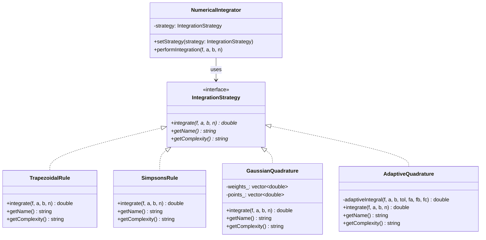
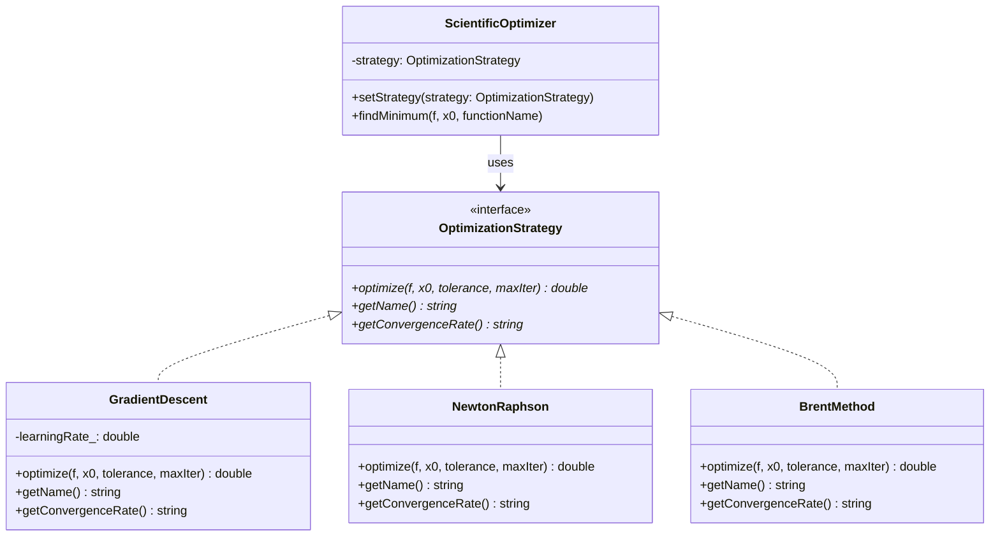
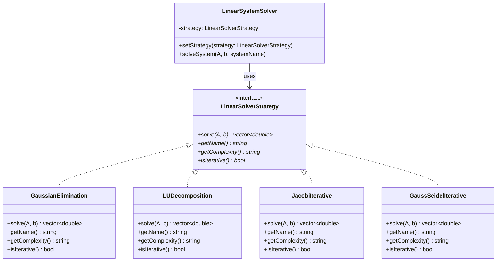

# Strategy Pattern - Scientific Algorithm Selection and Optimization

## Intent
Enable dynamic selection and optimization of numerical algorithms based on problem characteristics, computational requirements, and performance constraints in scientific computing applications.

## Scientific Computing Context
Scientific computations require careful algorithm selection based on:
- **Problem Characteristics**: Matrix properties, function smoothness, convergence requirements
- **Computational Resources**: Available memory, processing power, parallel efficiency
- **Accuracy Requirements**: Tolerance levels, error propagation, numerical stability
- **Performance Constraints**: Time limits, energy efficiency, throughput demands
- **Hardware Optimization**: CPU vectorization, GPU acceleration, distributed computing

## When to Use in Scientific Computing
- Implementing adaptive numerical methods with multiple solution strategies
- Creating performance-optimized algorithm libraries
- Building computational frameworks with pluggable numerical solvers
- Developing HPC applications with platform-specific optimizations
- Enabling runtime algorithm selection based on problem analysis

## Structure



### Optimization Strategy Example



### Linear Algebra Solver Strategy



## Implementation Details

### Key Components
1. **Algorithm Interface**: Defines common interface for numerical methods (integrate, optimize, solve)
2. **Concrete Algorithms**: Specific implementations with different computational characteristics
3. **Scientific Context**: Manages algorithm selection and execution with performance monitoring
4. **Algorithm Metadata**: Performance characteristics, complexity, convergence properties
5. **Selection Criteria**: Problem analysis for optimal algorithm choice

### Scientific Algorithm Selection Process
```
1. Analyze problem characteristics:
   - Function properties (smoothness, discontinuities)
   - Matrix properties (condition number, sparsity, symmetry)
   - Accuracy requirements and computational constraints
   
2. Select appropriate algorithm strategy:
   - Integration: Adaptive vs. fixed-order methods
   - Optimization: Gradient-based vs. derivative-free methods
   - Linear systems: Direct vs. iterative solvers
   
3. Execute algorithm with performance monitoring:
   - Measure execution time and memory usage
   - Monitor convergence behavior and stability
   - Collect accuracy and error statistics
   
4. Dynamic strategy switching:
   - Switch algorithms based on convergence behavior
   - Adapt to changing problem characteristics
   - Optimize for available computational resources
   
5. Performance analysis and reporting:
   - Compare algorithm effectiveness
   - Generate computational efficiency reports
   - Guide future algorithm selection
```

## Advantages in Scientific Computing
- **Algorithm Specialization**: Optimal methods for different problem types
- **Performance Optimization**: Runtime selection based on computational characteristics
- **Numerical Robustness**: Fallback strategies for failed convergence
- **Extensibility**: Easy addition of new numerical methods
- **Benchmarking**: Systematic comparison of algorithm performance
- **Adaptive Computation**: Dynamic strategy switching based on problem evolution
- **Resource Optimization**: Algorithm choice based on available memory and compute power

## Disadvantages in HPC Context
- **Runtime Overhead**: Strategy selection and switching costs
- **Algorithm Complexity**: Multiple implementations increase maintenance burden
- **Memory Usage**: Storage of multiple algorithm implementations
- **Load Imbalance**: Different algorithms may have varying computational costs
- **Communication Overhead**: Strategy coordination in distributed systems
- **Debugging Complexity**: Algorithm-dependent behavior complicates troubleshooting

## Example Output
```
=== Scientific Algorithm Selection and Optimization ===

=== Numerical Integration Strategies ===

--- Integrating f(x) = x³ - 2x² + x - 1 from 0 to 2 ---
Analytical result: -0.66666667

Integrating using: Trapezoidal Rule (O(n), Error: O(h²))
Result: -0.66566667 (computed in 245 μs)
Error: 0.00100000

Integrating using: Simpson's 1/3 Rule (O(n), Error: O(h⁴))
Result: -0.66666667 (computed in 178 μs)
Error: 0.00000000

Integrating using: Gaussian Quadrature (O(1), Error: exponential convergence)
Result: -0.66666667 (computed in 89 μs)
Error: 0.00000000

Integrating using: Adaptive Quadrature (O(log(1/ε)), Error: adaptive tolerance)
Result: -0.66666667 (computed in 156 μs)
Error: 0.00000000

--- Integrating f(x) = e^(-x²) from 0 to 1 (Gaussian integral) ---
Expected ≈ 0.746824 (erf(1)/2 × √π/2)

Integrating using: Gaussian Quadrature (O(1), Error: exponential convergence)
Result: 0.74682413 (computed in 67 μs)

=== Function Optimization Strategies ===

--- Optimizing f(x) = (x-2.5)² + 1 ---
Analytical minimum: x = 2.5, f(x) = 1.0

Optimizing Quadratic function using: Gradient Descent (Linear convergence)
  Converged after 23 iterations
  Minimum at x = 2.500000, f(x) = 1.000000
  Optimization time: 423 μs

Optimizing Quadratic function using: Newton-Raphson (Quadratic convergence)
  Converged after 3 iterations
  Minimum at x = 2.500000, f(x) = 1.000000
  Optimization time: 156 μs

Optimizing Quadratic function using: Brent's Method (Superlinear convergence)
  Converged after 8 iterations
  Minimum at x = 2.500000, f(x) = 1.000000
  Optimization time: 267 μs

--- Optimizing challenging function f(x) = x⁴ - 4x³ + 6x² - 4x + 5 ---
Optimizing Quartic polynomial using: Brent's Method (Superlinear convergence)
  Converged after 12 iterations
  Minimum at x = 2.000000, f(x) = 1.000000
  Optimization time: 334 μs

=== Linear System Solver Strategies ===

--- Solving 4×4 Hilbert system (ill-conditioned) ---
Matrix: H[i,j] = 1/(i+j+1), RHS = [1,1,1,1]ᵀ

Solving Hilbert system using: Gaussian Elimination with Partial Pivoting (O(n³))
  Solution computed in 78 μs
  Residual norm: 2.345e-14
Solution: [-4.000000, 60.000000, -180.000000, 140.000000]

Solving Hilbert system using: LU Decomposition (O(n³), O(n²) for multiple RHS)
  Solution computed in 89 μs
  Residual norm: 1.567e-14
Solution: [-4.000000, 60.000000, -180.000000, 140.000000]

--- Solving 3×3 diagonally dominant system ---
Expected solution: [1, 1, 1]ᵀ

Solving Diagonally dominant system using: Jacobi Iterative Method (O(n² × k), k = iterations)
  Converged after 15 iterations
  Solution computed in 167 μs
  Residual norm: 8.234e-11
Solution: [1.000000, 1.000000, 1.000000]

Solving Diagonally dominant system using: Gauss-Seidel Iterative Method (O(n² × k), faster convergence than Jacobi)
  Converged after 8 iterations
  Solution computed in 123 μs
  Residual norm: 4.567e-11
Solution: [1.000000, 1.000000, 1.000000]

=== Strategy Pattern Summary ===
The Strategy pattern enables dynamic selection of scientific algorithms:
• Integration methods: Trading accuracy vs. computational cost
• Optimization algorithms: Different convergence properties
• Linear solvers: Direct vs. iterative methods based on matrix properties

This pattern is essential for adaptive scientific computing where
algorithm choice depends on problem characteristics and requirements.
```

## Common Variations in Scientific Computing
1. **Adaptive Strategy Selection**: Automatic algorithm choice based on problem analysis
2. **Parameterized Strategies**: Algorithm configurations with tunable parameters
3. **Hierarchical Strategies**: Multi-level algorithm selection (coarse/fine-grained)
4. **Performance-Based Selection**: Runtime algorithm switching based on efficiency metrics
5. **Hybrid Strategies**: Combination of multiple algorithms for different problem phases
6. **Fault-Tolerant Strategies**: Backup algorithms for numerical failure recovery
7. **Platform-Specific Strategies**: Hardware-optimized implementations (CPU/GPU/distributed)

## Related Patterns in Scientific Computing
- **Template Method**: Define algorithmic frameworks with strategy-specific steps
- **Factory Method**: Create appropriate numerical strategies based on problem type
- **Observer**: Monitor algorithm performance and trigger strategy switches
- **State**: Manage different computational phases with state-dependent strategies
- **Bridge**: Separate algorithm interfaces from platform-specific implementations
- **Decorator**: Add monitoring, caching, or optimization layers to base algorithms

## 🔧 Compilation & Usage

### Prerequisites
- **C++ Standard**: C++11 or later (required for smart pointers, functional, chrono)
- **Compiler**: GCC 4.9+, Clang 3.4+, MSVC 2015+ (GCC 4.9+ recommended for make_unique)
- **Math Library**: Link with `-lm` on Unix systems for mathematical functions
- **Features Used**: `unique_ptr`, `make_unique`, `std::function`, templates, `override`, `chrono`
- **Optional**: BLAS/LAPACK for optimized linear algebra, OpenMP for parallel algorithms

### Basic Compilation

#### Linux/macOS
```bash
# Basic compilation
g++ -std=c++11 -o strategy strategy.cpp -lm

# With C++14 for native make_unique support
g++ -std=c++14 -o strategy strategy.cpp -lm

# Alternative with Clang
clang++ -std=c++11 -o strategy strategy.cpp -lm

# With BLAS/LAPACK for optimized linear algebra
g++ -std=c++11 -o strategy strategy.cpp -lm -lblas -llapack
```

#### Windows (MinGW)
```batch
g++ -std=c++11 -o strategy.exe strategy.cpp
```

#### Windows (MSVC)
```batch
cl /EHsc /std:c++11 strategy.cpp
```

### Advanced Compilation Options

#### Debug Build
```bash
g++ -std=c++11 -g -O0 -DDEBUG -o strategy_debug strategy.cpp -lm
```

#### Optimized Release Build
```bash
g++ -std=c++11 -O3 -DNDEBUG -march=native -o strategy_release strategy.cpp -lm
```

#### With All Warnings
```bash
g++ -std=c++11 -Wall -Wextra -Wpedantic -o strategy strategy.cpp -lm
```

#### Sanitizer Builds (Debug)
```bash
# Address sanitizer
g++ -std=c++11 -fsanitize=address -g -o strategy_asan strategy.cpp -lm

# Undefined behavior sanitizer
g++ -std=c++11 -fsanitize=undefined -g -o strategy_ubsan strategy.cpp -lm

# Memory sanitizer (Clang only)
clang++ -std=c++11 -fsanitize=memory -g -o strategy_msan strategy.cpp -lm
```

### CMake Instructions

Create `CMakeLists.txt`:
```cmake
cmake_minimum_required(VERSION 3.10)
project(StrategyPattern)

# Set C++ standard (C++14 recommended for make_unique)
set(CMAKE_CXX_STANDARD 14)
set(CMAKE_CXX_STANDARD_REQUIRED ON)

# Fallback to C++11 if C++14 not available
if(NOT CMAKE_CXX_STANDARD MATCHES "14|17|20")
    set(CMAKE_CXX_STANDARD 11)
endif()

# Create executable
add_executable(strategy strategy.cpp)

# Link math library
target_link_libraries(strategy m)

# Compiler-specific options
if(MSVC)
    target_compile_options(strategy PRIVATE /W4)
    # Enable make_unique for MSVC 2013
    if(MSVC_VERSION LESS 1900)
        add_definitions(-D_VARIADIC_MAX=10)
    endif()
else()
    target_compile_options(strategy PRIVATE -Wall -Wextra -Wpedantic)
endif()

# Enable optimizations for Release
if(CMAKE_BUILD_TYPE STREQUAL "Release")
    target_compile_options(strategy PRIVATE -O3 -march=native)
endif()

# Optional: Find BLAS/LAPACK for optimized linear algebra
# find_package(BLAS)
# find_package(LAPACK)
# if(BLAS_FOUND AND LAPACK_FOUND)
#     target_link_libraries(strategy ${BLAS_LIBRARIES} ${LAPACK_LIBRARIES})
#     target_compile_definitions(strategy PRIVATE USE_BLAS_LAPACK)
# endif()

# Add custom make_unique implementation for older compilers
if(CMAKE_CXX_STANDARD EQUAL 11)
    target_compile_definitions(strategy PRIVATE NEED_MAKE_UNIQUE_POLYFILL)
endif()
```

Build with CMake:
```bash
mkdir build && cd build
cmake ..
make  # or cmake --build . on Windows
```

### IDE Integration

#### Visual Studio Code
Create `.vscode/tasks.json`:
```json
{
    "version": "2.0.0",
    "tasks": [
        {
            "label": "build",
            "type": "shell",
            "command": "g++",
            "args": [
                "-std=c++14",
                "-g",
                "-Wall",
                "-Wextra",
                "${file}",
                "-o",
                "${fileDirname}/${fileBasenameNoExtension}"
            ],
            "group": {
                "kind": "build",
                "isDefault": true
            }
        },
        {
            "label": "build-c++11",
            "type": "shell",
            "command": "g++",
            "args": [
                "-std=c++11",
                "-g",
                "-Wall",
                "-Wextra",
                "${file}",
                "-o",
                "${fileDirname}/${fileBasenameNoExtension}"
            ],
            "group": "build"
        }
    ]
}
```

#### Visual Studio
1. Create new Console Application project
2. Set C++ Language Standard to C++14 (or C++11) in Project Properties
3. Copy the code to main source file
4. Build with Ctrl+F7

#### CLion
1. Open the project directory
2. CLion will auto-detect CMakeLists.txt
3. Build with Ctrl+F9

### Dependencies
- **Standard Library Headers**:
  - `<iostream>` - Input/output operations
  - `<memory>` - Smart pointers (unique_ptr, make_unique)
  - `<vector>` - Dynamic arrays for matrices and solution vectors
  - `<string>` - String operations
  - `<algorithm>` - STL algorithms (swap, find)
  - `<iomanip>` - I/O manipulators for scientific notation
  - `<cmath>` - Mathematical functions (sin, cos, exp, sqrt, abs)
  - `<chrono>` - High-resolution timing for performance measurement
  - `<random>` - Random number generation
  - `<complex>` - Complex number support
  - `<functional>` - Function objects and std::function
- **C++11 Features**: smart pointers, auto, range-based for loops, uniform initialization, std::function
- **Math Functions**: Advanced mathematical operations for scientific computations
- **Optional**: BLAS/LAPACK for optimized linear algebra, OpenMP for parallel algorithms

### Platform-Specific Notes

#### Linux
- Install build tools: `sudo apt-get install build-essential`
- GCC recommended version: 4.9+ for `make_unique` support
- GCC 4.8 requires manual `make_unique` implementation

#### macOS
- Install Xcode command line tools: `xcode-select --install`
- Alternative: Install via Homebrew: `brew install gcc`
- Apple Clang supports `make_unique` from Xcode 6.0+

#### Windows
- **Visual Studio**: Download Visual Studio Community (free)
  - VS 2015+ has full C++11/14 support
  - VS 2013 needs `make_unique` polyfill
- **MinGW-w64**: Available via MSYS2 or standalone installer
- **Clang**: Available via Visual Studio or LLVM download

### Troubleshooting

#### Common Issues
1. **"make_unique not found"**: 
   - Use C++14 standard or implement polyfill:
   ```cpp
   #if __cplusplus < 201402L
   template<typename T, typename... Args>
   std::unique_ptr<T> make_unique(Args&&... args) {
       return std::unique_ptr<T>(new T(std::forward<Args>(args)...));
   }
   #endif
   ```

2. **"unique_ptr not found"**: Ensure C++11 standard is set and `<memory>` is included

3. **"std::function not found"**: Include `<functional>` header

4. **Math linking errors**: Add `-lm` flag on Unix systems for mathematical functions

5. **Numerical stability issues**: Check algorithm convergence criteria and tolerance settings

6. **Performance degradation**: Profile algorithm strategy overhead vs. computational work

#### Performance Tips for Scientific Computing
- Use `-O3` and `-march=native` for production scientific computations
- Profile algorithm selection overhead vs. computation time
- Consider template specializations for performance-critical algorithms
- Use vectorized operations and SIMD instructions where possible
- Implement algorithm caching for frequently used strategies

#### Scientific Computing Considerations
- **Numerical Stability**: Choose algorithms based on problem conditioning
- **Algorithm Convergence**: Implement robust convergence criteria
- **Error Propagation**: Monitor numerical errors across algorithm strategies
- **Memory Efficiency**: Optimize data structures for large-scale computations
- **Parallel Scalability**: Design strategies for distributed computing environments

#### HPC-Specific Design
- **Load Balancing**: Ensure strategies don't create computational imbalances
- **Communication Patterns**: Optimize algorithm strategies for network topology
- **Fault Tolerance**: Implement algorithm recovery mechanisms
- **Resource Management**: Monitor memory and compute resource usage
- **Performance Profiling**: Use algorithm switching for computational optimization