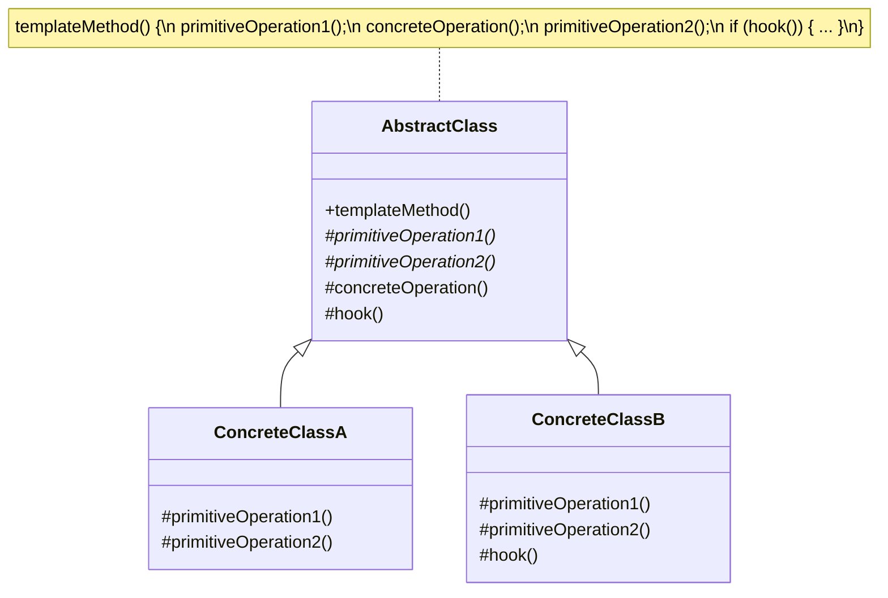
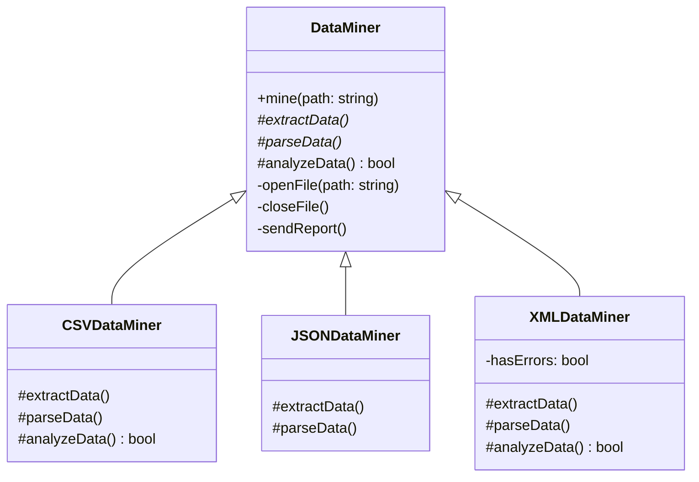

# Template Method Pattern

## Intent
Define the skeleton of an algorithm in an operation, deferring some steps to subclasses. Template Method lets subclasses redefine certain steps of an algorithm without changing the algorithm's structure.

## When to Use
- Implement invariant parts of algorithm once and let subclasses implement varying behavior
- Control subclass extensions (hook operations)
- Avoid code duplication by extracting common behavior
- Have several classes with similar algorithms

## Structure



### Data Mining Example



## Implementation Details

### Key Components
1. **AbstractClass**: Defines abstract primitive operations and implements template method
2. **ConcreteClass**: Implements primitive operations to carry out subclass-specific steps
3. **Template Method**: Defines skeleton of algorithm
4. **Hook Operations**: Provide default behavior that subclasses can extend

### Algorithm
```
1. AbstractClass defines templateMethod()
2. templateMethod() calls operations in specific order:
   - Primitive operations (abstract)
   - Concrete operations (implemented)
   - Hook operations (may be overridden)
3. ConcreteClass implements primitive operations
4. ConcreteClass optionally overrides hooks
5. Client calls templateMethod()
```

## Advantages
- Code reuse for invariant parts
- Controls points of extension
- Follows "Don't call us, we'll call you" principle
- Fundamental technique for framework design

## Disadvantages
- Difficult to maintain with many steps
- Inheritance-based (less flexible than composition)
- Can lead to rigid designs
- Debugging can be confusing

## Example Output
```
=== Data Mining Template Method Example ===

Processing CSV file:
Opening file: data.csv
Extracting data from CSV file...
  Reading comma-separated values
Parsing CSV data...
  Converting strings to appropriate types
  Handling missing values
Analyzing CSV data...
  Computing statistics
  Detecting anomalies
Sending analysis report via email
Closing file

Processing JSON file:
Opening file: data.json
Extracting data from JSON file...
  Parsing JSON structure
Parsing JSON data...
  Navigating nested objects
  Extracting arrays
Performing default analysis...
Sending analysis report via email
Closing file

Processing XML file:
Opening file: data.xml
Extracting data from XML file...
  Parsing XML tags
  WARNING: Malformed XML detected!
Parsing XML data...
  Processing attributes
  Handling namespaces
Skipping analysis due to XML errors
Closing file

=== Game Character Template Method Example ===

========== ROUND 1 ==========

--- Warrior's turn ---
Warrior swings mighty sword!
  Damage: 15 HP
Turn ended

--- Mage's turn ---
Mage casts Fireball!
  Damage: 25 HP
  Mana cost: 20
Turn ended

--- Rogue's turn ---
Rogue strikes with daggers
  Damage: 10 HP x2
Turn ended

========== ROUND 2 ==========

--- Warrior's turn ---
Warrior swings mighty sword!
  Damage: 15 HP
Turn ended

--- Mage's turn ---
Mage casts Fireball!
  Damage: 25 HP
  Mana cost: 20
Mage casts METEOR STORM!
  Area damage: 50 HP to all enemies
  Mana cost: 50
Turn ended

--- Rogue's turn ---
Rogue strikes with daggers
  Damage: 10 HP x2
Turn ended

========== ROUND 3 ==========

--- Warrior's turn ---
Warrior swings mighty sword!
  Damage: 15 HP
Warrior uses BERSERK RAGE!
  Damage increased by 50%
  Defense reduced by 25%
Turn ended

--- Mage's turn ---
Mage attacks with staff
  Damage: 5 HP
Turn ended

--- Rogue's turn ---
Rogue strikes with daggers
  Damage: 10 HP x2
Turn ended

=== Testing Framework Template Method Example ===

Running test suite...
===================
Connecting to test database...
  Inserting test records...
  Querying data...
  Verifying results...
✓ Database Connection Test passed (108ms)
Cleaning up test data...
Disconnecting from database...

  Running performance benchmarks...
  Average response time: 15ms
  Throughput: 1000 req/s
✓ Performance Test passed (0ms)

  Testing email validation...
  Testing phone validation...
  Testing input sanitization...
✓ Input Validation Test passed (0ms)

=== Social Network Auth Template Method Example ===

Logging into Facebook:
Checking Facebook credentials...
  Connecting to facebook.com
  Verifying user: user@example.com
Creating session token...
Downloading Facebook profile...
  Friends list
  Recent posts
  Photos

Logging into Google:
Checking Google credentials...
  Connecting to accounts.google.com
  Verifying user: user@gmail.com
Creating session token...
Enter verification code: ******
Downloading Google profile...
  Gmail contacts
  Google Drive files
  YouTube subscriptions
```

## Common Variations
1. **Hook Methods**: Optional steps with default implementation
2. **Hollywood Principle**: "Don't call us, we'll call you"
3. **Multiple Template Methods**: Several related algorithms
4. **Template Method with Strategy**: Combine patterns for flexibility

## Related Patterns
- **Strategy**: Uses delegation instead of inheritance
- **Factory Method**: Often called by template methods
- **Abstract Factory**: Template methods often use factories

## 🔧 Compilation & Usage

### Prerequisites
- **C++ Standard**: C++11 or later (required for chrono, thread, override, auto, range-based for loops)
- **Compiler**: GCC 4.9+, Clang 3.4+, MSVC 2015+
- **Threading Support**: Required for std::thread and std::chrono

### Basic Compilation

#### Linux/macOS
```bash
# Basic compilation
g++ -std=c++11 -pthread -o template_method template_method.cpp

# Alternative with Clang
clang++ -std=c++11 -pthread -o template_method template_method.cpp
```

#### Windows (MinGW)
```batch
g++ -std=c++11 -pthread -o template_method.exe template_method.cpp
```

#### Windows (MSVC)
```batch
cl /EHsc /std:c++11 template_method.cpp
```

### Advanced Compilation Options

#### Debug Build
```bash
g++ -std=c++11 -pthread -g -O0 -DDEBUG -o template_method_debug template_method.cpp
```

#### Optimized Release Build
```bash
g++ -std=c++11 -pthread -O3 -DNDEBUG -o template_method_release template_method.cpp
```

#### With All Warnings
```bash
g++ -std=c++11 -pthread -Wall -Wextra -Wpedantic -o template_method template_method.cpp
```

#### Sanitizer Builds (Debug)
```bash
# Address sanitizer
g++ -std=c++11 -pthread -fsanitize=address -g -o template_method_asan template_method.cpp

# Thread sanitizer (useful for threading-related issues)
g++ -std=c++11 -pthread -fsanitize=thread -g -o template_method_tsan template_method.cpp

# Undefined behavior sanitizer
g++ -std=c++11 -pthread -fsanitize=undefined -g -o template_method_ubsan template_method.cpp
```

### CMake Instructions

Create `CMakeLists.txt`:
```cmake
cmake_minimum_required(VERSION 3.10)
project(TemplateMethodPattern)

# Set C++ standard
set(CMAKE_CXX_STANDARD 11)
set(CMAKE_CXX_STANDARD_REQUIRED ON)

# Find required packages
find_package(Threads REQUIRED)

# Create executable
add_executable(template_method template_method.cpp)

# Link threading library
target_link_libraries(template_method Threads::Threads)

# Compiler-specific options
if(MSVC)
    target_compile_options(template_method PRIVATE /W4)
else()
    target_compile_options(template_method PRIVATE -Wall -Wextra -Wpedantic)
endif()
```

Build with CMake:
```bash
mkdir build && cd build
cmake ..
make  # or cmake --build . on Windows
```

### IDE Integration

#### Visual Studio Code
Create `.vscode/tasks.json`:
```json
{
    "version": "2.0.0",
    "tasks": [
        {
            "label": "build",
            "type": "shell",
            "command": "g++",
            "args": [
                "-std=c++11",
                "-pthread",
                "-g",
                "${file}",
                "-o",
                "${fileDirname}/${fileBasenameNoExtension}"
            ],
            "group": {
                "kind": "build",
                "isDefault": true
            }
        }
    ]
}
```

#### Visual Studio
1. Create new Console Application project
2. Set C++ Language Standard to C++11 or later in Project Properties
3. Copy the code to main source file
4. Build with Ctrl+F7

#### CLion
1. Open the project directory
2. CLion will auto-detect CMakeLists.txt
3. Build with Ctrl+F9

### Dependencies
- **Standard Library**: `<iostream>`, `<memory>`, `<vector>`, `<string>`, `<fstream>`, `<sstream>`, `<chrono>`, `<thread>`, `<iomanip>`
- **Threading Library**: Required for std::thread and timing operations
- **No external dependencies required**

### Platform-Specific Notes

#### Linux
- Install build tools: `sudo apt-get install build-essential`
- GCC recommended version: 4.9+ for full C++11 support (especially make_unique)
- Threading library usually included by default

#### macOS
- Install Xcode command line tools: `xcode-select --install`
- Alternative: Install via Homebrew: `brew install gcc`
- Threading support included with standard installation

#### Windows
- **Visual Studio**: Download Visual Studio Community (free) - includes full C++11 support
- **MinGW-w64**: Available via MSYS2 or standalone installer
- **Clang**: Available via Visual Studio or LLVM download
- Ensure threading support is available (usually included with modern installations)

### Troubleshooting

#### Common Issues
1. **"make_unique not found"**: 
   - Use GCC 4.9+ or Clang 3.4+
   - For older compilers, implement make_unique manually or use `new` with `unique_ptr`
2. **"override specifier not recognized"**: Ensure C++11 standard is set
3. **"chrono not found"**: Verify C++11 support and proper header inclusion
4. **"thread not found"**: 
   - Link pthread library with `-pthread` flag
   - On Windows, ensure threading support is enabled
5. **"this_thread::sleep_for not found"**: Check thread library linking
6. **Linker errors with threading**: 
   - Use `-pthread` flag (not just `-lpthread`)
   - On Windows with MinGW, may need `-static` flag

#### Performance Tips
- Use `-O2` or `-O3` for production builds
- Consider `-march=native` for CPU-specific optimizations
- Profile timing-sensitive code with tools like `perf` (Linux) or Visual Studio Profiler
- Thread sanitizer can help identify threading issues during development

#### Design Considerations
- Template methods define algorithm structure - avoid making too granular
- Use hook methods sparingly to prevent complexity
- Consider const-correctness for template methods that don't modify state
- Threading in examples is for demonstration - real applications need proper synchronization