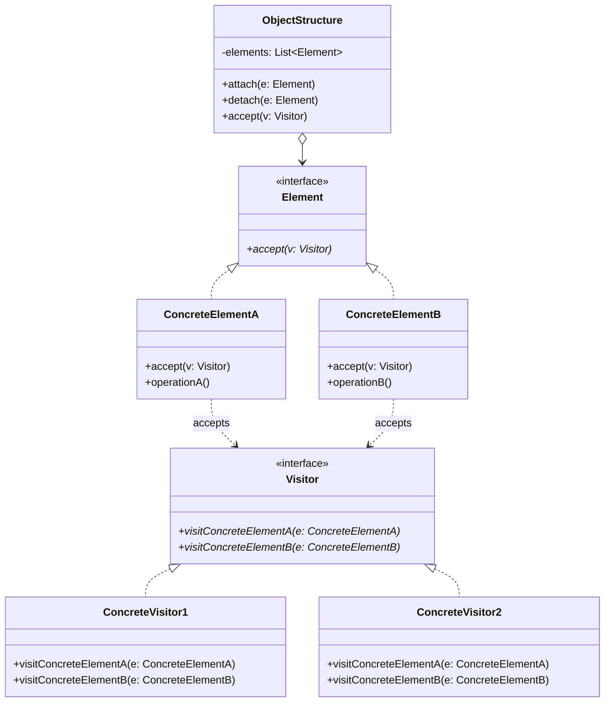
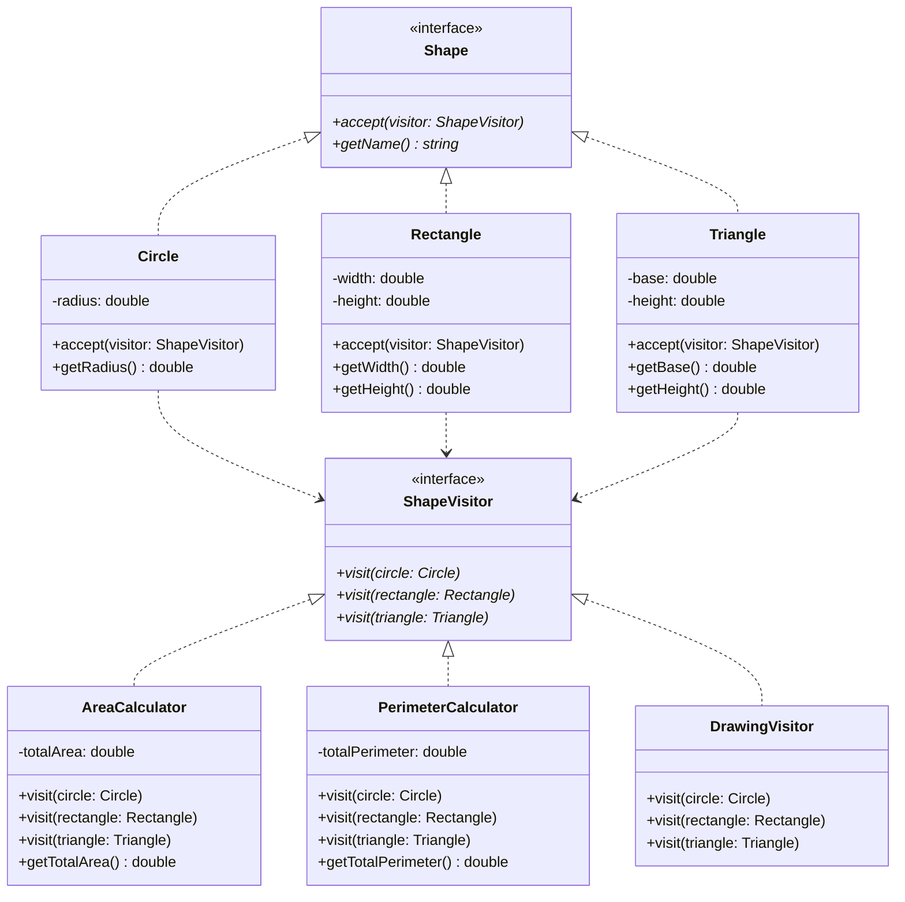

# Visitor Pattern

## Intent
Represent an operation to be performed on the elements of an object structure. Visitor lets you define a new operation without changing the classes of the elements on which it operates.

## When to Use
- Object structure contains many classes with differing interfaces
- Many distinct unrelated operations need to be performed on objects
- Classes defining object structure rarely change, but operations often change
- Need to avoid polluting element classes with operations

## Structure



### Shape Example



## Implementation Details

### Key Components
1. **Visitor**: Declares visit operation for each ConcreteElement
2. **ConcreteVisitor**: Implements operations for each element class
3. **Element**: Defines accept operation
4. **ConcreteElement**: Implements accept to call appropriate visitor method
5. **ObjectStructure**: Can enumerate elements and provide high-level interface

### Algorithm
```
1. Element accepts visitor
2. Element calls visit method on visitor, passing itself
3. Visitor performs operation on element
4. For composite structures:
   - Parent accepts visitor
   - Parent passes visitor to children
   - Each child accepts visitor
```

## Advantages
- Adding new operations is easy
- Related operations gathered in one visitor
- Visiting across class hierarchies
- Accumulating state while traversing

## Disadvantages
- Adding new ConcreteElement classes is hard
- Breaking encapsulation
- Visitor must be updated when elements change
- Can make simple operations complex

## Example Output
```
=== Shape Visitor Example ===

Calculating Areas:
Circle area: 78.54 sq units
Rectangle area: 24.00 sq units
Triangle area: 6.00 sq units
Total area: 108.54 sq units

Calculating Perimeters:
Circle perimeter: 31.42 units
Rectangle perimeter: 20.00 units
Triangle perimeter: 12.00 units
Total perimeter: 63.42 units

Drawing Shapes:

Circle(r=5.000000):
Drawing Circle:
     ●●●●●     
   ●●●●●●●●●   
  ●●●●●●●●●●●  
 ●●●●●●●●●●●●● 
 ●●●●●●●●●●●●● 
●●●●●●●●●●●●●●●
 ●●●●●●●●●●●●● 
 ●●●●●●●●●●●●● 
  ●●●●●●●●●●●  
   ●●●●●●●●●   
     ●●●●●     

Rectangle(4.000000x6.000000):
Drawing Rectangle:
████
█  █
█  █
█  █
█  █
████

Triangle(b=3.000000, h=4.000000):
Drawing Triangle:
▲
▲▲
▲▲▲
▲▲▲▲

=== File System Visitor Example ===

File System Structure:
📁 root/
  📁 src/
    📄 main.cpp (1024 bytes)
    📄 utils.cpp (512 bytes)
    📄 utils.h (256 bytes)
  📁 docs/
    📄 README.md (2048 bytes)
    📄 design.pdf (4096 bytes)

Total size: 7936 bytes

Searching for '.cpp' files:
Found: /root/src/main.cpp
Found: /root/src/utils.cpp

=== Expression Tree Visitor Example ===

Expression: ((3 + 4) * (5 + 2))

Evaluation steps:
3 + 4 = 7
5 + 2 = 7
7 * 7 = 49

Result: 49
```

## Common Variations
1. **Double Dispatch**: Visitor achieves double dispatch in single dispatch languages
2. **Acyclic Visitor**: Breaks circular dependency between visitor and elements
3. **Default Visit**: Base visitor with default implementations
4. **Hierarchical Visitor**: Visits inheritance hierarchies

## Related Patterns
- **Composite**: Visitors often work with composite structures
- **Iterator**: Similar way of traversing structures
- **Strategy**: Visitor packages strategy with additional context

## 🔧 Compilation & Usage

### Prerequisites
- **C++ Standard**: C++11 or later (required for smart pointers, range-based loops)
- **Compiler**: GCC 4.9+, Clang 3.4+, MSVC 2015+
- **Math Library**: Standard math library (for M_PI, sqrt functions)

### Basic Compilation

#### Linux/macOS
```bash
# Basic compilation
g++ -std=c++11 -o visitor visitor.cpp

# Alternative with Clang
clang++ -std=c++11 -o visitor visitor.cpp

# With math library (if needed on some systems)
g++ -std=c++11 -lm -o visitor visitor.cpp
```

#### Windows (MinGW)
```batch
g++ -std=c++11 -o visitor.exe visitor.cpp
```

#### Windows (MSVC)
```batch
cl /EHsc /std:c++11 visitor.cpp
```

### Advanced Compilation Options

#### Debug Build
```bash
g++ -std=c++11 -g -O0 -DDEBUG -o visitor_debug visitor.cpp
```

#### Optimized Release Build
```bash
g++ -std=c++11 -O3 -DNDEBUG -o visitor_release visitor.cpp
```

#### With All Warnings
```bash
g++ -std=c++11 -Wall -Wextra -Wpedantic -o visitor visitor.cpp
```

#### Sanitizer Builds (Debug)
```bash
# Address sanitizer (detects memory errors)
g++ -std=c++11 -fsanitize=address -g -o visitor_asan visitor.cpp

# Undefined behavior sanitizer
g++ -std=c++11 -fsanitize=undefined -g -o visitor_ubsan visitor.cpp

# Memory sanitizer (Clang only)
clang++ -std=c++11 -fsanitize=memory -g -o visitor_msan visitor.cpp
```

### CMake Instructions

Create `CMakeLists.txt`:
```cmake
cmake_minimum_required(VERSION 3.10)
project(VisitorPattern)

# Set C++ standard
set(CMAKE_CXX_STANDARD 11)
set(CMAKE_CXX_STANDARD_REQUIRED ON)

# Create executable
add_executable(visitor visitor.cpp)

# Link math library if needed
if(UNIX AND NOT APPLE)
    target_link_libraries(visitor m)
endif()

# Compiler-specific options
if(MSVC)
    target_compile_options(visitor PRIVATE /W4)
    target_compile_definitions(visitor PRIVATE _USE_MATH_DEFINES)
else()
    target_compile_options(visitor PRIVATE -Wall -Wextra -Wpedantic)
endif()

# Enable debug symbols in debug mode
target_compile_options(visitor PRIVATE $<$<CONFIG:Debug>:-g>)
target_compile_options(visitor PRIVATE $<$<CONFIG:Release>:-O3>)
```

Build with CMake:
```bash
mkdir build && cd build
cmake ..
make  # or cmake --build . on Windows
```

### IDE Integration

#### Visual Studio Code
Create `.vscode/tasks.json`:
```json
{
    "version": "2.0.0",
    "tasks": [
        {
            "label": "build",
            "type": "shell",
            "command": "g++",
            "args": [
                "-std=c++11",
                "-g",
                "-Wall",
                "-Wextra",
                "${file}",
                "-o",
                "${fileDirname}/${fileBasenameNoExtension}"
            ],
            "group": {
                "kind": "build",
                "isDefault": true
            },
            "presentation": {
                "echo": true,
                "reveal": "always",
                "focus": false,
                "panel": "shared"
            },
            "problemMatcher": ["$gcc"]
        }
    ]
}
```

Create `.vscode/launch.json` for debugging:
```json
{
    "version": "0.2.0",
    "configurations": [
        {
            "name": "Debug Visitor Pattern",
            "type": "cppdbg",
            "request": "launch",
            "program": "${fileDirname}/${fileBasenameNoExtension}",
            "args": [],
            "stopAtEntry": false,
            "cwd": "${fileDirname}",
            "environment": [],
            "externalConsole": false,
            "MIMode": "gdb",
            "preLaunchTask": "build"
        }
    ]
}
```

#### Visual Studio
1. Create new Console Application project
2. Set C++ Language Standard to C++11 or later in Project Properties
3. Add `_USE_MATH_DEFINES` preprocessor definition for M_PI
4. Copy the code to main source file
5. Build with Ctrl+F7

#### CLion/IntelliJ
1. Open the project directory
2. CLion will auto-detect CMakeLists.txt
3. Build with Ctrl+F9
4. Run/Debug with Shift+F10/Shift+F9

#### Code::Blocks
1. Create new Console Application project
2. Set compiler to use C++11 standard
3. Add source file to project
4. Build and run

### Dependencies

#### Standard Library Headers Required
- `<iostream>` - Console input/output
- `<memory>` - Smart pointers (shared_ptr, unique_ptr, make_shared, make_unique)
- `<vector>` - Dynamic arrays
- `<string>` - String manipulation
- `<iomanip>` - Stream manipulators (setprecision, fixed)
- `<sstream>` - String streams
- `<cmath>` - Mathematical functions (M_PI, sqrt)

#### No External Dependencies
- Pure C++ standard library implementation
- No third-party libraries required
- No Boost dependencies

### Platform-Specific Notes

#### Linux (Ubuntu/Debian)
```bash
# Install build tools
sudo apt-get update
sudo apt-get install build-essential

# For GCC 9+ (recommended)
sudo apt-get install gcc-9 g++-9

# Compile with specific version
g++-9 -std=c++11 -o visitor visitor.cpp
```

#### Linux (CentOS/RHEL/Fedora)
```bash
# CentOS/RHEL
sudo yum groupinstall "Development Tools"
sudo yum install gcc-c++

# Fedora
sudo dnf groupinstall "Development Tools"
sudo dnf install gcc-c++
```

#### macOS
```bash
# Install Xcode command line tools
xcode-select --install

# Alternative: Install via Homebrew
brew install gcc

# Compile with Homebrew GCC
g++-11 -std=c++11 -o visitor visitor.cpp
```

#### Windows Environments

**Visual Studio (Recommended)**
- Download Visual Studio Community (free)
- Install C++ development workload
- Supports IntelliSense and debugging

**MinGW-w64 via MSYS2**
```bash
# Install MSYS2, then in MSYS2 terminal:
pacman -S mingw-w64-x86_64-gcc
pacman -S mingw-w64-x86_64-gdb

# Add to PATH: C:\msys64\mingw64\bin
```

**Clang/LLVM**
- Download from LLVM releases
- Or install via Visual Studio installer
- Use with: `clang++ -std=c++11 -o visitor.exe visitor.cpp`

### Troubleshooting

#### Common Compilation Issues

1. **"shared_ptr/unique_ptr not found"**
   ```bash
   # Solution: Ensure C++11 standard
   g++ -std=c++11 visitor.cpp
   ```

2. **"make_shared/make_unique not found"**
   ```bash
   # make_unique requires C++14, but code provides fallback
   # Use GCC 4.9+ or Clang 3.4+ for best support
   g++ -std=c++14 visitor.cpp  # Recommended
   ```

3. **"M_PI not defined" (Windows/MSVC)**
   ```cpp
   // Add before #include <cmath>
   #define _USE_MATH_DEFINES
   ```
   
   Or compile with:
   ```batch
   cl /EHsc /std:c++11 /D_USE_MATH_DEFINES visitor.cpp
   ```

4. **"sqrt not found"**
   ```bash
   # Link math library (some Linux distributions)
   g++ -std=c++11 -lm visitor.cpp
   ```

5. **"undefined reference to std::__cxx11"**
   ```bash
   # ABI compatibility issue, rebuild with same compiler
   g++ -std=c++11 -D_GLIBCXX_USE_CXX11_ABI=0 visitor.cpp
   ```

#### Runtime Issues

1. **Incorrect circle drawing**
   - Check terminal font supports Unicode symbols
   - May appear differently in various terminals

2. **Performance issues with large structures**
   ```bash
   # Compile with optimizations
   g++ -std=c++11 -O3 -DNDEBUG visitor.cpp
   ```

#### Memory Analysis
```bash
# Check for memory leaks (Linux)
valgrind --leak-check=full ./visitor

# Profile performance
perf record ./visitor
perf report
```

#### Performance Tips
- Use `-O2` or `-O3` for production builds
- Consider `-march=native` for CPU-specific optimizations
- Profile with `gprof`: compile with `-pg`, run, then `gprof ./visitor`
- For large visitor hierarchies, consider template-based approaches

#### Design Considerations
- **Smart Pointer Usage**: The code extensively uses modern C++ smart pointers
- **Template Instantiation**: Complex visitor hierarchies may increase compile time
- **Virtual Function Overhead**: Consider performance impact in tight loops
- **Exception Safety**: All smart pointers provide automatic cleanup