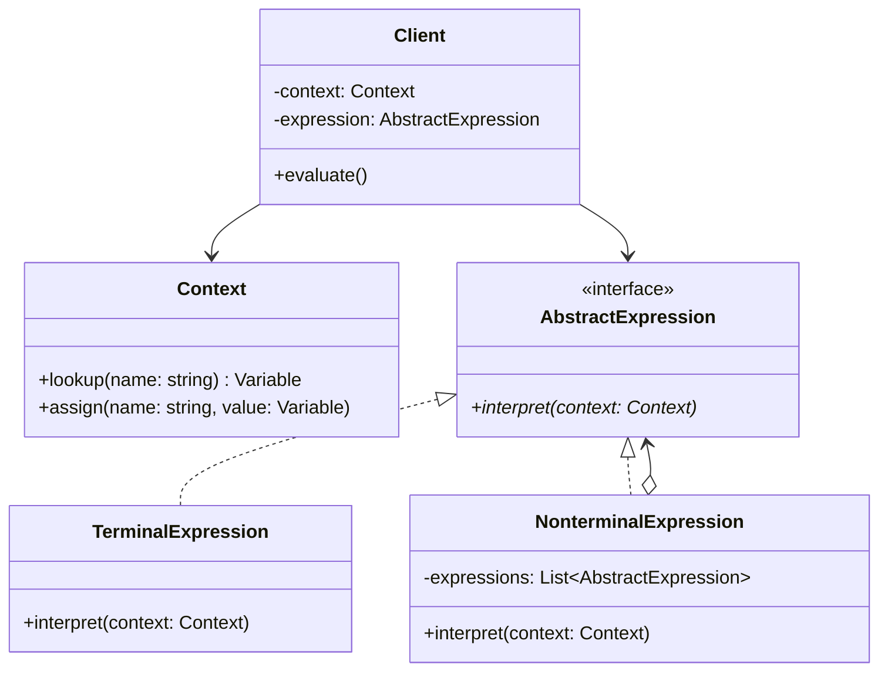
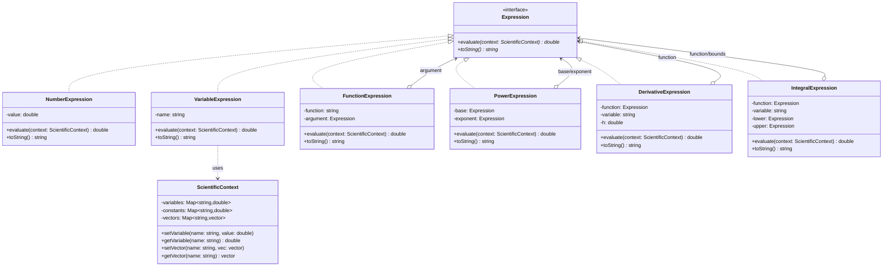

# Interpreter Pattern - Scientific Formula and Expression Language

## Intent
Create a domain-specific language for scientific computing that interprets mathematical formulas, physical equations, and numerical expressions with support for constants, functions, and dimensional analysis.

## Scientific Computing Context
Scientific computations require sophisticated expression evaluation:
- **Mathematical Functions**: Trigonometric, exponential, logarithmic operations
- **Physical Constants**: Universal constants, unit conversions
- **Numerical Analysis**: Derivatives, integrals, differential equations
- **Dimensional Analysis**: Physical units and quantity validation
- **Symbolic Computation**: Formula manipulation and simplification

## When to Use in Scientific Computing
- Implementing scientific calculators or computation engines
- Creating formula parsers for simulation software
- Building mathematical expression evaluators
- Developing physics equation solvers
- Enabling user-defined computational models

## Structure



### Scientific Expression Example



## Implementation Details

### Key Components
1. **Expression Interface**: Base for all mathematical expressions (evaluate, toString)
2. **Terminal Expressions**: Numbers, variables, physical constants
3. **Function Expressions**: Mathematical functions (sin, cos, exp, ln, sqrt)
4. **Operator Expressions**: Arithmetic, power, derivatives, integrals
5. **Scientific Context**: Variables, physical constants, vectors, matrices
6. **Expression Parser**: Converts string formulas to expression trees

### Scientific Evaluation Algorithm
```
1. Parse scientific formula into expression tree:
   - Tokenize input respecting scientific notation
   - Build AST following operator precedence
   - Recognize functions and constants
   
2. Initialize scientific context:
   - Load physical constants (π, e, c, h, k_B, N_A)
   - Set user-defined variables
   - Initialize computational parameters
   
3. Evaluate expression tree:
   - Numbers: Return floating-point value
   - Variables/Constants: Lookup in context
   - Functions: Apply mathematical operation
   - Derivatives: Numerical differentiation
   - Integrals: Numerical integration
   
4. Handle dimensional analysis:
   - Track physical units through calculations
   - Validate dimensional consistency
   - Convert between unit systems
   
5. Return result with appropriate precision
```

## Advantages in Scientific Computing
- **Extensible Function Library**: Easy to add new mathematical functions
- **Physical Constant Support**: Built-in support for scientific constants
- **Numerical Methods**: Integrate derivatives, integrals, and other operations
- **Unit Awareness**: Can extend for dimensional analysis
- **Formula Validation**: Check mathematical correctness at parse time
- **Symbolic Capabilities**: Foundation for symbolic computation
- **Interactive Computation**: REPL-style scientific calculator

## Disadvantages in Scientific Context
- **Numerical Precision**: Floating-point errors accumulate in complex expressions
- **Performance Overhead**: Interpretation slower than compiled calculations
- **Limited Optimization**: Cannot apply mathematical simplifications easily
- **Memory Usage**: Expression trees can be large for complex formulas
- **Parser Complexity**: Scientific notation and functions complicate parsing
- **Error Propagation**: Numerical errors harder to track through tree

## Example Output
```
=== Scientific Formula and Expression Interpreter ===

Example 1: Basic Scientific Calculations
-----------------------------------------
Expression: (2.5 * 3.14159)
Result: 7.8540e+00

Example 2: Physical Constants
-----------------------------
2π = 6.2832e+00
h·c (Planck constant × speed of light) = 1.9864e-25 J·m
k_B·N_A (Boltzmann × Avogadro = R) = 8.3145e+00 J/(mol·K)

Example 3: Scientific Functions
-------------------------------
sin(π/2) = 1.000000
exp(-0.5) = 0.606531
ln(e²) = 2.000000
√2 = 1.414214

Example 4: Scientific Variable Assignments
-----------------------------------------
Set T_celsius = 2.5000e+01
Set T_kelvin = 2.9815e+02
Set T_fahrenheit = 7.7000e+01
Set m = 1.0000e-03
E = mc² for 1 gram: 8.9876e+13 J

Example 5: Complex Scientific Expressions
----------------------------------------
Gaussian PDF at x=1.5, μ=0, σ=1: 0.129518

Example 6: Numerical Derivatives
--------------------------------
d/dx[x² + 3x] at x=1.5: 6.000000
Analytical: 2x + 3 = 6.000000

Example 7: Physical Units (Demonstration)
----------------------------------------
Force: 10 N
Atmospheric pressure: 101325 Pa
Energy unit: 1 J

Variables:
  T_celsius = 2.5000e+01
  T_fahrenheit = 7.7000e+01
  T_kelvin = 2.9815e+02
  E = 8.9876e+13
  m = 1.0000e-03
  mu = 0.0000e+00
  sigma = 1.0000e+00
  x = 1.5000e+00

Constants:
  N_A = 6.0221e+23
  c = 2.9979e+08
  e = 2.7183e+00
  g = 9.8067e+00
  h = 6.6261e-34
  k_B = 1.3806e-23
  pi = 3.1416e+00

=== Interactive Scientific Calculator ===
Available functions: sin, cos, tan, exp, ln, log10, sqrt, abs
Physical constants: pi, e, c, h, k_B, N_A, g
Operators: +, -, *, /, ^ (power)
Commands: 'vars' (show variables), 'quit' (exit)

Examples:
  sin ( pi / 4 )
  v = 10
  KE = 0.5 * m * v ^ 2

> sin ( pi / 4 )
Parsed: sin((pi / 4))
Result: 7.071068e-01

> E_photon = h * c / 500e-9
Parsed: E_photon = ((h * c) / 5.000000e-07)
Set E_photon = 3.9728e-19
Result: 3.972821e-19

> quit
```

## Scientific Expression Grammar
```
expression     ::= term (('+' | '-') term)*
term          ::= power (('*' | '/') power)*
power         ::= factor ('^' factor)*
factor        ::= number | variable | function | '(' expression ')'
function      ::= function_name '(' expression ')'
assignment    ::= variable '=' expression
variable      ::= letter (letter | digit | '_')*
number        ::= ['-']digit+['.'digit+][('e'|'E')['-']digit+]
function_name ::= 'sin' | 'cos' | 'tan' | 'exp' | 'ln' | 'sqrt' | ...
constant      ::= 'pi' | 'e' | 'c' | 'h' | 'k_B' | 'N_A' | 'g'
```

## Common Variations in Scientific Computing
1. **Symbolic Differentiation**: Extend to compute exact derivatives symbolically
2. **Matrix Operations**: Add matrix and vector expression support
3. **Complex Numbers**: Support for complex arithmetic and functions
4. **Unit System**: Full dimensional analysis with automatic unit conversion
5. **Optimization**: Expression simplification and common subexpression elimination
6. **Parallel Evaluation**: Evaluate independent subexpressions concurrently
7. **Precision Control**: Arbitrary precision arithmetic for exact calculations

## Related Patterns in Scientific Computing
- **Composite**: Expression trees are hierarchical composite structures
- **Visitor**: Separate evaluation, differentiation, and formatting algorithms
- **Strategy**: Different numerical methods for derivatives/integrals
- **Factory Method**: Create appropriate expression types from parsed tokens
- **Flyweight**: Share common constants and function definitions
- **Builder**: Construct complex mathematical expressions step by step
- **Command**: Store and replay calculation sequences

## 🔧 Compilation & Usage

### Prerequisites
- **C++ Standard**: C++11 or later (uses smart pointers, auto, range-based for)
- **Compiler**: GCC 4.9+, Clang 3.4+, MSVC 2015+
- **Math Library**: Link with `-lm` on Unix systems

### Basic Compilation

#### Linux/macOS
```bash
# Basic compilation
g++ -std=c++11 -o interpreter interpreter.cpp -lm

# Alternative with Clang
clang++ -std=c++11 -o interpreter interpreter.cpp -lm
```

#### Windows (MinGW)
```batch
g++ -std=c++11 -o interpreter.exe interpreter.cpp
```

#### Windows (MSVC)
```batch
cl /EHsc /std:c++11 interpreter.cpp
```

### Advanced Compilation Options

#### Debug Build
```bash
g++ -std=c++11 -g -O0 -DDEBUG -o interpreter_debug interpreter.cpp -lm
```

#### Optimized Release Build
```bash
g++ -std=c++11 -O3 -DNDEBUG -march=native -o interpreter_release interpreter.cpp -lm
```

#### With All Warnings
```bash
g++ -std=c++11 -Wall -Wextra -Wpedantic -o interpreter interpreter.cpp -lm
```

#### Sanitizer Builds (Debug)
```bash
# Address sanitizer
g++ -std=c++11 -fsanitize=address -g -o interpreter_asan interpreter.cpp -lm

# Undefined behavior sanitizer
g++ -std=c++11 -fsanitize=undefined -g -o interpreter_ubsan interpreter.cpp -lm
```

### CMake Instructions

Create `CMakeLists.txt`:
```cmake
cmake_minimum_required(VERSION 3.10)
project(InterpreterPattern)

# Set C++ standard
set(CMAKE_CXX_STANDARD 11)
set(CMAKE_CXX_STANDARD_REQUIRED ON)

# Find math library
find_library(MATH_LIBRARY m)

# Create executable
add_executable(interpreter interpreter.cpp)

# Link math library if found
if(MATH_LIBRARY)
    target_link_libraries(interpreter ${MATH_LIBRARY})
endif()

# Compiler-specific options
if(MSVC)
    target_compile_options(interpreter PRIVATE /W4)
else()
    target_compile_options(interpreter PRIVATE -Wall -Wextra -Wpedantic)
endif()
```

Build with CMake:
```bash
mkdir build && cd build
cmake ..
make  # or cmake --build . on Windows
```

### IDE Integration

#### Visual Studio Code
Create `.vscode/tasks.json`:
```json
{
    "version": "2.0.0",
    "tasks": [
        {
            "label": "build",
            "type": "shell",
            "command": "g++",
            "args": [
                "-std=c++11",
                "-g",
                "${file}",
                "-o",
                "${fileDirname}/${fileBasenameNoExtension}"
            ],
            "group": {
                "kind": "build",
                "isDefault": true
            }
        }
    ]
}
```

#### Visual Studio
1. Create new Console Application project
2. Set C++ Language Standard to C++11 or later in Project Properties
3. Copy the code to main source file
4. Build with Ctrl+F7

#### CLion
1. Open the project directory
2. CLion will auto-detect CMakeLists.txt
3. Build with Ctrl+F9

### Dependencies
- **Standard Library Headers**: 
  - `<iostream>` - Input/output operations
  - `<memory>` - Smart pointers (unique_ptr)
  - `<string>` - String operations
  - `<unordered_map>` - Hash maps for variables/constants
  - `<vector>` - Dynamic arrays for vectors
  - `<sstream>` - String stream for parsing
  - `<cctype>` - Character classification
  - `<stdexcept>` - Exception types
  - `<algorithm>` - STL algorithms
  - `<cmath>` - Mathematical functions
  - `<iomanip>` - I/O manipulators
  - `<set>` - Set container for function names
- **Math Library**: Required for mathematical functions (link with `-lm`)
- **No external dependencies required**

### Platform-Specific Notes

#### Linux
- Install build tools: `sudo apt-get install build-essential`
- GCC recommended version: 4.9+ for full C++11 support

#### macOS
- Install Xcode command line tools: `xcode-select --install`
- Alternative: Install via Homebrew: `brew install gcc`
- Xcode 7.0+ provides full C++11 support

#### Windows
- **Visual Studio**: Download Visual Studio 2015 or later (Community is free)
- **MinGW-w64**: Use version 4.9+ available via MSYS2 or standalone installer
- **Clang**: Available via Visual Studio or LLVM download (version 3.4+)

### Troubleshooting

#### Common Issues
1. **"unique_ptr not found"**: Ensure C++11 standard is set and `<memory>` included
2. **"make_unique not found"**: Use C++14 or implement polyfill for C++11
3. **Math linking errors**: Add `-lm` flag on Unix systems
4. **"M_PI not defined"**: MSVC doesn't define M_PI by default (defined in code)
5. **Parsing errors**: Ensure spaces between tokens in expressions
6. **Numerical precision**: Be aware of floating-point limitations

#### Performance Tips for Scientific Computing
- Use `-O3` and `-march=native` for numerical computations
- Consider `-ffast-math` for non-critical calculations (affects precision)
- Profile mathematical function calls - they can be expensive
- Cache frequently used expressions and results
- For large-scale computations, consider compiling expressions to bytecode
- Use vectorization where possible for array operations

#### Scientific Computing Design Considerations
- **Numerical Stability**: Choose appropriate algorithms for derivatives/integrals
- **Precision Management**: Consider arbitrary precision libraries for exact math
- **Physical Units**: Extend for full dimensional analysis and unit conversion
- **Error Propagation**: Track numerical errors through calculations
- **Optimization Opportunities**: Common subexpression elimination, constant folding
- **Parallel Evaluation**: Independent subexpressions can be computed concurrently
- **Memory Efficiency**: Consider expression simplification before evaluation
- **Domain Extensions**: Easy to add new functions, constants, and operations