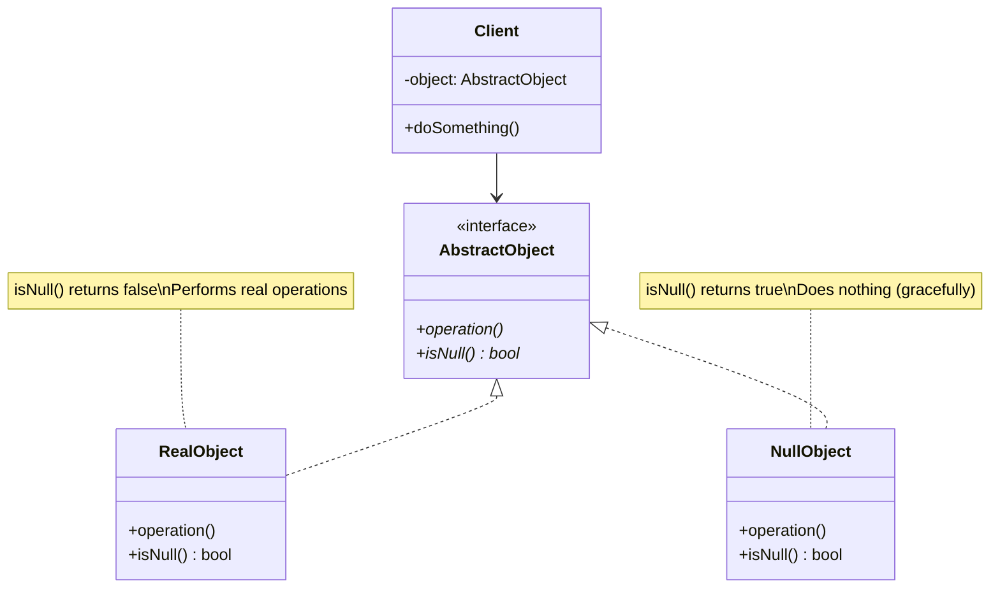
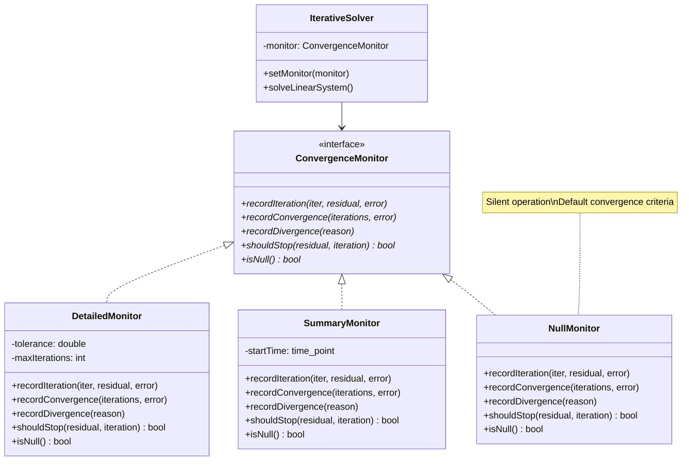
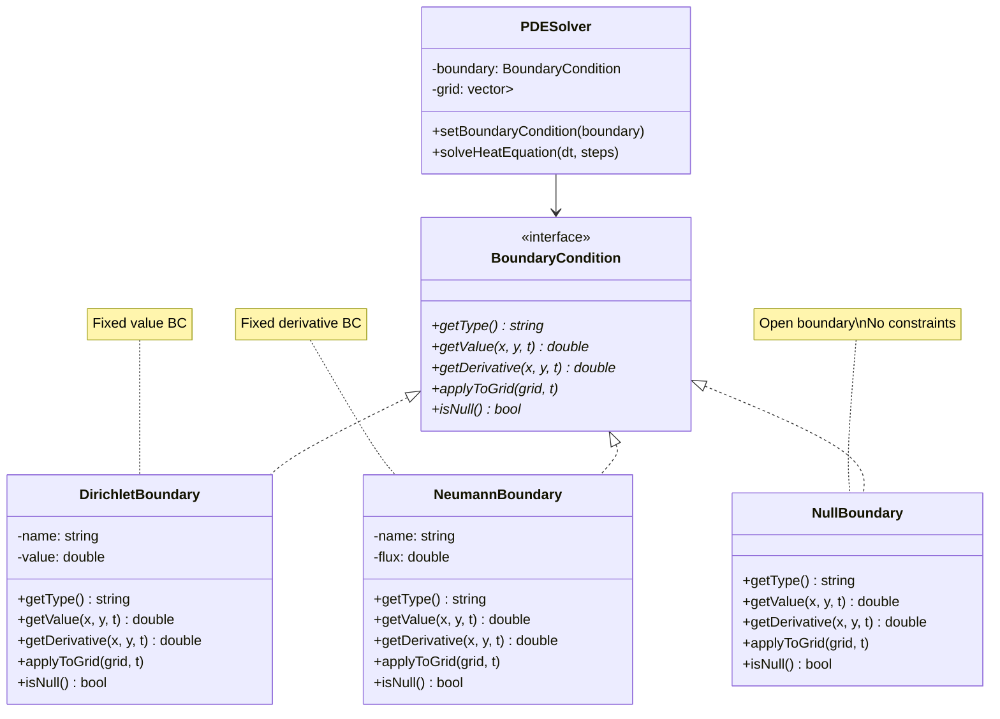

# Null Object Pattern - Scientific Computing Safety and Default Behaviors

## Intent
Provide safe default implementations for scientific computation interfaces, ensuring numerical algorithms continue operating predictably when optional components are absent, without requiring explicit null checks or conditional logic.

## Scientific Computing Context
Scientific computations often involve optional components:
- **Convergence Monitors**: May be disabled for production runs
- **Boundary Conditions**: Open boundaries for unbounded domains
- **Preconditioners**: Identity preconditioning when not needed
- **Integrators**: Zero integration for disabled quadrature
- **Error Handlers**: Silent operation for stable algorithms

## When to Use in Scientific Computing
- Providing default boundary conditions for PDEs
- Silent convergence monitoring in production mode
- Identity operations for optional preconditioners
- Safe defaults for missing numerical methods
- Eliminating checks for optional diagnostics

## Structure



### Scientific Computing Example



### Boundary Condition Example



## Implementation Details

### Key Components
1. **Scientific Interface**: Common interface for numerical components (monitors, boundaries, integrators)
2. **Active Implementation**: Real numerical algorithms with full functionality
3. **Null Implementation**: Safe defaults that maintain numerical stability
4. **Scientific Client**: Uses components without checking for null
5. **Default Behaviors**: Mathematically sound neutral operations

### Scientific Null Object Design
```
1. Define interface for scientific component:
   - Convergence monitoring methods
   - Boundary condition applications
   - Numerical integration operations
   
2. Implement active components:
   - Detailed logging and diagnostics
   - Physical boundary constraints
   - Numerical quadrature methods
   
3. Implement null components with safe defaults:
   - Silent operation (no output)
   - Identity operations (no transformation)
   - Zero contributions (neutral element)
   - Open boundaries (no constraints)
   
4. Ensure numerical stability:
   - Default tolerances for convergence
   - Identity preconditioning
   - Conservative error estimates
   
5. Client code remains clean:
   - No null checks needed
   - Algorithms always complete
   - Predictable behavior
```

## Advantages in Scientific Computing
- **Numerical Stability**: Ensures algorithms continue with safe defaults
- **Clean Algorithm Code**: No conditional checks for optional components
- **Production Ready**: Easy switching between diagnostic and silent modes
- **Flexible Boundaries**: Natural representation of open/unbounded domains
- **Performance**: Eliminates branching in hot computational loops
- **Testing**: Simplified testing without mock objects
- **Composability**: Components work together without special cases

## Disadvantages in Scientific Context
- **Silent Failures**: May hide convergence problems or numerical issues
- **Performance Overhead**: Virtual function calls in tight loops
- **Default Semantics**: Must carefully define mathematically sound defaults
- **Debugging Challenges**: Missing components may go unnoticed
- **Memory Usage**: Additional objects for null implementations
- **Type Safety**: Can't distinguish required vs optional at compile time

## Example Output
```
=== Scientific Computing with Null Object Pattern ===
Safe defaults for numerical algorithms and boundary conditions

=== Convergence Monitoring with Null Object Pattern ===

Solver without monitoring:
Convergence monitoring is disabled
[SOLVER] CONVERGED after 10 iterations, final error = 1.000000e-11

Solver with detailed monitoring:
Convergence monitoring is enabled
[SOLVER] Iteration 1: residual = 1.000000e-01, error = 1.500000e-01
[SOLVER] Iteration 2: residual = 1.000000e-02, error = 2.250000e-02
[SOLVER] Iteration 3: residual = 1.000000e-03, error = 3.375000e-03
[SOLVER] Iteration 4: residual = 1.000000e-04, error = 5.062500e-04
[SOLVER] Iteration 5: residual = 1.000000e-05, error = 7.593750e-05
[SOLVER] Iteration 6: residual = 1.000000e-06, error = 1.139063e-05
[SOLVER] Iteration 7: residual = 1.000000e-07, error = 1.708594e-06
[SOLVER] Iteration 8: residual = 1.000000e-08, error = 2.562891e-07
[SOLVER] Iteration 9: residual = 1.000000e-09, error = 3.844336e-08
[SOLVER] Iteration 10: residual = 1.000000e-10, error = 5.766504e-09
[SOLVER] Iteration 11: residual = 1.000000e-11, error = 8.649756e-10
[SOLVER] Iteration 12: residual = 1.000000e-12, error = 1.297463e-10
[SOLVER] CONVERGED after 12 iterations, final error = 1.297463e-10

Solver with summary monitoring:
[SOLVER] Starting iterative solution...
[SOLVER] Converged: 10 iterations in 0 ms

=== PDE Solver with Null Object Pattern ===

Heat Equation - Open Boundary:
Initializing 50x50 grid with gaussian pattern

Solving heat equation with None (Open Boundary) boundary conditions
Initial state - Center value: 1.0000
Final state - Center value: 0.3678
Total heat in domain: 0.3682
Boundary effects: None (open boundary)

Heat Equation - Dirichlet Boundary (T=0):
Initializing 50x50 grid with gaussian pattern

Solving heat equation with Dirichlet (Cold walls) boundary conditions
Initial state - Center value: 1.0000
Final state - Center value: 0.3626
Total heat in domain: 0.3185
Boundary effects: Active (Dirichlet (Cold walls))

Heat Equation - Neumann Boundary (insulated):
Initializing 50x50 grid with step pattern

Solving heat equation with Neumann (Insulated) boundary conditions
Initial state - Center value: 0.0000
Final state - Center value: 0.4999
Total heat in domain: 1.2500
Boundary effects: Active (Neumann (Insulated))

=== Function Analysis with Null Object Pattern ===

Analysis without integration:
Analyzing function: f(x) = x^2 on [0, 1]
Integration method: No Integration
Integral value: 0.00000000
(Integration disabled - returning zero)

Analysis with Trapezoidal integration:
Analyzing function: f(x) = x^2 on [0, 1]
Integration method: Trapezoidal Rule
Performing trapezoidal integration with 1000 intervals...
Integral value: 0.33333350
Error estimate: 1.111178e-07
Analytical result: 0.333333

Analysis with Simpson's rule:
Analyzing function: f(x) = sin(x) on [0, 3.14159]
Integration method: Simpson's Rule
Performing Simpson's rule integration...
Integral value: 2.00000001
Error estimate: 2.896886e-11
Analytical result: 2

=== Preconditioner Hierarchy with Null Object Pattern ===

Preconditioner Hierarchy:
Main System (Jacobi (Diagonal)) - Condition number: 2.00e+00
  Subsystem (Jacobi (Diagonal)) - Condition number: 1.25e+00
  Block ILU (ILU(2)) - Fill level: 2, Estimated condition: 3.33333
Simple Diagonal (Jacobi (Diagonal)) - Condition number: 1.00e+00

Applying preconditioners:
Input vector b: 1 2 3 4 5 
Main System result: 0.25 0.57 1.00 1.60 2.50 
No Preconditioning result: 1.00 2.00 3.00 4.00 5.00 
```

## Common Variations in Scientific Computing
1. **Singleton Null Components**: Share null monitors/boundaries across solvers
2. **Diagnostic Null Object**: Counts skipped operations for performance analysis
3. **Adaptive Null Object**: Switches behavior based on problem characteristics
4. **Composite Null Boundary**: Multiple null boundaries for different regions
5. **Cached Null Object**: Stores and reuses default computation results
6. **Typed Null Object**: Different null implementations for different precision
7. **Parallel Null Object**: Thread-safe null implementations for HPC

## Related Patterns in Scientific Computing
- **Strategy**: Null integrator/solver as a do-nothing strategy
- **Template Method**: Null steps in scientific algorithms
- **Decorator**: Add monitoring to null objects when needed
- **Singleton**: Share null boundary conditions across PDE solvers
- **Factory Method**: Create appropriate null objects for problem type
- **Composite**: Null nodes in computational trees
- **State**: Null state for adaptive algorithms

## 🔧 Compilation & Usage

### Prerequisites
- **C++ Standard**: C++11 or later
- **Compiler**: GCC 4.9+, Clang 3.4+, MSVC 2015+
- **Features Used**: `shared_ptr`, `make_shared`, `override`, lambdas, `<functional>`, `<chrono>`
- **Math Library**: Link with `-lm` on Unix systems

### Basic Compilation

#### Linux/macOS
```bash
# Basic compilation
g++ -std=c++11 -o null_object null_object.cpp -lm

# Alternative with Clang
clang++ -std=c++11 -o null_object null_object.cpp -lm
```

#### Windows (MinGW)
```batch
g++ -std=c++11 -o null_object.exe null_object.cpp
```

#### Windows (MSVC)
```batch
cl /EHsc /std:c++11 null_object.cpp
```

### Advanced Compilation Options

#### Debug Build
```bash
g++ -std=c++11 -g -O0 -DDEBUG -o null_object_debug null_object.cpp -lm
```

#### Optimized Release Build
```bash
g++ -std=c++11 -O3 -DNDEBUG -march=native -o null_object_release null_object.cpp -lm
```

#### With All Warnings
```bash
g++ -std=c++11 -Wall -Wextra -Wpedantic -o null_object null_object.cpp -lm
```

#### Sanitizer Builds (Debug)
```bash
# Address sanitizer
g++ -std=c++11 -fsanitize=address -g -o null_object_asan null_object.cpp -lm

# Undefined behavior sanitizer
g++ -std=c++11 -fsanitize=undefined -g -o null_object_ubsan null_object.cpp -lm
```

### CMake Instructions

Create `CMakeLists.txt`:
```cmake
cmake_minimum_required(VERSION 3.10)
project(NullObjectPattern)

# Set C++ standard
set(CMAKE_CXX_STANDARD 11)
set(CMAKE_CXX_STANDARD_REQUIRED ON)

# Create executable
add_executable(null_object null_object.cpp)

# Link math library
target_link_libraries(null_object m)

# Compiler-specific options
if(MSVC)
    target_compile_options(null_object PRIVATE /W4)
else()
    target_compile_options(null_object PRIVATE -Wall -Wextra -Wpedantic)
endif()
```

Build with CMake:
```bash
mkdir build && cd build
cmake ..
make  # or cmake --build . on Windows
```

### IDE Integration

#### Visual Studio Code
Create `.vscode/tasks.json`:
```json
{
    "version": "2.0.0",
    "tasks": [
        {
            "label": "build",
            "type": "shell",
            "command": "g++",
            "args": [
                "-std=c++11",
                "-g",
                "${file}",
                "-o",
                "${fileDirname}/${fileBasenameNoExtension}"
            ],
            "group": {
                "kind": "build",
                "isDefault": true
            }
        }
    ]
}
```

#### Visual Studio
1. Create new Console Application project
2. Set C++ Language Standard to C++11 in Project Properties
3. Copy the code to main source file
4. Build with Ctrl+F7

#### CLion
1. Open the project directory
2. CLion will auto-detect CMakeLists.txt
3. Build with Ctrl+F9

### Dependencies
- **Standard Library Headers**: 
  - `<iostream>` - Input/output
  - `<memory>` - Smart pointers
  - `<vector>` - Dynamic arrays for grids
  - `<string>` - String operations
  - `<algorithm>` - STL algorithms
  - `<cmath>` - Mathematical functions
  - `<iomanip>` - Output formatting
  - `<chrono>` - Timing measurements
  - `<limits>` - Numeric limits
  - `<functional>` - Function objects
- **Math Library**: Required for mathematical functions
- **No external dependencies required**

### Platform-Specific Notes

#### Linux
- Install build tools: `sudo apt-get install build-essential`
- GCC recommended version: 7.0+ for better C++11 support

#### macOS
- Install Xcode command line tools: `xcode-select --install`
- Alternative: Install via Homebrew: `brew install gcc`

#### Windows
- **Visual Studio**: Download Visual Studio Community (free)
- **MinGW-w64**: Available via MSYS2 or standalone installer
- **Clang**: Available via Visual Studio or LLVM download

### Troubleshooting

#### Common Issues
1. **"shared_ptr not found"**: Ensure C++11 standard is set and `<memory>` is included
2. **"make_shared not found"**: Use GCC 4.9+ or implement polyfill
3. **Math linking errors**: Add `-lm` flag on Unix systems
4. **"M_PI not defined"**: MSVC doesn't define M_PI by default (defined in code)
5. **Lambda errors**: Ensure C++11 support for lambda expressions
6. **Performance issues**: Virtual calls in tight loops - consider templates

#### Performance Tips for Scientific Computing
- Use `-O3` and `-march=native` for numerical code
- Consider template-based null objects to eliminate virtual calls
- Profile virtual function overhead in tight numerical loops
- Use singleton pattern for frequently used null objects
- Consider compile-time null object selection when possible
- Batch operations to amortize virtual function costs

#### Scientific Computing Design Considerations
- **Numerical Safety**: Ensure null objects maintain numerical stability
- **Default Values**: Choose mathematically sound defaults (0, 1, or identity)
- **Performance**: Consider template specialization for hot paths
- **Boundary Semantics**: Clearly define open vs. closed boundary behavior
- **Error Propagation**: Null objects should not hide numerical errors
- **Parallel Safety**: Ensure thread-safe null implementations
- **Memory Efficiency**: Share null objects across solver instances
- **Debugging**: Consider debug-mode null objects that log operations