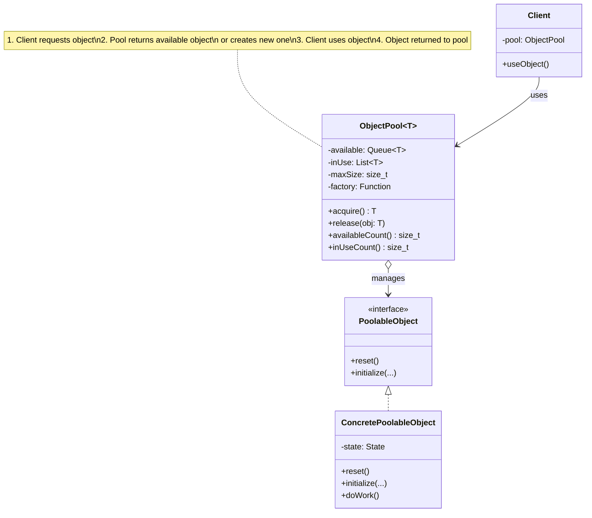
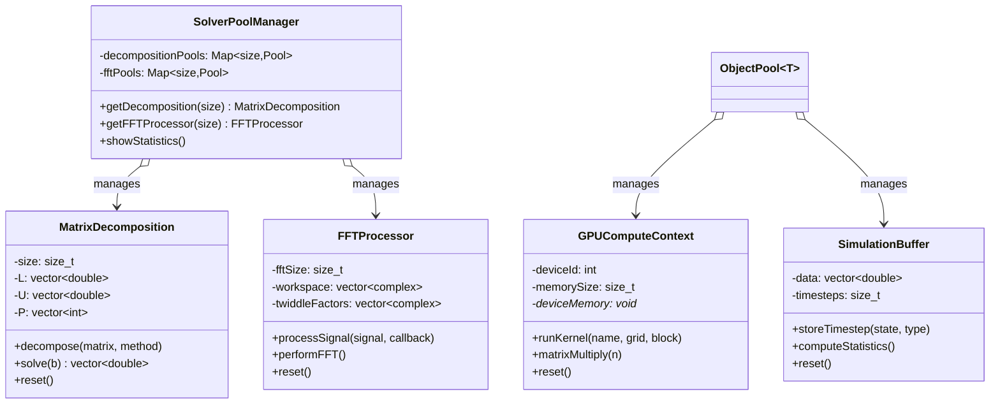

# Object Pool Pattern - High-Performance Scientific Computing Resource Management

## Intent
Manage pools of expensive computational resources (GPU contexts, FFT processors, matrix decompositions) to minimize allocation overhead and maximize resource utilization in scientific computing environments.

## Scientific Computing Context
High-performance computing requires efficient resource management:
- **GPU Contexts**: Limited GPU memory and initialization overhead
- **FFT Processors**: Pre-computed twiddle factors and workspace allocation
- **Matrix Decompositions**: Reusable factorization structures
- **Simulation Buffers**: Large memory allocations for time-series data
- **Solver Objects**: Complex initialization for numerical algorithms

## When to Use in Scientific Computing
- Managing GPU compute contexts with limited device memory
- Reusing FFT processors with pre-allocated workspaces
- Caching matrix decompositions for iterative solvers
- Pooling large simulation buffers for multiple runs
- Limiting concurrent solver instances for memory constraints

## Structure



### Scientific Resource Pool Example



## Implementation Details

### Key Components
1. **Scientific Resource Pool**: Thread-safe management of computational resources
2. **GPU Compute Context**: Expensive GPU memory allocations and kernel states
3. **FFT Processor**: Pre-computed twiddle factors and complex workspaces
4. **Matrix Decomposition**: Reusable LU/Cholesky/QR factorizations
5. **Simulation Buffer**: Large time-series data storage
6. **Pool Manager**: Hierarchical pools for different problem sizes

### Scientific Resource Pool Algorithm
```
acquireComputeResource():
1. Lock pool (thread-safe for parallel computations)
2. Determine appropriate pool size (round to power of 2 or standard sizes)
3. If resource available in pool:
   - Remove from available queue
   - Verify resource state (GPU memory, workspace integrity)
   - Return wrapped with RAII deleter
4. Else if below resource limits:
   - Allocate new resource (GPU context, FFT workspace, etc.)
   - Initialize computational structures
   - Return wrapped with automatic cleanup
5. Else:
   - Wait for resource (with condition variable)
   - Log wait time for performance analysis
   
releaseResource(resource):
1. Lock pool
2. Clear computational state:
   - GPU: Clear device memory
   - FFT: Zero workspace
   - Decomposition: Reset factorization
   - Buffer: Clear timesteps
3. Verify resource integrity
4. Return to appropriate size pool
5. Notify waiting computations

Pooling Strategy:
- GPU Contexts: Limited by device count and memory
- FFT Processors: Pool by power-of-2 sizes
- Matrix Decompositions: Pool by standard matrix sizes
- Buffers: Pool by memory size classes
```

## Advantages in Scientific Computing
- **Performance**: Eliminates GPU initialization and memory allocation overhead
- **Memory Efficiency**: Reuses large workspace allocations (FFT, matrices)
- **Predictable Latency**: No allocation delays during computation
- **Resource Control**: Limits GPU contexts and memory usage
- **Cache Efficiency**: Keeps frequently-used computational structures hot
- **Parallel Scalability**: Thread-safe pools for concurrent simulations
- **Energy Efficiency**: Reduces GPU power state transitions

## Disadvantages in HPC Context
- **Memory Footprint**: Idle resources consume significant memory
- **Lock Contention**: Pool access can become bottleneck at high core counts
- **Size Mismatch**: Fixed pool sizes may not match all problem dimensions
- **NUMA Effects**: Pool objects may be on wrong NUMA node
- **GPU Fragmentation**: Multiple small allocations can fragment GPU memory
- **Cleanup Overhead**: Resource reset can be expensive for large structures

## Example Output
```
=== High-Performance Scientific Computing Resource Pools ===

=== GPU Compute Context Pool ===

Creating GPU compute context #1 on device 0 with 4096 MB

Computation 0 requesting GPU context...
[GPU Context #1] Matrix multiply 1024x1024
[GPU Context #1] Launching kernel: matmul_kernel with grid(64) block(256)

Computation 1 requesting GPU context...
Creating GPU compute context #2 on device 0 with 4096 MB
[GPU Context #2] Matrix multiply 1280x1280
[GPU Context #2] Launching kernel: matmul_kernel with grid(80) block(256)

Computation 2 requesting GPU context...
Pool exhausted, waiting for available object...
[GPU Context #1] Launching kernel: fft_radix2 with grid(512) block(128)
Computation 0 releasing GPU context
[GPU Context #1] Clearing GPU memory
Object returned to pool. Available: 1/2
[GPU Context #1] Matrix multiply 1536x1536

Final GPU pool state: 2 available contexts

=== FFT Processor Pool ===

Signal 0 requesting FFT processor...
Creating FFT processor #1 for size 1024
[FFT Processor #1] Initializing twiddle factors
[FFT Processor #1] Processing signal of length 1024
  Signal 0 spectrum computed. Peak at bin 10
[FFT Processor #1] Signal processed

Signal 1 requesting FFT processor...
Creating FFT processor #2 for size 1024
[FFT Processor #2] Initializing twiddle factors
[FFT Processor #2] Processing signal of length 1024
  Signal 1 spectrum computed. Peak at bin 15

Signal 2 requesting FFT processor...
Pool exhausted, waiting for available object...
Object returned to pool. Available: 1/2
[FFT Processor #1] Processing signal of length 1024
  Signal 2 spectrum computed. Peak at bin 20

=== Matrix Decomposition Pool ===

Solving multiple linear systems...

System 0 requesting decomposition object...
Creating matrix decomposition object #1 for 100x100 matrices
[Decomposition #1] Performing LU decomposition on 100x100 matrix
[Decomposition #1] Solving linear system
System 0 solved. Solution norm: 10.0499

System 1 requesting decomposition object...
Creating matrix decomposition object #2 for 100x100 matrices
[Decomposition #2] Performing Cholesky decomposition on 100x100 matrix
  Using Cholesky for symmetric positive definite matrix
[Decomposition #2] Solving linear system
System 1 solved. Solution norm: 9.54951

System 2 requesting decomposition object...
Creating matrix decomposition object #3 for 100x100 matrices
[Decomposition #3] Performing LU decomposition on 100x100 matrix
[Decomposition #3] Solving linear system
System 2 solved. Solution norm: 8.16645

System 3 requesting decomposition object...
Pool exhausted, waiting for available object...
Object returned to pool. Available: 1/3
[Decomposition #1] Performing Cholesky decomposition on 100x100 matrix
  Using Cholesky for symmetric positive definite matrix
[Decomposition #1] Solving linear system
System 3 solved. Solution norm: 7.14213

Decompositions in use: 3
Pool available: 0

=== Simulation Buffer Pool ===

Allocating simulation buffer #1 for 10000 doubles (78 KB)
Allocating simulation buffer #2 for 10000 doubles (78 KB)
Allocating simulation buffer #3 for 10000 doubles (78 KB)
[Buffer #1] Stored Temperature timestep. Used: 100/10000
[Buffer #2] Stored Pressure timestep. Used: 100/10000
[Buffer #3] Stored Velocity timestep. Used: 100/10000
[... more timesteps ...]

Simulation statistics:
[Buffer #1] Statistics for Temperature:
  Min: 290, Max: 310, Avg: 300
[Buffer #2] Statistics for Pressure:
  Min: 100325, Max: 102325, Avg: 101325
[Buffer #3] Statistics for Velocity:
  Min: -4.52419, Max: 4.52419, Avg: 1.55211e-15

=== Solver Pool Manager ===

Requesting decomposition for 50x50 matrix (using pool size 64)
Creating matrix decomposition object #4 for 64x64 matrices
Requesting decomposition for 200x200 matrix (using pool size 256)
Creating matrix decomposition object #5 for 256x256 matrices
Requesting FFT processor for size 512 (using pool size 512)
Creating FFT processor #3 for size 512
Requesting FFT processor for size 2048 (using pool size 2048)
Creating FFT processor #4 for size 2048

=== Solver Pool Statistics ===
Matrix Decomposition Pools:
  Size 64x64: 1 in use, 0 available
  Size 100x100: 0 in use, 3 available
  Size 256x256: 1 in use, 0 available
FFT Processor Pools:
  Size 512: 1 in use, 0 available
  Size 1024: 0 in use, 2 available
  Size 2048: 1 in use, 0 available
```

## Common Variations in Scientific Computing
1. **GPU Memory Pool**: Separate pools for different GPU memory types (global, shared, texture)
2. **NUMA-Aware Pool**: Allocate resources on specific NUMA nodes for locality
3. **Heterogeneous Pool**: Mix CPU and GPU resources in unified pool
4. **Adaptive Pool Sizing**: Adjust pool size based on problem characteristics
5. **Pinned Memory Pool**: Special pool for GPU-CPU transfer buffers
6. **Workspace Sharing**: Multiple algorithms share large workspace pools
7. **Hierarchical Pools**: Nested pools for complex solver hierarchies

## Related Patterns in Scientific Computing
- **Singleton**: Global solver pool manager for HPC applications
- **Factory Method**: Create appropriate solver/processor for problem type
- **Strategy**: Different pooling strategies for CPU vs GPU resources
- **Flyweight**: Share read-only data (twiddle factors, basis functions)
- **Prototype**: Clone pre-configured solver objects
- **Facade**: Hide complex pool management behind simple interfaces
- **Resource Acquisition Is Initialization (RAII)**: Automatic resource return

## 🔧 Compilation & Usage

### Prerequisites
- **C++ Standard**: C++14 or later (uses make_unique, auto return types)
- **Compiler**: GCC 5+, Clang 3.4+, MSVC 2015+
- **Threading Support**: Required for mutex, condition_variable, and thread classes
- **Math Library**: Link with `-lm` on Unix systems

### Basic Compilation

#### Linux/macOS
```bash
# Basic compilation
g++ -std=c++14 -pthread -o object_pool object_pool.cpp -lm

# Alternative with Clang
clang++ -std=c++14 -pthread -o object_pool object_pool.cpp -lm
```

#### Windows (MinGW)
```batch
g++ -std=c++14 -pthread -o object_pool.exe object_pool.cpp
```

#### Windows (MSVC)
```batch
cl /EHsc /std:c++14 object_pool.cpp
```

### Advanced Compilation Options

#### Debug Build
```bash
g++ -std=c++14 -pthread -g -O0 -DDEBUG -o object_pool_debug object_pool.cpp -lm
```

#### Optimized Release Build
```bash
g++ -std=c++14 -pthread -O3 -DNDEBUG -march=native -o object_pool_release object_pool.cpp -lm
```

#### With All Warnings
```bash
g++ -std=c++14 -pthread -Wall -Wextra -Wpedantic -o object_pool object_pool.cpp -lm
```

#### Sanitizer Builds (Debug)
```bash
# Address sanitizer
g++ -std=c++14 -pthread -fsanitize=address -g -o object_pool_asan object_pool.cpp -lm

# Thread sanitizer (for detecting race conditions)
g++ -std=c++14 -pthread -fsanitize=thread -g -o object_pool_tsan object_pool.cpp -lm

# Undefined behavior sanitizer
g++ -std=c++14 -pthread -fsanitize=undefined -g -o object_pool_ubsan object_pool.cpp -lm
```

### CMake Instructions

Create `CMakeLists.txt`:
```cmake
cmake_minimum_required(VERSION 3.10)
project(ObjectPoolPattern)

# Set C++ standard
set(CMAKE_CXX_STANDARD 14)
set(CMAKE_CXX_STANDARD_REQUIRED ON)

# Find threading library
find_package(Threads REQUIRED)

# Create executable
add_executable(object_pool object_pool.cpp)

# Link threading and math libraries
target_link_libraries(object_pool Threads::Threads m)

# Compiler-specific options
if(MSVC)
    target_compile_options(object_pool PRIVATE /W4)
else()
    target_compile_options(object_pool PRIVATE -Wall -Wextra -Wpedantic)
endif()
```

Build with CMake:
```bash
mkdir build && cd build
cmake ..
make  # or cmake --build . on Windows
```

### IDE Integration

#### Visual Studio Code
Create `.vscode/tasks.json`:
```json
{
    "version": "2.0.0",
    "tasks": [
        {
            "label": "build",
            "type": "shell",
            "command": "g++",
            "args": [
                "-std=c++14",
                "-pthread",
                "-g",
                "${file}",
                "-o",
                "${fileDirname}/${fileBasenameNoExtension}"
            ],
            "group": {
                "kind": "build",
                "isDefault": true
            }
        }
    ]
}
```

#### Visual Studio
1. Create new Console Application project
2. Set C++ Language Standard to C++14 (/std:c++14) in Project Properties
3. Copy the code to main source file
4. Build with Ctrl+F7

#### CLion
1. Open the project directory
2. CLion will auto-detect CMakeLists.txt
3. Build with Ctrl+F9

### Dependencies
- **Standard Library Headers**:
  - `<iostream>`, `<memory>` - I/O and smart pointers
  - `<vector>`, `<queue>` - Container classes
  - `<unordered_map>` - Hash maps for pool management
  - `<string>` - String operations
  - `<algorithm>`, `<numeric>` - STL algorithms
  - `<complex>` - Complex numbers for FFT
  - `<cmath>` - Mathematical functions
  - `<iomanip>` - Output formatting
- **Threading**: `<mutex>`, `<condition_variable>`, `<thread>`, `<chrono>`
- **Functional**: `<functional>` for callbacks and custom deleters
- **Math Library**: Required for mathematical functions
- **No external dependencies required**

### Platform-Specific Notes

#### Linux
- Install build tools: `sudo apt-get install build-essential`
- GCC recommended version: 5.0+ for full C++14 support
- Threading support included in standard library

#### macOS
- Install Xcode command line tools: `xcode-select --install`
- Alternative: Install via Homebrew: `brew install gcc`
- Threading support included in standard library

#### Windows
- **Visual Studio**: Download Visual Studio 2017 or later (free Community edition)
- **MinGW-w64**: Available via MSYS2 or standalone installer (ensure threading support)
- **Clang**: Available via Visual Studio or LLVM download

### Troubleshooting

#### Common Issues
1. **"auto return type not supported"**: Ensure C++14 standard is set
2. **"mutex not found"**: Include `<mutex>` header and link pthread (`-pthread`)
3. **Math linking errors**: Add `-lm` flag on Unix systems
4. **"make_unique not found"**: Requires C++14, check compiler version
5. **Threading errors on Windows**: Ensure proper runtime library linkage
6. **Race conditions**: Use thread sanitizer for debugging pool access
7. **"complex not found"**: Include `<complex>` for FFT operations

#### Performance Tips for Scientific Computing
- Use `-O3` and `-march=native` for numerical code optimization
- Enable vectorization reports with `-ftree-vectorize-verbose`
- Profile GPU kernel launches and memory transfers
- Monitor pool lock contention with `perf` or VTune
- Consider NUMA node pinning for large systems
- Use huge pages for large matrix allocations
- Profile cache misses for pooled objects

#### Scientific Computing Design Considerations
- **GPU Memory Management**: Pool GPU contexts by device and memory size
- **FFT Optimization**: Pool by power-of-2 sizes for efficiency
- **Matrix Sizes**: Use standard sizes (64, 128, 256, etc.) for better pooling
- **NUMA Awareness**: Allocate pools on appropriate NUMA nodes
- **Memory Alignment**: Ensure proper alignment for SIMD operations
- **Resource Limits**: Set based on available GPU memory and system RAM
- **Cleanup Cost**: Balance thorough reset vs. performance
- **Warm Caches**: Keep frequently-used sizes in pool