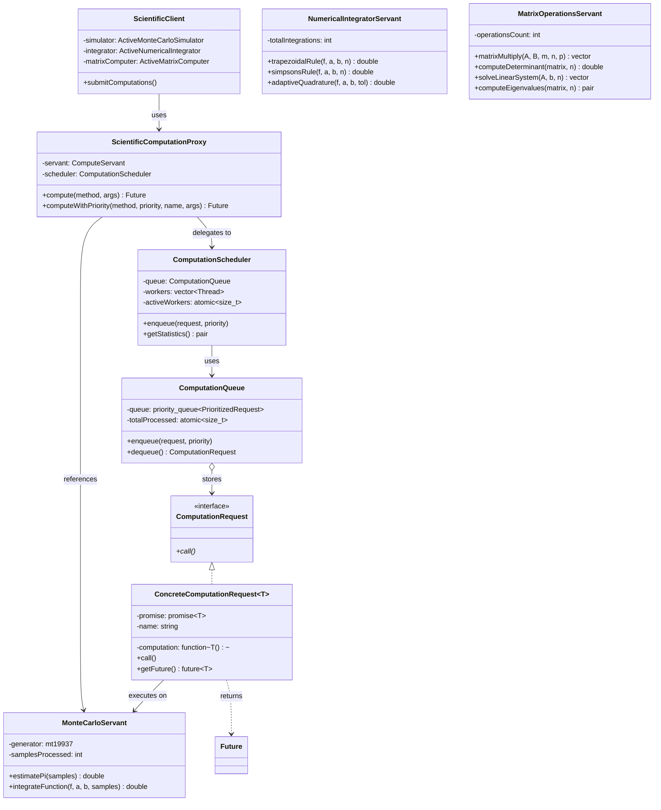
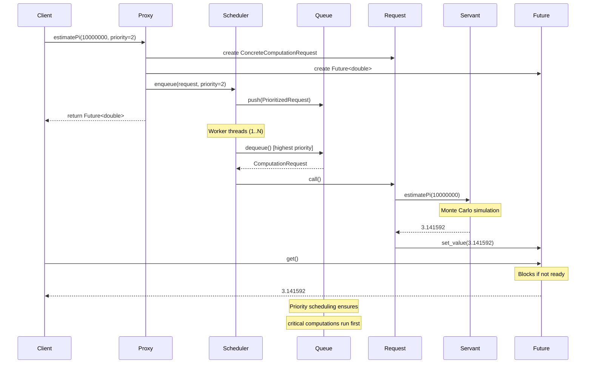

# Active Object Pattern - Asynchronous Scientific Computation

## Intent
Decouple scientific computation requests from their execution, enabling asynchronous processing, priority-based scheduling, and efficient utilization of computational resources in parallel scientific applications.

## Scientific Computing Context
Scientific computations often involve:
- **Long-running calculations**: Monte Carlo simulations, numerical integration
- **Resource-intensive operations**: Matrix computations, eigenvalue problems
- **Parallel processing**: Multiple independent calculations
- **Priority scheduling**: Critical computations need faster execution
- **Asynchronous results**: Clients shouldn't block waiting for results

## When to Use in Scientific Computing
- Parallel execution of independent scientific calculations
- Priority-based scheduling of computational tasks
- Asynchronous numerical integration and simulations
- Thread-safe access to computational resources
- Load balancing across multiple computation threads
- Decoupling computation submission from execution

## Structure



### Scientific Computation Flow



## Implementation Details

### Key Components
1. **ScientificComputationProxy**: Interface for submitting computations with priority
2. **ComputationScheduler**: Multi-threaded scheduler with worker pool
3. **ComputationQueue**: Priority queue for computation requests
4. **ComputationRequest**: Encapsulates scientific computation
5. **Scientific Servants**: Monte Carlo, Numerical Integration, Matrix Operations
6. **Future**: Type-safe placeholder for computation results

### Scientific Computation Algorithm
```
1. Client submits computation via Proxy:
   - Monte Carlo simulation with priority
   - Numerical integration task
   - Matrix operation request
   
2. Proxy creates ConcreteComputationRequest<T>:
   - Captures computation lambda
   - Creates promise/future pair
   - Tags with computation name
   
3. Scheduler enqueues with priority:
   - Higher priority = more urgent
   - FIFO within same priority
   - Tracks total enqueued
   
4. Worker threads (1..hardware_concurrency):
   - Dequeue highest priority request
   - Execute computation
   - Measure execution time
   - Set promise value/exception
   
5. Client retrieves result:
   - Future::get() blocks if needed
   - Type-safe result return
   - Exception propagation
```

## Advantages in Scientific Computing
- **Parallel Execution**: Multiple computations run concurrently
- **Priority Scheduling**: Critical calculations execute first
- **Resource Utilization**: Automatic load balancing across cores
- **Asynchronous Results**: Non-blocking computation submission
- **Thread Safety**: No explicit synchronization needed
- **Scalability**: Easy to adjust worker thread count
- **Progress Monitoring**: Track computation statistics

## Disadvantages in Scientific Context
- **Memory Overhead**: Request objects and result futures
- **Latency**: Queue and scheduling overhead for small computations
- **Debugging Complexity**: Asynchronous execution harder to trace
- **Priority Inversion**: Lower priority tasks may starve
- **Context Switching**: Thread overhead for fine-grained tasks
- **Error Handling**: Exceptions must propagate through futures

## Example Output
```
=== Active Object Pattern - Scientific Computing Demo ===
Asynchronous execution of scientific computations

[GlobalScheduler] Starting with 4 computation threads

=== Monte Carlo Simulations ===

Pending Monte Carlo computations: 4

[MC-Simulator] Estimated π = 3.141200 (from 10000 samples)
[MC-Simulator] Estimated π = 3.143160 (from 100000 samples)
[Pi Estimation] Computation completed in 15234 μs
[MC-Simulator] Estimated π = 3.141444 (from 1000000 samples)
[Pi Estimation] Computation completed in 152341 μs
[MC Integration] Computation completed in 123456 μs
[MC-Simulator] Monte Carlo integration result: 1.772454e+00
[MC Integration] Computation completed in 234567 μs
[MC-Simulator] Monte Carlo integration result: 3.596893e+00
[MC-Simulator] Estimated π = 3.141587 (from 10000000 samples)
[Pi Estimation] Computation completed in 1523415 μs

=== Pi Estimation Results ===
Samples:    10000, Error: 3.927e-04
Samples:   100000, Error: 1.567e-03
Samples:  1000000, Error: 1.487e-04
Samples: 10000000, Error: 5.654e-06

Gaussian integral: 1.77245 (Expected: 1.77245)
Sinc integral: 3.59689

Total Monte Carlo samples processed: 11610000

=== Numerical Integration ===

[NumIntegrator] Trapezoidal integration: -1.291667e+00 (1000 intervals)
[NumIntegrator] Simpson's rule integration: -1.291667e+00 (1000 intervals)
[NumIntegrator] Adaptive quadrature converged to -1.291666667e+00 (tolerance: 1e-09)
[NumIntegrator] Trapezoidal integration: 9.089809e+00 (5000 intervals)
[NumIntegrator] Simpson's rule integration: 9.089809e+00 (5000 intervals)
[NumIntegrator] Adaptive quadrature converged to 9.089809423e+00 (tolerance: 1e-12)

=== Integration Results ===
Polynomial integral [-2, 3]:
  Trapezoidal: -1.291666667
  Simpson's:   -1.291666667
  Adaptive:    -1.291666667

Transcendental integral [0, 10]:
  Trapezoidal: 9.089809423
  Simpson's:   9.089809423
  Adaptive:    9.089809423

=== Matrix Operations ===

[MatrixComputer] Matrix multiply (100x100) × (100x100) completed in 234567 μs
[MatrixComputer] Determinant of 3x3 matrix = 2.100000e+01
[MatrixComputer] Linear system 3x3 solved
[MatrixComputer] Dominant eigenvalue: 1.000000e+01

=== Matrix Computation Results ===
Matrix multiplication completed (result size: 10000)
Determinant of 3x3 matrix: 21
Linear system solution: -0.2857 0.8571 0.1429 
Dominant eigenvalue: 1.000000e+01

=== Concurrent Client Simulation ===
[MC-Simulator] Estimated π = 3.139876 (from 54321 samples)
[NumIntegrator] Trapezoidal integration: 3.333333e-01 (1000 intervals)
[MatrixComputer] Determinant of 2x2 matrix = -3.000000e+00
...

[GlobalScheduler] Stopped. Total computations processed: 47/47

=== Final Statistics ===
Total computations: 47
Processed computations: 47
Success rate: 100.0%

=== Active Object Pattern Benefits ===
• Asynchronous execution of expensive computations
• Priority-based scheduling for critical calculations
• Thread-safe access to computational resources
• Natural load balancing across worker threads
• Improved responsiveness for scientific applications
```

## Common Variations in Scientific Computing
1. **GPU Scheduler**: Dedicated scheduler for GPU computations
2. **Adaptive Thread Pool**: Adjust workers based on computation load
3. **Result Caching**: Cache computation results for reuse
4. **Distributed Active Object**: Extend across network nodes
5. **Checkpoint/Restart**: Save long-running computation state
6. **Computation Pipeline**: Chain dependent computations
7. **Resource-Aware Scheduling**: Consider memory/CPU requirements

## Related Patterns in Scientific Computing
- **Command**: Computation requests are command objects
- **Future/Promise**: Asynchronous result handling
- **Thread Pool**: Worker threads for computation execution
- **Priority Queue**: Scheduling based on computation importance
- **Object Pool**: Reuse computation resources
- **Strategy**: Different computation algorithms
- **Template Method**: Common computation workflow

## 🔧 Compilation & Usage

### Prerequisites
- **C++ Standard**: C++17 or later (required for structured bindings, if constexpr)
- **Compiler**: GCC 7.0+, Clang 5.0+, MSVC 2017+ (v15.3+)
- **Threading Support**: Required (pthread on Unix, native on Windows)
- **Features Used**: 
  - Structured bindings (`auto [a, b] = pair`)
  - `if constexpr` for compile-time branching
  - Class template argument deduction
  - `std::priority_queue` for scheduling

### Basic Compilation

#### Linux/macOS
```bash
# Basic compilation with threading and math library
g++ -std=c++17 -pthread -o active_object active_object.cpp -lm

# Alternative with Clang
clang++ -std=c++17 -pthread -o active_object active_object.cpp -lm

# With optimization for scientific computing
g++ -std=c++17 -pthread -O3 -march=native -o active_object active_object.cpp -lm
```

#### Windows (MinGW)
```batch
g++ -std=c++17 -pthread -o active_object.exe active_object.cpp
```

#### Windows (MSVC)
```batch
cl /EHsc /std:c++17 active_object.cpp
```

### Advanced Compilation Options

#### Debug Build with Thread Debugging
```bash
g++ -std=c++17 -pthread -g -O0 -DDEBUG -fsanitize=thread -o active_object_debug active_object.cpp -lm
```

#### Optimized Release Build for Scientific Computing
```bash
g++ -std=c++17 -pthread -O3 -DNDEBUG -march=native -ffast-math -o active_object_release active_object.cpp -lm
```

#### With Enhanced Warnings (Threading-aware)
```bash
g++ -std=c++17 -pthread -Wall -Wextra -Wpedantic -o active_object active_object.cpp -lm
```

#### Sanitizer Builds (Essential for Threading)
```bash
# Thread sanitizer (highly recommended)
g++ -std=c++14 -pthread -fsanitize=thread -g -O1 -o active_object_tsan active_object.cpp

# Address sanitizer
g++ -std=c++14 -pthread -fsanitize=address -g -o active_object_asan active_object.cpp

# Combined sanitizers (careful - may conflict)
g++ -std=c++14 -pthread -fsanitize=address,undefined -g -o active_object_san active_object.cpp
```

### CMake Instructions

Create `CMakeLists.txt`:
```cmake
cmake_minimum_required(VERSION 3.12)
project(ActiveObjectScientificComputing)

# Set C++ standard
set(CMAKE_CXX_STANDARD 17)
set(CMAKE_CXX_STANDARD_REQUIRED ON)

# Find threads package (required)
find_package(Threads REQUIRED)

# Create executable
add_executable(active_object active_object.cpp)

# Link threading and math libraries
target_link_libraries(active_object Threads::Threads m)

# Compiler-specific options
if(MSVC)
    target_compile_options(active_object PRIVATE /W4)
    # Enable parallel compilation
    target_compile_options(active_object PRIVATE /MP)
    # C++17 features
    target_compile_options(active_object PRIVATE /std:c++17)
else()
    target_compile_options(active_object PRIVATE 
        -Wall -Wextra -Wpedantic -pthread)
    # Optimization for release builds
    if(CMAKE_BUILD_TYPE STREQUAL "Release")
        target_compile_options(active_object PRIVATE -O3 -march=native)
    endif()
endif()

# Debug configuration with thread sanitizer
if(CMAKE_BUILD_TYPE STREQUAL "Debug")
    if(NOT MSVC)
        target_compile_options(active_object PRIVATE -fsanitize=thread -g)
        target_link_options(active_object PRIVATE -fsanitize=thread)
    endif()
endif()
```

Build with CMake:
```bash
mkdir build && cd build
cmake -DCMAKE_BUILD_TYPE=Release ..
make -j$(nproc)  # parallel build

# Debug build with sanitizers
cmake -DCMAKE_BUILD_TYPE=Debug ..
make -j$(nproc)
```

### IDE Integration

#### Visual Studio Code
Create `.vscode/tasks.json`:
```json
{
    "version": "2.0.0",
    "tasks": [
        {
            "label": "build-threading",
            "type": "shell",
            "command": "g++",
            "args": [
                "-std=c++14",
                "-pthread",
                "-g",
                "-Wall",
                "-Wextra",
                "${file}",
                "-o",
                "${fileDirname}/${fileBasenameNoExtension}"
            ],
            "group": {
                "kind": "build",
                "isDefault": true
            }
        },
        {
            "label": "build-debug-tsan",
            "type": "shell",
            "command": "g++",
            "args": [
                "-std=c++14",
                "-pthread",
                "-fsanitize=thread",
                "-g",
                "-O1",
                "${file}",
                "-o",
                "${fileDirname}/${fileBasenameNoExtension}_tsan"
            ],
            "group": "build"
        }
    ]
}
```

#### Visual Studio
1. Create new Console Application project
2. Project Properties → C/C++ → Language → C++ Language Standard: C++14
3. Project Properties → C/C++ → Code Generation → Enable Parallel Code Generation: Yes
4. Copy the code to main source file
5. Build with Ctrl+F7

#### CLion
1. Open project directory
2. Ensure CMakeLists.txt is properly configured
3. Set Build Type to Debug or Release
4. Build with Ctrl+F9

### Dependencies
- **Standard Library Headers**: 
  - `<iostream>`, `<memory>`, `<queue>`, `<thread>`
  - `<mutex>`, `<condition_variable>`, `<functional>`
  - `<future>`, `<chrono>`, `<atomic>`
  - `<vector>`, `<cmath>`, `<algorithm>`, `<numeric>`
  - `<iomanip>`, `<random>` - For scientific computations
- **Math Library**: `-lm` for mathematical functions
- **Threading Library**: pthread (Unix), Windows threading (Windows)
- **No external dependencies required**

### Threading-Specific Considerations

#### Runtime Requirements
```bash
# Check thread limits (Linux)
ulimit -u  # user processes
cat /proc/sys/kernel/threads-max  # system threads

# Set higher limits if needed
ulimit -u 4096
```

#### Performance Tuning
```bash
# Compile with specific CPU features
g++ -std=c++14 -pthread -march=native -O3 active_object.cpp

# Profile thread performance
perf record -g ./active_object
perf report
```

### Platform-Specific Notes

#### Linux
- Install build tools: `sudo apt-get install build-essential`
- Thread debugging: `sudo apt-get install gdb valgrind`
- Monitor threads: `htop` or `top -H`

#### macOS
- Install Xcode command line tools: `xcode-select --install`
- Thread debugging with Instruments (Xcode)
- Monitor with Activity Monitor

#### Windows
- **Visual Studio**: Full threading support built-in
- **MinGW-w64**: Ensure pthread support is included
- Use Windows Performance Toolkit for profiling

### Troubleshooting

#### Common Issues
1. **C++17 Features**: Ensure compiler supports structured bindings and if constexpr
2. **Linking errors**: Add `-pthread` and `-lm` flags
3. **Thread sanitizer**: May report priority queue access - usually false positive
4. **Performance**: Profile computation granularity vs overhead
5. **Deadlocks**: Check future.get() calls and exception handling

#### Scientific Computing Debugging
```bash
# Run with thread sanitizer
export TSAN_OPTIONS="detect_thread_leaks=false:halt_on_error=1"
./active_object_tsan

# Profile computational performance
perf record -g ./active_object
perf report

# Monitor thread utilization
htop -H  # Show threads
```

#### Performance Optimization for Scientific Computing
- **Computation Granularity**: Balance task size vs scheduling overhead
- **Thread Pool Size**: Match hardware concurrency for CPU-bound tasks
- **Priority Tuning**: Assign priorities based on computation cost
- **Memory Locality**: Group related computations on same thread
- **Vectorization**: Enable compiler auto-vectorization with -march=native
- **Cache Efficiency**: Consider data layout for matrix operations

#### Scientific Computing Best Practices
- Use high priority for time-critical computations
- Batch small computations to reduce overhead  
- Monitor queue depth to prevent memory issues
- Profile actual vs theoretical speedup
- Consider NUMA effects on large systems