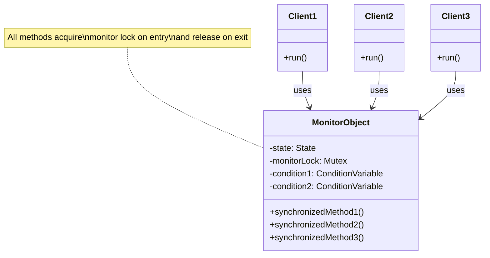
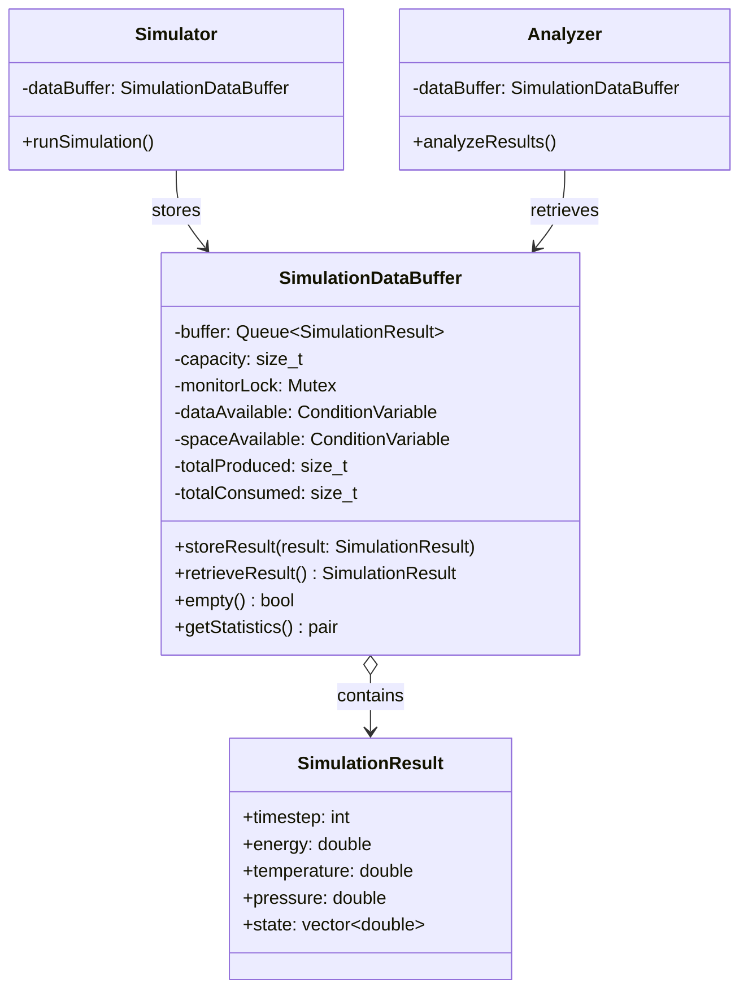
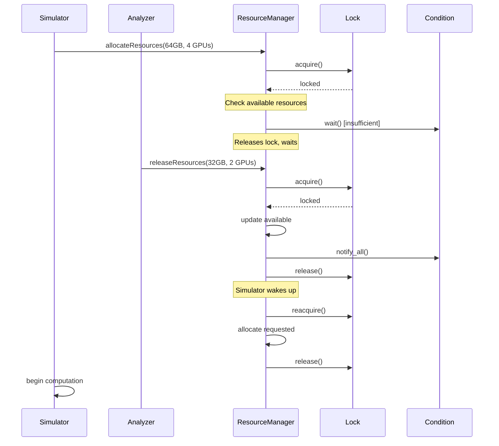

# Monitor Object Pattern - Scientific Computing Synchronization

## Intent
Provide thread-safe access to shared computational resources and data structures, ensuring synchronized execution of scientific calculations while maintaining data integrity and resource invariants.

## Scientific Computing Context
In scientific computing, the Monitor Object pattern is essential for:
- **Parallel Simulations**: Multiple threads producing/consuming simulation data
- **Resource Management**: GPU, memory, and license allocation for computations
- **Data Grid Access**: Concurrent read/write operations on scientific datasets
- **HPC Coordination**: Synchronizing access to expensive computational resources

## When to Use in Scientific Computing
- Managing simulation data pipelines between producers and consumers
- Coordinating access to limited computational resources (GPUs, licenses)
- Implementing thread-safe scientific data structures
- Synchronizing parallel numerical computations
- Preventing race conditions in shared scientific datasets

## Structure



### Scientific Data Pipeline Example



### Scientific Computation Synchronization Flow



## Implementation Details

### Key Components
1. **Monitor Lock**: Mutex that protects the monitor's state
2. **Condition Variables**: For waiting on specific conditions
3. **Synchronized Methods**: All public methods acquire lock
4. **Guarded Suspension**: Wait for preconditions to be met
5. **State Variables**: Protected by monitor lock

### Algorithm
```
synchronized_method():
1. Acquire monitor lock
2. While (precondition not met):
   - Wait on condition variable (releases lock)
   - Reacquire lock when signaled
3. Perform operation
4. Update state
5. Signal/broadcast to waiting threads
6. Release monitor lock
```

## Advantages in Scientific Computing
- **Data Integrity**: Ensures consistency of scientific datasets
- **Resource Safety**: Prevents over-allocation of computational resources
- **Pipeline Efficiency**: Smooth data flow between simulation stages
- **Automatic Synchronization**: No explicit locking in client code
- **Condition-based Waiting**: Efficient resource utilization
- **RAII Support**: Automatic cleanup of resources

## Disadvantages in Scientific Context
- **Serialization Overhead**: Can limit parallel computation throughput
- **Lock Contention**: High-frequency data updates may bottleneck
- **Granularity Issues**: Coarse-grained locking may reduce parallelism
- **Priority Inversion**: Critical computations may wait for less important ones
- **Debugging Complexity**: Harder to trace synchronization issues

## Example Output
```
=== Monitor Object Pattern - Scientific Computing Demo ===
Thread-safe synchronization for computational resources

=== Simulation Pipeline Example ===
Multiple simulators producing results, analyzers consuming them

[Simulator-140704789436160] Stored timestep 0 (E=-7.845e+01, buffer size: 1)
[Simulator-140704781043456] Stored timestep 100 (E=-9.123e+01, buffer size: 2)
[Analyzer-140704789436160] Retrieved timestep 0 (buffer size: 1)
[Analyzer-0] Analyzed timestep 0: avg state = -8.234, T = 298.5 K
[Analyzer-140704772650752] Retrieved timestep 100 (buffer size: 0)
[Analyzer-1] Analyzed timestep 100: avg state = -9.567, T = 315.2 K
[Simulator-140704789436160] Stored timestep 1 (E=-8.234e+01, buffer size: 1)
[Analyzer-2] Average energy: -85.678 eV

Statistics: Produced 10, Consumed 10

=== Computational Resource Management Example ===
Managing GPU and memory resources for parallel computations

[Cluster-1] Allocated to DeepLearning-Training: 64.00 GB, 4 GPU(s) | Available: 192.00 GB, 4 GPU(s)
[Cluster-1] Insufficient resources for MolecularDynamics (needs 128.00 GB, 4 GPU(s))
MD simulation waiting for resources...
[Cluster-1] Allocated to CFD-Simulation: 48.00 GB, 2 GPU(s) | Available: 144.00 GB, 2 GPU(s)
Transfer: 32.00 GB, 2 GPU(s) from Cluster-1 to Cluster-2

[Monitor] Resource status:
  Cluster-1: 112.00 GB, 0 GPUs
  Cluster-2: 160.00 GB, 6 GPUs

[Cluster-1] Released by CFD-Simulation: 48.00 GB, 2 GPU(s) | Available: 160.00 GB, 2 GPU(s)
[Cluster-1] Allocated to MolecularDynamics: 128.00 GB, 4 GPU(s) | Available: 32.00 GB, -2 GPU(s)

=== Scientific Data Grid Example ===
Multiple readers computing metrics, writers updating grid

[DataReader-140704789436160] Acquired read access (active readers: 1)
[DataReader-140704781043456] Acquired read access (active readers: 2)
[DataReader-140704772650752] Acquired read access (active readers: 3)
Reader 0 computed Frobenius norm: 4.082483e+01
Reader 1 computed spectral radius: 0.000000
Reader 2 computed trace: -4.189378
[DataWriter-140704764258048] Acquired write access
Writer applying 5-point stencil operation...
[DataWriter-140704764258048] Released write access
[DataReader-140704755865344] Acquired read access (active readers: 1)
Reader 3 read center value: 0.247404

Note: Writers have priority - readers wait when writers are pending

=== Computation License Management Example ===
Managing limited licenses for expensive scientific computations

[QuantumChemistry-140704789436160] Requesting 3 license(s)...
[QuantumChemistry-140704789436160] Acquired 3 license(s) (available: 5/8)
[QuantumChemistry-140704789436160] Starting computation...
[ProteinFolding-140704781043456] Try-acquired 2 license(s)
[ProteinFolding-140704781043456] Starting computation immediately...
[WeatherSimulation-140704772650752] Requesting 4 license(s)...
[WeatherSimulation-140704772650752] Waiting in queue...

=== License Usage Statistics ===
Total licenses: 8
Available: 3
In use: 5
Uptime: 0 seconds

Active licenses by computation type:
  QuantumChemistry: 3 license(s)
  ProteinFolding: 2 license(s)

=== Summary ===
Monitor Object Pattern provides:
• Thread-safe access to shared computational resources
• Automatic synchronization without explicit locking
• Condition-based waiting for resource availability
• Prevention of race conditions in scientific computations
• Efficient resource utilization in parallel computing
```

## Common Variations in Scientific Computing
1. **Data Grid Monitor**: Read/write synchronization for scientific datasets
2. **Resource Pool Monitor**: Managing GPU, memory, and compute resources
3. **Pipeline Monitor**: Producer-consumer for simulation data flow
4. **License Monitor**: Controlling access to expensive software licenses
5. **Hierarchical Monitor**: Nested resource allocation (cluster → node → GPU)
6. **Priority Monitor**: High-priority computations get resources first
7. **Timed Monitor**: Timeouts for long-running computations

## Related Patterns in Scientific Computing
- **Active Object**: Asynchronous scientific computations
- **Object Pool**: Reusable computational resources
- **Producer-Consumer**: Simulation data pipelines
- **Read-Write Lock**: Scientific data grid access
- **Semaphore**: License/resource counting
- **Thread Pool**: Parallel computation workers
- **Command**: Queued computational tasks

## 🔧 Compilation & Usage

### Prerequisites
- **C++ Standard**: C++17 or later (required for structured bindings, std::apply)
- **Compiler**: GCC 7.0+, Clang 5.0+, MSVC 2017+ (v15.3+)
- **Threading Support**: Required (pthread on Unix, native on Windows)
- **Key Features**: 
  - std::mutex, std::condition_variable for synchronization
  - std::atomic for lock-free counters
  - RAII wrappers for automatic resource management
  - std::unordered_map for license tracking
  - Structured bindings for convenient tuple handling

### Basic Compilation

#### Linux/macOS
```bash
# Basic compilation with threading support and math library
g++ -std=c++17 -pthread -o monitor_object monitor_object.cpp -lm

# Alternative with Clang
clang++ -std=c++17 -pthread -o monitor_object monitor_object.cpp -lm

# With optimization for scientific computing
g++ -std=c++17 -pthread -O3 -march=native -o monitor_object monitor_object.cpp -lm
```

#### Windows (MinGW)
```batch
g++ -std=c++17 -pthread -o monitor_object.exe monitor_object.cpp
```

#### Windows (MSVC)
```batch
cl /EHsc /std:c++17 monitor_object.cpp
```

### Advanced Compilation Options

#### Debug Build with Thread Debugging
```bash
g++ -std=c++17 -pthread -g -O0 -DDEBUG -fsanitize=thread -fno-omit-frame-pointer -o monitor_object_debug monitor_object.cpp -lm
```

#### Optimized Release Build for Scientific Computing
```bash
g++ -std=c++17 -pthread -O3 -DNDEBUG -march=native -ffast-math -o monitor_object_release monitor_object.cpp -lm
```

#### Enhanced Warnings for Threading Issues
```bash
g++ -std=c++17 -pthread -Wall -Wextra -Wpedantic -o monitor_object monitor_object.cpp -lm
```

#### Sanitizer Builds (Essential for Monitor Objects)
```bash
# Thread sanitizer (CRITICAL for detecting race conditions)
g++ -std=c++14 -pthread -fsanitize=thread -g -O1 -fno-omit-frame-pointer -o monitor_object_tsan monitor_object.cpp

# Address sanitizer
g++ -std=c++14 -pthread -fsanitize=address -g -o monitor_object_asan monitor_object.cpp

# Undefined behavior sanitizer
g++ -std=c++14 -pthread -fsanitize=undefined -g -o monitor_object_ubsan monitor_object.cpp

# Memory sanitizer (Clang only)
clang++ -std=c++14 -pthread -fsanitize=memory -g -O1 -o monitor_object_msan monitor_object.cpp
```

### CMake Instructions

Create `CMakeLists.txt`:
```cmake
cmake_minimum_required(VERSION 3.12)
project(MonitorObjectPattern)

# Set C++ standard
set(CMAKE_CXX_STANDARD 17)
set(CMAKE_CXX_STANDARD_REQUIRED ON)

# Find threads package (essential)
find_package(Threads REQUIRED)

# Create executable
add_executable(monitor_object monitor_object.cpp)

# Link threading library (critical)
target_link_libraries(monitor_object Threads::Threads)

# Compiler-specific options
if(MSVC)
    target_compile_options(monitor_object PRIVATE /W4)
    # Enable parallel compilation
    target_compile_options(monitor_object PRIVATE /MP)
else()
    target_compile_options(monitor_object PRIVATE 
        -Wall -Wextra -Wpedantic -pthread)
    # Thread-safety warnings (GCC 10+ or Clang 12+)
    if(CMAKE_CXX_COMPILER_ID STREQUAL "GNU" AND CMAKE_CXX_COMPILER_VERSION VERSION_GREATER_EQUAL 10)
        target_compile_options(monitor_object PRIVATE -Wthread-safety)
    endif()
    if(CMAKE_CXX_COMPILER_ID STREQUAL "Clang" AND CMAKE_CXX_COMPILER_VERSION VERSION_GREATER_EQUAL 12)
        target_compile_options(monitor_object PRIVATE -Wthread-safety)
    endif()
endif()

# Debug configuration with thread sanitizer
if(CMAKE_BUILD_TYPE STREQUAL "Debug")
    if(NOT MSVC)
        target_compile_options(monitor_object PRIVATE -fsanitize=thread -fno-omit-frame-pointer)
        target_link_options(monitor_object PRIVATE -fsanitize=thread)
    endif()
endif()

# Custom target for different sanitizer builds
add_custom_target(sanitize_all)

# Thread sanitizer build
add_executable(monitor_object_tsan monitor_object.cpp)
target_link_libraries(monitor_object_tsan Threads::Threads)
if(NOT MSVC)
    target_compile_options(monitor_object_tsan PRIVATE -fsanitize=thread -g -O1 -fno-omit-frame-pointer)
    target_link_options(monitor_object_tsan PRIVATE -fsanitize=thread)
endif()
add_dependencies(sanitize_all monitor_object_tsan)

# Address sanitizer build
add_executable(monitor_object_asan monitor_object.cpp)
target_link_libraries(monitor_object_asan Threads::Threads)
if(NOT MSVC)
    target_compile_options(monitor_object_asan PRIVATE -fsanitize=address -g)
    target_link_options(monitor_object_asan PRIVATE -fsanitize=address)
endif()
add_dependencies(sanitize_all monitor_object_asan)
```

Build with CMake:
```bash
mkdir build && cd build
cmake -DCMAKE_BUILD_TYPE=Release ..
make -j$(nproc)  # parallel build

# Debug build with sanitizers
cmake -DCMAKE_BUILD_TYPE=Debug ..
make monitor_object_tsan  # thread sanitizer version
make sanitize_all         # all sanitizer versions
```

### IDE Integration

#### Visual Studio Code
Create `.vscode/tasks.json`:
```json
{
    "version": "2.0.0",
    "tasks": [
        {
            "label": "build-monitor-threading",
            "type": "shell",
            "command": "g++",
            "args": [
                "-std=c++14",
                "-pthread",
                "-g",
                "-Wall",
                "-Wextra",
                "-Wthread-safety",
                "${file}",
                "-o",
                "${fileDirname}/${fileBasenameNoExtension}"
            ],
            "group": {
                "kind": "build",
                "isDefault": true
            }
        },
        {
            "label": "build-monitor-tsan",
            "type": "shell",
            "command": "g++",
            "args": [
                "-std=c++14",
                "-pthread",
                "-fsanitize=thread",
                "-g",
                "-O1",
                "-fno-omit-frame-pointer",
                "${file}",
                "-o",
                "${fileDirname}/${fileBasenameNoExtension}_tsan"
            ],
            "group": "build"
        },
        {
            "label": "build-monitor-debug",
            "type": "shell",
            "command": "g++",
            "args": [
                "-std=c++14",
                "-pthread",
                "-g",
                "-O0",
                "-DDEBUG",
                "-fno-omit-frame-pointer",
                "${file}",
                "-o",
                "${fileDirname}/${fileBasenameNoExtension}_debug"
            ],
            "group": "build"
        }
    ]
}
```

#### Visual Studio
1. Create new Console Application project
2. Project Properties → C/C++ → Language → C++ Language Standard: C++14
3. Project Properties → C/C++ → Code Generation → Enable Parallel Code Generation: Yes
4. Copy the code to main source file
5. Build with Ctrl+F7

#### CLion
1. Open project directory
2. Ensure CMakeLists.txt is properly configured
3. Set Build Type to Debug or Release
4. Build with Ctrl+F9

### Dependencies
- **Standard Library Headers**: 
  - `<iostream>`, `<mutex>`, `<condition_variable>`, `<thread>`
  - `<vector>`, `<queue>`, `<chrono>`, `<random>`
  - `<iomanip>`, `<atomic>`, `<functional>`
  - `<cmath>`, `<numeric>`, `<algorithm>` - For scientific computations
  - `<memory>`, `<unordered_map>` - For resource management
- **Math Library**: `-lm` for mathematical functions
- **Threading Library**: pthread (Unix), Windows threading (Windows)
- **No external dependencies required**

### Threading-Specific Considerations

#### Monitor Pattern Requirements
- **Mutual Exclusion**: Mutex for protecting shared state
- **Condition Synchronization**: Condition variables for waiting
- **RAII**: Proper lock management with lock guards
- **Exception Safety**: Locks released even during exceptions

#### Runtime Requirements
```bash
# Check thread limits (Linux)
ulimit -u                    # user processes
cat /proc/sys/kernel/threads-max  # system threads

# Set higher limits if needed
ulimit -u 8192

# Check mutex/condition variable limits
getconf _POSIX_THREAD_THREADS_MAX
```

#### Performance Tuning
```bash
# Compile with CPU-specific optimizations for scientific computing
g++ -std=c++17 -pthread -march=native -O3 -ffast-math -DNDEBUG monitor_object.cpp -lm

# Profile monitor performance in scientific workloads
perf record -g ./monitor_object
perf report

# CPU affinity for HPC testing
taskset -c 0-3 ./monitor_object  # Use CPUs 0-3

# NUMA-aware execution
numactl --cpunodebind=0 --membind=0 ./monitor_object
```

### Platform-Specific Notes

#### Linux
- Install build tools: `sudo apt-get install build-essential`
- Thread debugging: `sudo apt-get install gdb valgrind`
- Monitor threads: `htop -H` or `top -H`
- Check for deadlocks: `valgrind --tool=helgrind ./monitor_object`

#### macOS
- Install Xcode command line tools: `xcode-select --install`
- Thread debugging with Instruments (Xcode)
- Monitor with Activity Monitor
- Use `sudo dtruss -p <pid>` for system call tracing

#### Windows
- **Visual Studio**: Full threading support built-in
- **MinGW-w64**: Ensure pthread support is included
- Use Windows Performance Toolkit for profiling
- Event Viewer for system-level debugging

### Troubleshooting

#### Common Issues
1. **Linking errors**: Ensure `-pthread` flag is used
2. **Condition variable spurious wakeups**: Always use condition predicates
3. **Deadlocks**: Use lock ordering, timeout-based locks
4. **Performance**: Profile with release builds only
5. **Race conditions**: Use thread sanitizer extensively

#### Monitor-Specific Debugging
```bash
# Run with thread sanitizer (essential for monitors)
export TSAN_OPTIONS="detect_thread_leaks=true:halt_on_error=1:abort_on_error=1"
./monitor_object_tsan

# Debug with GDB (monitor threads)
gdb ./monitor_object
(gdb) set scheduler-locking on  # Control thread scheduling
(gdb) info threads
(gdb) thread apply all bt       # All thread backtraces
(gdb) break monitor_object.cpp:50 thread 2  # Break in specific thread

# Helgrind for race condition detection
valgrind --tool=helgrind --track-lockorders=yes ./monitor_object

# DRD for deadlock detection
valgrind --tool=drd --check-stack-var=yes ./monitor_object
```

#### Scientific Computing Monitor Issues
- **Resource Starvation**: Large computations blocking smaller ones
- **Priority Inversion**: Critical simulations waiting for routine tasks
- **Data Coherency**: Ensuring scientific data consistency
- **Granularity**: Balance between parallelism and synchronization overhead

#### Performance Optimization for Scientific Workloads
- **Lock Contention**: Profile resource allocation bottlenecks
- **Data Locality**: Keep related computations on same NUMA node
- **Batch Processing**: Group small operations to reduce overhead
- **Read-Write Ratio**: Optimize for common access patterns
- **Resource Pooling**: Pre-allocate expensive resources

### Testing Strategy
```bash
# Stress testing with multiple threads
stress-ng --cpu 4 --timeout 60s &
./monitor_object &
killall stress-ng

# Verify correctness with different thread counts
for i in {1..16}; do
    echo "Testing with $i threads"
    THREAD_COUNT=$i ./monitor_object
done

# Long-running stability test
timeout 300s ./monitor_object  # Run for 5 minutes
```