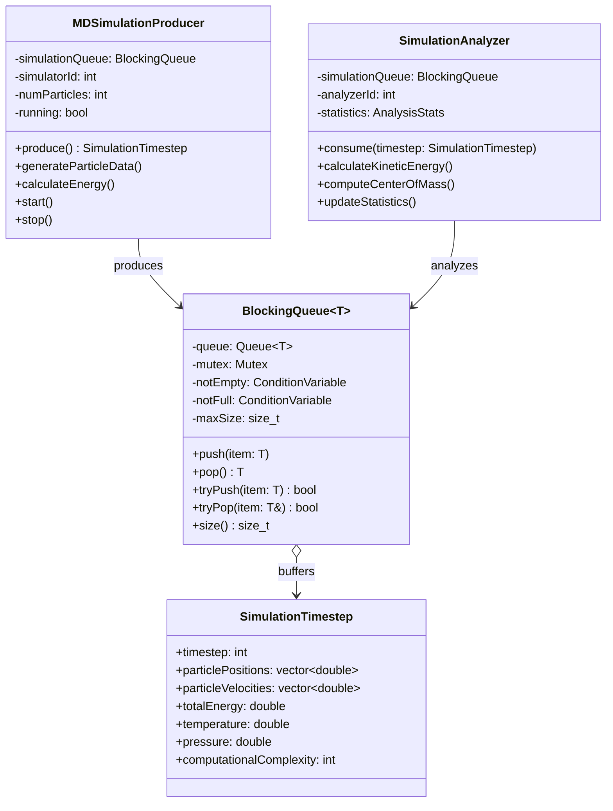
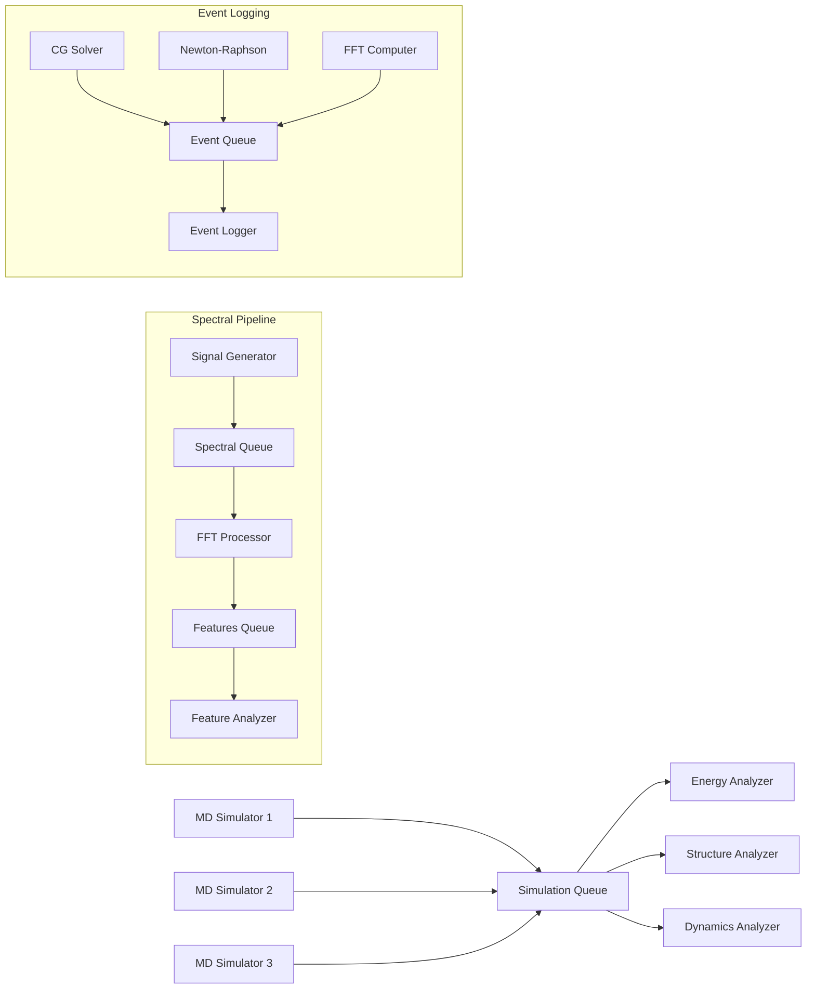
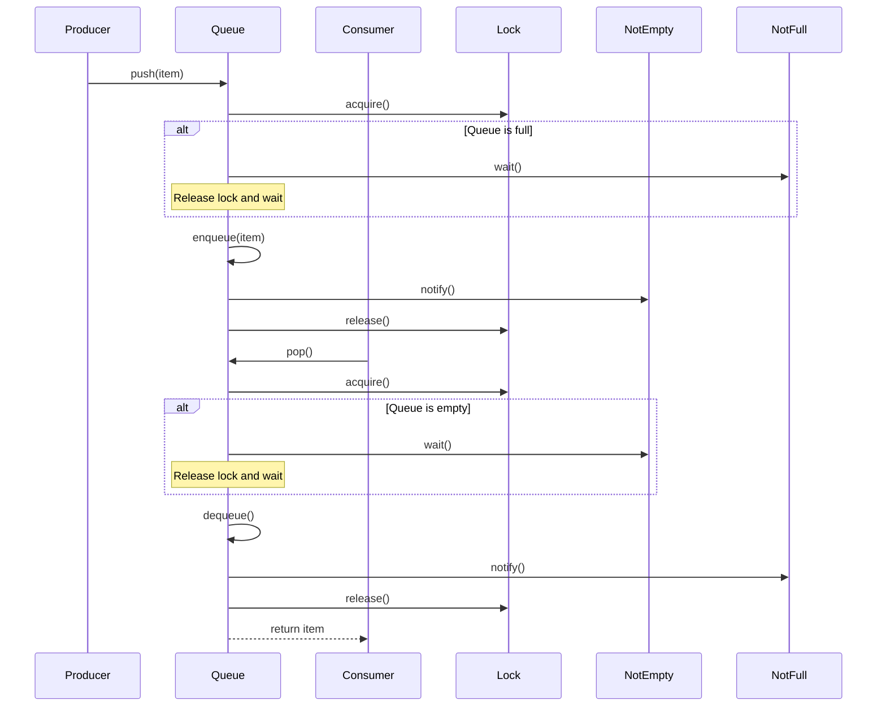

# Producer-Consumer Pattern - Scientific Computing Pipeline

## Intent
Decouple the generation of scientific data (simulations, measurements) from its analysis and processing, enabling parallel computation pipelines with different production and consumption rates.

## Scientific Computing Context
In scientific computing, the Producer-Consumer pattern is essential for:
- **Simulation Pipelines**: MD simulations producing timesteps for analysis
- **Data Acquisition**: Sensors/instruments generating data for processing
- **Parallel Analysis**: Multiple analyzers consuming simulation results
- **Signal Processing**: FFT pipelines and spectral analysis workflows
- **Event Logging**: Tracking convergence, divergence, and computational events

## When to Use in Scientific Computing
- Simulation generates data faster than analysis can process
- Multiple analysis stages with different computational costs
- Real-time data acquisition with offline processing
- Distributing computational tasks across worker threads
- Building multi-stage scientific processing pipelines

## Structure



### Scientific Processing Pipeline



### Synchronization Flow



## Implementation Details

### Key Components
1. **Producer**: Creates items and puts them in queue
2. **Consumer**: Takes items from queue and processes them
3. **Blocking Queue**: Thread-safe buffer with capacity limit
4. **Synchronization**: Mutex and condition variables
5. **Items**: Data passed between producers and consumers

### Algorithm
```
Producer:
1. While running:
   - Produce item
   - Push to queue (blocks if full)
   - Sleep/continue

Consumer:
1. While running:
   - Pop from queue (blocks if empty)
   - Process item
   - Continue

BlockingQueue.push():
1. Lock mutex
2. While queue is full:
   - Wait on not_full condition
3. Add item to queue
4. Signal not_empty condition
5. Unlock mutex

BlockingQueue.pop():
1. Lock mutex
2. While queue is empty:
   - Wait on not_empty condition
3. Remove item from queue
4. Signal not_full condition
5. Unlock mutex
6. Return item
```

## Advantages in Scientific Computing
- **Decoupling**: Simulation can run independently of analysis speed
- **Parallelism**: Multiple analyzers process data concurrently
- **Load Balancing**: Work distributed evenly across compute resources
- **Buffering**: Handles varying computational speeds
- **Pipeline Architecture**: Natural fit for multi-stage processing
- **Resource Utilization**: Maximizes CPU/GPU usage

## Disadvantages in Scientific Context
- **Memory Usage**: Large simulation data can overflow buffers
- **Latency**: Real-time analysis delayed by queuing
- **Ordering**: May need to preserve timestep order
- **Backpressure**: Fast producers can overwhelm slow consumers
- **Synchronization Overhead**: Lock contention on shared queue
- **Error Propagation**: Failed analysis may go unnoticed

## Example Output
```
=== Producer-Consumer Pattern - Scientific Computing ===
Parallel processing pipelines for scientific data

=== Molecular Dynamics Simulation Pipeline ===
Multiple simulators producing timesteps, analyzers processing them

[MDSimulator-0] Generated timestep 0 (particles: 50, E: -789.234e+00 eV)
[MDSimulator-1] Generated timestep 1 (particles: 100, E: -923.567e+00 eV)
[Analyzer-0] Analyzing timestep 0
[Analyzer-1] Analyzing timestep 1
[Analyzer-0] Timestep 0 - KE: 4.523e+02, COM: (5.23, 4.87, 6.12)
[MDSimulator-0] Generated timestep 2 (particles: 50, E: -812.456e+00 eV)
[Analyzer-2] Analyzing timestep 2
[Analyzer-1] Timestep 1 - KE: 8.234e+02, COM: (4.56, 5.89, 5.34)

Stopping simulators...
Stopping analyzers...

=== Analysis Statistics ===
Analyzer 0:
  Timesteps analyzed: 7
  Average energy: -834.567e+00 eV
  Energy range: [-978.234e+00, -723.456e+00] eV
Analyzer 1:
  Timesteps analyzed: 6
  Average energy: -845.123e+00 eV
  Energy range: [-967.890e+00, -734.567e+00] eV
Analyzer 2:
  Timesteps analyzed: 5
  Average energy: -823.789e+00 eV
  Energy range: [-945.678e+00, -712.345e+00] eV

=== Scientific Event Logging (Multiple Computations) ===
Multiple solvers producing convergence/divergence events

[14:32:45] [CHECKPOINT] [ConjugateGradient] Starting CG solver for linear system (metric: 0.000000e+00)
[14:32:45] [CHECKPOINT] [NewtonRaphson] Starting nonlinear solver (metric: 0.000000e+00)
[14:32:45] [CHECKPOINT] [FFT] Computing Fast Fourier Transform (metric: 0.000000e+00)
[14:32:45] [CHECKPOINT] [ConjugateGradient] Iteration 0 completed (metric: 1.000000e-01)
[14:32:45] [WARNING] [FFT] Input size not power of 2, using slower algorithm (metric: 1.024000e+03)
[14:32:46] [CHECKPOINT] [ConjugateGradient] Iteration 1 completed (metric: 1.000000e-02)
[14:32:46] [CHECKPOINT] [FFT] FFT computation completed (metric: 2.345000e-12)
[14:32:46] [CONVERGENCE] [ConjugateGradient] Solution converged at iteration 2 (metric: 1.000000e-03)
[14:32:46] [CONVERGENCE] [NewtonRaphson] Converged to solution (metric: 7.290000e-01)

=== Spectral Analysis Pipeline ===
Signal acquisition -> FFT -> Feature extraction

[SignalAcquisition] Generated spectrum for sample #0 (FFT size: 1024)
[SpectralProcessor] Analyzed sample #0 - Dominant freq: 2205.00 Hz, Power: 1.325e+04
[FeatureAnalyzer] Sample #0 analysis:
  - Dominant frequency: 2205.0 Hz
  - Spectral centroid: 2516.8 Hz
  - Total power: 1.325e+04
  - Peak frequencies: 2205.0 5512.5 8820.0 Hz

[SignalAcquisition] Generated spectrum for sample #1 (FFT size: 1024)
[SpectralProcessor] Analyzed sample #1 - Dominant freq: 2205.00 Hz, Power: 1.287e+04
[FeatureAnalyzer] Sample #1 analysis:
  - Dominant frequency: 2205.0 Hz
  - Spectral centroid: 2498.3 Hz
  - Total power: 1.287e+04
  - Peak frequencies: 2205.0 5512.5 8820.0 Hz

=== Pattern Benefits in Scientific Computing ===
• Decouples data generation from analysis
• Enables parallel processing of simulation timesteps
• Natural load balancing between producers and consumers
• Buffering handles varying computation speeds
• Pipeline architecture for multi-stage processing
```

## Common Variations in Scientific Computing
1. **Simulation Pipeline**: MD/CFD simulation → Analysis → Visualization
2. **Priority Processing**: Urgent computations get priority
3. **Data Streaming**: Real-time sensor data → Processing → Storage
4. **Parallel Analysis**: Multiple analyzers for different properties
5. **Hierarchical Pipeline**: Coarse → Fine grain analysis
6. **Checkpoint/Restart**: Save intermediate results for fault tolerance
7. **GPU Pipeline**: CPU preprocessing → GPU computation → CPU postprocessing

## Related Patterns in Scientific Computing
- **Pipeline**: Multi-stage scientific data processing
- **Thread Pool**: Worker threads for parallel analysis
- **Monitor Object**: Synchronization for shared data
- **Active Object**: Asynchronous computation requests
- **Command**: Encapsulated computation tasks
- **Strategy**: Different analysis algorithms
- **Object Pool**: Reusable computation resources

## 🔧 Compilation & Usage

### Prerequisites
- **C++ Standard**: C++17 or later (required for structured bindings, if constexpr)
- **Compiler**: GCC 7.0+, Clang 5.0+, MSVC 2017+ (v15.3+)
- **Threading Support**: Required (pthread on Unix, native on Windows)
- **Key Features**: 
  - Advanced templates with inheritance hierarchies
  - std::complex for spectral analysis
  - std::atomic for thread-safe counters
  - std::unique_ptr for resource management
  - Structured bindings for tuple unpacking

### Basic Compilation

#### Linux/macOS
```bash
# Basic compilation with threading and math support
g++ -std=c++17 -pthread -o producer_consumer producer_consumer.cpp -lm

# Alternative with Clang
clang++ -std=c++17 -pthread -o producer_consumer producer_consumer.cpp -lm

# With optimization for scientific computing
g++ -std=c++17 -pthread -O3 -march=native -o producer_consumer producer_consumer.cpp -lm
```

#### Windows (MinGW)
```batch
g++ -std=c++17 -pthread -o producer_consumer.exe producer_consumer.cpp
```

#### Windows (MSVC)
```batch
cl /EHsc /std:c++17 producer_consumer.cpp
```

### Advanced Compilation Options

#### Debug Build with Thread Debugging
```bash
g++ -std=c++17 -pthread -g -O0 -DDEBUG -fsanitize=thread -fno-omit-frame-pointer -o producer_consumer_debug producer_consumer.cpp -lm
```

#### Optimized Release Build for Scientific Computing
```bash
g++ -std=c++17 -pthread -O3 -DNDEBUG -march=native -ffast-math -o producer_consumer_release producer_consumer.cpp -lm
```

#### Enhanced Warnings for Templates and Threading
```bash
g++ -std=c++17 -pthread -Wall -Wextra -Wpedantic -Wtemplate-backtrace-limit=0 -o producer_consumer producer_consumer.cpp -lm
```

#### Sanitizer Builds (Critical for Producer-Consumer)
```bash
# Thread sanitizer (ESSENTIAL for race condition detection)
g++ -std=c++14 -pthread -fsanitize=thread -g -O1 -fno-omit-frame-pointer -o producer_consumer_tsan producer_consumer.cpp

# Address sanitizer for memory issues
g++ -std=c++14 -pthread -fsanitize=address -g -o producer_consumer_asan producer_consumer.cpp

# Undefined behavior sanitizer
g++ -std=c++14 -pthread -fsanitize=undefined -g -o producer_consumer_ubsan producer_consumer.cpp

# Combined sanitizers (memory + undefined behavior)
g++ -std=c++14 -pthread -fsanitize=address,undefined -g -o producer_consumer_combined producer_consumer.cpp
```

### CMake Instructions

Create `CMakeLists.txt`:
```cmake
cmake_minimum_required(VERSION 3.12)
project(ProducerConsumerPattern)

# Set C++ standard (C++17 for structured bindings)
set(CMAKE_CXX_STANDARD 17)
set(CMAKE_CXX_STANDARD_REQUIRED ON)

# Find threads package (required)
find_package(Threads REQUIRED)

# Create executable
add_executable(producer_consumer producer_consumer.cpp)

# Link threading library (essential)
target_link_libraries(producer_consumer Threads::Threads)

# Compiler-specific options
if(MSVC)
    target_compile_options(producer_consumer PRIVATE /W4)
    # Enable parallel compilation
    target_compile_options(producer_consumer PRIVATE /MP)
    # Better template diagnostics
    target_compile_options(producer_consumer PRIVATE /diagnostics:caret)
else()
    target_compile_options(producer_consumer PRIVATE 
        -Wall -Wextra -Wpedantic -pthread)
    # Enhanced template error reporting
    target_compile_options(producer_consumer PRIVATE -ftemplate-backtrace-limit=0)
    # Thread-safety warnings
    if(CMAKE_CXX_COMPILER_ID STREQUAL "GNU" AND CMAKE_CXX_COMPILER_VERSION VERSION_GREATER_EQUAL 10)
        target_compile_options(producer_consumer PRIVATE -Wthread-safety)
    endif()
    if(CMAKE_CXX_COMPILER_ID STREQUAL "Clang" AND CMAKE_CXX_COMPILER_VERSION VERSION_GREATER_EQUAL 12)
        target_compile_options(producer_consumer PRIVATE -Wthread-safety)
    endif()
endif()

# Debug configuration with thread sanitizer
if(CMAKE_BUILD_TYPE STREQUAL "Debug")
    if(NOT MSVC)
        target_compile_options(producer_consumer PRIVATE -fsanitize=thread -fno-omit-frame-pointer)
        target_link_options(producer_consumer PRIVATE -fsanitize=thread)
    endif()
endif()

# Custom target for different sanitizer builds
add_custom_target(sanitize_all)

# Thread sanitizer build (priority for producer-consumer)
add_executable(producer_consumer_tsan producer_consumer.cpp)
target_link_libraries(producer_consumer_tsan Threads::Threads)
if(NOT MSVC)
    target_compile_options(producer_consumer_tsan PRIVATE -fsanitize=thread -g -O1 -fno-omit-frame-pointer)
    target_link_options(producer_consumer_tsan PRIVATE -fsanitize=thread)
endif()
add_dependencies(sanitize_all producer_consumer_tsan)

# Address sanitizer build
add_executable(producer_consumer_asan producer_consumer.cpp)
target_link_libraries(producer_consumer_asan Threads::Threads)
if(NOT MSVC)
    target_compile_options(producer_consumer_asan PRIVATE -fsanitize=address -g)
    target_link_options(producer_consumer_asan PRIVATE -fsanitize=address)
endif()
add_dependencies(sanitize_all producer_consumer_asan)

# Memory leak detection build
add_executable(producer_consumer_leak producer_consumer.cpp)
target_link_libraries(producer_consumer_leak Threads::Threads)
if(NOT MSVC)
    target_compile_options(producer_consumer_leak PRIVATE -fsanitize=leak -g)
    target_link_options(producer_consumer_leak PRIVATE -fsanitize=leak)
endif()
add_dependencies(sanitize_all producer_consumer_leak)
```

Build with CMake:
```bash
mkdir build && cd build
cmake -DCMAKE_BUILD_TYPE=Release ..
make -j$(nproc)  # parallel build

# Debug build with sanitizers
cmake -DCMAKE_BUILD_TYPE=Debug ..
make producer_consumer_tsan  # thread sanitizer version
make sanitize_all           # all sanitizer versions
```

### IDE Integration

#### Visual Studio Code
Create `.vscode/tasks.json`:
```json
{
    "version": "2.0.0",
    "tasks": [
        {
            "label": "build-producer-consumer",
            "type": "shell",
            "command": "g++",
            "args": [
                "-std=c++14",
                "-pthread",
                "-g",
                "-Wall",
                "-Wextra",
                "-Wthread-safety",
                "-ftemplate-backtrace-limit=0",
                "${file}",
                "-o",
                "${fileDirname}/${fileBasenameNoExtension}"
            ],
            "group": {
                "kind": "build",
                "isDefault": true
            }
        },
        {
            "label": "build-producer-consumer-tsan",
            "type": "shell",
            "command": "g++",
            "args": [
                "-std=c++14",
                "-pthread",
                "-fsanitize=thread",
                "-g",
                "-O1",
                "-fno-omit-frame-pointer",
                "${file}",
                "-o",
                "${fileDirname}/${fileBasenameNoExtension}_tsan"
            ],
            "group": "build"
        },
        {
            "label": "build-producer-consumer-templates",
            "type": "shell",
            "command": "g++",
            "args": [
                "-std=c++14",
                "-pthread",
                "-g",
                "-Wall",
                "-Wextra",
                "-ftemplate-backtrace-limit=0",
                "-fdiagnostics-show-template-tree",
                "${file}",
                "-o",
                "${fileDirname}/${fileBasenameNoExtension}_templates"
            ],
            "group": "build"
        }
    ]
}
```

#### Visual Studio
1. Create new Console Application project
2. Project Properties → C/C++ → Language → C++ Language Standard: C++14
3. Project Properties → C/C++ → Code Generation → Enable Parallel Code Generation: Yes
4. Project Properties → C/C++ → Advanced → Show Includes: Yes (for template debugging)
5. Copy the code to main source file
6. Build with Ctrl+F7

#### CLion
1. Open project directory
2. Ensure CMakeLists.txt is properly configured
3. Set Build Type to Debug or Release
4. Enable Template Instantiation Tracking in Settings
5. Build with Ctrl+F9

### Dependencies
- **Standard Library Headers**: 
  - `<iostream>`, `<queue>`, `<thread>`, `<mutex>`, `<condition_variable>`
  - `<vector>`, `<chrono>`, `<random>`, `<atomic>`, `<memory>`
  - `<functional>`, `<cmath>`, `<numeric>`, `<algorithm>`
  - `<iomanip>`, `<complex>`, `<fstream>` - For scientific computations
- **Math Library**: `-lm` for mathematical functions
- **Threading Library**: pthread (Unix), Windows threading (Windows)
- **No external dependencies required**

### Threading-Specific Considerations

#### Producer-Consumer Requirements
- **Template Instantiation**: Complex template hierarchies with inheritance
- **Queue Synchronization**: Blocking operations with condition variables
- **Exception Safety**: RAII for producer/consumer lifecycle
- **Memory Management**: Smart pointers for dynamic objects
- **Type Safety**: Strong typing for different item types

#### Runtime Environment
```bash
# Check system limits (Linux)
ulimit -u                    # user processes
ulimit -v                    # virtual memory
cat /proc/sys/kernel/threads-max  # system threads

# Set higher limits for intensive testing  
ulimit -u 16384
ulimit -v unlimited

# Check queue memory limits
cat /proc/sys/kernel/msgmax  # max message size
cat /proc/sys/kernel/msgmnb  # max queue size
```

#### Performance Tuning
```bash
# Compile with scientific computing optimizations
g++ -std=c++17 -pthread -O3 -march=native -ffast-math -flto -DNDEBUG producer_consumer.cpp -lm

# Profile scientific pipeline performance
perf record -g -e cpu-cycles,cache-misses,fp_arith_inst_retired.scalar_double ./producer_consumer
perf report

# Memory usage profiling for large datasets
valgrind --tool=massif --pages-as-heap=yes ./producer_consumer
ms_print massif.out.*

# NUMA-aware execution for HPC
numactl --cpunodebind=0 --membind=0 ./producer_consumer
```

### Platform-Specific Notes

#### Linux
- Install build tools: `sudo apt-get install build-essential`
- Thread debugging: `sudo apt-get install gdb valgrind`
- Queue monitoring: `sudo apt-get install htop sysstat`
- Memory debugging: `sudo apt-get install valgrind massif-visualizer`

#### macOS
- Install Xcode command line tools: `xcode-select --install`
- Thread debugging with Instruments (Xcode)
- Activity Monitor for system resources
- Use `sudo dtruss -p <pid>` for system call tracing

#### Windows
- **Visual Studio**: Full threading and template support built-in
- **MinGW-w64**: Ensure pthread and template support
- Use Windows Performance Toolkit for profiling
- Application Verifier for memory debugging

### Troubleshooting

#### Common Issues
1. **Template compilation errors**: Use better error reporting flags
2. **Queue deadlocks**: Ensure proper producer/consumer shutdown
3. **Memory leaks**: Use smart pointers and RAII
4. **Performance bottlenecks**: Profile queue contention
5. **Type safety**: Use explicit template instantiation

#### Producer-Consumer Specific Debugging
```bash
# Run with thread sanitizer (critical for producer-consumer)
export TSAN_OPTIONS="detect_thread_leaks=true:halt_on_error=1:history_size=7"
./producer_consumer_tsan

# Debug template instantiation issues
g++ -std=c++14 -pthread -ftemplate-backtrace-limit=0 -fdiagnostics-show-template-tree producer_consumer.cpp

# Memory leak detection
valgrind --leak-check=full --show-leak-kinds=all --track-origins=yes ./producer_consumer

# Debug with GDB (producer-consumer specific)
gdb ./producer_consumer
(gdb) set print thread-events on
(gdb) info threads
(gdb) thread apply all bt
(gdb) break producer_consumer.cpp:100 thread 3  # Break in specific producer/consumer

# Queue debugging with DDD (visual debugger)
ddd ./producer_consumer
```

#### Advanced Debugging Techniques
```bash
# Helgrind for race condition detection
valgrind --tool=helgrind --track-lockorders=yes --history-level=approx ./producer_consumer

# DRD for more detailed race detection
valgrind --tool=drd --check-stack-var=yes --trace-addr=yes ./producer_consumer

# Intel Inspector (if available)
inspxe-cl -collect ti3 -- ./producer_consumer

# AddressSanitizer with better stack traces
export ASAN_OPTIONS="abort_on_error=1:print_stacktrace=1:check_initialization_order=1"
./producer_consumer_asan
```

#### Performance Optimization for Scientific Workloads
- **Buffer Sizing**: Match simulation timestep size
- **Thread Affinity**: Pin threads to cores for HPC
- **NUMA Awareness**: Keep data local to processors
- **Vectorization**: Use SIMD for particle calculations
- **Memory Pooling**: Pre-allocate simulation buffers
- **Batch Processing**: Group small computations
- **GPU Offloading**: Move heavy computations to GPU

### Testing Strategy
```bash
# Stress testing with varying loads
for producers in 1 2 4 8; do
    for consumers in 1 2 4 8; do
        echo "Testing P=$producers C=$consumers"
        PRODUCER_COUNT=$producers CONSUMER_COUNT=$consumers timeout 30s ./producer_consumer
    done
done

# Memory stress testing
stress-ng --vm 2 --vm-bytes 1G --timeout 60s &
./producer_consumer &
wait

# Queue capacity testing
for queue_size in 1 10 100 1000; do
    echo "Testing queue size: $queue_size"
    QUEUE_SIZE=$queue_size ./producer_consumer
done

# Long-running stability test
timeout 1800s ./producer_consumer  # Run for 30 minutes
```

### Template Debugging Tips
```bash
# Better template error messages
g++ -std=c++14 -pthread -ftemplate-backtrace-limit=0 -fdiagnostics-show-template-tree producer_consumer.cpp

# Template instantiation profiling
g++ -std=c++14 -pthread -ftime-report producer_consumer.cpp

# Precompiled headers for faster compilation
g++ -std=c++14 -pthread -x c++-header common_headers.h
g++ -std=c++14 -pthread -include common_headers.h producer_consumer.cpp
```