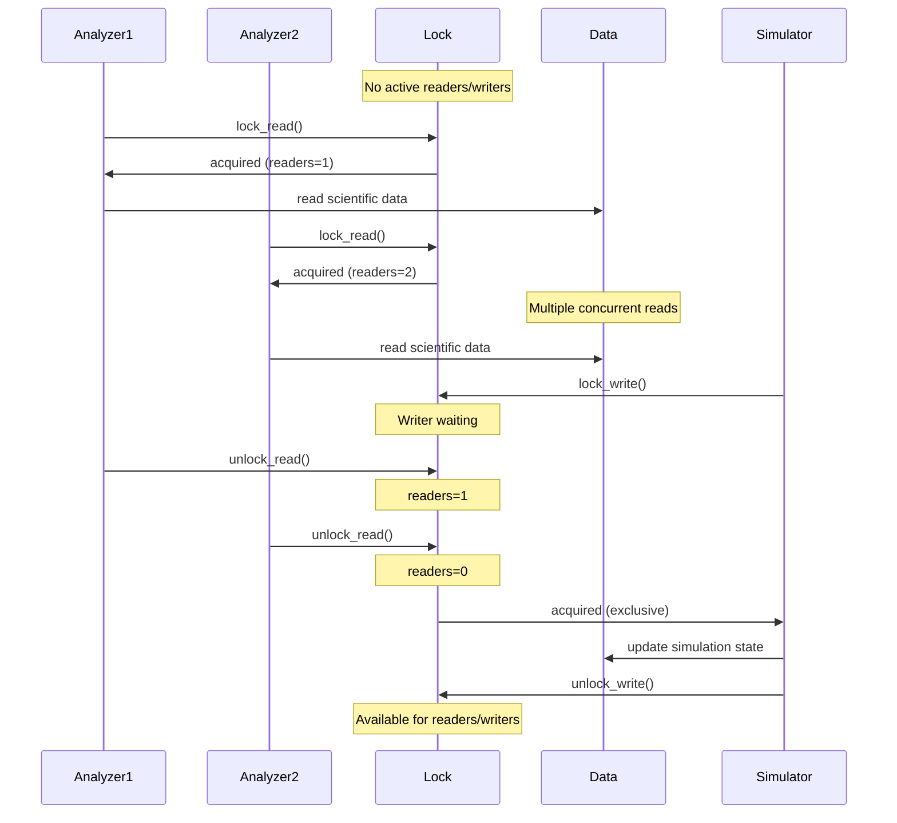

# Read-Write Lock Pattern - Scientific Data Access Synchronization

## Intent
Allow concurrent read access to scientific datasets and computational results while ensuring exclusive access for data updates. This pattern optimizes performance in scientific computing scenarios with many analysis threads reading data and fewer simulation threads updating results.

## Scientific Computing Context
In scientific computing, the Read-Write Lock pattern is essential for:
- **Simulation Results**: Multiple analyzers reading while simulation updates
- **Computational Cache**: Concurrent reads of cached eigenvalues, FFT results
- **Dataset Access**: Many threads analyzing data, few updating
- **State Monitoring**: Real-time monitoring of simulation state
- **Parameter Sharing**: Read-heavy access to simulation parameters

## When to Use in Scientific Computing
- Simulation data is analyzed more frequently than updated
- Multiple analysis threads need concurrent data access
- Performance critical for read-heavy scientific workloads
- Data consistency is required during updates
- Cache hit rates are high in computational pipelines

## Structure

```mermaid
classDiagram
    class ReadWriteLock {
        -readers_active: int
        -writers_waiting: int 
        -writer_active: bool
        -mutex: mutex
        -read_cv: condition_variable
        -write_cv: condition_variable
        +lock_read()
        +unlock_read()
        +lock_write()
        +unlock_write()
    }
    
    class ComputationalResultsCache {
        -cache: map<Key,Value>
        -lock: ReadWriteLock
        -cache_hits: atomic<size_t>
        -cache_misses: atomic<size_t>
        +get(key) Value
        +put(key, value)
        +clear()
        +hit_rate() double
    }
    
    class ScientificDataArray {
        -scientific_data: vector<T>
        -data_mutex: shared_mutex
        -dataset_name: string
        +get(index) T
        +update(index, value)
        +push_back(value)
        +get_all() vector<T>
    }
    
    class SimulationState {
        -state_vector: vector<double>
        -gradients: vector<double>
        -total_energy: double
        -temperature: double
        -iteration: int
        -state_mutex: shared_mutex
        +read_state() vector<double>
        +update_state(new_state, energy)
        +get_energy() double
        +get_gradients() vector<double>
    }
    
    ComputationalResultsCache --> ReadWriteLock : uses
    ScientificDataArray --> "shared_mutex" : uses C++17
    SimulationState --> "shared_mutex" : uses C++17
```

### Synchronization Flow



## Participants

### ReadWriteLock (Basic Implementation)
- Manages scientific data access synchronization
- Allows multiple analysis threads to read concurrently
- Ensures exclusive access for simulation updates
- Writer preference to prevent starvation

### ComputationalResultsCache
- Thread-safe cache for expensive computations
- Multiple threads can check cache simultaneously
- Single thread updates cache with new results
- Tracks hit/miss statistics

### ScientificDataArray (std::shared_mutex)
- Modern C++17 implementation
- Optimized for read-heavy workloads
- Bulk operations for analysis
- Type-safe scientific data storage

### SimulationState
- Concurrent access to simulation parameters
- Multiple monitors reading state
- Exclusive updates from simulator
- Version tracking for convergence analysis

## Implementation Considerations

### Scientific Computing Patterns
1. **Eigenvalue Cache**: Read-heavy access to computed eigenvalues
2. **Simulation State**: Frequent reads, periodic updates
3. **Analysis Pipeline**: Multiple stages reading results
4. **Parameter Sharing**: Configuration read by many threads

### Writer Preference for Consistency
- Simulation updates have priority to maintain data freshness
- Prevents analyzer threads from starving writers
- Ensures timely propagation of state changes

### Performance Optimization
- Significant speedup for analysis workloads
- Reduced contention vs exclusive locking
- Cache-friendly for read operations
- Minimal overhead for reader tracking

### C++17 std::shared_mutex Benefits
- Standard library implementation
- Platform-optimized performance  
- RAII with lock guards
- Timed lock variants available

## Example Usage

```cpp
// Computational results cache for eigenvalues
ComputationalResultsCache<std::pair<int,int>, double> eigen_cache(100);

// Multiple analysis threads reading cached results
for (int i = 0; i < 5; ++i) {
    threads.emplace_back([&eigen_cache]() {
        std::pair<int,int> matrix_key{10, 10};
        double eigenvalue;
        if (eigen_cache.get(matrix_key, eigenvalue)) {
            std::cout << "Cached eigenvalue: " << eigenvalue << "\n";
        }
    });
}

// Computation thread storing results
threads.emplace_back([&eigen_cache]() {
    // Expensive eigenvalue computation
    double result = compute_eigenvalue(matrix);
    eigen_cache.put({10, 10}, result);
});

// Scientific data array with concurrent access
ScientificDataArray<double> waveform("Signal");
for (int i = 0; i < 1000; ++i) {
    waveform.push_back(std::sin(2.0 * M_PI * i / 1000));
}

// Simulation state with version tracking
SimulationState sim_state;
sim_state.update_state(initial_conditions, -523.45);
```

## Example Output
```
=== Scientific Computation Cache Example ===
[EigenSolver-0] Cached eigenvalue for matrix 0x0 -> λ = -7.234e+00
[EigenSolver-1] Cached eigenvalue for matrix 10x10 -> λ = 3.456e+00
[Analyzer-0] Cache hit: matrix 0x0 -> λ = -7.234e+00
[Analyzer-1] Cache miss: matrix 15x15
[Analyzer-2] Cache hit: matrix 10x10 -> λ = 3.456e+00

Eigenvalue Cache Statistics:
Hits: 8, Misses: 16
Hit Rate: 33.3%
Cache Size: 5

=== Simulation State Example ===
[Analyzer-0] Reading simulation state (iteration 0)
[Analyzer-1] Reading simulation state (iteration 0)
[Analyzer-0] State statistics: mean = 0.0234, variance = 0.3421
[Simulator-1] Updating simulation state
[ThermalController-2] Updating temperature
[Analyzer-2] State statistics: mean = 0.0187, variance = 0.2156

Final simulation state:
Energy: -5.152e+02 eV
Temperature: 373.15 K
Iteration: 2
Convergence history: (0, -5.23e+02) (1, -5.15e+02)

=== Performance Comparison: Scientific Data Access ===
Regular Mutex: 523ms
Read-Write Lock: 187ms
Read-Write lock provides better performance for scientific analysis workloads with many readers!
```

## Advantages in Scientific Computing
- **Concurrent Analysis**: Multiple threads analyze data simultaneously
- **Cache Performance**: High hit rates for repeated computations
- **Real-time Monitoring**: Non-blocking reads of simulation state
- **Scalability**: Performance scales with number of CPU cores
- **Data Consistency**: Atomic updates preserve scientific accuracy

## Disadvantages in Scientific Context
- **Update Latency**: Writers may wait for many readers
- **Memory Overhead**: Tracking reader count and state
- **Complexity**: More complex than simple exclusive locking
- **Not GPU-friendly**: Designed for CPU-based parallelism

## Related Patterns in Scientific Computing
- **Monitor Object**: Synchronization for shared resources
- **Producer-Consumer**: Simulation data pipelines
- **Object Pool**: Reusable computational resources
- **Active Object**: Asynchronous scientific computations
- **Double-Checked Locking**: Lazy initialization of expensive resources

## Known Uses in Scientific Computing
- **HDF5**: Parallel file access for scientific data
- **NumPy**: Thread-safe array operations
- **BLAS/LAPACK**: Shared matrix data structures
- **Computational Chemistry**: Molecule databases
- **Climate Models**: Shared atmospheric data grids
- **Bioinformatics**: Genome sequence databases
- **HPC Frameworks**: MPI shared memory windows

## 🔧 Compilation & Usage

### Prerequisites
- **C++ Standard**: C++17 or later (required for std::shared_mutex)
- **Compiler**: GCC 7.0+, Clang 5.0+, MSVC 2017+
- **Threading Support**: Required (pthread on Unix, native on Windows)

### Basic Compilation
```bash
# Linux/macOS
g++ -std=c++17 -pthread -o read_write_lock read_write_lock.cpp

# Windows (MinGW)
g++ -std=c++17 -pthread -o read_write_lock.exe read_write_lock.cpp

# Windows (MSVC)
cl /std:c++17 /EHsc read_write_lock.cpp
```

### CMake Configuration
```cmake
cmake_minimum_required(VERSION 3.12)
project(ReadWriteLock)

set(CMAKE_CXX_STANDARD 17)
set(CMAKE_CXX_STANDARD_REQUIRED ON)

find_package(Threads REQUIRED)

add_executable(read_write_lock read_write_lock.cpp)
target_link_libraries(read_write_lock Threads::Threads)

# Enable warnings
if(MSVC)
    target_compile_options(read_write_lock PRIVATE /W4)
else()
    target_compile_options(read_write_lock PRIVATE -Wall -Wextra -Wpedantic)
endif()
```

## Implementation Notes for Scientific Computing
- **Data Locality**: Keep frequently read data in cache-friendly layouts
- **Batch Operations**: Group reads/writes to amortize lock overhead
- **Lock Granularity**: Consider multiple locks for data partitions
- **NUMA Awareness**: Pin threads to processors near data
- **Profile First**: Verify read-write lock improves your specific workload