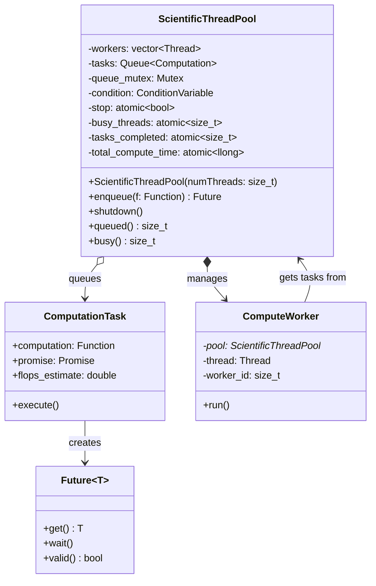
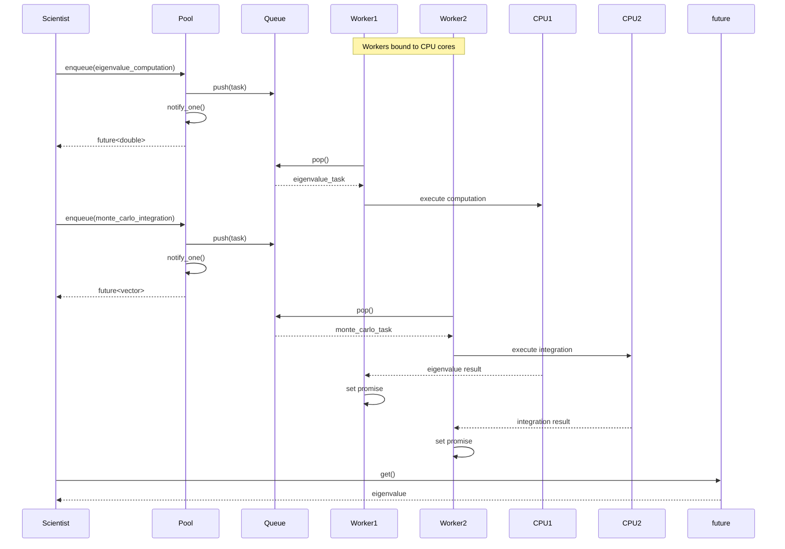
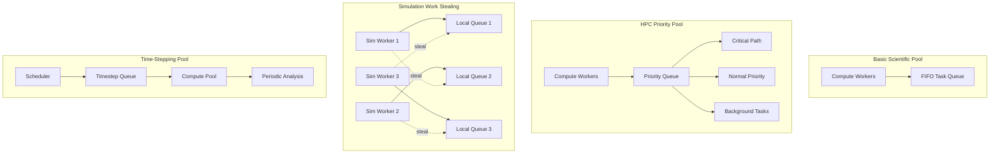

# Thread Pool Pattern - Scientific Computing Parallelization

## Intent
Manage a pool of reusable computation threads to execute scientific tasks asynchronously, enabling efficient parallel processing of numerical simulations, data analysis, and HPC workloads while controlling computational resource usage.

## Scientific Computing Context
In scientific computing, the Thread Pool pattern is essential for:
- **Parallel Simulations**: Running multiple independent simulations concurrently
- **Matrix Operations**: Distributing eigenvalue/eigenvector computations
- **Monte Carlo Methods**: Parallel random sampling for integration
- **Time-Stepping**: Concurrent computation of simulation timesteps
- **HPC Workloads**: Managing CPU-intensive scientific calculations

## When to Use in Scientific Computing
- Multiple independent computations need execution
- Overhead of creating threads per computation is significant
- Need to limit concurrent CPU core usage
- Implementing batch processing for simulations
- Building computational pipelines with priorities

## Structure



### Scientific Computation Workflow



### Thread Pool Variations for Scientific Computing



## Implementation Details

### Key Components
1. **Scientific Thread Pool**: Manages computational workers
2. **Computation Queue**: Stores pending scientific tasks
3. **Compute Workers**: Execute numerical computations
4. **Work Stealing**: Dynamic load balancing for simulations
5. **Priority Scheduling**: Critical path optimization

### Algorithm
```
Compute Worker Thread:
1. Bind to CPU core (optional NUMA optimization)
2. While not stopped:
   - Lock mutex
   - Wait on condition while queue empty
   - Pop computation task from queue
   - Unlock mutex
   - Execute scientific computation
   - Track FLOPS and timing
   - Set promise/future result

Enqueue Computation:
1. Create packaged_task with computation
2. Get future from task
3. Lock mutex
4. Push task to queue with metadata
5. Unlock mutex
6. Notify one worker
7. Return future for result

Work Stealing:
1. Check local queue
2. If empty, try to steal from other workers
3. Execute stolen task
4. Track load balancing statistics
```

## Advantages in Scientific Computing
- **Parallel Speedup**: Near-linear scaling for independent computations
- **Resource Control**: Limits CPU usage to available cores
- **Load Balancing**: Work stealing for uneven computational loads
- **Priority Scheduling**: Critical computations complete first
- **Performance Metrics**: Built-in FLOPS and timing tracking

## Disadvantages in Scientific Context
- **NUMA Effects**: Memory locality issues on large systems
- **GPU Integration**: Not suitable for GPU computations
- **Task Dependencies**: Complex for dependent calculations
- **Memory Bandwidth**: Can be limited by memory access
- **Cache Effects**: False sharing between threads

## Example Output
```
=== Thread Pool Pattern - Scientific Computing Demo ===
Parallel execution of numerical simulations and HPC workloads

Hardware: 8 CPU cores available

=== Parallel Eigenvalue Computation ===
Scientific computation pool initialized with 4 worker threads (8 hardware cores detected)
[ComputeWorker-0] Started on CPU core
[ComputeWorker-1] Started on CPU core
[ComputeWorker-2] Started on CPU core
[ComputeWorker-3] Started on CPU core
[Thread-140485639616256] Computing eigenvalue for 10x10 matrix
[Thread-140485631223552] Computing eigenvalue for 20x20 matrix
[Thread-140485622830848] Computing eigenvalue for 30x30 matrix
[Thread-140485614438144] Computing eigenvalue for 40x40 matrix

Eigenvalues computed:
  Matrix 10x10: λ = -2.3214
  Matrix 20x20: λ = -2.2561
  Matrix 30x30: λ = -2.1893
  Matrix 40x40: λ = -2.1234

Computation statistics:
  Total time: 360ms
  Speedup vs serial: ~3.8x
  Queued computations: 0
  Active threads: 0

=== HPC Priority-Based Computation ===
HPC priority pool initialized with 2 compute workers
[HPCWorker-0] Started for high-performance computing
[HPCWorker-1] Started for high-performance computing
[HPCWorker-0] Executing Critical Monte Carlo (priority: 10, waited: 0ms)
  Critical: Large-scale Monte Carlo result = 3.456e-01 ± 2.34e-03
[HPCWorker-1] Executing Critical Linear Solver (priority: 10, waited: 1ms)
  Critical: Linear solver converged (residual: 1.000000e-10)
[HPCWorker-0] Executing FFT Analysis (priority: 5, waited: 15ms)
  Normal: FFT complete (1024 points)
[HPCWorker-1] Executing Background Statistics (priority: 1, waited: 25ms)
  Background: Statistics complete

HPC Priority Pool Statistics:
  Computations completed: 5
  Average computation time: 68ms
  Total compute time: 340ms

=== Work-Stealing Simulation Pool ===
Work-stealing pool 'Molecular Dynamics' initialized with 3 simulation workers
[SimWorker-0] Started for Molecular Dynamics
[SimWorker-1] Started for Molecular Dynamics
[SimWorker-2] Started for Molecular Dynamics
  [MD] Timestep 0 (complexity: 45) executed by 140485639616256
  [MD] Timestep 3 (complexity: 82) executed by 140485622830848
    -> Heavy computation detected, may trigger work stealing
[SimWorker-1] Stole simulation task from worker 0 (load balancing)
  [MD] Timestep 1 (complexity: 23) executed by 140485631223552

Work-Stealing Pool 'Molecular Dynamics' Statistics:
  Worker 0: 4 simulations, 1.23 GFLOPS
  Worker 1: 5 simulations, 1.56 GFLOPS  
  Worker 2: 3 simulations, 0.98 GFLOPS
  Total: 12 simulations, 3.77 GFLOPS

=== Time-Stepping Scientific Simulation ===
Time-stepping computation pool initialized with 2 compute threads
[TimeStepScheduler] Started for time-dependent computations
  [Wall: 50ms] Computing initial conditions...
    Initial temperature field: 100x100 grid at 293.15K
[TimeStepScheduler] Executing Heat Equation Solver at t=0.010s
  [Wall: 150ms] Solving heat equation at t=0.01s...
    Max temperature change: 0.5K
[TimeStepScheduler] Executing Periodic Analysis at t=0.010s
  [Wall: 100ms] Periodic analysis #1
    Average temperature: 293.25K
    Maximum temperature: 293.65K

=== Key Benefits for Scientific Computing ===
• Parallel execution of independent computations
• Priority scheduling for critical path calculations
• Work stealing for dynamic load balancing
• Time-stepping for numerical simulations
• Efficient utilization of multi-core processors
```

## Common Variations in Scientific Computing
1. **Fixed Computation Pool**: Constant number of worker threads
2. **NUMA-Aware Pool**: Thread-to-core affinity for memory locality
3. **GPU Task Pool**: Hybrid CPU-GPU computation scheduling
4. **MPI Process Pool**: Distributed memory parallelization
5. **Adaptive Pool**: Dynamic worker count based on load

## Related Patterns in Scientific Computing
- **Active Object**: Asynchronous scientific computations
- **Producer-Consumer**: Simulation data pipeline feeding
- **Command**: Encapsulated computational tasks
- **Future**: Asynchronous result retrieval
- **Strategy**: Different numerical algorithms

## 🔧 Compilation & Usage

### Prerequisites
- **C++ Standard**: C++17 or later (for std::invoke_result)
- **Compiler**: GCC 7.0+, Clang 5.0+, MSVC 2017+
- **Threading Support**: Required (pthread on Unix, native on Windows)
- **Key Features**: std::packaged_task, std::future, std::atomic

### Basic Compilation
```bash
# Linux/macOS
g++ -std=c++17 -pthread -o thread_pool thread_pool.cpp

# Windows (MinGW)
g++ -std=c++17 -pthread -o thread_pool.exe thread_pool.cpp

# Windows (MSVC)
cl /std:c++17 /EHsc thread_pool.cpp
```

### HPC Optimization
```bash
# Optimized for scientific computing
g++ -std=c++17 -pthread -O3 -march=native -ffast-math -fopenmp thread_pool.cpp

# With vectorization reports
g++ -std=c++17 -pthread -O3 -march=native -fopt-info-vec-optimized thread_pool.cpp

# NUMA-aware compilation
g++ -std=c++17 -pthread -O3 -DNUMA_AWARE -lnuma thread_pool.cpp
```

### CMake Configuration
```cmake
cmake_minimum_required(VERSION 3.12)
project(ScientificThreadPool)

set(CMAKE_CXX_STANDARD 17)
set(CMAKE_CXX_STANDARD_REQUIRED ON)

find_package(Threads REQUIRED)
find_package(OpenMP)

add_executable(thread_pool thread_pool.cpp)
target_link_libraries(thread_pool Threads::Threads)

if(OpenMP_CXX_FOUND)
    target_link_libraries(thread_pool OpenMP::OpenMP_CXX)
endif()

# HPC optimizations
target_compile_options(thread_pool PRIVATE 
    $<$<CONFIG:Release>:-O3 -march=native -ffast-math>
)
```

## Performance Considerations for Scientific Computing
- **Task Granularity**: Balance computation size vs scheduling overhead
- **NUMA Binding**: Pin threads to specific CPU sockets
- **Cache Optimization**: Align data structures to cache lines
- **Vectorization**: Enable SIMD instructions for numerical kernels
- **Memory Pools**: Pre-allocate computation buffers

## Benchmarking Scientific Workloads
```bash
# Test scaling with different thread counts
for threads in 1 2 4 8 16 32; do
    echo "Testing with $threads threads"
    OMP_NUM_THREADS=$threads ./thread_pool
done

# Profile FLOPS performance
perf stat -e fp_arith_inst_retired.scalar_double,fp_arith_inst_retired.128b_packed_double ./thread_pool

# Memory bandwidth analysis
likwid-perfctr -C 0-7 -g MEM ./thread_pool
```