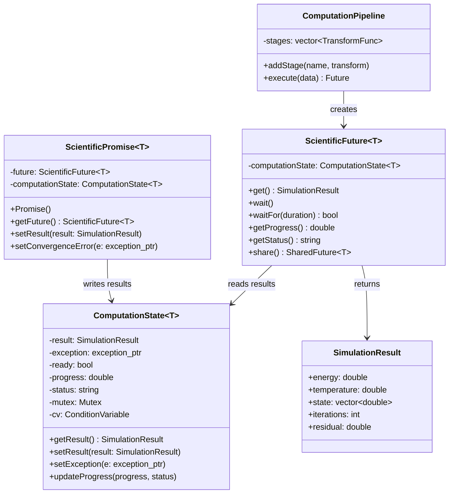
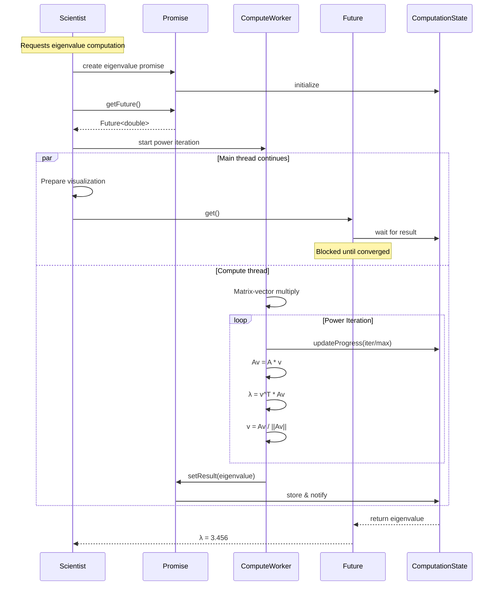

# Future-Promise Pattern - Scientific Asynchronous Computation

## Intent
Provide a mechanism for asynchronous scientific computations where futures represent placeholders for numerical results (eigenvalues, simulation states, integration values) that will be computed later, and promises set these computational results. This pattern is essential for parallel scientific computing workflows.

## Scientific Computing Context
In scientific computing, the Future-Promise pattern enables:
- **Parallel Simulations**: Running multiple independent simulations concurrently
- **Eigenvalue Computations**: Asynchronous matrix analysis with result collection
- **Monte Carlo Methods**: Parallel sampling with aggregated results
- **Numerical Integration**: Distributed computation of integrals
- **HPC Workflows**: Managing dependencies between computational tasks

## When to Use in Scientific Computing
- Parallel execution of independent calculations
- Long-running numerical computations (eigenvalue decomposition, FFTs)
- Monte Carlo simulations requiring aggregation
- Pipeline processing of scientific data
- Managing computational task dependencies

## Structure



### Scientific Computation Flow



## Implementation Details

### Key Scientific Computing Components
1. **Scientific Promise**: Sets computational results or convergence errors
2. **Scientific Future**: Retrieves results with progress tracking
3. **Computation State**: Thread-safe storage for scientific results
4. **std::async**: Launches parallel computations (eigenvalues, Monte Carlo)
5. **Computation Pipeline**: Chains numerical transformations
6. **Computation Queue**: Priority-based scientific task scheduling

### Scientific Computation Algorithm
```
Computation submission:
1. Create promise for result type (eigenvalue, simulation state)
2. Get future from promise
3. Submit to computation pool/worker
4. Track progress (iterations, convergence)
5. Set result or numerical exception

Result collection:
1. Multiple analysis threads hold futures
2. Continue with data preparation
3. Call get() when results needed
4. Block until computation converges
5. Aggregate results (Monte Carlo averaging)

Parallel patterns:
1. Fork-join: Split computation, collect results
2. Pipeline: Chain transformations (FFT → filter → IFFT)
3. Map-reduce: Parallel compute, aggregate results
4. Work stealing: Dynamic load balancing
5. Progress tracking: Monitor long computations
```

## Advantages in Scientific Computing
- **Parallel Speedup**: Near-linear scaling for independent computations
- **Exception Safety**: Numerical errors propagate cleanly (singular matrix, non-convergence)
- **Type Safety**: Scientific result structures (eigenvalues, simulation states)
- **Composition**: Build complex computational pipelines
- **Progress Tracking**: Monitor long-running simulations
- **Resource Management**: Automatic cleanup of computation resources

## Disadvantages in Scientific Context
- **Memory Overhead**: Large result matrices stored until collected
- **No Cancellation**: Can't stop diverging computations
- **Single Result**: Can't stream intermediate results
- **GPU Limitations**: Not directly compatible with GPU async operations
- **NUMA Effects**: Shared state may cross memory boundaries

## Example Output
```
=== Future-Promise Pattern - Scientific Computing Demo ===
Asynchronous computation results for numerical simulations

=== Eigenvalue Computation with Future-Promise ===
[Compute Thread] Starting eigenvalue computation for 100x100 matrix...
[Main Thread] Preparing mesh for visualization...
[Main Thread] Waiting for eigenvalue...
[Compute Thread] Eigenvalue converged
[Main Thread] Dominant eigenvalue: λ = 3.456e+00

=== Monte Carlo Integration with std::async ===
[Thread 0] Starting Monte Carlo sampling...
[Thread 1] Starting Monte Carlo sampling...
[Thread 2] Starting Monte Carlo sampling...
[Thread 3] Starting Monte Carlo sampling...

Monte Carlo Integration Results:
  Integral value: 3.14159e-01
  Total samples: 10000000
  Computation time: 523ms
  Samples/second: 1.91e+07

=== Numerical Solver Exception Handling ===
[Solver] Starting Newton-Raphson iteration...
[Solver] Converged in 7 iterations
[Main] Found root: x = 2.0945514815
[Main] Verification: f(x) = -4.44e-16

=== Shared Simulation Parameters Example ===
[Energy Analyzer] Waiting for parameters...
[Stability Analyzer] Waiting for parameters...
[Performance Estimator] Waiting for parameters...
[Main] Loading simulation parameters...
[Energy Analyzer] Kinetic energy: 3.71e+03 J
[Stability Analyzer] Max stable timestep: 0.005s (current: 0.001s)
[Performance Estimator] FLOPS per timestep: 2.00e+07

=== Scientific Computation Pipeline ===
[Pipeline] Executing stage: FFT Transform (input size: 1024)
[Pipeline] Stage completed in 15ms
[Pipeline] Executing stage: Frequency Filter (input size: 1024)
[Pipeline] Stage completed in 8ms
[Pipeline] Executing stage: Inverse FFT (input size: 1024)
[Pipeline] Stage completed in 14ms
Pipeline result size: 1024

=== Priority-based Scientific Queue ===
[ComputationQueue] Started with 4 workers
[Worker 0] Starting computation: Critical Path Eigenvalue
[Worker 1] Starting computation: Monte Carlo Integration
[Worker 0] Completed Critical Path Eigenvalue in 125ms
[Worker 2] Starting computation: Background Statistics
[Worker 1] Completed Monte Carlo Integration in 256ms
[ComputationQueue] Completed 3 computations
```

## Common Variations in Scientific Computing
1. **Parallel Eigensolvers**: Multiple futures for different eigenvalues
2. **Monte Carlo Aggregation**: Combining results from parallel samples
3. **Simulation Pipelines**: Chained futures for multi-stage computations
4. **Progress Futures**: Extended futures with computation progress
5. **GPU Futures**: Integration with CUDA/OpenCL async operations
6. **MPI Futures**: Distributed memory parallel computations

## Related Patterns in Scientific Computing
- **Thread Pool**: Manages computation workers returning futures
- **Active Object**: Asynchronous scientific method execution
- **Producer-Consumer**: Streaming computation results
- **Repository**: Caching computed futures
- **Command**: Encapsulated scientific computations

## 🔧 Compilation & Usage

### Prerequisites
- **C++ Standard**: C++11 or later (C++14+ recommended for enhanced async features)
- **Compiler**: GCC 5.0+, Clang 3.8+, MSVC 2017+
- **Threading Support**: Required (pthread on Unix, native on Windows)
- **Key Features**: std::future, std::promise, std::async, std::packaged_task

### Basic Compilation

#### Linux/macOS
```bash
# Basic compilation with threading and future support
g++ -std=c++14 -pthread -o future_promise future_promise.cpp

# Alternative with Clang
clang++ -std=c++14 -pthread -o future_promise future_promise.cpp

# Explicit linking (if needed)
g++ -std=c++14 -lpthread -o future_promise future_promise.cpp
```

#### Windows (MinGW)
```batch
g++ -std=c++14 -pthread -o future_promise.exe future_promise.cpp
```

#### Windows (MSVC)
```batch
cl /EHsc /std:c++14 future_promise.cpp
```

### Advanced Compilation Options

#### Debug Build with Thread Debugging
```bash
g++ -std=c++14 -pthread -g -O0 -DDEBUG -fsanitize=thread -fno-omit-frame-pointer -o future_promise_debug future_promise.cpp
```

#### Optimized Release Build
```bash
g++ -std=c++14 -pthread -O3 -DNDEBUG -DTHREAD_SAFE -march=native -flto -o future_promise_release future_promise.cpp
```

#### Enhanced Warnings for Future/Promise
```bash
g++ -std=c++14 -pthread -Wall -Wextra -Wpedantic -Wthread-safety -Wconcurrency -Wexceptions -o future_promise future_promise.cpp
```

#### Sanitizer Builds (Essential for Future/Promise)
```bash
# Thread sanitizer (CRITICAL for async operations)
g++ -std=c++14 -pthread -fsanitize=thread -g -O1 -fno-omit-frame-pointer -o future_promise_tsan future_promise.cpp

# Address sanitizer for memory issues
g++ -std=c++14 -pthread -fsanitize=address -g -o future_promise_asan future_promise.cpp

# Undefined behavior sanitizer
g++ -std=c++14 -pthread -fsanitize=undefined -g -o future_promise_ubsan future_promise.cpp

# Memory sanitizer (Clang only - for uninitialized memory)
clang++ -std=c++14 -pthread -fsanitize=memory -g -O1 -o future_promise_msan future_promise.cpp
```

### CMake Instructions

Create `CMakeLists.txt`:
```cmake
cmake_minimum_required(VERSION 3.12)
project(FuturePromisePattern)

# Set C++ standard (C++14 for enhanced future/promise features)
set(CMAKE_CXX_STANDARD 14)
set(CMAKE_CXX_STANDARD_REQUIRED ON)

# Find threads package (required)
find_package(Threads REQUIRED)

# Create executable
add_executable(future_promise future_promise.cpp)

# Link threading library (essential)
target_link_libraries(future_promise Threads::Threads)

# Check for future/promise features
include(CheckCXXSymbolExists)
check_cxx_symbol_exists("std::async" "future" HAS_STD_ASYNC)
check_cxx_symbol_exists("std::packaged_task" "future" HAS_PACKAGED_TASK)

if(HAS_STD_ASYNC)
    target_compile_definitions(future_promise PRIVATE HAS_STD_ASYNC)
endif()

if(HAS_PACKAGED_TASK)
    target_compile_definitions(future_promise PRIVATE HAS_PACKAGED_TASK)
endif()

# Compiler-specific options
if(MSVC)
    target_compile_options(future_promise PRIVATE /W4)
    # Enable parallel compilation
    target_compile_options(future_promise PRIVATE /MP)
    # Better async/exception diagnostics
    target_compile_options(future_promise PRIVATE /diagnostics:caret)
    # Enable exception handling
    target_compile_options(future_promise PRIVATE /EHsc)
else()
    target_compile_options(future_promise PRIVATE 
        -Wall -Wextra -Wpedantic -pthread)
    # Enhanced async error reporting
    target_compile_options(future_promise PRIVATE -ftemplate-backtrace-limit=0)
    # Thread-safety warnings
    if(CMAKE_CXX_COMPILER_ID STREQUAL "GNU" AND CMAKE_CXX_COMPILER_VERSION VERSION_GREATER_EQUAL 10)
        target_compile_options(future_promise PRIVATE -Wthread-safety)
    endif()
    if(CMAKE_CXX_COMPILER_ID STREQUAL "Clang" AND CMAKE_CXX_COMPILER_VERSION VERSION_GREATER_EQUAL 12)
        target_compile_options(future_promise PRIVATE -Wthread-safety)
    endif()
    # Exception handling warnings
    target_compile_options(future_promise PRIVATE -Wexceptions)
endif()

# Debug configuration with thread sanitizer
if(CMAKE_BUILD_TYPE STREQUAL "Debug")
    if(NOT MSVC)
        target_compile_options(future_promise PRIVATE -fsanitize=thread -fno-omit-frame-pointer)
        target_link_options(future_promise PRIVATE -fsanitize=thread)
    endif()
endif()

# Custom target for different sanitizer builds
add_custom_target(sanitize_all)

# Thread sanitizer build (essential for futures)
add_executable(future_promise_tsan future_promise.cpp)
target_link_libraries(future_promise_tsan Threads::Threads)
if(HAS_STD_ASYNC)
    target_compile_definitions(future_promise_tsan PRIVATE HAS_STD_ASYNC)
endif()
if(HAS_PACKAGED_TASK)
    target_compile_definitions(future_promise_tsan PRIVATE HAS_PACKAGED_TASK)
endif()
if(NOT MSVC)
    target_compile_options(future_promise_tsan PRIVATE -fsanitize=thread -g -O1 -fno-omit-frame-pointer)
    target_link_options(future_promise_tsan PRIVATE -fsanitize=thread)
endif()
add_dependencies(sanitize_all future_promise_tsan)

# Address sanitizer build
add_executable(future_promise_asan future_promise.cpp)
target_link_libraries(future_promise_asan Threads::Threads)
if(HAS_STD_ASYNC)
    target_compile_definitions(future_promise_asan PRIVATE HAS_STD_ASYNC)
endif()
if(HAS_PACKAGED_TASK)
    target_compile_definitions(future_promise_asan PRIVATE HAS_PACKAGED_TASK)
endif()
if(NOT MSVC)
    target_compile_options(future_promise_asan PRIVATE -fsanitize=address -g)
    target_link_options(future_promise_asan PRIVATE -fsanitize=address)
endif()
add_dependencies(sanitize_all future_promise_asan)

# Performance benchmark build
add_executable(future_promise_perf future_promise.cpp)
target_link_libraries(future_promise_perf Threads::Threads)
if(HAS_STD_ASYNC)
    target_compile_definitions(future_promise_perf PRIVATE HAS_STD_ASYNC)
endif()
if(HAS_PACKAGED_TASK)
    target_compile_definitions(future_promise_perf PRIVATE HAS_PACKAGED_TASK)
endif()
target_compile_options(future_promise_perf PRIVATE -O3 -DNDEBUG -march=native)
if(NOT MSVC)
    target_compile_options(future_promise_perf PRIVATE -flto)
    target_link_options(future_promise_perf PRIVATE -flto)
endif()
```

Build with CMake:
```bash
mkdir build && cd build
cmake -DCMAKE_BUILD_TYPE=Release ..
make -j$(nproc)  # parallel build

# Debug build with sanitizers
cmake -DCMAKE_BUILD_TYPE=Debug ..
make future_promise_tsan  # thread sanitizer version
make sanitize_all        # all sanitizer versions
```

### IDE Integration

#### Visual Studio Code
Create `.vscode/tasks.json`:
```json
{
    "version": "2.0.0",
    "tasks": [
        {
            "label": "build-future-promise",
            "type": "shell",
            "command": "g++",
            "args": [
                "-std=c++14",
                "-pthread",
                "-g",
                "-Wall",
                "-Wextra",
                "-Wthread-safety",
                "-Wexceptions",
                "${file}",
                "-o",
                "${fileDirname}/${fileBasenameNoExtension}"
            ],
            "group": {
                "kind": "build",
                "isDefault": true
            }
        },
        {
            "label": "build-future-promise-tsan",
            "type": "shell",
            "command": "g++",
            "args": [
                "-std=c++14",
                "-pthread",
                "-fsanitize=thread",
                "-g",
                "-O1",
                "-fno-omit-frame-pointer",
                "${file}",
                "-o",
                "${fileDirname}/${fileBasenameNoExtension}_tsan"
            ],
            "group": "build"
        },
        {
            "label": "build-future-promise-async",
            "type": "shell",
            "command": "g++",
            "args": [
                "-std=c++14",
                "-pthread",
                "-g",
                "-DTEST_ASYNC_FEATURES",
                "-Wall",
                "-Wextra",
                "${file}",
                "-o",
                "${fileDirname}/${fileBasenameNoExtension}_async"
            ],
            "group": "build"
        }
    ]
}
```

#### Visual Studio
1. Create new Console Application project
2. Project Properties → C/C++ → Language → C++ Language Standard: C++14
3. Project Properties → C/C++ → Code Generation → Enable Parallel Code Generation: Yes
4. Project Properties → C/C++ → Code Generation → Enable C++ Exceptions: Yes
5. Project Properties → C/C++ → Advanced → Show Includes: Yes (for debugging)
6. Copy the code to main source file
7. Build with Ctrl+F7

#### CLion
1. Open project directory
2. Ensure CMakeLists.txt is properly configured
3. Set Build Type to Debug or Release
4. Enable Exception Handling in Settings
5. Build with Ctrl+F9

### Dependencies
- **Standard Library**: 
  - `<iostream>`, `<future>`, `<thread>`, `<chrono>`
  - `<vector>`, `<numeric>`, `<exception>`, `<functional>`
  - `<memory>`, `<queue>`, `<random>` (for advanced examples)
- **Threading Library**: pthread (Unix), Windows threading (Windows)
- **No external dependencies required**

### Threading-Specific Considerations

#### Future/Promise Requirements
- **Async Operations**: std::async for automatic thread management
- **Exception Propagation**: Proper exception handling across threads
- **Shared State**: Thread-safe synchronization between promise and future
- **Memory Management**: RAII for proper cleanup
- **Timeout Support**: wait_for and wait_until functionality

#### C++11 vs C++14 Features
```bash
# Check for std::async support
echo '#include <future>
int main() { 
    auto f = std::async(std::launch::async, [](){return 42;}); 
    return f.get(); 
}' | g++ -std=c++11 -pthread -x c++ -

# Test shared_future support
echo '#include <future>
int main() { 
    std::promise<int> p; 
    std::shared_future<int> sf = p.get_future().share(); 
    return 0; 
}' | g++ -std=c++11 -pthread -x c++ -
```

#### Runtime Requirements
```bash
# Check async execution support (Linux)
ulimit -u                    # user processes
cat /proc/sys/kernel/threads-max  # system threads

# Set appropriate limits for async operations
ulimit -u 32768              # increase process limit

# Check exception handling support
echo '#include <stdexcept>
int main() { 
    try { throw std::runtime_error("test"); } 
    catch(...) { return 0; } 
}' | g++ -std=c++14 -x c++ -
```

#### Performance Tuning
```bash
# Compile with async optimizations
g++ -std=c++14 -pthread -O3 -march=native -flto -DNDEBUG future_promise.cpp

# Profile async performance
perf record -g -e cpu-cycles,cache-references,context-switches ./future_promise
perf report

# Memory usage for futures
valgrind --tool=massif --time-unit=ms ./future_promise
ms_print massif.out.*

# Exception handling overhead measurement
perf record -g -e exceptions:* ./future_promise
perf report
```

### Platform-Specific Notes

#### Linux
- Install build tools: `sudo apt-get install build-essential`
- Thread debugging: `sudo apt-get install gdb valgrind`
- Async debugging: `sudo apt-get install strace ltrace`
- Exception debugging: `sudo apt-get install libdw-dev`

#### macOS
- Install Xcode command line tools: `xcode-select --install`
- Thread debugging with Instruments (Xcode)
- Activity Monitor for async operations
- Use `lldb` for exception debugging

#### Windows
- **Visual Studio**: Full C++14 future/promise support built-in
- **MinGW-w64**: Ensure pthread and exception handling support
- Use Windows Performance Toolkit for profiling
- Application Verifier for async debugging

### Troubleshooting

#### Common Issues
1. **Future exceptions not caught**: Ensure proper exception handling
2. **Deadlocks with futures**: Avoid circular dependencies
3. **Memory leaks in shared_future**: Use proper RAII
4. **Async launch policy issues**: Specify launch policy explicitly
5. **Performance bottlenecks**: Profile async overhead

#### Future/Promise Specific Debugging
```bash
# Run with thread sanitizer (critical for async code)
export TSAN_OPTIONS="detect_thread_leaks=true:halt_on_error=1:async_stack_trace_size=16"
./future_promise_tsan

# Debug exception propagation
g++ -std=c++14 -pthread -g -DDEBUG_EXCEPTIONS -fno-omit-frame-pointer future_promise.cpp

# Memory usage tracking for futures
valgrind --leak-check=full --show-leak-kinds=all --track-origins=yes ./future_promise

# Debug with GDB (future/promise specific)
gdb ./future_promise
(gdb) set print thread-events on
(gdb) catch throw
(gdb) catch catch
(gdb) info threads
(gdb) thread apply all bt
(gdb) break future_promise.cpp:100  # Break at promise.set_value()

# Advanced async debugging
strace -f -e trace=clone,futex,exit_group ./future_promise
```

#### Exception Handling Issues
```bash
# Test exception propagation
g++ -std=c++14 -pthread -g -DTEST_EXCEPTIONS future_promise.cpp
./future_promise

# Debug unhandled exceptions
export GLIBCXX_FORCE_NEW=1
export MALLOC_CHECK_=2
./future_promise

# Valgrind exception tracking
valgrind --track-origins=yes --show-leak-kinds=all ./future_promise
```

#### Advanced Debugging Techniques
```bash
# Helgrind for async race conditions
valgrind --tool=helgrind --track-lockorders=yes --history-level=full ./future_promise

# DRD for detailed async analysis
valgrind --tool=drd --check-stack-var=yes --trace-barrier=yes ./future_promise

# Intel Inspector for async analysis (if available)
inspxe-cl -collect ti3 -knob enable-async-support=true -- ./future_promise

# Exception flow tracing
perf record -g -e exceptions:* ./future_promise
perf report

# Async operation latency measurement
perf record -g -e sched:sched_switch,sched:sched_wakeup ./future_promise
perf report
```

#### Performance Optimization for Scientific Computing
- **Computation Granularity**: Balance task size vs scheduling overhead
- **NUMA Awareness**: Pin computation threads to specific sockets
- **Result Caching**: Reuse computed eigenvalues and simulation states
- **Batch Processing**: Group small computations to reduce overhead
- **Progress Tracking**: Add lightweight progress updates for monitoring
- **Memory Pools**: Pre-allocate result structures for matrices

### Testing Strategy
```bash
# Basic async functionality testing
ASYNC_TEST=basic ./future_promise

# Exception propagation testing
ASYNC_TEST=exceptions ./future_promise

# Shared future testing
ASYNC_TEST=shared ./future_promise

# Performance benchmarking
ASYNC_TEST=performance THREAD_COUNT=8 TASK_COUNT=10000 ./future_promise

# Stress testing with many futures
for futures in 10 100 1000 10000; do
    echo "Testing with $futures futures"
    FUTURE_COUNT=$futures timeout 60s ./future_promise
done

# Memory pressure testing
stress-ng --vm 2 --vm-bytes 512M --timeout 180s &
./future_promise &
wait

# Long-running stability test
timeout 3600s ./future_promise  # Run for 1 hour

# Exception handling stress test
EXCEPTION_RATE=0.1 TASK_COUNT=10000 ./future_promise
```

### Benchmarking
```bash
# Compare sync vs async performance
echo "Synchronous execution:"
EXECUTION_MODE=sync time ./future_promise

echo "Asynchronous execution:"
EXECUTION_MODE=async time ./future_promise

# Future creation overhead
echo "Future creation benchmark:"
BENCHMARK_MODE=future_creation ./future_promise

# Exception handling overhead
echo "Exception handling benchmark:"
BENCHMARK_MODE=exceptions ./future_promise

# Shared future performance
echo "Shared future benchmark:"
BENCHMARK_MODE=shared_future ./future_promise

# Latency measurement
for concurrency in 1 2 4 8 16; do
    echo "Concurrency: $concurrency"
    CONCURRENCY_LEVEL=$concurrency time ./future_promise
done
```

### Advanced Features Testing
```bash
# Test std::async launch policies
ASYNC_POLICY=deferred ./future_promise
ASYNC_POLICY=async ./future_promise

# Test timeout functionality
TIMEOUT_TEST=true ./future_promise

# Test future chaining (if implemented)
CHAIN_TEST=true ./future_promise

# Test when_all/when_any combinators (if implemented)
COMBINATOR_TEST=true ./future_promise
```