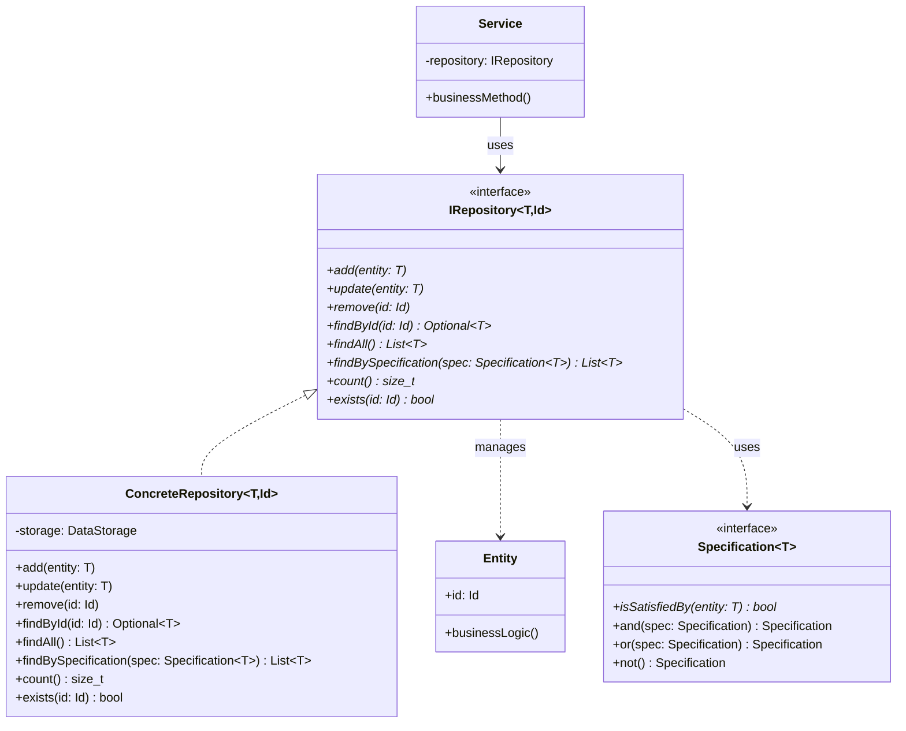
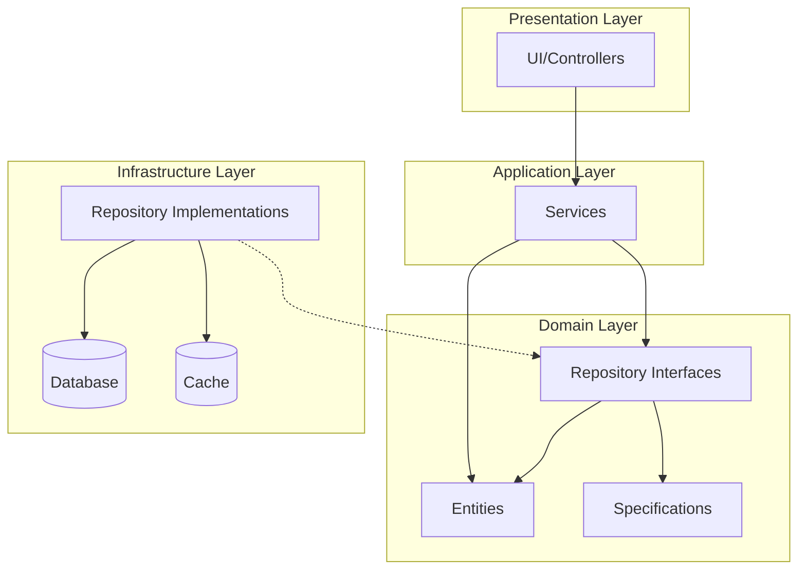
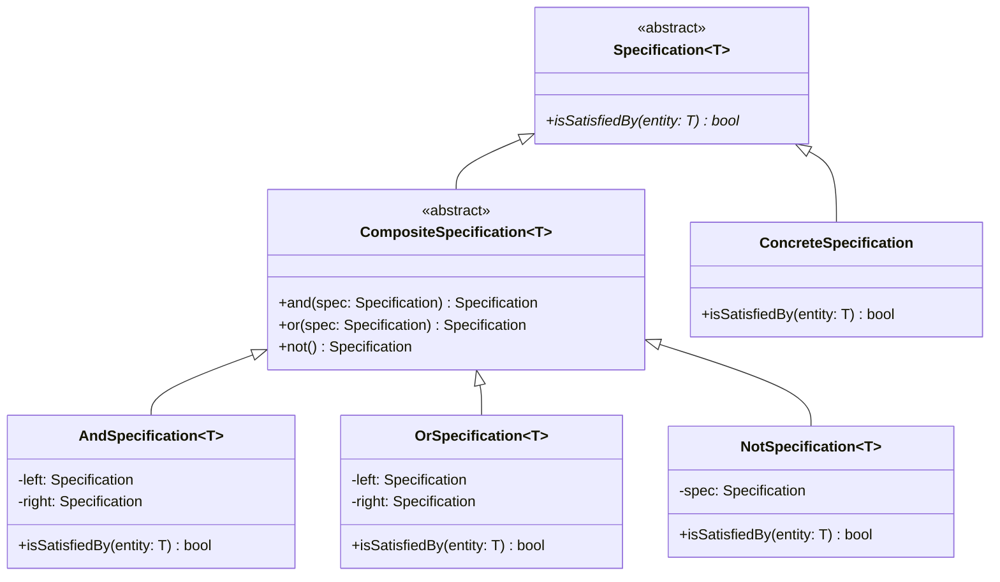

# Repository Pattern

## Intent
Encapsulate the logic needed to access data sources, creating a uniform interface for accessing data regardless of the data source implementation.

## When to Use
- Want to isolate domain objects from data access logic
- Need to centralize query logic
- Supporting multiple data sources
- Want to unit test business logic without database
- Implementing Domain-Driven Design

## Structure



### Repository Layer Architecture



### Specification Pattern Integration



## Implementation Details

### Key Components
1. **Repository Interface**: Defines data access methods
2. **Concrete Repository**: Implements interface for specific storage
3. **Entity**: Domain objects managed by repository
4. **Specification**: Encapsulates query criteria
5. **Service Layer**: Uses repositories for business logic

### Algorithm
```
Repository Operations:
1. Add: Insert new entity into storage
2. Update: Modify existing entity
3. Remove: Delete entity by ID
4. FindById: Retrieve single entity
5. FindAll: Retrieve all entities
6. FindBySpecification: Query with criteria

Specification Usage:
1. Create specific criteria
2. Combine with and/or/not
3. Pass to repository
4. Repository filters entities
5. Return matching results
```

## Advantages
- Separates business logic from data access
- Enables unit testing with mock repositories
- Centralizes query logic
- Supports multiple data sources
- Promotes Domain-Driven Design

## Disadvantages
- Additional abstraction layer
- Can lead to anemic domain model
- Complex queries may be difficult
- Potential for leaky abstractions
- May duplicate ORM functionality

## Example Output
```
=== Repository Pattern Demo ===

=== Basic Repository Usage ===
Added: User{id=1, username='alice', email='alice@example.com', active=true, created=2024-01-20 10:30:45}
Added: User{id=2, username='bob', email='bob@example.com', active=true, created=2024-01-20 10:30:45}
Added: User{id=3, username='charlie', email='charlie@test.com', active=true, created=2024-01-20 10:30:45}

Total users: 3

=== Find by ID ===
Found: User{id=2, username='bob', email='bob@example.com', active=true, created=2024-01-20 10:30:45}

=== Find by Username ===
Found: User{id=1, username='alice', email='alice@example.com', active=true, created=2024-01-20 10:30:45}

=== Update User ===
Updated: User{id=1, username='alice', email='alice@newdomain.com', active=true, created=2024-01-20 10:30:45}

=== Specification Pattern ===
Active users: 3
Users from example.com: 1

=== Service Layer ===
Added: User{id=4, username='david', email='david@example.com', active=true, created=2024-01-20 10:30:45}
Registration failed: Username already exists
Updated: User{id=1, username='alice', email='alice@newdomain.com', active=false, created=2024-01-20 10:30:45}

Active users from example.com:
  User{id=2, username='bob', email='bob@example.com', active=true, created=2024-01-20 10:30:45}
  User{id=4, username='david', email='david@example.com', active=true, created=2024-01-20 10:30:45}

=== Cached Repository ===
Cache miss for id: 1
Cache hit for id: 1
Cache miss for findAll
Returning cached all results
```

## Common Variations
1. **Generic Repository**: Base class for all repositories
2. **Async Repository**: Async methods returning futures
3. **Read/Write Separation**: Different interfaces for queries/commands
4. **Unit of Work Integration**: Coordinate multiple repositories
5. **Event Sourcing Repository**: Store events instead of state

## Related Patterns
- **Unit of Work**: Manages transactions across repositories
- **Data Mapper**: Similar but focuses on mapping
- **DAO**: Data Access Object, similar concept
- **Specification**: Query criteria objects
- **Factory**: Create entities from data

## 🔧 Compilation & Usage

### Prerequisites
- **C++ Standard**: C++17 or later (requires std::optional, structured bindings)
- **Compiler**: GCC 7.0+, Clang 4.0+, MSVC 2017+
- **Key Features**: Templates, std::optional, std::unordered_map, std::chrono, std::any
- **Dependencies**: Standard library only

### Basic Compilation

#### Linux/macOS
```bash
# Basic compilation with C++17 support
g++ -std=c++17 -Wall -Wextra -O2 -o repository repository.cpp

# Alternative with Clang
clang++ -std=c++17 -Wall -Wextra -O2 -o repository repository.cpp

# Debug build with additional warnings
g++ -std=c++17 -Wall -Wextra -Wpedantic -g -O0 -DDEBUG -o repository_debug repository.cpp
```

#### Windows (MinGW)
```batch
g++ -std=c++17 -Wall -Wextra -O2 -o repository.exe repository.cpp
```

#### Windows (MSVC)
```batch
cl /EHsc /std:c++17 /W4 repository.cpp
```

### Advanced Compilation Options

#### Optimized Release Build
```bash
g++ -std=c++17 -O3 -DNDEBUG -march=native -flto -o repository_release repository.cpp
```

#### Template Instantiation Analysis
```bash
# Enhanced template debugging
g++ -std=c++17 -Wall -Wextra -ftemplate-backtrace-limit=0 -o repository repository.cpp

# Template instantiation profiling
g++ -std=c++17 -ftime-report -fmem-report -o repository repository.cpp
```

#### Memory and Performance Analysis
```bash
# Address sanitizer for memory errors
g++ -std=c++17 -fsanitize=address -g -o repository_asan repository.cpp

# Undefined behavior sanitizer
g++ -std=c++17 -fsanitize=undefined -g -o repository_ubsan repository.cpp

# Memory profiling with Valgrind
g++ -std=c++17 -g -O1 -o repository_profile repository.cpp
valgrind --tool=memcheck --leak-check=full ./repository_profile

# Performance profiling
g++ -std=c++17 -g -pg -O2 -o repository_prof repository.cpp
gprof ./repository_prof gmon.out > profile_report.txt
```

### CMake Instructions

Create `CMakeLists.txt`:
```cmake
cmake_minimum_required(VERSION 3.10)
project(RepositoryPattern)

# Set C++17 standard (required for std::optional)
set(CMAKE_CXX_STANDARD 17)
set(CMAKE_CXX_STANDARD_REQUIRED ON)

# Create executable
add_executable(repository repository.cpp)

# Compiler-specific options
if(MSVC)
    target_compile_options(repository PRIVATE /W4 /permissive-)
    # Enable better template diagnostics
    target_compile_options(repository PRIVATE /diagnostics:caret)
    # Optimize for speed
    target_compile_options(repository PRIVATE /O2)
else()
    target_compile_options(repository PRIVATE 
        -Wall -Wextra -Wpedantic 
        -Wno-unused-parameter
        -ftemplate-backtrace-limit=0)
    
    # GCC-specific warnings for templates
    if(CMAKE_CXX_COMPILER_ID STREQUAL "GNU")
        target_compile_options(repository PRIVATE 
            -Weffc++ -Wold-style-cast -Woverloaded-virtual)
    endif()
    
    # Clang-specific warnings
    if(CMAKE_CXX_COMPILER_ID STREQUAL "Clang")
        target_compile_options(repository PRIVATE 
            -Wmost -Wextra-semi -Wimplicit-fallthrough)
    endif()
endif()

# Debug configuration
if(CMAKE_BUILD_TYPE STREQUAL "Debug")
    target_compile_definitions(repository PRIVATE DEBUG)
    if(NOT MSVC)
        target_compile_options(repository PRIVATE -fsanitize=address -fno-omit-frame-pointer)
        target_link_options(repository PRIVATE -fsanitize=address)
    endif()
endif()

# Performance build
if(CMAKE_BUILD_TYPE STREQUAL "Release")
    target_compile_definitions(repository PRIVATE NDEBUG)
    if(NOT MSVC)
        target_compile_options(repository PRIVATE -march=native -flto)
        target_link_options(repository PRIVATE -flto)
    endif()
endif()

# Custom sanitizer builds
add_executable(repository_asan repository.cpp)
target_compile_options(repository_asan PRIVATE -fsanitize=address -g)
target_link_options(repository_asan PRIVATE -fsanitize=address)

add_executable(repository_ubsan repository.cpp)
target_compile_options(repository_ubsan PRIVATE -fsanitize=undefined -g)
target_link_options(repository_ubsan PRIVATE -fsanitize=undefined)

# Template instantiation analysis build
add_executable(repository_template_debug repository.cpp)
target_compile_options(repository_template_debug PRIVATE 
    -ftemplate-backtrace-limit=0 -ftime-report -fmem-report)
```

Build with CMake:
```bash
mkdir build && cd build
cmake -DCMAKE_BUILD_TYPE=Release ..
make -j$(nproc)

# Debug build with sanitizers
cmake -DCMAKE_BUILD_TYPE=Debug ..
make repository_asan repository_ubsan
```

### IDE Integration

#### Visual Studio Code
Create `.vscode/tasks.json`:
```json
{
    "version": "2.0.0",
    "tasks": [
        {
            "label": "build-repository",
            "type": "shell",
            "command": "g++",
            "args": [
                "-std=c++17",
                "-Wall",
                "-Wextra",
                "-Wpedantic",
                "-ftemplate-backtrace-limit=0",
                "-g",
                "${file}",
                "-o",
                "${fileDirname}/${fileBasenameNoExtension}"
            ],
            "group": {
                "kind": "build",
                "isDefault": true
            }
        },
        {
            "label": "build-repository-optimized",
            "type": "shell",
            "command": "g++",
            "args": [
                "-std=c++17",
                "-O3",
                "-DNDEBUG",
                "-march=native",
                "-flto",
                "${file}",
                "-o",
                "${fileDirname}/${fileBasenameNoExtension}_opt"
            ],
            "group": "build"
        }
    ]
}
```

#### Visual Studio
1. Create new Console Application project
2. Project Properties → C/C++ → Language → C++ Language Standard: C++17
3. Project Properties → C/C++ → General → Warning Level: Level4 (/W4)
4. For template debugging: C/C++ → Command Line → Additional Options: `/diagnostics:caret`
5. Copy the code to main source file
6. Build with Ctrl+F7

#### CLion
1. Open project directory
2. Ensure CMakeLists.txt is properly configured
3. Set Build Type to Debug or Release
4. Build with Ctrl+F9

### Dependencies and Headers
- **Standard Library**: 
  - `<iostream>`, `<memory>`, `<vector>`, `<unordered_map>`
  - `<optional>`, `<algorithm>`, `<functional>`, `<sstream>`
  - `<chrono>`, `<iomanip>`, `<string>`
- **C++17 Features**: std::optional, structured bindings (auto [id, user])
- **No external dependencies required**

### Feature-Specific Requirements

#### C++17 Features Used
```bash
# Check for std::optional support
echo '#include <optional>
int main() { 
    std::optional<int> opt = 42; 
    return opt.has_value() ? 0 : 1; 
}' | g++ -std=c++17 -x c++ -

# Test structured bindings support
echo '#include <utility>
int main() { 
    auto [a, b] = std::make_pair(1, 2); 
    return a + b - 3; 
}' | g++ -std=c++17 -x c++ -
```

#### Template Compilation
```bash
# Test template instantiation
g++ -std=c++17 -c -ftemplate-backtrace-limit=0 repository.cpp

# Generate template instantiation report
g++ -std=c++17 -ftime-report repository.cpp 2>&1 | grep -A 20 "time report"
```

### Platform-Specific Notes

#### Linux
- Install build tools: `sudo apt-get install build-essential`
- For time profiling: `sudo apt-get install gprof`
- For memory analysis: `sudo apt-get install valgrind`

#### macOS  
- Install Xcode command line tools: `xcode-select --install`
- Use Homebrew for additional tools: `brew install valgrind` (when available)
- Activity Monitor for memory monitoring

#### Windows
- **Visual Studio**: Full C++17 support built-in
- **MinGW-w64**: Ensure recent version (GCC 7.0+)
- Use Performance Toolkit for profiling

### Troubleshooting

#### Common Issues
1. **std::optional not found**: Ensure C++17 is enabled
2. **Template compilation errors**: Use `-ftemplate-backtrace-limit=0`
3. **Structured binding errors**: Check compiler C++17 support
4. **Performance issues**: Enable optimizations with `-O2` or `-O3`

#### Compiler-Specific Fixes
```bash
# GCC: Enable all C++17 features
g++ -std=c++17 -fconcepts repository.cpp

# Clang: Enhanced diagnostics
clang++ -std=c++17 -Weverything -Wno-c++98-compat repository.cpp

# MSVC: Permissive mode off for strict compliance
cl /std:c++17 /permissive- repository.cpp
```

#### Template Debugging
```bash
# Debug template instantiation issues
g++ -std=c++17 -ftemplate-backtrace-limit=50 -fdiagnostics-show-template-tree repository.cpp

# Show template instantiation context
g++ -std=c++17 -fdiagnostics-show-template-tree -fno-elide-type repository.cpp
```

### Performance Optimization

#### Compilation Flags
```bash
# Maximum optimization for production
g++ -std=c++17 -O3 -DNDEBUG -march=native -mtune=native -flto -ffast-math repository.cpp

# Profile-guided optimization (two-step process)
g++ -std=c++17 -O2 -fprofile-generate repository.cpp -o repository_prof
./repository_prof  # Generate profile data
g++ -std=c++17 -O3 -fprofile-use repository.cpp -o repository_optimized
```

#### Memory Layout Optimization
```bash
# Optimize for cache performance
g++ -std=c++17 -O3 -march=native -fdata-sections -ffunction-sections repository.cpp

# Link-time optimization
g++ -std=c++17 -O3 -flto=auto -fuse-linker-plugin repository.cpp
```

### Testing Strategy
```bash
# Compile test version with assertions enabled
g++ -std=c++17 -DDEBUG -DTEST_MODE -g repository.cpp -o repository_test

# Run with different inputs
echo "Test 1: Basic functionality"
./repository_test

# Memory leak testing
valgrind --leak-check=full --show-leak-kinds=all ./repository_test

# Performance testing
time ./repository_test
```

### Advanced Debugging
```bash
# GDB with template debugging
g++ -std=c++17 -g -O0 -fno-eliminate-unused-debug-types repository.cpp
gdb ./repository
(gdb) set print demangle on
(gdb) set print asm-demangle on
(gdb) info functions
(gdb) break main
(gdb) run

# Static analysis
clang++ -std=c++17 --analyze repository.cpp
```