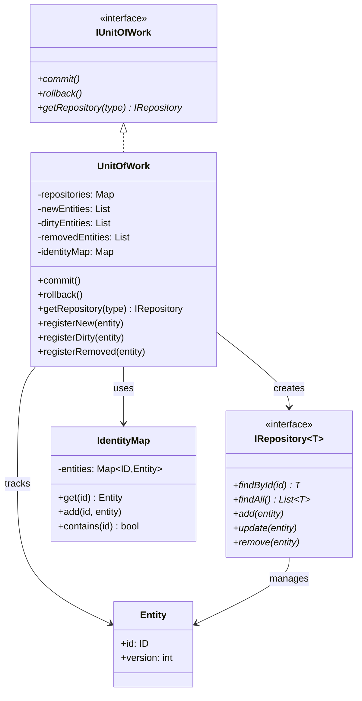
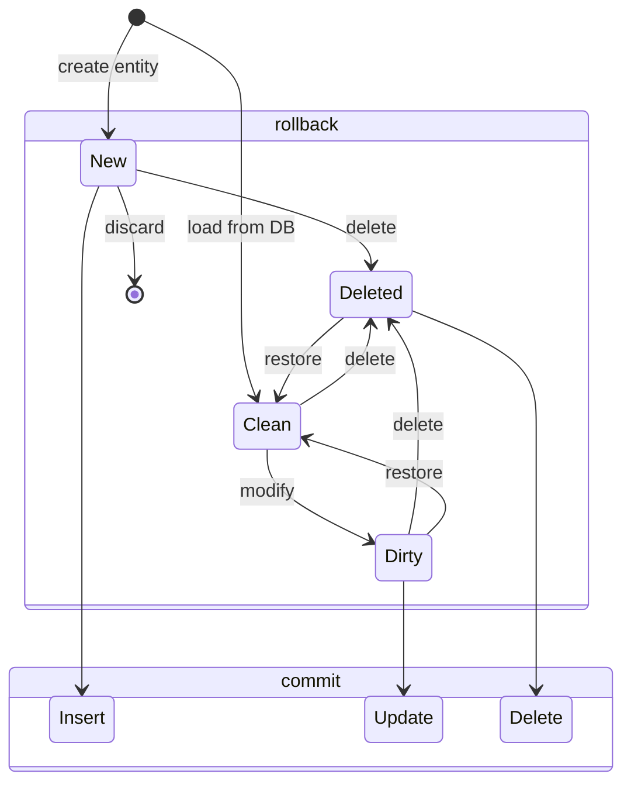
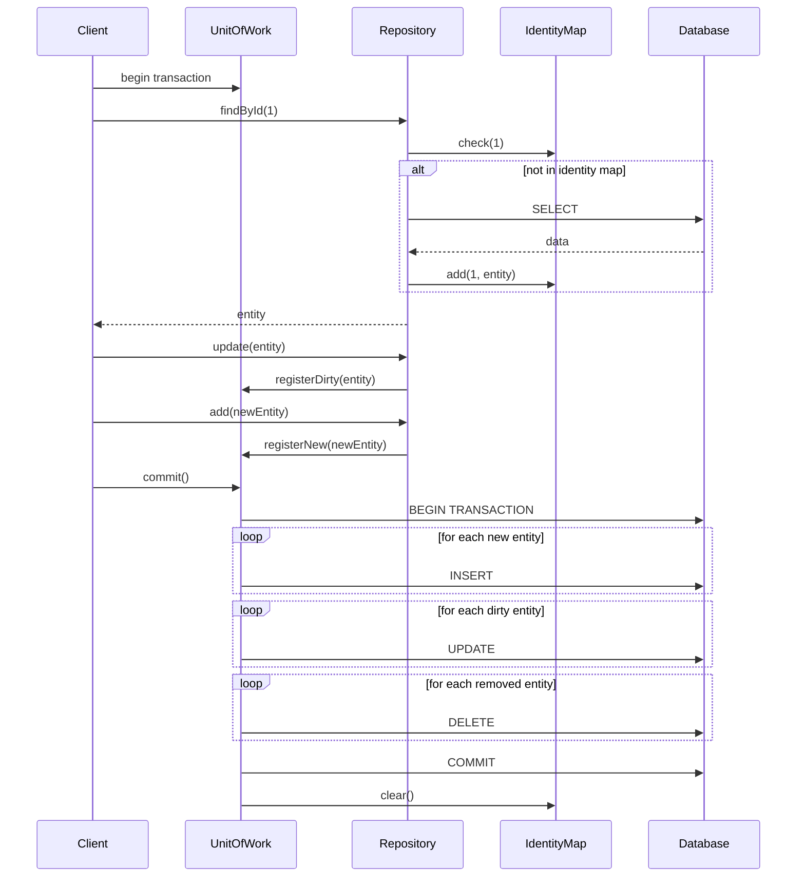

# Unit of Work Pattern

## Intent
Maintain a list of objects affected by a business transaction and coordinate writing out changes and resolving concurrency problems.

## When to Use
- Need to track changes to multiple objects
- Want to commit or rollback changes as a group
- Implementing optimistic concurrency control
- Need to minimize database round trips
- Working with complex domain models

## Structure



### Change Tracking Flow



### Transaction Coordination



## Implementation Details

### Key Components
1. **Unit of Work**: Tracks changes and coordinates commits
2. **Change Sets**: Lists of new, modified, and deleted entities
3. **Identity Map**: Ensures entity uniqueness per transaction
4. **Repository Integration**: Repositories register changes with UoW
5. **Transaction Management**: Atomic commit/rollback

### Algorithm
```
Change Tracking:
1. Load entity: Add to identity map as clean
2. Create entity: Add to new entities list
3. Modify entity: Add to dirty entities list
4. Delete entity: Add to removed entities list

Commit Process:
1. Begin database transaction
2. For each new entity: INSERT
3. For each dirty entity: UPDATE
4. For each removed entity: DELETE
5. Commit transaction
6. Clear change tracking

Rollback Process:
1. Discard new entities
2. Restore dirty entities to original state
3. Remove deleted markers
4. Clear identity map
```

## Advantages
- Maintains consistency across aggregate boundaries
- Reduces database calls
- Implements transaction script pattern
- Supports optimistic concurrency
- Simplifies business transaction logic

## Disadvantages
- Complex to implement correctly
- Memory overhead for tracking
- Can become god object
- Tight coupling with persistence
- Difficult to test in isolation

## Example Output
```
=== Unit of Work Pattern Demo ===

=== Basic Unit of Work Demo ===
Loaded: Customer{id=1, name='John Doe', email='john@example.com', creditLimit=5000.000000, version=0}

=== Committing Unit of Work ===
UPDATE: Customer{id=1, name='John Doe', email='john.doe@newdomain.com', creditLimit=7500.000000, version=1}
INSERT: Customer{id=0, name='Alice Brown', email='alice@example.com', creditLimit=3000.000000, version=0}
DELETE: Customer with ID 3
Commit successful!

=== Identity Map Demo ===
First load: Customer{id=1, name='John Doe', email='john@example.com', creditLimit=5000.000000, version=0}
Second load: Customer{id=1, name='John Doe', email='john@example.com', creditLimit=5000.000000, version=0}
After modification: Customer{id=1, name='John Doe', email='modified@example.com', creditLimit=5000.000000, version=0}
Identity map ensures single instance per entity!

=== Rollback Demo ===
Original: Customer{id=2, name='Jane Smith', email='jane@example.com', creditLimit=10000.000000, version=0}
Modified: Customer{id=2, name='Jane Smith', email='jane@example.com', creditLimit=20000.000000, version=0}

=== Rolling back Unit of Work ===
Rollback complete!
After rollback: Customer{id=2, name='Jane Smith', email='jane@example.com', creditLimit=10000.000000, version=0}

=== Service Layer with Unit of Work ===

=== Committing Unit of Work ===
UPDATE: Customer{id=1, name='John Doe', email='john@example.com', creditLimit=8000.000000, version=1}
Commit successful!

=== Committing Unit of Work ===
INSERT: Customer{id=0, name='New Customer', email='new@example.com', creditLimit=5000.000000, version=0}
Commit successful!
```

## Common Variations
1. **Nested Units of Work**: Support for nested transactions
2. **Event Sourcing UoW**: Track domain events instead of state
3. **Distributed UoW**: Coordinate across multiple databases
4. **Async Unit of Work**: Asynchronous commit operations
5. **Read-only UoW**: For query operations without tracking

## Related Patterns
- **Repository**: Often used together
- **Identity Map**: Ensures entity uniqueness
- **Data Mapper**: Maps entities to database
- **Domain Events**: Can trigger on commit
- **Transaction Script**: Alternative approach

## 🔧 Compilation & Usage

### Prerequisites
- **C++ Standard**: C++11 or later (C++14+ recommended for enhanced features)
- **Compiler**: GCC 5.0+, Clang 3.8+, MSVC 2015+
- **Key Features**: Templates, std::optional, std::unordered_map, std::typeinfo, std::functional
- **Dependencies**: Standard library only

### Basic Compilation

#### Linux/macOS
```bash
# Basic compilation with C++14 support
g++ -std=c++14 -Wall -Wextra -O2 -o unit_of_work unit_of_work.cpp

# Alternative with Clang
clang++ -std=c++14 -Wall -Wextra -O2 -o unit_of_work unit_of_work.cpp

# Debug build with additional warnings
g++ -std=c++14 -Wall -Wextra -Wpedantic -g -O0 -DDEBUG -o unit_of_work_debug unit_of_work.cpp
```

#### Windows (MinGW)
```batch
g++ -std=c++14 -Wall -Wextra -O2 -o unit_of_work.exe unit_of_work.cpp
```

#### Windows (MSVC)
```batch
cl /EHsc /std:c++14 /W4 unit_of_work.cpp
```

### Advanced Compilation Options

#### Optimized Release Build
```bash
g++ -std=c++14 -O3 -DNDEBUG -march=native -flto -o unit_of_work_release unit_of_work.cpp
```

#### Template and RTTI Analysis
```bash
# Enhanced template debugging (important for change tracking templates)
g++ -std=c++14 -Wall -Wextra -ftemplate-backtrace-limit=0 -frtti -o unit_of_work unit_of_work.cpp

# Template instantiation profiling
g++ -std=c++14 -ftime-report -fmem-report -frtti -o unit_of_work unit_of_work.cpp
```

#### Memory and Performance Analysis
```bash
# Address sanitizer for memory errors (important for entity tracking)
g++ -std=c++14 -fsanitize=address -g -o unit_of_work_asan unit_of_work.cpp

# Undefined behavior sanitizer
g++ -std=c++14 -fsanitize=undefined -g -o unit_of_work_ubsan unit_of_work.cpp

# Memory profiling with Valgrind
g++ -std=c++14 -g -O1 -o unit_of_work_profile unit_of_work.cpp
valgrind --tool=memcheck --leak-check=full ./unit_of_work_profile

# Performance profiling for transaction overhead
g++ -std=c++14 -g -pg -O2 -o unit_of_work_prof unit_of_work.cpp
gprof ./unit_of_work_prof gmon.out > profile_report.txt
```

### CMake Instructions

Create `CMakeLists.txt`:
```cmake
cmake_minimum_required(VERSION 3.8)
project(UnitOfWorkPattern)

# Set C++14 standard (required for enhanced template features)
set(CMAKE_CXX_STANDARD 14)
set(CMAKE_CXX_STANDARD_REQUIRED ON)

# Create executable
add_executable(unit_of_work unit_of_work.cpp)

# Enable RTTI (required for typeinfo operations)
target_compile_options(unit_of_work PRIVATE -frtti)

# Compiler-specific options
if(MSVC)
    target_compile_options(unit_of_work PRIVATE /W4 /GR)
    # Enable better template diagnostics
    target_compile_options(unit_of_work PRIVATE /diagnostics:caret)
    # Optimize for speed
    target_compile_options(unit_of_work PRIVATE /O2)
else()
    target_compile_options(unit_of_work PRIVATE 
        -Wall -Wextra -Wpedantic 
        -Wno-unused-parameter
        -ftemplate-backtrace-limit=0
        -frtti)
    
    # GCC-specific warnings for templates and RTTI
    if(CMAKE_CXX_COMPILER_ID STREQUAL "GNU")
        target_compile_options(unit_of_work PRIVATE 
            -Weffc++ -Wold-style-cast -Woverloaded-virtual
            -Wsuggest-override)
    endif()
    
    # Clang-specific warnings
    if(CMAKE_CXX_COMPILER_ID STREQUAL "Clang")
        target_compile_options(unit_of_work PRIVATE 
            -Wmost -Wextra-semi -Wimplicit-fallthrough)
    endif()
endif()

# Debug configuration with memory tracking
if(CMAKE_BUILD_TYPE STREQUAL "Debug")
    target_compile_definitions(unit_of_work PRIVATE DEBUG UOW_DEBUG_TRACKING)
    if(NOT MSVC)
        target_compile_options(unit_of_work PRIVATE -fsanitize=address -fno-omit-frame-pointer)
        target_link_options(unit_of_work PRIVATE -fsanitize=address)
    endif()
endif()

# Performance build with LTO
if(CMAKE_BUILD_TYPE STREQUAL "Release")
    target_compile_definitions(unit_of_work PRIVATE NDEBUG)
    if(NOT MSVC)
        target_compile_options(unit_of_work PRIVATE -march=native -flto)
        target_link_options(unit_of_work PRIVATE -flto)
    endif()
endif()

# Custom sanitizer builds for entity tracking
add_executable(unit_of_work_asan unit_of_work.cpp)
target_compile_options(unit_of_work_asan PRIVATE -fsanitize=address -frtti -g)
target_link_options(unit_of_work_asan PRIVATE -fsanitize=address)

add_executable(unit_of_work_ubsan unit_of_work.cpp)
target_compile_options(unit_of_work_ubsan PRIVATE -fsanitize=undefined -frtti -g)
target_link_options(unit_of_work_ubsan PRIVATE -fsanitize=undefined)

# Template instantiation analysis build
add_executable(unit_of_work_template_debug unit_of_work.cpp)
target_compile_options(unit_of_work_template_debug PRIVATE 
    -ftemplate-backtrace-limit=0 -ftime-report -fmem-report -frtti)
```

Build with CMake:
```bash
mkdir build && cd build
cmake -DCMAKE_BUILD_TYPE=Release ..
make -j$(nproc)

# Debug build with sanitizers
cmake -DCMAKE_BUILD_TYPE=Debug ..
make unit_of_work_asan unit_of_work_ubsan
```

### IDE Integration

#### Visual Studio Code
Create `.vscode/tasks.json`:
```json
{
    "version": "2.0.0",
    "tasks": [
        {
            "label": "build-unit-of-work",
            "type": "shell",
            "command": "g++",
            "args": [
                "-std=c++14",
                "-Wall",
                "-Wextra",
                "-Wpedantic",
                "-ftemplate-backtrace-limit=0",
                "-frtti",
                "-g",
                "${file}",
                "-o",
                "${fileDirname}/${fileBasenameNoExtension}"
            ],
            "group": {
                "kind": "build",
                "isDefault": true
            }
        },
        {
            "label": "build-unit-of-work-debug",
            "type": "shell",
            "command": "g++",
            "args": [
                "-std=c++14",
                "-DDEBUG",
                "-DUOW_DEBUG_TRACKING",
                "-fsanitize=address",
                "-g",
                "-frtti",
                "${file}",
                "-o",
                "${fileDirname}/${fileBasenameNoExtension}_debug"
            ],
            "group": "build"
        }
    ]
}
```

#### Visual Studio
1. Create new Console Application project
2. Project Properties → C/C++ → Language → C++ Language Standard: C++14
3. Project Properties → C/C++ → Language → Enable Run-Time Type Info: Yes (/GR)
4. Project Properties → C/C++ → General → Warning Level: Level4 (/W4)
5. For template debugging: C/C++ → Command Line → Additional Options: `/diagnostics:caret`
6. Copy the code to main source file
7. Build with Ctrl+F7

#### CLion
1. Open project directory
2. Ensure CMakeLists.txt is properly configured
3. Set Build Type to Debug or Release
4. Build with Ctrl+F9

### Dependencies and Headers
- **Standard Library**: 
  - `<iostream>`, `<memory>`, `<unordered_map>`, `<vector>`
  - `<typeinfo>`, `<functional>`, `<optional>`, `<algorithm>`
  - `<stdexcept>`, `<string>`
- **RTTI Features**: typeid operations for type identification
- **Template Features**: Variadic templates, template specialization
- **No external dependencies required**

### Feature-Specific Requirements

#### RTTI and TypeInfo Support
```bash
# Check for RTTI support
echo '#include <typeinfo>
#include <iostream>
int main() { 
    int x = 42;
    std::cout << typeid(x).name() << std::endl;
    return 0; 
}' | g++ -std=c++14 -frtti -x c++ - && ./a.out

# Test without RTTI (should fail)
echo '#include <typeinfo>
int main() { 
    int x = 42;
    return typeid(x).hash_code(); 
}' | g++ -std=c++14 -fno-rtti -x c++ - 2>&1 | grep -i rtti
```

#### Template Instantiation Testing
```bash
# Test template compilation for entity tracking
g++ -std=c++14 -c -ftemplate-backtrace-limit=0 -frtti unit_of_work.cpp

# Generate template instantiation report
g++ -std=c++14 -ftime-report -frtti unit_of_work.cpp 2>&1 | grep -A 20 "time report"
```

### Platform-Specific Notes

#### Linux
- Install build tools: `sudo apt-get install build-essential`
- For RTTI debugging: `sudo apt-get install gdb`
- For memory analysis: `sudo apt-get install valgrind`
- Enable core dumps: `ulimit -c unlimited`

#### macOS  
- Install Xcode command line tools: `xcode-select --install`
- Use lldb for RTTI debugging: `lldb ./unit_of_work`
- Activity Monitor for memory tracking

#### Windows
- **Visual Studio**: Full RTTI support built-in (/GR flag)
- **MinGW-w64**: Ensure RTTI is enabled (-frtti)
- Use Application Verifier for memory issues

### Troubleshooting

#### Common Issues
1. **typeid not found**: Ensure RTTI is enabled (-frtti or /GR)
2. **Template compilation errors**: Use `-ftemplate-backtrace-limit=0`
3. **Memory tracking issues**: Enable address sanitizer
4. **Performance bottlenecks**: Profile entity tracking overhead

#### Compiler-Specific Fixes
```bash
# GCC: Enable all C++14 features with RTTI
g++ -std=c++14 -frtti -ftemplate-depth=1024 unit_of_work.cpp

# Clang: Enhanced diagnostics with RTTI
clang++ -std=c++14 -frtti -Weverything -Wno-c++98-compat unit_of_work.cpp

# MSVC: Enable RTTI and permissive mode off
cl /std:c++14 /GR /permissive- unit_of_work.cpp
```

#### RTTI and Template Debugging
```bash
# Debug RTTI issues
g++ -std=c++14 -frtti -g -O0 -DDEBUG_RTTI unit_of_work.cpp
gdb ./unit_of_work
(gdb) set print object on
(gdb) set print vtbl on

# Template instantiation debugging
g++ -std=c++14 -ftemplate-backtrace-limit=50 -fdiagnostics-show-template-tree unit_of_work.cpp
```

### Performance Optimization

#### Compilation Flags for Entity Tracking
```bash
# Maximum optimization for production
g++ -std=c++14 -O3 -DNDEBUG -march=native -mtune=native -flto -frtti unit_of_work.cpp

# Profile-guided optimization for transaction patterns
g++ -std=c++14 -frtti -O2 -fprofile-generate unit_of_work.cpp -o unit_of_work_prof
./unit_of_work_prof  # Generate profile data
g++ -std=c++14 -frtti -O3 -fprofile-use unit_of_work.cpp -o unit_of_work_optimized
```

#### Memory Layout Optimization
```bash
# Optimize for cache performance in entity tracking
g++ -std=c++14 -frtti -O3 -march=native -fdata-sections -ffunction-sections unit_of_work.cpp

# Link-time optimization
g++ -std=c++14 -frtti -O3 -flto=auto -fuse-linker-plugin unit_of_work.cpp
```

### Testing Strategy
```bash
# Compile test version with entity tracking debug
g++ -std=c++14 -frtti -DDEBUG -DUOW_DEBUG_TRACKING -DTEST_MODE -g unit_of_work.cpp -o unit_of_work_test

# Test entity tracking
echo "Test 1: Entity tracking functionality"
./unit_of_work_test

# Memory leak testing for entity management
valgrind --leak-check=full --show-leak-kinds=all --track-origins=yes ./unit_of_work_test

# Performance testing for transaction overhead
time ./unit_of_work_test
```

### Advanced Debugging for Entity Tracking
```bash
# GDB with RTTI debugging
g++ -std=c++14 -frtti -g -O0 -fno-eliminate-unused-debug-types unit_of_work.cpp
gdb ./unit_of_work
(gdb) set print demangle on
(gdb) set print object on
(gdb) set print vtbl on
(gdb) info types
(gdb) break UnitOfWork::commit
(gdb) run

# Debug entity state transitions
g++ -std=c++14 -frtti -DDEBUG_ENTITY_STATES -g unit_of_work.cpp
./unit_of_work

# Memory usage analysis for large entity sets
valgrind --tool=massif --time-unit=ms ./unit_of_work
ms_print massif.out.*
```

### Unit of Work Specific Considerations

#### Entity Tracking Performance
```bash
# Benchmark entity tracking overhead
g++ -std=c++14 -frtti -O3 -DBENCHMARK_MODE unit_of_work.cpp
./unit_of_work

# Profile memory usage patterns
perf record -g -e cache-references,cache-misses ./unit_of_work
perf report

# Analyze RTTI overhead
perf record -g -e instructions,cycles ./unit_of_work
perf report
```

#### Concurrency Testing (if applicable)
```bash
# Thread sanitizer for concurrent access
g++ -std=c++14 -frtti -fsanitize=thread -g -O1 unit_of_work.cpp
export TSAN_OPTIONS="detect_thread_leaks=true:halt_on_error=1"
./unit_of_work

# Helgrind for detailed concurrency analysis
valgrind --tool=helgrind ./unit_of_work
```

#### Database Integration Testing
```bash
# Test with mock database connections
g++ -std=c++14 -frtti -DMOCK_DATABASE -DTEST_TRANSACTIONS unit_of_work.cpp
./unit_of_work

# Stress test with many entities
ENTITY_COUNT=10000 ./unit_of_work

# Transaction rollback testing
FORCE_ROLLBACK=true ./unit_of_work
```