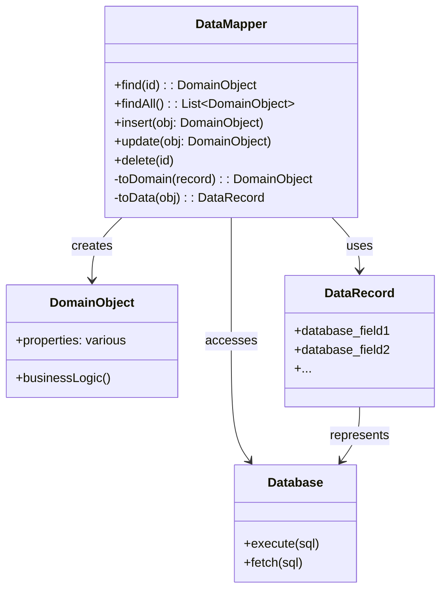

# Data Mapper Pattern

## Intent
A layer of Mappers that moves data between objects and a database while keeping them independent of each other and the mapper itself.

## When to Use
- Need to isolate domain objects from database schema
- Domain model and database schema are different
- Want to keep database access logic separate from business logic
- Need to support multiple database schemas for same domain
- Working with legacy databases with complex schemas

## Structure



### Domain-Database Separation

```mermaid
graph TB
    subgraph "Domain Layer"
        DO[Domain Objects]
        BL[Business Logic]
    end
    
    subgraph "Data Access Layer"
        DM[Data Mappers]
        DR[Data Records/DTOs]
    end
    
    subgraph "Database Layer"
        DB[(Database)]
        Schema[Database Schema]
    end
    
    DO --> BL
    DM --> DO : creates/updates
    DM --> DR : transforms
    DR --> DB : maps to
    Schema --> DB
```

## Implementation Details

### Key Components
1. **Domain Objects**: Pure business objects without persistence concerns
2. **Data Mappers**: Handle mapping between domain and database
3. **Data Records/DTOs**: Represent database structure
4. **Transformation Logic**: Converts between domain and data representations
5. **Database Access**: Actual database operations

### Algorithm
```
Data Retrieval:
1. Mapper receives request for domain object
2. Mapper queries database using SQL
3. Database returns raw data/records
4. Mapper transforms data to domain object
5. Return domain object to caller

Data Persistence:
1. Mapper receives domain object to save
2. Mapper transforms domain object to data record
3. Mapper executes SQL INSERT/UPDATE
4. Database confirms operation
5. Update domain object with any generated keys
```

## Advantages
- Complete separation of domain and database concerns
- Domain objects are persistence-ignorant
- Easy to change database schema without affecting domain
- Supports complex mapping scenarios
- Testable with mock mappers

## Disadvantages
- Additional layer increases complexity
- More code to write and maintain
- Can be overkill for simple CRUD applications
- Performance overhead from mapping
- Requires careful design to avoid leaky abstractions

## Example Output
```
=== Data Mapper Pattern Demo ===

=== Registering Customers ===
SQL: SELECT * FROM customers WHERE email = 'john@example.com'
SQL: INSERT INTO customers (id, first_name, last_name, ...) VALUES (1, 'John', 'Doe', ...)
Customer registered with ID: 1
SQL: SELECT * FROM customers WHERE email = 'jane@example.com'
SQL: INSERT INTO customers (id, first_name, last_name, ...) VALUES (2, 'Jane', 'Smith', ...)
Customer registered with ID: 2
SQL: SELECT * FROM customers WHERE email = 'bob@example.com'
SQL: INSERT INTO customers (id, first_name, last_name, ...) VALUES (3, 'Bob', 'Johnson', ...)
Customer registered with ID: 3

=== Recording Purchases ===
SQL: SELECT * FROM customers WHERE id = 1
Customer John Doe is now a VIP!
SQL: UPDATE customers SET first_name = 'John', last_name = 'Doe', ... WHERE id = 1
SQL: SELECT * FROM customers WHERE id = 2
SQL: UPDATE customers SET first_name = 'Jane', last_name = 'Smith', ... WHERE id = 2

=== Product Operations ===
SQL: INSERT INTO products (id, sku, name, price, ...) VALUES (1, 'LAPTOP-001', 'High-end Laptop', 1500, ...)
SQL: INSERT INTO products (id, sku, name, price, ...) VALUES (2, 'MOUSE-001', 'Wireless Mouse', 50, ...)
SQL: INSERT INTO products (id, sku, name, price, ...) VALUES (3, 'BOOK-001', 'Design Patterns', 45, ...)

=== Products In Stock ===
SQL: SELECT * FROM products WHERE stock_quantity > 0
High-end Laptop - $1500.00 (10 in stock)
Wireless Mouse - $50.00 (100 in stock)

=== Updating Product Stock ===
SQL: UPDATE products SET name = 'High-end Laptop', price = 1500, stock_quantity = 8 WHERE id = 1

=== Customer Report ===
SQL: SELECT * FROM customers
ID: 1
Name: John Doe
Email: john@example.com
Total Purchases: $12000.00
VIP Status: Yes
Discount: 15%
Shipping: 123 Main St, New York, 10001, USA
---
ID: 2
Name: Jane Smith
Email: jane@example.com
Total Purchases: $2000.00
VIP Status: No
Discount: 0%
Shipping: 456 Oak Ave, Los Angeles, 90001, USA
---

=== VIP Customers ===
SQL: SELECT * FROM customers WHERE is_vip = true
John Doe - john@example.com
```

## Common Variations
1. **Generic Data Mapper**: Base class for all entity mappers
2. **Table Data Gateway**: One mapper per database table
3. **Active Record Integration**: Hybrid approach with some mapping
4. **Query Object**: Separate query construction from mapping
5. **Lazy Loading Mapper**: Load related objects on demand

## Related Patterns
- **Repository**: Higher-level abstraction that may use Data Mappers
- **Unit of Work**: Coordinates multiple Data Mappers
- **Identity Map**: Ensures object uniqueness
- **Lazy Load**: Defers loading of expensive objects
- **Query Object**: Encapsulates database queries

## 🔧 Compilation & Usage

### Prerequisites
- **C++ Standard**: C++11 or later (C++14+ recommended for enhanced features)
- **Compiler**: GCC 5.0+, Clang 3.8+, MSVC 2015+
- **Key Features**: Templates, std::optional, std::chrono, std::iomanip, std::ctime
- **Dependencies**: Standard library only

### Basic Compilation

#### Linux/macOS
```bash
# Basic compilation with C++14 support
g++ -std=c++14 -Wall -Wextra -O2 -o data_mapper data_mapper.cpp

# Alternative with Clang
clang++ -std=c++14 -Wall -Wextra -O2 -o data_mapper data_mapper.cpp

# Debug build with additional warnings
g++ -std=c++14 -Wall -Wextra -Wpedantic -g -O0 -DDEBUG -o data_mapper_debug data_mapper.cpp
```

#### Windows (MinGW)
```batch
g++ -std=c++14 -Wall -Wextra -O2 -o data_mapper.exe data_mapper.cpp
```

#### Windows (MSVC)
```batch
cl /EHsc /std:c++14 /W4 data_mapper.cpp
```

### Advanced Compilation Options

#### Optimized Release Build
```bash
g++ -std=c++14 -O3 -DNDEBUG -march=native -flto -o data_mapper_release data_mapper.cpp
```

#### Template and Mapping Analysis
```bash
# Enhanced template debugging for mapping operations
g++ -std=c++14 -Wall -Wextra -ftemplate-backtrace-limit=0 -o data_mapper data_mapper.cpp

# Template instantiation profiling
g++ -std=c++14 -ftime-report -fmem-report -o data_mapper data_mapper.cpp
```

#### Memory and Performance Analysis
```bash
# Address sanitizer for memory errors in mapping operations
g++ -std=c++14 -fsanitize=address -g -o data_mapper_asan data_mapper.cpp

# Undefined behavior sanitizer
g++ -std=c++14 -fsanitize=undefined -g -o data_mapper_ubsan data_mapper.cpp

# Memory profiling with Valgrind
g++ -std=c++14 -g -O1 -o data_mapper_profile data_mapper.cpp
valgrind --tool=memcheck --leak-check=full ./data_mapper_profile

# Performance profiling for mapping overhead
g++ -std=c++14 -g -pg -O2 -o data_mapper_prof data_mapper.cpp
gprof ./data_mapper_prof gmon.out > profile_report.txt
```

### CMake Instructions

Create `CMakeLists.txt`:
```cmake
cmake_minimum_required(VERSION 3.8)
project(DataMapperPattern)

# Set C++14 standard (required for enhanced features)
set(CMAKE_CXX_STANDARD 14)
set(CMAKE_CXX_STANDARD_REQUIRED ON)

# Create executable
add_executable(data_mapper data_mapper.cpp)

# Compiler-specific options
if(MSVC)
    target_compile_options(data_mapper PRIVATE /W4)
    # Enable better template diagnostics
    target_compile_options(data_mapper PRIVATE /diagnostics:caret)
    # Optimize for speed
    target_compile_options(data_mapper PRIVATE /O2)
else()
    target_compile_options(data_mapper PRIVATE 
        -Wall -Wextra -Wpedantic 
        -Wno-unused-parameter
        -ftemplate-backtrace-limit=0)
    
    # GCC-specific warnings for templates
    if(CMAKE_CXX_COMPILER_ID STREQUAL "GNU")
        target_compile_options(data_mapper PRIVATE 
            -Weffc++ -Wold-style-cast -Woverloaded-virtual)
    endif()
    
    # Clang-specific warnings
    if(CMAKE_CXX_COMPILER_ID STREQUAL "Clang")
        target_compile_options(data_mapper PRIVATE 
            -Wmost -Wextra-semi -Wimplicit-fallthrough)
    endif()
endif()

# Debug configuration with mapping debug
if(CMAKE_BUILD_TYPE STREQUAL "Debug")
    target_compile_definitions(data_mapper PRIVATE DEBUG MAPPER_DEBUG)
    if(NOT MSVC)
        target_compile_options(data_mapper PRIVATE -fsanitize=address -fno-omit-frame-pointer)
        target_link_options(data_mapper PRIVATE -fsanitize=address)
    endif()
endif()

# Performance build with LTO
if(CMAKE_BUILD_TYPE STREQUAL "Release")
    target_compile_definitions(data_mapper PRIVATE NDEBUG)
    if(NOT MSVC)
        target_compile_options(data_mapper PRIVATE -march=native -flto)
        target_link_options(data_mapper PRIVATE -flto)
    endif()
endif()

# Custom sanitizer builds for mapping operations
add_executable(data_mapper_asan data_mapper.cpp)
target_compile_options(data_mapper_asan PRIVATE -fsanitize=address -g)
target_link_options(data_mapper_asan PRIVATE -fsanitize=address)

add_executable(data_mapper_ubsan data_mapper.cpp)
target_compile_options(data_mapper_ubsan PRIVATE -fsanitize=undefined -g)
target_link_options(data_mapper_ubsan PRIVATE -fsanitize=undefined)

# Template instantiation analysis build
add_executable(data_mapper_template_debug data_mapper.cpp)
target_compile_options(data_mapper_template_debug PRIVATE 
    -ftemplate-backtrace-limit=0 -ftime-report -fmem-report)
```

Build with CMake:
```bash
mkdir build && cd build
cmake -DCMAKE_BUILD_TYPE=Release ..
make -j$(nproc)

# Debug build with sanitizers
cmake -DCMAKE_BUILD_TYPE=Debug ..
make data_mapper_asan data_mapper_ubsan
```

### IDE Integration

#### Visual Studio Code
Create `.vscode/tasks.json`:
```json
{
    "version": "2.0.0",
    "tasks": [
        {
            "label": "build-data-mapper",
            "type": "shell",
            "command": "g++",
            "args": [
                "-std=c++14",
                "-Wall",
                "-Wextra",
                "-Wpedantic",
                "-ftemplate-backtrace-limit=0",
                "-g",
                "${file}",
                "-o",
                "${fileDirname}/${fileBasenameNoExtension}"
            ],
            "group": {
                "kind": "build",
                "isDefault": true
            }
        },
        {
            "label": "build-data-mapper-debug",
            "type": "shell",
            "command": "g++",
            "args": [
                "-std=c++14",
                "-DDEBUG",
                "-DMAPPER_DEBUG",
                "-fsanitize=address",
                "-g",
                "${file}",
                "-o",
                "${fileDirname}/${fileBasenameNoExtension}_debug"
            ],
            "group": "build"
        }
    ]
}
```

#### Visual Studio
1. Create new Console Application project
2. Project Properties → C/C++ → Language → C++ Language Standard: C++14
3. Project Properties → C/C++ → General → Warning Level: Level4 (/W4)
4. For template debugging: C/C++ → Command Line → Additional Options: `/diagnostics:caret`
5. Copy the code to main source file
6. Build with Ctrl+F7

#### CLion
1. Open project directory
2. Ensure CMakeLists.txt is properly configured
3. Set Build Type to Debug or Release
4. Build with Ctrl+F9

### Dependencies and Headers
- **Standard Library**: 
  - `<iostream>`, `<memory>`, `<vector>`, `<unordered_map>`
  - `<optional>`, `<algorithm>`, `<functional>`, `<sstream>`
  - `<iomanip>`, `<ctime>`, `<string>`
- **C++14 Features**: Enhanced lambda expressions, auto return types
- **No external dependencies required**

### Feature-Specific Requirements

#### Time and Date Handling
```bash
# Check for chrono and ctime support
echo '#include <chrono>
#include <ctime>
#include <iomanip>
#include <iostream>
int main() { 
    auto now = std::chrono::system_clock::now();
    auto time_t = std::chrono::system_clock::to_time_t(now);
    std::cout << std::put_time(std::localtime(&time_t), "%Y-%m-%d %H:%M:%S");
    return 0; 
}' | g++ -std=c++14 -x c++ - && ./a.out
```

#### Template Compilation Testing
```bash
# Test template compilation for mapping operations
g++ -std=c++14 -c -ftemplate-backtrace-limit=0 data_mapper.cpp

# Generate template instantiation report
g++ -std=c++14 -ftime-report data_mapper.cpp 2>&1 | grep -A 20 "time report"
```

### Platform-Specific Notes

#### Linux
- Install build tools: `sudo apt-get install build-essential`
- For time debugging: `sudo apt-get install gdb`
- For memory analysis: `sudo apt-get install valgrind`

#### macOS  
- Install Xcode command line tools: `xcode-select --install`
- Use lldb for debugging: `lldb ./data_mapper`
- Activity Monitor for memory tracking

#### Windows
- **Visual Studio**: Full C++14 support built-in
- **MinGW-w64**: Ensure recent version (GCC 5.0+)
- Use Performance Toolkit for profiling

### Troubleshooting

#### Common Issues
1. **Time formatting errors**: Ensure proper include of `<iomanip>` and `<ctime>`
2. **Template compilation errors**: Use `-ftemplate-backtrace-limit=0`
3. **Memory mapping issues**: Enable address sanitizer
4. **Performance bottlenecks**: Profile mapping overhead

#### Compiler-Specific Fixes
```bash
# GCC: Enable all C++14 features
g++ -std=c++14 -ftemplate-depth=1024 data_mapper.cpp

# Clang: Enhanced diagnostics with time support
clang++ -std=c++14 -Weverything -Wno-c++98-compat data_mapper.cpp

# MSVC: Permissive mode off for strict compliance
cl /std:c++14 /permissive- data_mapper.cpp
```

#### Template and Mapping Debugging
```bash
# Debug template instantiation issues
g++ -std=c++14 -ftemplate-backtrace-limit=50 -fdiagnostics-show-template-tree data_mapper.cpp

# Show template instantiation context
g++ -std=c++14 -fdiagnostics-show-template-tree -fno-elide-type data_mapper.cpp
```

### Performance Optimization

#### Compilation Flags for Mapping Operations
```bash
# Maximum optimization for production
g++ -std=c++14 -O3 -DNDEBUG -march=native -mtune=native -flto -ffast-math data_mapper.cpp

# Profile-guided optimization for mapping patterns
g++ -std=c++14 -O2 -fprofile-generate data_mapper.cpp -o data_mapper_prof
./data_mapper_prof  # Generate profile data
g++ -std=c++14 -O3 -fprofile-use data_mapper.cpp -o data_mapper_optimized
```

#### Memory Layout Optimization
```bash
# Optimize for cache performance in mapping operations
g++ -std=c++14 -O3 -march=native -fdata-sections -ffunction-sections data_mapper.cpp

# Link-time optimization
g++ -std=c++14 -O3 -flto=auto -fuse-linker-plugin data_mapper.cpp
```

### Testing Strategy
```bash
# Compile test version with mapping debug
g++ -std=c++14 -DDEBUG -DMAPPER_DEBUG -DTEST_MODE -g data_mapper.cpp -o data_mapper_test

# Test mapping operations
echo "Test 1: Domain to Data mapping"
./data_mapper_test

# Memory leak testing for object mapping
valgrind --leak-check=full --show-leak-kinds=all --track-origins=yes ./data_mapper_test

# Performance testing for mapping overhead
time ./data_mapper_test
```

### Advanced Debugging for Data Mapping
```bash
# GDB with template debugging
g++ -std=c++14 -g -O0 -fno-eliminate-unused-debug-types data_mapper.cpp
gdb ./data_mapper
(gdb) set print demangle on
(gdb) info functions
(gdb) break CustomerDataMapper::toDomain
(gdb) run

# Debug mapping transformations
g++ -std=c++14 -DDEBUG_MAPPING_TRANSFORMS -g data_mapper.cpp
./data_mapper

# Memory usage analysis for mapping operations
valgrind --tool=massif --time-unit=ms ./data_mapper
ms_print massif.out.*
```

### Data Mapper Specific Considerations

#### Mapping Performance Analysis
```bash
# Benchmark mapping operation overhead
g++ -std=c++14 -O3 -DBENCHMARK_MAPPING data_mapper.cpp
./data_mapper

# Profile memory usage patterns in mapping
perf record -g -e cache-references,cache-misses ./data_mapper
perf report

# Analyze mapping transformation costs
perf record -g -e instructions,cycles ./data_mapper
perf report
```

#### Database Simulation Testing
```bash
# Test with different data scenarios
g++ -std=c++14 -DMOCK_DATABASE -DTEST_LARGE_DATASETS data_mapper.cpp
./data_mapper

# Stress test with many objects
OBJECT_COUNT=10000 ./data_mapper

# Test complex mapping scenarios
COMPLEX_MAPPING=true ./data_mapper
```

#### Type Safety and Validation
```bash
# Compile with strict type checking for mapping safety
g++ -std=c++14 -Wall -Wextra -Wconversion -Wsign-conversion data_mapper.cpp

# Static analysis for mapping correctness
clang++ -std=c++14 --analyze data_mapper.cpp

# Enable runtime type checking
g++ -std=c++14 -DRUNTIME_TYPE_CHECKS -g data_mapper.cpp
```