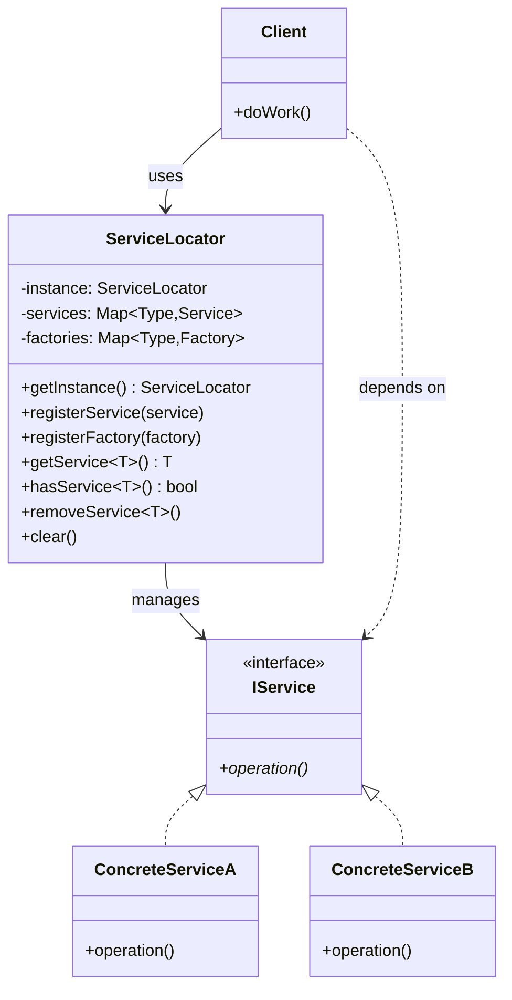
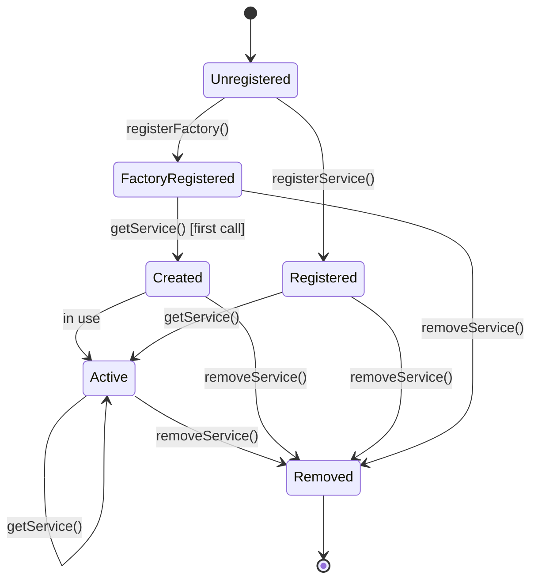
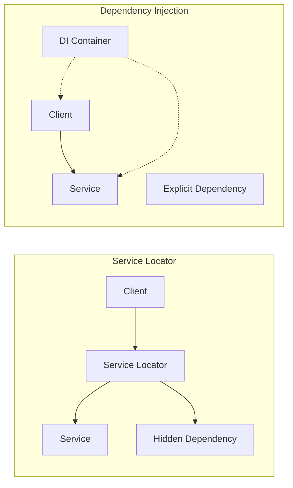

# Service Locator Pattern

## Intent
Provide a global point of access to services without coupling users to the concrete classes that implement these services.

## When to Use
- Need centralized service management
- Want to decouple service consumers from providers
- Implementing plugin architectures
- Need runtime service configuration
- Supporting multiple implementations of services

## Structure



### Service Locator Architecture

```mermaid
graph TB
    subgraph "Application Layer"
        C1[Client 1]
        C2[Client 2]
        C3[Client 3]
    end
    
    subgraph "Service Locator"
        SL[Service Locator]
        REG[Service Registry]
        FAC[Factory Registry]
    end
    
    subgraph "Service Layer"
        S1[Logger Service]
        S2[Database Service]
        S3[Email Service]
        S4[Auth Service]
    end
    
    C1 --> SL
    C2 --> SL
    C3 --> SL
    
    SL --> REG
    SL --> FAC
    
    REG --> S1
    REG --> S2
    REG --> S3
    REG --> S4
    
    FAC -.-> S2 : lazy create
    FAC -.-> S3 : lazy create
```

### Service Lifecycle



### Comparison with Dependency Injection



## Implementation Details

### Key Components
1. **Service Locator**: Central registry for services
2. **Service Interface**: Abstract interface for services
3. **Concrete Services**: Actual service implementations
4. **Service Factory**: Creates services on demand
5. **Client**: Uses services through locator

### Algorithm
```
Service Registration:
1. Create service instance or factory
2. Register with type information
3. Store in internal registry

Service Resolution:
1. Client requests service by type
2. Check if instance exists
3. If not, check for factory
4. Create instance if factory exists
5. Return service or throw error

Lazy Initialization:
1. Register factory instead of instance
2. Create service on first request
3. Cache created instance
4. Return cached instance on subsequent requests
```

## Advantages
- Decouples clients from concrete services
- Enables runtime service configuration
- Supports lazy initialization
- Simplifies service management
- Allows easy service replacement

## Disadvantages
- Hidden dependencies (anti-pattern)
- Runtime errors instead of compile-time
- Makes testing harder
- Global state issues
- Violates Dependency Inversion Principle

## Example Output
```
=== Service Locator Pattern Demo ===

=== Registering Services ===
Registered service: class ILogger
Registered service: class IEmailService
Registered service: class IPaymentGateway
Registered service: class IAuthService
Registered factory for: class IDatabase

Total services registered: 5

=== Using Order Service ===
[APP] INFO: Processing order for customer: 123
Created service using factory: class IDatabase
Connecting to database: server=localhost;db=myapp
Data from customers with id=123
[APP] DEBUG: Retrieved customer data: Data from customers with id=123
Processing payment of $99.99 via Stripe
  Card: ****1111
  Transaction ID: TXN1000
[APP] INFO: Payment successful
Executing query: INSERT INTO orders (customer_id, amount) VALUES (123, 99.990000)
Sending email via smtp.example.com:587
  To: customer@example.com
  Subject: Order Confirmation
  Body: Your order has been processed successfully!
[APP] INFO: Order completed successfully

=== Using Reporting Service (Lazy Loading) ===
[APP] INFO: Generating report: sales
Executing query: SELECT * FROM sales_data
[APP] INFO: Report generated successfully

=== Direct Service Access ===
[APP] INFO: Direct access to logger service

=== Authentication Demo ===
User admin authenticated successfully
User admin authorized for: write
User admin not authorized for: execute

=== Dependency Injection Alternative ===
[USER] INFO: Login attempt for user: user
User user authenticated successfully
[USER] INFO: Login successful for user: user
Has read permission: 1
Has write permission: 0

=== Service Replacement ===
Removed service: class ILogger
Registered service: class ILogger
Writing to app.log: INFO: Using new file logger

=== Anti-Pattern Warning ===
Service Locator can be considered an anti-pattern because:
- It creates hidden dependencies
- Makes testing harder (need to mock the locator)
- Violates Dependency Inversion Principle
- Runtime errors instead of compile-time errors

Prefer Dependency Injection when possible!
```

## Common Variations
1. **Null Service Locator**: Returns null objects for missing services
2. **Scoped Service Locator**: Different locators for different scopes
3. **Hierarchical Service Locator**: Parent-child locator relationships
4. **Type-Safe Service Locator**: Compile-time type checking
5. **Plugin Service Locator**: Dynamic plugin loading

## Related Patterns
- **Dependency Injection**: Better alternative
- **Factory**: Creates service instances
- **Singleton**: Service Locator often implemented as singleton
- **Registry**: Similar concept for object registration
- **Plugin**: Often uses Service Locator

## Best Practices
1. Prefer Dependency Injection over Service Locator
2. If using Service Locator, limit scope
3. Make dependencies explicit in documentation
4. Use interfaces for all services
5. Consider using for legacy code migration only

## 🔧 Compilation & Usage

### Prerequisites
- **C++ Standard**: C++11 or later (C++14+ recommended for enhanced features)
- **Compiler**: GCC 5.0+, Clang 3.8+, MSVC 2015+
- **Key Features**: Templates, std::typeinfo, std::functional, std::unordered_map
- **Dependencies**: Standard library only

### Basic Compilation

#### Linux/macOS
```bash
# Basic compilation with C++14 support
g++ -std=c++14 -Wall -Wextra -O2 -o service_locator service_locator.cpp

# Alternative with Clang
clang++ -std=c++14 -Wall -Wextra -O2 -o service_locator service_locator.cpp

# Debug build with additional warnings
g++ -std=c++14 -Wall -Wextra -Wpedantic -g -O0 -DDEBUG -o service_locator_debug service_locator.cpp
```

#### Windows (MinGW)
```batch
g++ -std=c++14 -Wall -Wextra -O2 -o service_locator.exe service_locator.cpp
```

#### Windows (MSVC)
```batch
cl /EHsc /std:c++14 /W4 service_locator.cpp
```

### Advanced Compilation Options

#### Optimized Release Build
```bash
g++ -std=c++14 -O3 -DNDEBUG -march=native -flto -o service_locator_release service_locator.cpp
```

#### RTTI and Template Analysis
```bash
# Enhanced template debugging for service registration
g++ -std=c++14 -Wall -Wextra -ftemplate-backtrace-limit=0 -frtti -o service_locator service_locator.cpp

# Template instantiation profiling
g++ -std=c++14 -ftime-report -fmem-report -frtti -o service_locator service_locator.cpp
```

#### Memory and Performance Analysis
```bash
# Address sanitizer for memory errors in service management
g++ -std=c++14 -fsanitize=address -g -o service_locator_asan service_locator.cpp

# Undefined behavior sanitizer
g++ -std=c++14 -fsanitize=undefined -g -o service_locator_ubsan service_locator.cpp

# Memory profiling with Valgrind
g++ -std=c++14 -g -O1 -o service_locator_profile service_locator.cpp
valgrind --tool=memcheck --leak-check=full ./service_locator_profile

# Performance profiling for service lookup overhead
g++ -std=c++14 -g -pg -O2 -o service_locator_prof service_locator.cpp
gprof ./service_locator_prof gmon.out > profile_report.txt
```

### CMake Instructions

Create `CMakeLists.txt`:
```cmake
cmake_minimum_required(VERSION 3.8)
project(ServiceLocatorPattern)

# Set C++14 standard (required for enhanced features)
set(CMAKE_CXX_STANDARD 14)
set(CMAKE_CXX_STANDARD_REQUIRED ON)

# Create executable
add_executable(service_locator service_locator.cpp)

# Enable RTTI (required for typeinfo operations)
target_compile_options(service_locator PRIVATE -frtti)

# Compiler-specific options
if(MSVC)
    target_compile_options(service_locator PRIVATE /W4 /GR)
    # Enable better template diagnostics
    target_compile_options(service_locator PRIVATE /diagnostics:caret)
    # Optimize for speed
    target_compile_options(service_locator PRIVATE /O2)
else()
    target_compile_options(service_locator PRIVATE 
        -Wall -Wextra -Wpedantic 
        -Wno-unused-parameter
        -ftemplate-backtrace-limit=0
        -frtti)
    
    # GCC-specific warnings for templates and RTTI
    if(CMAKE_CXX_COMPILER_ID STREQUAL "GNU")
        target_compile_options(service_locator PRIVATE 
            -Weffc++ -Wold-style-cast -Woverloaded-virtual)
    endif()
    
    # Clang-specific warnings
    if(CMAKE_CXX_COMPILER_ID STREQUAL "Clang")
        target_compile_options(service_locator PRIVATE 
            -Wmost -Wextra-semi -Wimplicit-fallthrough)
    endif()
endif()

# Debug configuration with service tracking
if(CMAKE_BUILD_TYPE STREQUAL "Debug")
    target_compile_definitions(service_locator PRIVATE DEBUG SERVICE_DEBUG)
    if(NOT MSVC)
        target_compile_options(service_locator PRIVATE -fsanitize=address -fno-omit-frame-pointer)
        target_link_options(service_locator PRIVATE -fsanitize=address)
    endif()
endif()

# Performance build with LTO
if(CMAKE_BUILD_TYPE STREQUAL "Release")
    target_compile_definitions(service_locator PRIVATE NDEBUG)
    if(NOT MSVC)
        target_compile_options(service_locator PRIVATE -march=native -flto)
        target_link_options(service_locator PRIVATE -flto)
    endif()
endif()

# Custom sanitizer builds for service management
add_executable(service_locator_asan service_locator.cpp)
target_compile_options(service_locator_asan PRIVATE -fsanitize=address -frtti -g)
target_link_options(service_locator_asan PRIVATE -fsanitize=address)

add_executable(service_locator_ubsan service_locator.cpp)
target_compile_options(service_locator_ubsan PRIVATE -fsanitize=undefined -frtti -g)
target_link_options(service_locator_ubsan PRIVATE -fsanitize=undefined)

# Template instantiation analysis build
add_executable(service_locator_template_debug service_locator.cpp)
target_compile_options(service_locator_template_debug PRIVATE 
    -ftemplate-backtrace-limit=0 -ftime-report -fmem-report -frtti)
```

Build with CMake:
```bash
mkdir build && cd build
cmake -DCMAKE_BUILD_TYPE=Release ..
make -j$(nproc)

# Debug build with sanitizers
cmake -DCMAKE_BUILD_TYPE=Debug ..
make service_locator_asan service_locator_ubsan
```

### IDE Integration

#### Visual Studio Code
Create `.vscode/tasks.json`:
```json
{
    "version": "2.0.0",
    "tasks": [
        {
            "label": "build-service-locator",
            "type": "shell",
            "command": "g++",
            "args": [
                "-std=c++14",
                "-Wall",
                "-Wextra",
                "-Wpedantic",
                "-ftemplate-backtrace-limit=0",
                "-frtti",
                "-g",
                "${file}",
                "-o",
                "${fileDirname}/${fileBasenameNoExtension}"
            ],
            "group": {
                "kind": "build",
                "isDefault": true
            }
        },
        {
            "label": "build-service-locator-debug",
            "type": "shell",
            "command": "g++",
            "args": [
                "-std=c++14",
                "-DDEBUG",
                "-DSERVICE_DEBUG",
                "-fsanitize=address",
                "-g",
                "-frtti",
                "${file}",
                "-o",
                "${fileDirname}/${fileBasenameNoExtension}_debug"
            ],
            "group": "build"
        }
    ]
}
```

#### Visual Studio
1. Create new Console Application project
2. Project Properties → C/C++ → Language → C++ Language Standard: C++14
3. Project Properties → C/C++ → Language → Enable Run-Time Type Info: Yes (/GR)
4. Project Properties → C/C++ → General → Warning Level: Level4 (/W4)
5. For template debugging: C/C++ → Command Line → Additional Options: `/diagnostics:caret`
6. Copy the code to main source file
7. Build with Ctrl+F7

#### CLion
1. Open project directory
2. Ensure CMakeLists.txt is properly configured
3. Set Build Type to Debug or Release
4. Build with Ctrl+F9

### Dependencies and Headers
- **Standard Library**: 
  - `<iostream>`, `<memory>`, `<unordered_map>`, `<vector>`
  - `<typeinfo>`, `<functional>`, `<stdexcept>`, `<string>`
- **RTTI Features**: typeid operations for service type identification
- **Template Features**: Variadic templates, template specialization
- **No external dependencies required**

### Feature-Specific Requirements

#### RTTI and TypeInfo Support
```bash
# Check for RTTI support for service type identification
echo '#include <typeinfo>
#include <iostream>
class Service {};
int main() { 
    Service s;
    std::cout << typeid(s).name() << std::endl;
    return 0; 
}' | g++ -std=c++14 -frtti -x c++ - && ./a.out

# Test without RTTI (should fail)
echo '#include <typeinfo>
class Service {};
int main() { 
    Service s;
    return typeid(s).hash_code(); 
}' | g++ -std=c++14 -fno-rtti -x c++ - 2>&1 | grep -i rtti
```

#### Template Compilation Testing
```bash
# Test template compilation for service registration
g++ -std=c++14 -c -ftemplate-backtrace-limit=0 -frtti service_locator.cpp

# Generate template instantiation report
g++ -std=c++14 -ftime-report -frtti service_locator.cpp 2>&1 | grep -A 20 "time report"
```

### Platform-Specific Notes

#### Linux
- Install build tools: `sudo apt-get install build-essential`
- For RTTI debugging: `sudo apt-get install gdb`
- For memory analysis: `sudo apt-get install valgrind`

#### macOS  
- Install Xcode command line tools: `xcode-select --install`
- Use lldb for RTTI debugging: `lldb ./service_locator`
- Activity Monitor for service memory tracking

#### Windows
- **Visual Studio**: Full RTTI support built-in (/GR flag)
- **MinGW-w64**: Ensure RTTI is enabled (-frtti)
- Use Application Verifier for service lifecycle issues

### Troubleshooting

#### Common Issues
1. **typeid not found**: Ensure RTTI is enabled (-frtti or /GR)
2. **Template compilation errors**: Use `-ftemplate-backtrace-limit=0`
3. **Service registration issues**: Enable debug mode for service tracking
4. **Performance bottlenecks**: Profile service lookup overhead

#### Compiler-Specific Fixes
```bash
# GCC: Enable all C++14 features with RTTI
g++ -std=c++14 -frtti -ftemplate-depth=1024 service_locator.cpp

# Clang: Enhanced diagnostics with RTTI
clang++ -std=c++14 -frtti -Weverything -Wno-c++98-compat service_locator.cpp

# MSVC: Enable RTTI and permissive mode off
cl /std:c++14 /GR /permissive- service_locator.cpp
```

#### RTTI and Template Debugging
```bash
# Debug RTTI issues in service identification
g++ -std=c++14 -frtti -g -O0 -DDEBUG_RTTI service_locator.cpp
gdb ./service_locator
(gdb) set print object on
(gdb) set print vtbl on

# Template instantiation debugging
g++ -std=c++14 -ftemplate-backtrace-limit=50 -fdiagnostics-show-template-tree service_locator.cpp
```

### Performance Optimization

#### Compilation Flags for Service Lookup
```bash
# Maximum optimization for production
g++ -std=c++14 -O3 -DNDEBUG -march=native -mtune=native -flto -frtti service_locator.cpp

# Profile-guided optimization for service patterns
g++ -std=c++14 -frtti -O2 -fprofile-generate service_locator.cpp -o service_locator_prof
./service_locator_prof  # Generate profile data
g++ -std=c++14 -frtti -O3 -fprofile-use service_locator.cpp -o service_locator_optimized
```

#### Memory Layout Optimization
```bash
# Optimize for cache performance in service lookup
g++ -std=c++14 -frtti -O3 -march=native -fdata-sections -ffunction-sections service_locator.cpp

# Link-time optimization
g++ -std=c++14 -frtti -O3 -flto=auto -fuse-linker-plugin service_locator.cpp
```

### Testing Strategy
```bash
# Compile test version with service debug
g++ -std=c++14 -frtti -DDEBUG -DSERVICE_DEBUG -DTEST_MODE -g service_locator.cpp -o service_locator_test

# Test service registration and lookup
echo "Test 1: Service registration functionality"
./service_locator_test

# Memory leak testing for service management
valgrind --leak-check=full --show-leak-kinds=all --track-origins=yes ./service_locator_test

# Performance testing for service lookup overhead
time ./service_locator_test
```

### Advanced Debugging for Service Management
```bash
# GDB with RTTI debugging
g++ -std=c++14 -frtti -g -O0 -fno-eliminate-unused-debug-types service_locator.cpp
gdb ./service_locator
(gdb) set print demangle on
(gdb) set print object on
(gdb) set print vtbl on
(gdb) info types
(gdb) break ServiceLocator::getService
(gdb) run

# Debug service lifecycle
g++ -std=c++14 -frtti -DDEBUG_SERVICE_LIFECYCLE -g service_locator.cpp
./service_locator

# Memory usage analysis for service registry
valgrind --tool=massif --time-unit=ms ./service_locator
ms_print massif.out.*
```

### Service Locator Specific Considerations

#### Service Lookup Performance
```bash
# Benchmark service lookup overhead
g++ -std=c++14 -frtti -O3 -DBENCHMARK_SERVICE_LOOKUP service_locator.cpp
./service_locator

# Profile memory usage patterns in service registry
perf record -g -e cache-references,cache-misses ./service_locator
perf report

# Analyze RTTI overhead in service identification
perf record -g -e instructions,cycles ./service_locator
perf report
```

#### Service Registry Testing
```bash
# Test with different service scenarios
g++ -std=c++14 -frtti -DTEST_SERVICE_SCENARIOS service_locator.cpp
./service_locator

# Stress test with many services
SERVICE_COUNT=1000 ./service_locator

# Test service factory patterns
FACTORY_MODE=true ./service_locator
```

#### Anti-Pattern Analysis
```bash
# Compile with dependency analysis
g++ -std=c++14 -frtti -DANALYZE_DEPENDENCIES -Wall -Wextra service_locator.cpp

# Static analysis for hidden dependencies
clang++ -std=c++14 -frtti --analyze service_locator.cpp

# Runtime dependency tracking
g++ -std=c++14 -frtti -DTRACK_DEPENDENCIES -g service_locator.cpp
```

### Service Locator vs Dependency Injection
```bash
# Compare performance characteristics
g++ -std=c++14 -frtti -DCOMPARE_WITH_DI -O2 service_locator.cpp
./service_locator

# Analyze testability issues
g++ -std=c++14 -frtti -DTEST_MOCKABILITY service_locator.cpp
./service_locator

# Runtime vs compile-time dependency analysis
g++ -std=c++14 -frtti -DDEPENDENCY_ANALYSIS service_locator.cpp
./service_locator
```