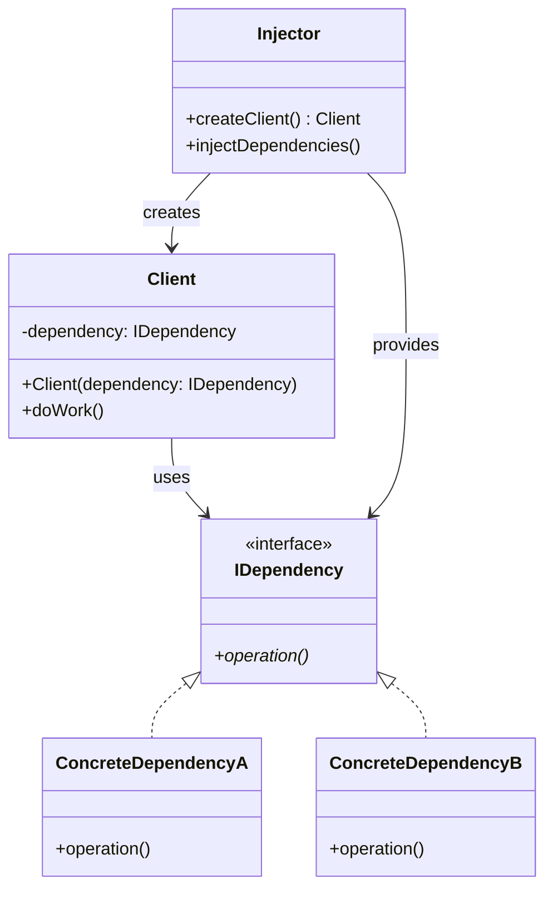
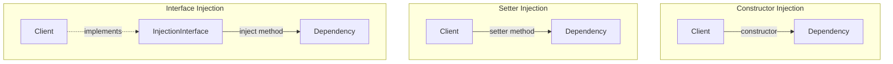
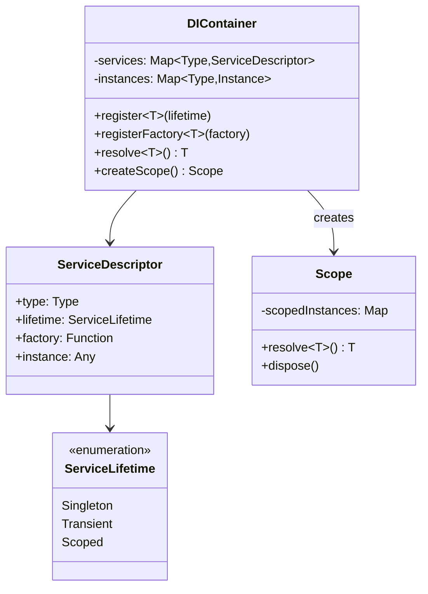
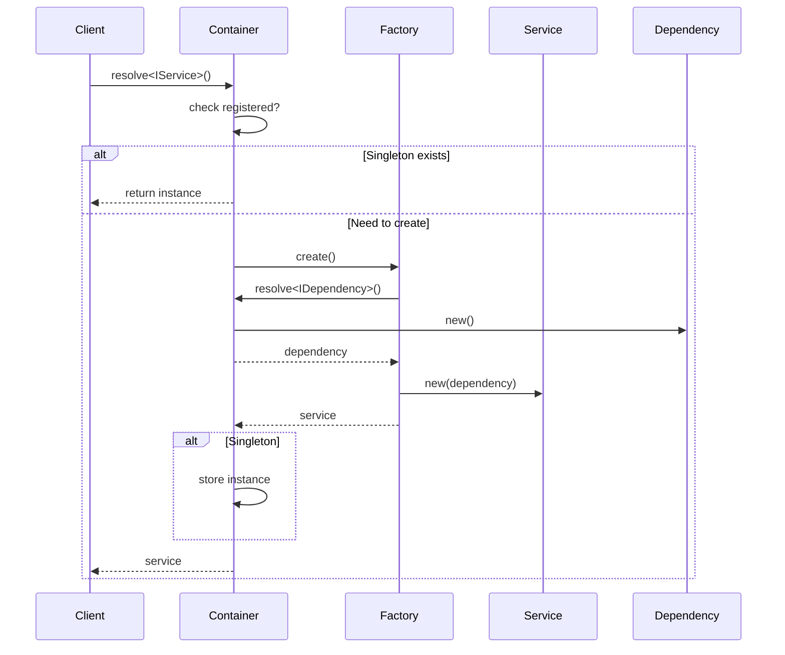

# Dependency Injection Pattern

## Intent
Supply external dependencies to an object rather than having it construct them itself, promoting loose coupling and testability.

## When to Use
- Want to decouple classes from their dependencies
- Need to support different implementations
- Want to improve testability
- Following SOLID principles
- Building modular applications

## Structure



### Types of Dependency Injection



### DI Container Architecture



### Dependency Resolution Flow



## Implementation Details

### Key Components
1. **Client**: Class that needs dependencies
2. **Dependency Interface**: Abstraction of dependency
3. **Concrete Dependency**: Actual implementation
4. **Injector/Container**: Manages dependencies
5. **Service Lifetime**: Singleton, Transient, or Scoped

### Algorithm
```
Constructor Injection:
1. Define dependencies as constructor parameters
2. Pass dependencies when creating object
3. Store dependencies as private members
4. Use dependencies in methods

Setter Injection:
1. Define setter methods for dependencies
2. Create object with default constructor
3. Call setters to inject dependencies
4. Validate dependencies before use

Container Resolution:
1. Register services with lifetime
2. When resolving, check lifetime
3. For singleton: return cached instance
4. For transient: create new instance
5. For scoped: return scoped instance
6. Recursively resolve dependencies
```

## Advantages
- Loose coupling between classes
- Easy unit testing with mocks
- Flexible runtime configuration
- Clear dependencies (constructor)
- Follows Dependency Inversion Principle

## Disadvantages
- Can make code more complex
- Runtime errors for missing dependencies
- Container becomes a dependency
- Learning curve for DI containers
- Can lead to over-engineering

## Example Output
```
=== Dependency Injection Pattern Demo ===

=== Constructor Injection ===
[MAIN] UserService initialized
[MAIN] Creating user: alice
Connecting to PostgreSQL: localhost:5432/testdb
Fetching from PostgreSQL: SELECT * FROM users WHERE username = 'alice'
Executing PostgreSQL query: INSERT INTO users (username, email) VALUES ('alice', 'alice@example.com')
Sending email via SMTP mail.example.com:25
  To: alice@example.com
  Subject: Welcome!
[MAIN] User created successfully

=== Setter Injection ===
Writing to product.log: Logger injected into ProductService
Writing to product.log: Fetching product: 456
Fetching from PostgreSQL: SELECT * FROM products WHERE id = 456
Cached: product_456 = PostgreSQL result data
Retrieved: PostgreSQL result data

=== Interface Injection ===
[MAIN] Creating order for customer: 789
Executing PostgreSQL query: INSERT INTO orders (customer_id) VALUES (789)
Executing PostgreSQL query: INSERT INTO order_items (order_id, product_id) VALUES (LAST_INSERT_ID(), 1)
Executing PostgreSQL query: INSERT INTO order_items (order_id, product_id) VALUES (LAST_INSERT_ID(), 2)
Executing PostgreSQL query: INSERT INTO order_items (order_id, product_id) VALUES (LAST_INSERT_ID(), 3)
Sending email via SMTP mail.example.com:25
  To: customer@example.com
  Subject: Order Confirmation
[MAIN] Order created successfully

=== Simple DI Container ===
Registered singleton: class ILogger
Registered singleton: class IDatabase
Registered singleton: class IEmailService
Registered factory: class ICache
[DI] Resolved from DI container
[DI] UserService initialized
[DI] Creating user: bob
Connecting to MySQL: di-server:3306/app
Fetching from MySQL: SELECT * FROM users WHERE username = 'bob'
Executing MySQL query: INSERT INTO users (username, email) VALUES ('bob', 'bob@example.com')
Sending email via SMTP di-smtp.com:587
  To: bob@example.com
  Subject: Welcome!
[DI] User created successfully

=== Poor Man's DI (Manual Wiring) ===
[APP] UserService initialized
[APP] Creating user: john_doe
Connecting to MySQL: localhost:3306/myapp
Fetching from MySQL: SELECT * FROM users WHERE username = 'john_doe'
Executing MySQL query: INSERT INTO users (username, email) VALUES ('john_doe', 'john@example.com')
Sending email via SMTP smtp.gmail.com:587
  To: john@example.com
  Subject: Welcome!
[APP] User created successfully
Writing to product.log: Logger injected into ProductService
Writing to product.log: Fetching product: 123
Fetching from MySQL: SELECT * FROM products WHERE id = 123
Cached: product_123 = MySQL result data

=== Benefits of Dependency Injection ===
1. Loose coupling between classes
2. Easy to test (mock dependencies)
3. Flexible configuration
4. Follows SOLID principles
5. Clear dependencies
```

## Common Variations
1. **Constructor Injection**: Dependencies via constructor
2. **Setter Injection**: Dependencies via setter methods
3. **Interface Injection**: Dependencies via interface methods
4. **Field Injection**: Direct field assignment (not recommended)
5. **Method Injection**: Dependencies as method parameters

## Related Patterns
- **Service Locator**: Alternative (anti-pattern)
- **Factory**: Creates objects with dependencies
- **Builder**: Constructs complex objects
- **Strategy**: Inject different algorithms
- **Decorator**: Inject decorators

## Best Practices
1. Prefer constructor injection for required dependencies
2. Use setter injection for optional dependencies
3. Program to interfaces, not implementations
4. Keep constructors simple
5. Use DI container for complex applications