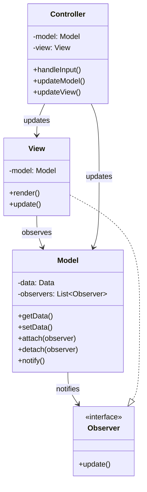
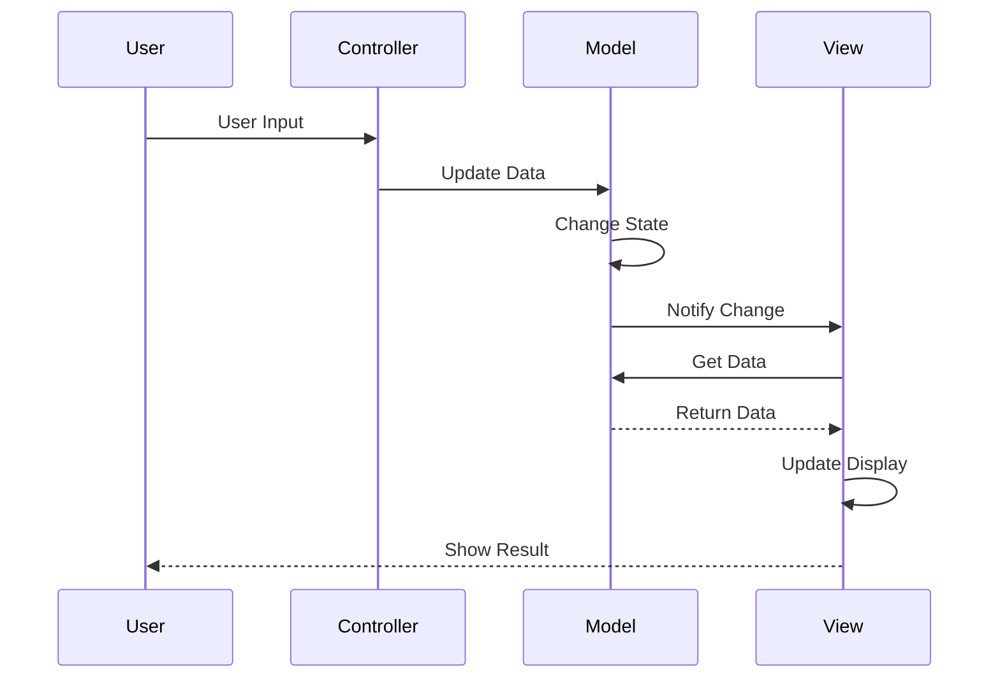
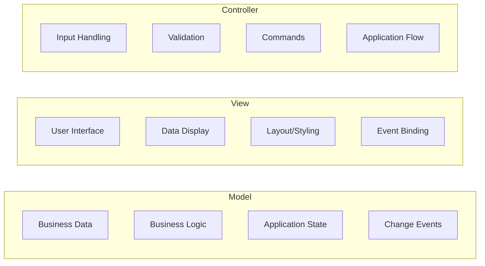

# MVC (Model-View-Controller) Pattern

## Intent
Separate an application into three interconnected components to separate internal representations of information from the ways information is presented to and accepted from the user.

## When to Use
- Building user interfaces
- Need separation of concerns
- Multiple views of same data
- Want independent development of components
- Building web applications

## Structure



### MVC Communication Flow



### MVC Variations

```mermaid
graph TB
    subgraph "Classic MVC"
        M1[Model] --> V1[View]
        V1 --> C1[Controller]
        C1 --> M1
    end
    
    subgraph "MVP (Model-View-Presenter)"
        M2[Model] <--> P[Presenter]
        P <--> V2[View]
    end
    
    subgraph "MVVM (Model-View-ViewModel)"
        M3[Model] <--> VM[ViewModel]
        VM <--> V3[View]
        V3 -.-> VM : Data Binding
    end
```

### Component Responsibilities



## Implementation Details

### Key Components
1. **Model**: Contains data and business logic
2. **View**: Presents data to user
3. **Controller**: Handles user input and updates
4. **Observer**: Enables view updates
5. **Events**: Communication mechanism

### Algorithm
```
MVC Flow:
1. User interacts with View
2. View sends input to Controller
3. Controller processes input
4. Controller updates Model
5. Model notifies Views
6. Views query Model for data
7. Views update display

Observer Pattern:
1. View registers with Model
2. Model changes state
3. Model notifies all Views
4. Each View updates itself

Controller Logic:
1. Receive user input
2. Validate input
3. Translate to Model operations
4. Execute business logic
5. Handle errors
```

## Advantages
- Separation of concerns
- Multiple views of same model
- Independent development
- Reusable components
- Easier testing

## Disadvantages
- Increased complexity
- More files/classes
- Learning curve
- Potential performance overhead
- Over-engineering for simple apps

## Example Output
```
=== MVC (Model-View-Controller) Pattern Demo ===

=== Todo Application Demo ===

=== Todo List (all) ===
No todos found.

Active todos: 0

=== Todo List (all) ===
[ ] 1. Learn MVC Pattern (created: 2024-01-20 15:30)

Active todos: 1

=== Todo List (all) ===
[ ] 1. Learn MVC Pattern (created: 2024-01-20 15:30)
[ ] 2. Implement Todo App (created: 2024-01-20 15:30)

Active todos: 2

=== Todo List (all) ===
[ ] 1. Learn MVC Pattern (created: 2024-01-20 15:30)
[ ] 2. Implement Todo App (created: 2024-01-20 15:30)
[ ] 3. Write Documentation (created: 2024-01-20 15:30)

Active todos: 3

=== Todo List (all) ===
[ ] 1. Learn MVC Pattern (created: 2024-01-20 15:30)
[X] 2. Implement Todo App (created: 2024-01-20 15:30)
[ ] 3. Write Documentation (created: 2024-01-20 15:30)

Active todos: 2

=== Todo List (active) ===
[ ] 1. Learn MVC Pattern (created: 2024-01-20 15:30)
[ ] 3. Write Documentation (created: 2024-01-20 15:30)

Active todos: 2

=== User Management System Demo ===
User created successfully.

=== User List ===
   ID       Username                    Email      Role    Status
-----------------------------------------------------------------
    1          alice        alice@example.com     admin    Active

User created successfully.

=== User List ===
   ID       Username                    Email      Role    Status
-----------------------------------------------------------------
    1          alice        alice@example.com     admin    Active
    2            bob          bob@example.com      user    Active

User created successfully.

=== User List ===
   ID       Username                    Email      Role    Status
-----------------------------------------------------------------
    1          alice        alice@example.com     admin    Active
    2            bob          bob@example.com      user    Active
    3        charlie      charlie@example.com moderator    Active

=== User Details ===
ID: 2
Username: bob
Email: bob@example.com
Role: user
Status: Active

=== Calculator Demo ===

┌─────────────────┐
│               0 │
├─────────────────┤
│ 7 │ 8 │ 9 │ / │
│ 4 │ 5 │ 6 │ * │
│ 1 │ 2 │ 3 │ - │
│ 0 │ . │ = │ + │
│   C (clear)   │
└─────────────────┘

┌─────────────────┐
│              22 │
├─────────────────┤
│ 7 │ 8 │ 9 │ / │
│ 4 │ 5 │ 6 │ * │
│ 1 │ 2 │ 3 │ - │
│ 0 │ . │ = │ + │
│   C (clear)   │
└─────────────────┘

=== Calculation History ===
15 + 7 = 22
22 * 3 = 66

=== MVC Pattern Benefits ===
1. Separation of Concerns
2. Multiple Views of Same Model
3. Reusable Components
4. Easier Testing
5. Parallel Development
```

## Common Variations
1. **MVP (Model-View-Presenter)**: Presenter handles all UI logic
2. **MVVM (Model-View-ViewModel)**: Two-way data binding
3. **PAC (Presentation-Abstraction-Control)**: Hierarchical MVC
4. **HMVC (Hierarchical MVC)**: Nested MVC triads
5. **MVA (Model-View-Adapter)**: Adapter mediates

## Related Patterns
- **Observer**: View observes Model
- **Strategy**: Controller strategies
- **Composite**: Complex views
- **Command**: Controller commands
- **Mediator**: Controller as mediator

## Best Practices
1. Keep Models independent of views
2. Views should only display data
3. Controllers handle all input
4. Use Observer for loose coupling
5. One Model can have multiple Views