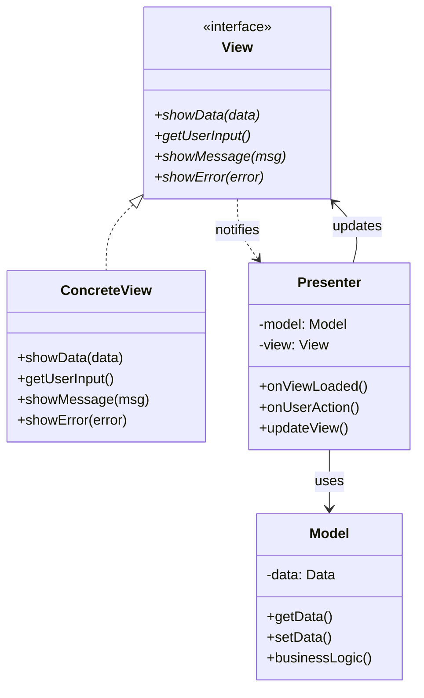
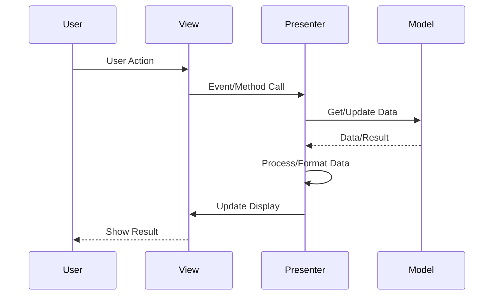
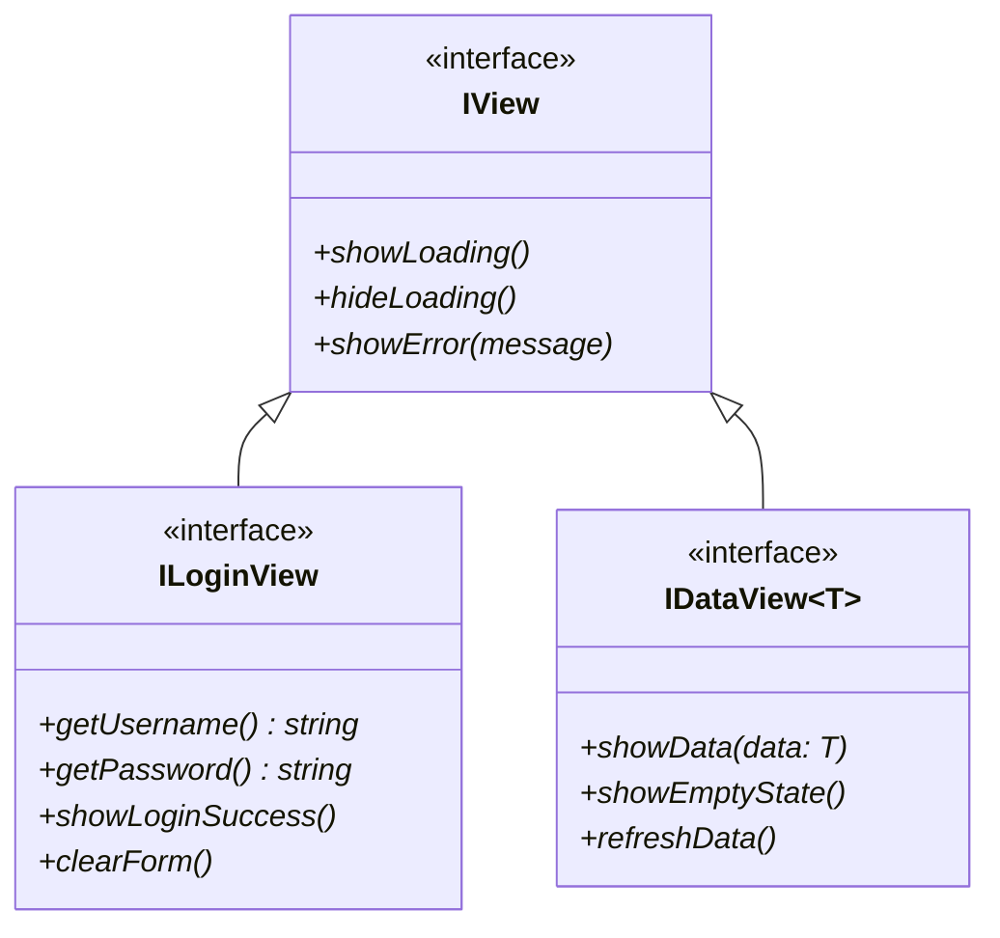

# MVP (Model-View-Presenter) Pattern

## Intent
Derivative of MVC that provides better separation of concerns by making the view completely passive and moving all UI logic to the presenter.

## When to Use
- Building testable user interfaces
- Need complete view abstraction
- Want to mock views for testing
- Complex UI logic
- Multiple platforms with shared logic

## Structure



### MVP Communication Flow



### MVP vs MVC Comparison

```mermaid
graph TB
    subgraph "MVC"
        M1[Model] --> V1[View]
        V1 --> C1[Controller]
        C1 --> M1
        V1 -.-> M1 : observes
    end
    
    subgraph "MVP"
        M2[Model] <--> P[Presenter]
        P <--> V2[View]
        V2 -.-> P : events only
    end
```

### View Abstraction Levels



## Implementation Details

### Key Components
1. **Model**: Business logic and data
2. **View**: Passive UI interface
3. **Presenter**: UI logic and coordination
4. **View Interface**: Abstraction for testing
5. **Events**: View-to-Presenter communication

### Algorithm
```
MVP Flow:
1. View creates Presenter
2. Presenter gets View reference
3. View forwards events to Presenter
4. Presenter processes events
5. Presenter updates Model
6. Presenter formats data
7. Presenter updates View

View Responsibilities:
- Display data
- Capture user input
- Forward events
- No logic or formatting

Presenter Responsibilities:
- Handle view events
- Update model
- Format data for view
- Manage view state
- Coordinate operations
```

## Advantages
- Highly testable (mock views)
- Clear separation of concerns
- Reusable presenters
- Platform-independent logic
- No view-model coupling

## Disadvantages
- More code/interfaces
- Complex for simple UIs
- Learning curve
- Potential over-abstraction
- More boilerplate

## Example Output
```
=== MVP (Model-View-Presenter) Pattern Demo ===

=== Login System Demo ===
Simulating login with empty fields...
[Error] Username and password are required

Simulating failed login...
[Error] Username and password are required

Simulating successful login (use 'admin' and 'password123')...

=== Task Management Demo ===

=== Task List ===
   ID                          Title   Priority      Status
---------------------------------------------------------
    1         Complete MVP pattern       high     Pending
    2                   Review code     medium     Pending
    3                   Write tests        low     Pending
    4          Update documentation       high     Pending
[Info] Showing high priority tasks

=== Task List ===
   ID                          Title   Priority      Status
---------------------------------------------------------
    1         Complete MVP pattern       high     Pending
    4          Update documentation       high     Pending
[Info] Showing pending tasks

=== Task List ===
   ID                          Title   Priority      Status
---------------------------------------------------------
    2                   Review code     medium     Pending
    3                   Write tests        low     Pending
    4          Update documentation       high     Pending

=== Shopping Cart Demo ===

=== Product Catalog ===
   ID             Product     Price     Stock
---------------------------------------------
    1              Laptop    999.99        10
    2               Mouse     29.99        50
    3            Keyboard     79.99        30
    4             Monitor    299.99        15
    5          Headphones     89.99        25

=== Shopping Cart ===
             Product     Price  Quantity    Subtotal
----------------------------------------------------
              Laptop    999.99         1      999.99
               Mouse     29.99         2       59.98
             Monitor    299.99         1      299.99
----------------------------------------------------
                             Total: $    1359.96

=== Shopping Cart ===
             Product     Price  Quantity    Subtotal
----------------------------------------------------
              Laptop    999.99         1      999.99
               Mouse     29.99         3       89.97
             Monitor    299.99         1      299.99
----------------------------------------------------
                             Total: $    1389.95

=== MVP vs MVC ===
MVP Differences:
- View is passive (no direct Model access)
- Presenter handles all UI logic
- Better testability (mock views)
- Clear separation of concerns
- One-to-one View-Presenter relationship
```

## Common Variations
1. **Supervising Presenter**: View has some logic for simple binding
2. **Passive View**: View has absolutely no logic
3. **Presentation Model**: Presenter maintains view state
4. **MVVM**: View Model with data binding
5. **MVP-VM**: Hybrid approach

## Related Patterns
- **MVC**: Original pattern MVP derives from
- **MVVM**: Uses data binding instead
- **Observer**: For event handling
- **Strategy**: Different presenter strategies
- **Template Method**: Presenter base classes

## Best Practices
1. Keep Views completely passive
2. Define clear View interfaces
3. One Presenter per View
4. Test Presenters with mock Views
5. Avoid View logic in Presenter