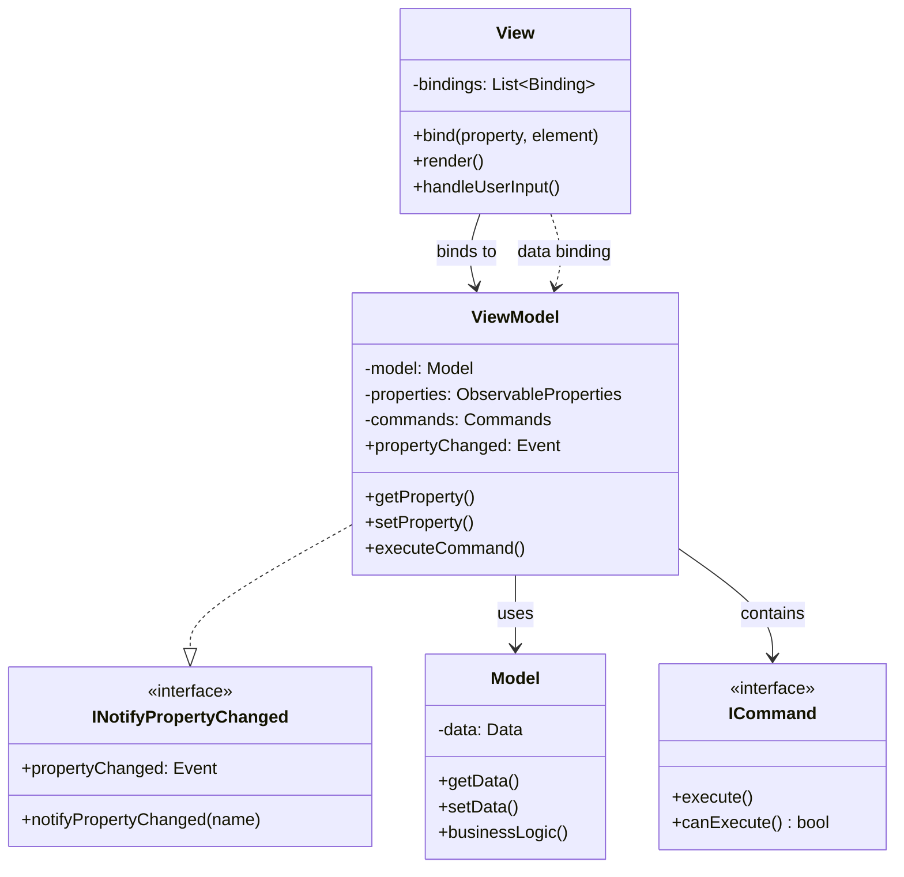
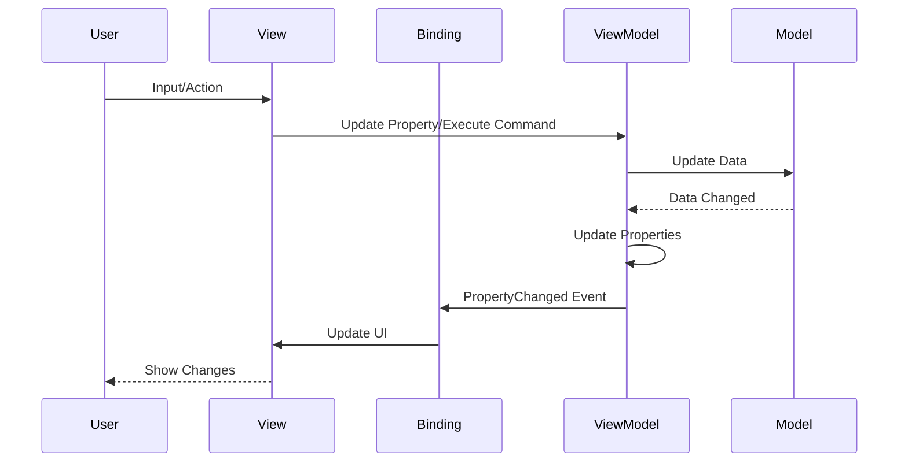
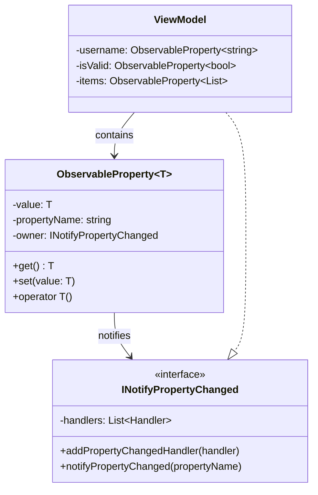
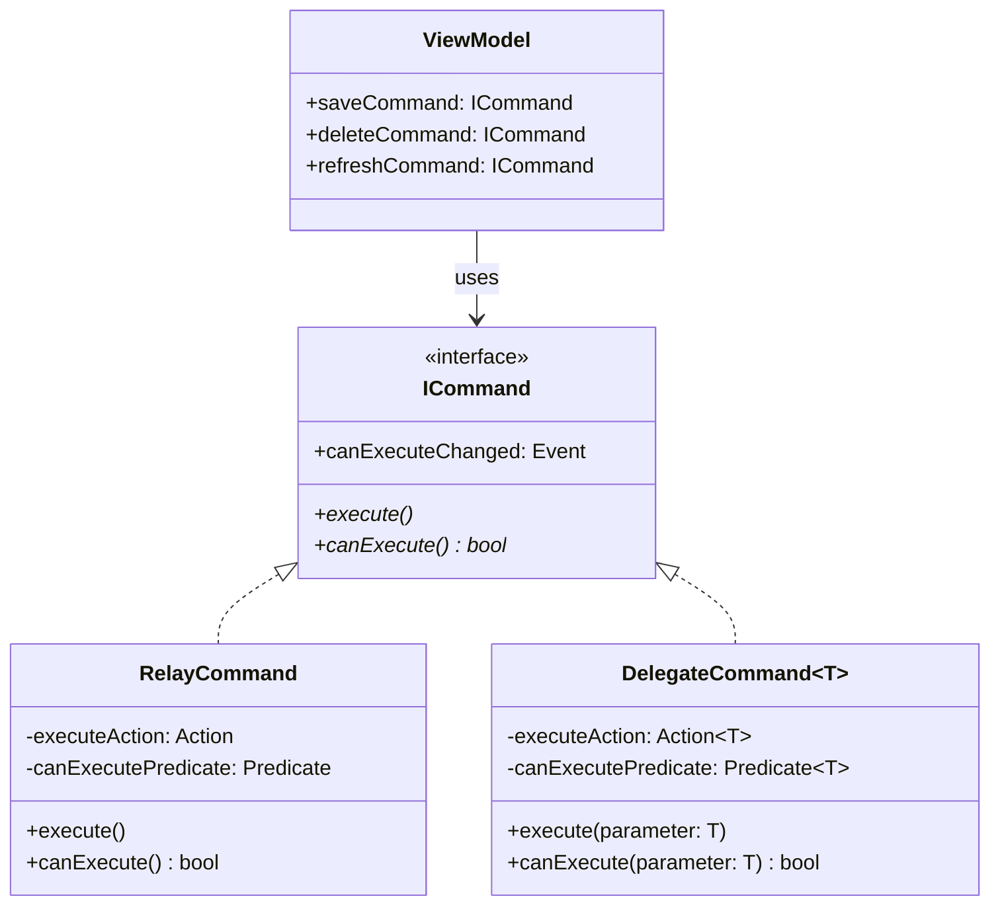

# MVVM (Model-View-ViewModel) Pattern

## Intent
Separate the development of user interfaces from business logic using data binding between View and ViewModel, enabling automatic UI updates when data changes.

## When to Use
- Building data-driven UIs
- Need two-way data binding
- Complex UI state management
- Want declarative UI updates
- Building reactive applications

## Structure



### MVVM Data Flow



### Observable Property System



### Command Pattern Integration



## Implementation Details

### Key Components
1. **Model**: Business logic and data
2. **View**: UI elements and layout
3. **ViewModel**: View state and commands
4. **Data Binding**: Automatic synchronization
5. **Commands**: Encapsulated actions

### Algorithm
```
Data Binding Flow:
1. View binds to ViewModel properties
2. User interacts with View
3. Binding updates ViewModel
4. ViewModel validates/processes
5. ViewModel updates Model
6. ViewModel raises PropertyChanged
7. Binding updates View

Observable Property:
1. Property value changes
2. Check if value different
3. Update internal value
4. Notify property changed
5. Binding receives notification
6. View updates display

Command Execution:
1. User triggers action
2. View invokes command
3. Command checks canExecute
4. Command executes action
5. Action updates ViewModel
6. Properties notify changes
```

## Advantages
- Separation of concerns
- Testable ViewModels
- Declarative data binding
- Reduced boilerplate code
- Reactive UI updates

## Disadvantages
- Complex for simple UIs
- Memory overhead (bindings)
- Debugging data binding issues
- Learning curve
- Performance concerns

## Example Output
```
=== MVVM (Model-View-ViewModel) Pattern Demo ===

=== Counter Application Demo ===

=== Counter Application ===
Counter: 0
Can Decrement: No

Commands:
[+] Increment
[-] Decrement (disabled)
[R] Reset

Incrementing...
Property changed: CounterValue
Property changed: DisplayText
Property changed: CanDecrement

=== Counter Application ===
Counter: 1
Can Decrement: Yes

Commands:
[+] Increment
[-] Decrement
[R] Reset

Incrementing again...
Property changed: CounterValue
Property changed: DisplayText

=== Counter Application ===
Counter: 2
Can Decrement: Yes

Commands:
[+] Increment
[-] Decrement
[R] Reset

=== Todo List Demo ===
Property changed: Items
Property changed: ActiveCount

=== Todo List (all) ===
[ ] 1. Learn MVVM pattern
[ ] 2. Implement data binding
[ ] 3. Write unit tests

Active items: 3
New item title: 

Toggling first item...
Property changed: Items
Property changed: ActiveCount

=== Todo List (all) ===
[X] 1. Learn MVVM pattern
[ ] 2. Implement data binding
[ ] 3. Write unit tests

Active items: 2
New item title: 

=== Form Validation Demo ===
Testing empty form:

=== Registration Form ===
Username: 
Email: 
Password: 

[Register] (disabled)

Testing partial input:
Property changed: Username
Property changed: ValidationMessage
Property changed: IsValid

Validation: Email is required

Testing valid input:
Property changed: Username
Property changed: Email
Property changed: Password
Property changed: ValidationMessage
Property changed: IsValid

Validation: All fields valid

=== Registration Form ===
Username: john
Email: john@example.com
Password: ***********

Validation: All fields valid

[Register] (enabled)

Registering...
Property changed: IsRegistered
Property changed: ValidationMessage

Validation: Registration successful!

*** REGISTRATION COMPLETE ***

=== MVVM Pattern Characteristics ===
1. Data Binding between View and ViewModel
2. ViewModel exposes Observable Properties
3. Commands encapsulate actions
4. View has no direct Model access
5. ViewModel is View-agnostic (testable)
```

## Common Variations
1. **One-Way Binding**: View reflects ViewModel only
2. **Two-Way Binding**: Bidirectional synchronization
3. **One-Time Binding**: Initial value only
4. **Command Parameters**: Commands with arguments
5. **Async Commands**: Asynchronous execution

## Related Patterns
- **MVC**: Original UI pattern
- **MVP**: No data binding
- **Observer**: Property change notification
- **Command**: Action encapsulation
- **Mediator**: Communication hub

## Best Practices
1. Keep ViewModels View-agnostic
2. Use commands for all actions
3. Validate in ViewModel, not View
4. Avoid complex logic in bindings
5. Test ViewModels independently