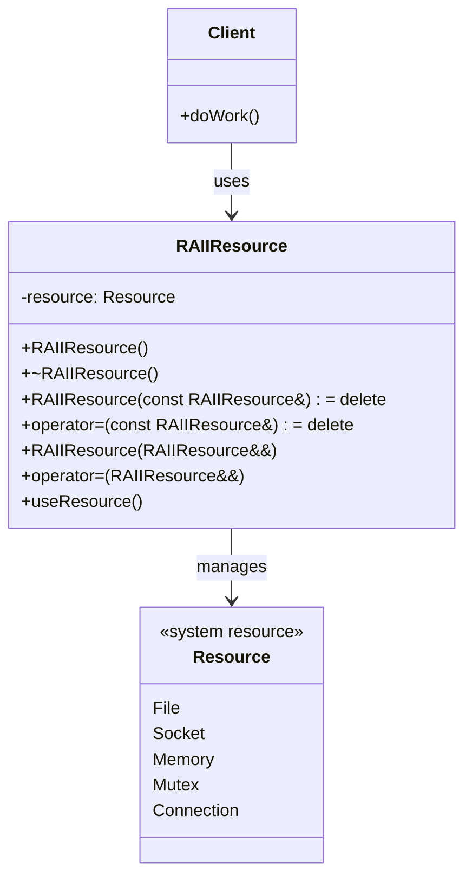
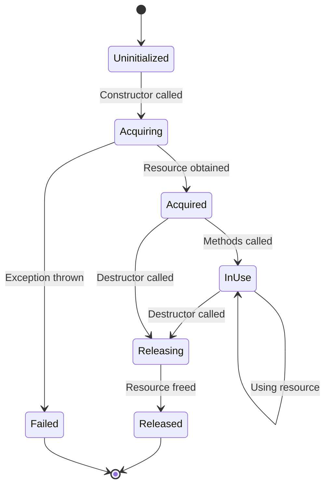
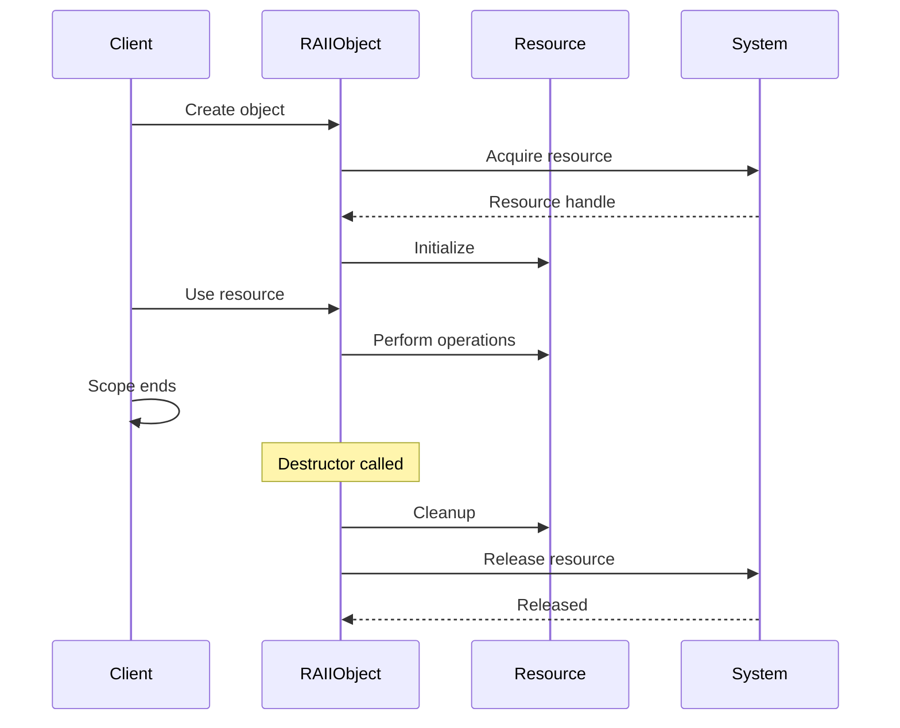
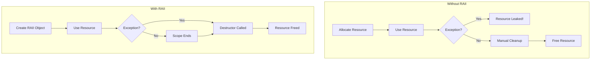

# RAII (Resource Acquisition Is Initialization) Pattern

## Intent
Bind the life cycle of a resource to the lifetime of an object, ensuring automatic resource management through constructors and destructors.

## When to Use
- Managing system resources (files, sockets, memory)
- Ensuring exception safety
- Preventing resource leaks
- Implementing scope-based resource management
- Simplifying resource cleanup

## Structure



### RAII Lifecycle



### Resource Management Flow



### Exception Safety with RAII



## Implementation Details

### Key Components
1. **Constructor**: Acquires resource
2. **Destructor**: Releases resource
3. **Deleted Copy**: Prevents double-free
4. **Move Operations**: Transfer ownership
5. **Resource Access**: Safe usage methods

### Algorithm
```
RAII Pattern:
1. Constructor acquires resource
2. Store resource handle/pointer
3. Provide access methods
4. Destructor releases resource
5. Delete copy operations
6. Implement move operations

Exception Safety:
1. Acquire resource
2. If exception thrown:
   - Constructor fails
   - No object created
   - No leak
3. If successful:
   - Object exists
   - Destructor guaranteed
   - Resource will be freed

Move Semantics:
1. Move constructor transfers ownership
2. Clear source object
3. Move assignment releases current
4. Transfer from source
5. Clear source object
```

## Advantages
- Automatic resource management
- Exception safety guaranteed
- No resource leaks
- Clear ownership semantics
- Stack unwinding cleanup

## Disadvantages
- Cannot use with incomplete types
- Overhead for simple resources
- Must handle copy/move correctly
- Destructor must not throw
- May hide resource lifetime

## Example Output
```
=== RAII (Resource Acquisition Is Initialization) Pattern Demo ===

=== File Handling RAII ===
File opened: test.txt
File closed: test.txt
File opened: test.txt
File content: Hello, RAII!
Resource management made easy.
File closed: test.txt

=== Memory Buffer RAII ===
Allocated 10 elements of type i
Buffer contents: 42 42 42 42 42 42 42 42 42 42 
Deallocated 10 elements
Allocated 5 elements of type d
Buffer2 size: 5
Deallocated 5 elements

=== Mutex Guard RAII ===
Mutex locked by thread 140735976564736
Thread 1 is working...
Mutex unlocked by thread 140735976564736
Mutex locked by thread 140735968172032
Thread 2 is working...
Mutex unlocked by thread 140735968172032
Mutex locked by thread 140735959779328
Thread 3 is working...
Mutex unlocked by thread 140735959779328

=== Database Transaction RAII ===
Connecting to database: server=localhost;db=test
Executing query: BEGIN TRANSACTION
Executing query: INSERT INTO users VALUES ('john', 'john@example.com')
Executing query: UPDATE stats SET count = count + 1
Executing query: COMMIT
Transaction committed
Executing query: BEGIN TRANSACTION
Executing query: INSERT INTO users VALUES ('jane', 'jane@example.com')
Simulating error - transaction will rollback
Executing query: ROLLBACK
Transaction rolled back
Disconnecting from database

=== Scoped Timer RAII ===
Timer 'Overall operation' started
Timer 'Step 1' started
Timer 'Step 1' elapsed: 50125 microseconds
Timer 'Step 2' started
Timer 'Step 2' elapsed: 100234 microseconds
Timer 'Overall operation' elapsed: 150892 microseconds

=== RAII Benefits ===
1. Automatic resource management
2. Exception safety
3. No resource leaks
4. Clear ownership semantics
5. Simplified code

=== RAII Rules ===
1. Acquire resources in constructor
2. Release resources in destructor
3. Never throw from destructor
4. Delete or implement copy operations
5. Implement move operations when appropriate
```

## Common Variations
1. **Smart Pointers**: `unique_ptr`, `shared_ptr`
2. **Lock Guards**: `lock_guard`, `unique_lock`
3. **Scope Guards**: Execute code on exit
4. **File Streams**: `fstream`, `ifstream`
5. **Memory Mapped Files**: RAII wrappers

## Related Patterns
- **Smart Pointer**: RAII for memory
- **Object Pool**: Reusable resources
- **Dispose Pattern**: Manual cleanup
- **Factory**: Create RAII objects
- **Proxy**: RAII proxy for resources

## Best Practices
1. Always use RAII for resources
2. Make destructors noexcept
3. Follow Rule of Five
4. Use standard RAII classes when available
5. Keep resource management simple