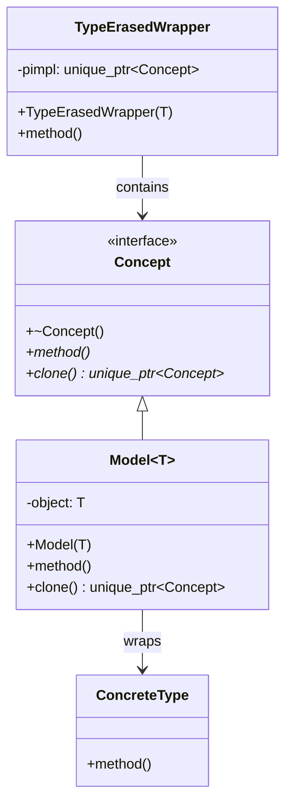
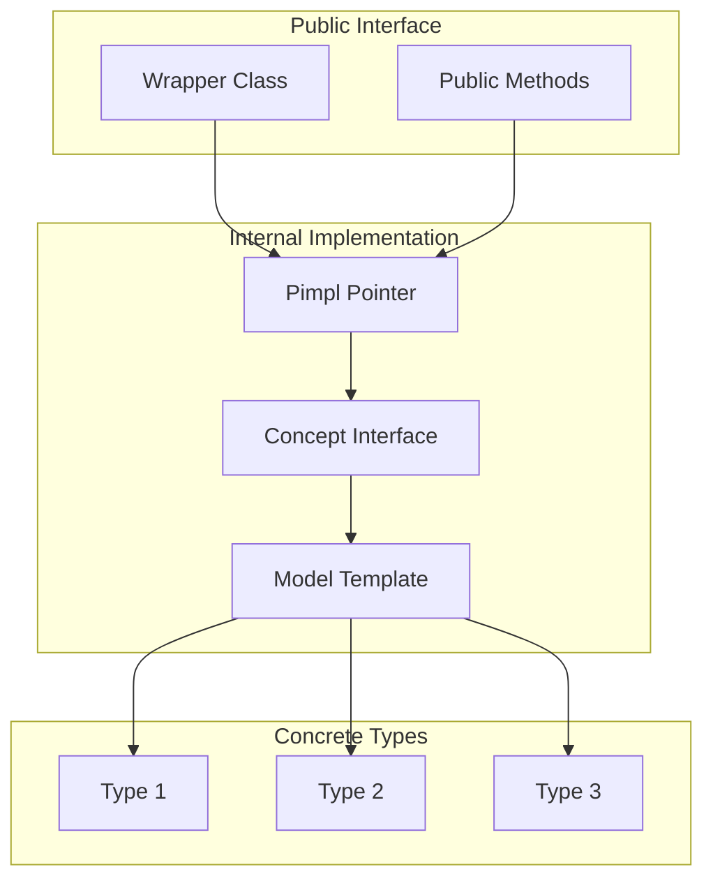
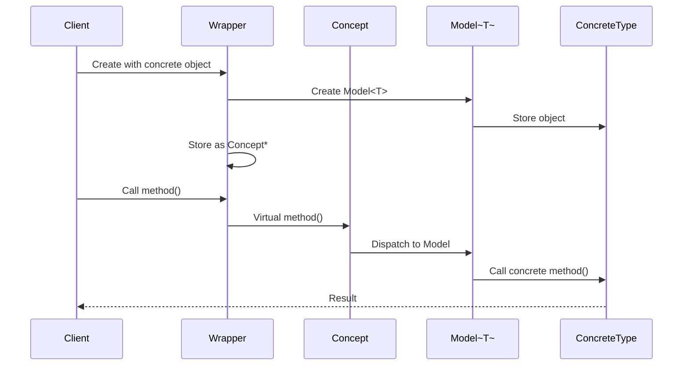
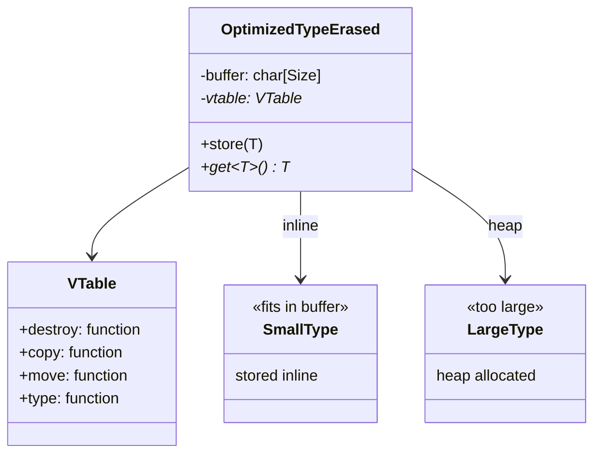

# Type Erasure Pattern

## Intent
Provide runtime polymorphism for unrelated types without requiring inheritance, allowing value semantics while hiding concrete type information.

## When to Use
- Need polymorphism without inheritance
- Want value semantics (no pointers)
- Working with third-party types
- Implementing generic containers
- Creating flexible interfaces

## Structure



### Type Erasure Components



### Type Erasure Flow



### Small Buffer Optimization



## Implementation Details

### Key Components
1. **Wrapper Class**: Public interface
2. **Concept**: Internal abstract interface
3. **Model**: Template concrete implementation
4. **Type Safety**: Template constructor
5. **Value Semantics**: Copy/move support

### Algorithm
```
Type Erasure Implementation:
1. Define Concept interface
2. Create Model<T> template
3. Wrapper stores Concept pointer
4. Template constructor creates Model<T>
5. Methods forward through Concept

Construction:
1. Accept any type T
2. Create Model<T> instance
3. Store as Concept pointer
4. Type information erased

Method Call:
1. Wrapper method called
2. Forward to Concept virtual method
3. Model<T> implements method
4. Calls concrete object method
5. Return result

Copy/Move:
1. Implement clone() in Concept
2. Model<T> clones concrete object
3. Copy constructor uses clone()
4. Move operations transfer ownership
```

## Advantages
- No inheritance required
- Value semantics
- Works with any type
- No intrusive requirements
- Flexible and extensible

## Disadvantages
- Runtime overhead (virtual calls)
- Extra memory allocation
- More complex than inheritance
- Type information lost
- Potential object slicing

## Example Output
```
=== Type Erasure Pattern Demo ===

=== Basic Type Erasure ===
Drawing all shapes:
Drawing Circle with radius 5
Drawing Rectangle 10x20
Drawing Text: "Hello, Type Erasure!"

Testing copy:
Drawing Circle with radius 5

=== Multi-Method Type Erasure ===
Zoo animals:
Buddy (age 5): Buddy says: Woof! Woof!
Whiskers (age 3): Whiskers says: Meow!
Polly (age 10): Polly says: Hello!

=== Function Type Erasure ===
Applying functions to value 5:
Result: 25
Result: 15
Result: 6
Result: 15

=== Advanced Type Erasure ===
Function reference result: 30
Integer value: 42
String value: Hello
Double value: 3.14

=== Visitor Type Erasure ===
Calculating areas:
Circle area: 78.5398
Rectangle area: 24
Triangle area: 6

Drawing shapes:
Drawing circle with radius 5
Drawing rectangle 4x6
Drawing triangle with base 3 and height 4

=== Type Erasure Benefits ===
1. Runtime polymorphism without inheritance
2. Value semantics (no pointers)
3. Decouples interface from implementation
4. No virtual function overhead in concrete types
5. Can work with third-party types
```

## Common Variations
1. **std::function**: Type-erased callable
2. **std::any**: Type-erased container
3. **Small Buffer Optimization**: Avoid heap allocation
4. **Shared Semantics**: Using shared_ptr
5. **Move-Only**: No copy operations

## Related Patterns
- **Bridge**: Separates abstraction from implementation
- **Strategy**: Type-erased strategies
- **Visitor**: Type-erased visitors
- **Adapter**: Adapts interface
- **Proxy**: Similar indirection

## Best Practices
1. Use for value semantics polymorphism
2. Consider small buffer optimization
3. Provide clear error messages
4. Document required interface
5. Prefer std::function/std::any when appropriate