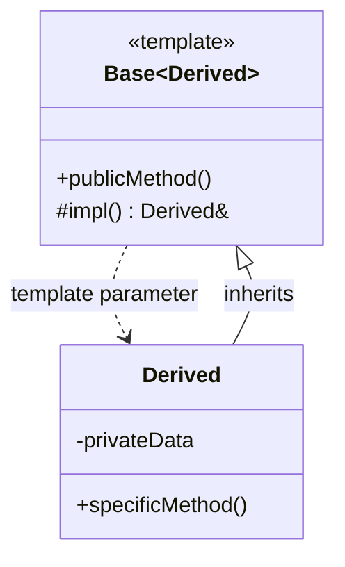
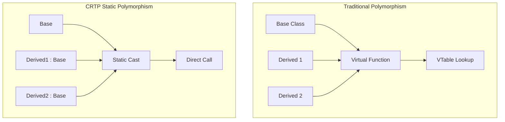
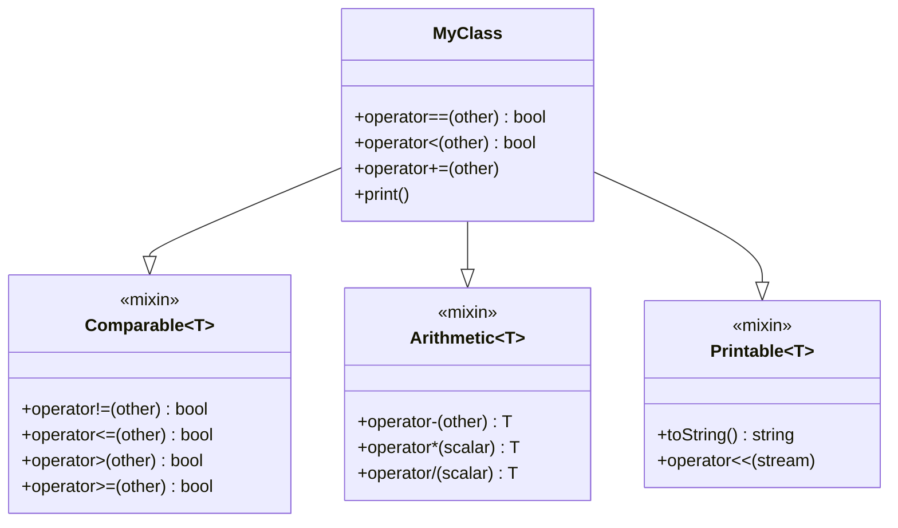
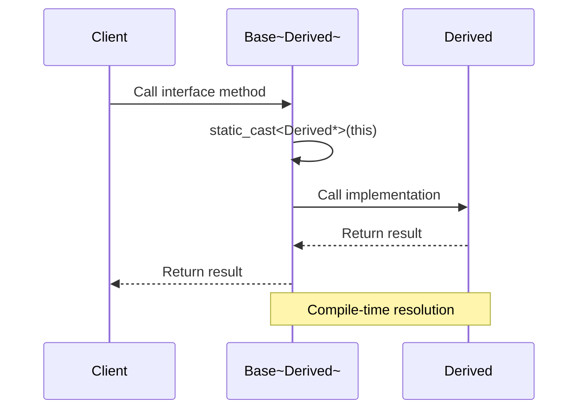

# CRTP (Curiously Recurring Template Pattern)

## Intent
Enable static polymorphism and compile-time code injection by having a base class template that takes the derived class as a template parameter.

## When to Use
- Need polymorphism without virtual function overhead
- Want compile-time polymorphism
- Implementing mixins or traits
- Adding common functionality to classes
- Performance-critical code

## Structure



### CRTP Static Polymorphism



### CRTP Mixin Architecture



### CRTP Pattern Flow



## Implementation Details

### Key Components
1. **Base Template**: Takes derived class as parameter
2. **Static Cast**: Cast this to Derived*
3. **Interface Methods**: Public methods in base
4. **Implementation**: Required methods in derived
5. **Compile-Time Resolution**: No virtual functions

### Algorithm
```
CRTP Implementation:
1. Create base template Base<Derived>
2. Derived inherits from Base<Derived>
3. Base methods cast this to Derived*
4. Call Derived implementation
5. Resolved at compile time

Static Polymorphism:
1. Template function accepts Base<T>&
2. Compiler generates code for each T
3. Direct function calls (no vtable)
4. Inlining possible
5. Better performance

Mixin Pattern:
1. Create mixin template
2. Inherit from multiple mixins
3. Provide required operations
4. Get derived operations free
5. Compose functionality
```

## Advantages
- Zero runtime overhead
- Compile-time polymorphism
- Better performance than virtual functions
- Code reuse through mixins
- Type safety at compile time

## Disadvantages
- Increases compile time
- Code bloat (template instantiation)
- Complex error messages
- No runtime polymorphism
- Must know types at compile time

## Example Output
```
=== CRTP (Curiously Recurring Template Pattern) Demo ===

=== Static Polymorphism with CRTP ===
Circle:
  Area: 78.5398
  Perimeter: 31.4159
Drawing circle with radius 5
Rectangle:
  Area: 24
  Perimeter: 20
Drawing rectangle 4x6

Triangle:
  Area: 6
  Perimeter: 12
Drawing triangle with base 3 and height 4

Performance test (1M iterations): 8234 microseconds

=== Mixin-style CRTP ===
p1 = (3, 4)
p2 = (1, 2)

Comparison operations:
p1 == p2: 0
p1 != p2: 1
p1 < p2: 0
p1 > p2: 1

Arithmetic operations:
p1 + p2 = (4, 6)
p1 - p2 = (2, 2)
p1 * 2 = (6, 8)

=== Clone Pattern with CRTP ===
Document: Report
Content: This is the original content

Original after clone modification:
Document: Report
Content: This is the original content

Clone:
Document: Report
Content: This is the modified content

Original image:
Image: photo.jpg (1920x1080)
Cloned image:
Image: photo.jpg (800x600)

=== Counter Pattern with CRTP ===
Widget 'First' created
Widget 'Second' created
Widget instances: 2
Widget 'Third' created
Gadget 101 created
Widget instances: 3
Gadget instances: 1
Widget 'Third' destroyed
Gadget 101 destroyed
After scope - Widget instances: 2
After scope - Gadget instances: 0
Widget 'Second' destroyed
Widget 'First' destroyed

Total widgets created: 3
Total gadgets created: 1
Current widget instances: 0
Current gadget instances: 0

=== Singleton Pattern with CRTP ===
Logger initialized
[LOG] First message
[LOG] Second message
Same logger instance: 1
ConfigManager initialized

App name: CRTP Demo
Version: 1.0
User: John Doe

=== CRTP Benefits ===
1. Static polymorphism (no virtual function overhead)
2. Compile-time interface enforcement
3. Mixin-style functionality
4. Code reuse without runtime cost
5. Type safety
```

## Common Variations
1. **Static Interface**: Compile-time polymorphism
2. **Mixin Classes**: Add functionality via inheritance
3. **Singleton CRTP**: Reusable singleton implementation
4. **Counter CRTP**: Instance counting
5. **Clone CRTP**: Polymorphic copying

## Related Patterns
- **Template Method**: Similar but uses virtual functions
- **Strategy**: Can use CRTP for static strategies
- **Decorator**: CRTP can add functionality
- **Policy-Based Design**: Often uses CRTP
- **Traits**: Compile-time type manipulation

## Best Practices
1. Use for performance-critical code
2. Prefer when types known at compile time
3. Document required interface clearly
4. Keep CRTP bases simple
5. Consider compilation time impact