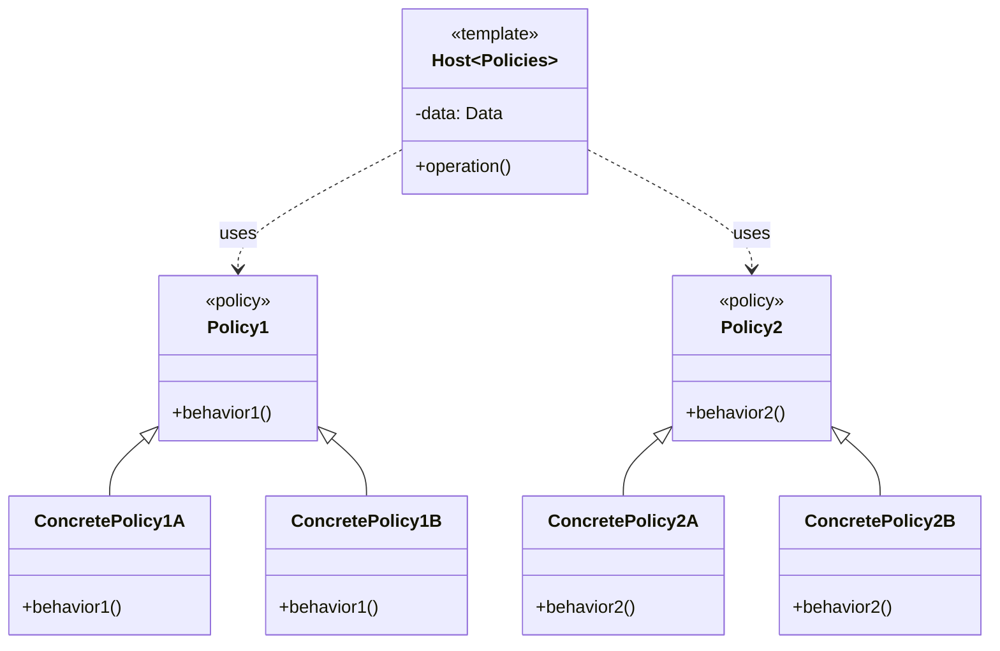
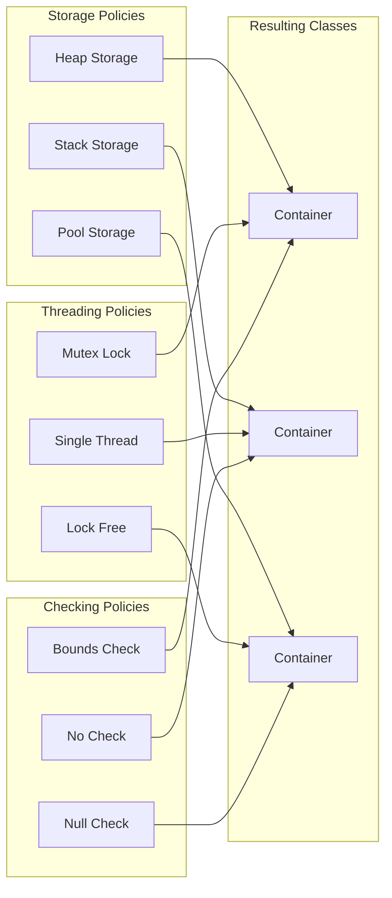
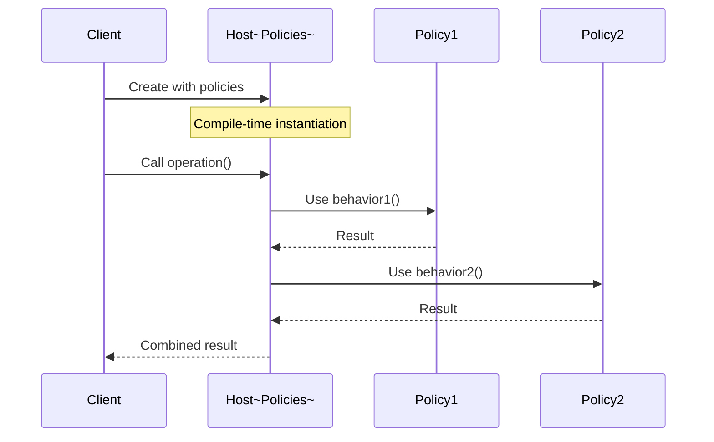
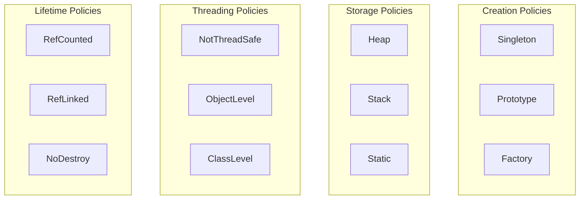

# Policy-Based Design Pattern

## Intent
Create flexible, efficient class designs by using template parameters to select behaviors (policies) at compile time, allowing orthogonal design choices to be combined independently.

## When to Use
- Need compile-time configurability
- Want to avoid runtime overhead
- Designing generic libraries
- Need orthogonal feature combinations
- Performance-critical applications

## Structure



### Policy Combination Matrix



### Policy-Based Design Flow



### Policy Categories



## Implementation Details

### Key Components
1. **Host Class**: Template class using policies
2. **Policy Classes**: Implement specific behaviors
3. **Policy Interfaces**: Expected methods/types
4. **Template Parameters**: Select policies
5. **Inheritance/Composition**: Combine policies

### Algorithm
```
Policy-Based Design:
1. Identify orthogonal concerns
2. Define policy interfaces
3. Implement policy variants
4. Create host template class
5. Combine via template parameters

Policy Requirements:
1. Each policy handles one concern
2. Policies are independent
3. Compile-time selection
4. No virtual functions
5. Static polymorphism

Combination Rules:
1. Policies can inherit from host
2. Host can inherit from policies
3. Private inheritance for implementation
4. Public inheritance for interface
5. Composition for data members
```

## Advantages
- Zero runtime overhead
- Compile-time optimization
- High flexibility
- Type safety
- Orthogonal design

## Disadvantages
- Increased compile time
- Code bloat potential
- Complex error messages
- Steep learning curve
- Documentation challenges

## Example Output
```
=== Policy-Based Design Pattern Demo ===

=== Smart Pointer with Policies ===
Unique pointer value: 42
Shared pointer value: Hello
Array pointer first element: 1
Caught exception: Null pointer access

=== Thread-Safe Container with Policies ===
Container size: 15
Fast vector size: 5

=== String Class with Policies ===
Normal string: Hello World
Upper string: HELLO WORLD!
Lower string: hello world from c++
Uppercase name: JOHN DOE

=== Allocator with Policies ===
New: Allocated 1 objects
New: Allocated 2 objects
New: Deallocated 1 objects
New: Allocated 4 objects
New: Deallocated 2 objects
New: Allocated 8 objects
New: Deallocated 4 objects
New: Allocated 16 objects
New: Deallocated 8 objects
Current memory usage: 64 bytes
Peak memory usage: 120 bytes
Pool: Allocated 1 objects
Pool: Allocated 2 objects
Pool: Deallocated 1 objects
Pool: Allocated 4 objects
Pool: Deallocated 2 objects
Pool: Allocated 8 objects
Pool: Deallocated 4 objects
Pool: Deallocated 8 objects
Malloc: Allocated 1 objects

=== Policy-Based Design Benefits ===
1. Compile-time configuration
2. No runtime overhead
3. High flexibility
4. Type safety
5. Orthogonal design
```

## Common Variations
1. **Smart Pointers**: Storage, ownership, checking policies
2. **Containers**: Threading, growth, allocation policies
3. **Strings**: Case, encoding, storage policies
4. **Allocators**: Memory source, tracking, alignment policies
5. **Singletons**: Creation, lifetime, threading policies

## Related Patterns
- **Strategy**: Runtime policy selection
- **Template Method**: Similar but uses inheritance
- **Traits**: Compile-time properties
- **CRTP**: Often used with policies
- **Mixin**: Multiple inheritance approach

## Best Practices
1. Keep policies focused on single concern
2. Document policy requirements clearly
3. Provide sensible defaults
4. Use descriptive policy names
5. Consider compilation time impact