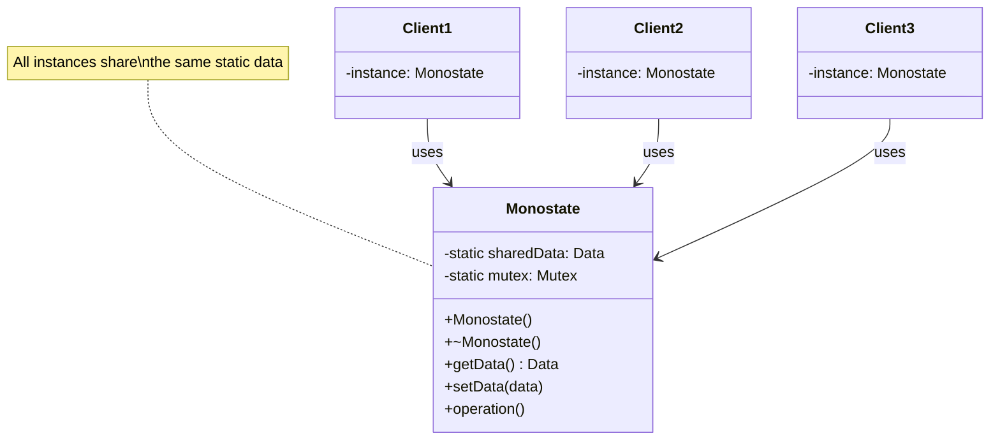
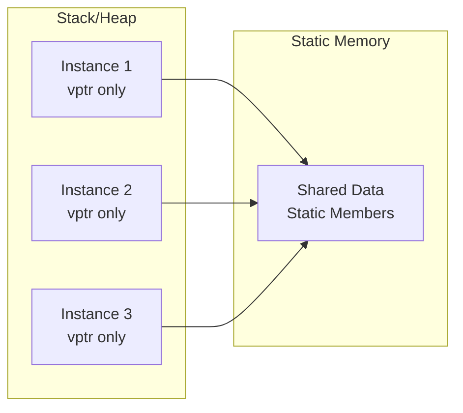
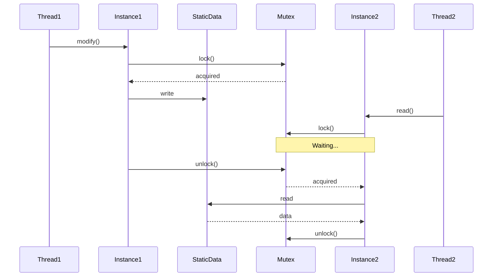

# Monostate Pattern

## Intent
Allow multiple instances of a class to share the same state by making all data members static, providing singleton behavior with normal object semantics.

## When to Use
- Want shared state across all instances
- Need normal constructor/destructor behavior
- Prefer object semantics over getInstance()
- Want to pass objects by value
- Need polymorphic behavior

## Structure



### Monostate vs Singleton

```mermaid
graph TB
    subgraph "Singleton Pattern"
        S[Single Instance] --> C1[Client 1]
        S --> C2[Client 2]
        S --> C3[Client 3]
        C1 -.-> |getInstance()| S
        C2 -.-> |getInstance()| S
        C3 -.-> |getInstance()| S
    end
    
    subgraph "Monostate Pattern"
        M1[Instance 1] --> SD[Shared Static Data]
        M2[Instance 2] --> SD
        M3[Instance 3] --> SD
        C4[Client 4] --> M1
        C5[Client 5] --> M2
        C6[Client 6] --> M3
    end
```

### Monostate Memory Layout



### Thread Safety Considerations



## Implementation Details

### Key Components
1. **Static Data Members**: Shared state
2. **Instance Methods**: Access shared state
3. **Normal Constructors**: Create instances
4. **Thread Safety**: Explicit synchronization
5. **Static Initialization**: Careful ordering

### Algorithm
```
Monostate Implementation:
1. Declare all data as static
2. Initialize static members
3. Provide normal constructors
4. Instance methods access static data
5. Handle thread safety if needed

Static Initialization:
1. Define static members outside class
2. Initialize before main()
3. Watch for initialization order
4. Consider lazy initialization
5. Handle destruction order

Thread Safety:
1. Add static mutex for shared data
2. Lock in all mutating methods
3. Consider read/write locks
4. Watch for deadlocks
5. Make operations atomic
```

## Advantages
- Normal object semantics
- Can pass by value/reference
- Works with existing interfaces
- Supports inheritance
- Multiple "instances"

## Disadvantages
- Hidden global state
- Static initialization issues
- Memory per instance overhead
- Testing difficulties
- Lifetime management complex

## Example Output
```
=== Monostate Pattern Demo ===

=== Basic Monostate Configuration ===
Initial state from config1:
Configuration:
  App Name: MyApp
  Version: 2.0.0
  Max Connections: 100
  Debug Mode: OFF
  Log Level: INFO

After modifications from different instances:
Configuration:
  App Name: MyApp
  Version: 2.0.0
  Max Connections: 200
  Debug Mode: ON
  Log Level: DEBUG

config2 sees: 200 connections
config3 sees debug mode: 1

=== Thread-Safe Monostate Logger ===
[10ms] Thread 0 message 0
[21ms] Thread 0 message 1
[21ms] Thread 1 message 0
[31ms] Thread 2 message 0
[32ms] Thread 0 message 2
[32ms] Thread 1 message 1
[42ms] Thread 2 message 1
[42ms] Thread 1 message 2
[52ms] Thread 2 message 2
Total log entries: 9
Logger2 also sees: 9 entries

=== Monostate vs Singleton ===
Monostate pattern:
MonostateCounter instance #1 created
MonostateCounter instance #2 created
MonostateCounter instance #3 created
Count from m1: 3
Count from m2: 3
Active instances: 3
MonostateCounter instance destroyed (remaining: 2)
MonostateCounter instance destroyed (remaining: 1)
MonostateCounter instance destroyed (remaining: 0)
After scope: 0 instances

Singleton pattern:
SingletonCounter created
Count: 3
Access count: 4

=== Template Monostate ===
App settings (from instance 2):
Settings for struct TemplateMonostate::AppSettings:
  autosave = true
  language = en-US
  theme = dark

User settings:
Settings for struct TemplateMonostate::UserSettings:
  email = john@example.com
  username = john_doe

Network settings:
Settings for struct TemplateMonostate::NetworkSettings:
  proxy = proxy.company.com:8080
  timeout = 30

=== Monostate Registry ===
Registered singleton: database
Registered service: cache
Database connected
Cached: key1 = value1

Registered services:
  - database (singleton)
  - cache (factory)

=== Monostate Pattern Characteristics ===
1. All instances share the same state
2. Normal constructor/destructor semantics
3. Can be passed by value or reference
4. Supports inheritance
5. Thread safety must be explicitly handled

=== Monostate vs Singleton ===
Monostate advantages:
- Normal object semantics
- Can have multiple instances
- Easier to test
- Works with existing code

Monostate disadvantages:
- Hidden global state
- Initialization order issues
- Memory overhead per instance
```

## Common Variations
1. **Template Monostate**: Different static data per type
2. **Lazy Monostate**: Lazy initialization of static data
3. **Registry Monostate**: Service locator pattern
4. **Parameterized Monostate**: Configure via template
5. **Hierarchical Monostate**: Inheritance with shared state

## Related Patterns
- **Singleton**: Alternative with single instance
- **Static Class**: All static methods
- **Object Pool**: Reuse instances
- **Flyweight**: Share immutable state
- **Registry**: Central registration point

## Best Practices
1. Document shared state clearly
2. Handle thread safety explicitly
3. Avoid complex static initialization
4. Consider Singleton instead
5. Minimize global state usage