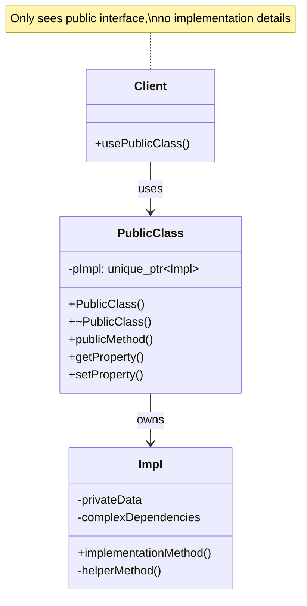
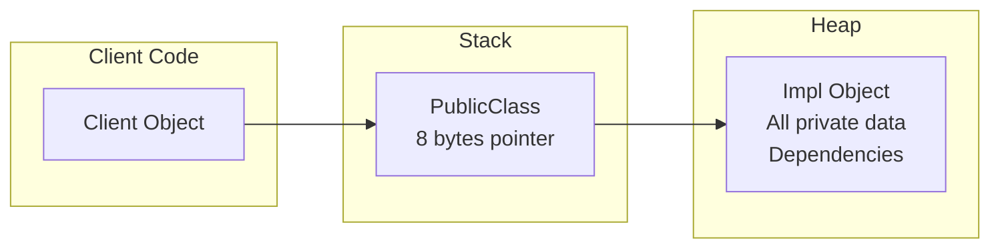
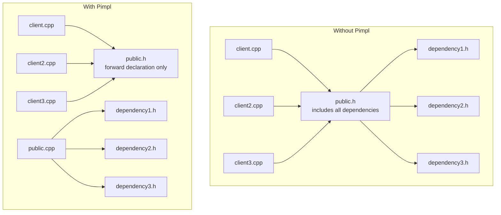
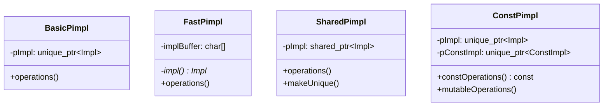

# Pimpl (Pointer to Implementation) Pattern

## Intent
Hide implementation details of a class by placing them in a separate implementation class accessed through a pointer, providing compilation firewall and ABI stability.

## When to Use
- Need to reduce compilation dependencies
- Want ABI stability across versions
- Hide implementation details completely
- Reduce header file dependencies
- Speed up compilation times

## Structure



### Pimpl Memory Layout



### Compilation Dependencies



### Pimpl Variations



## Implementation Details

### Key Components
1. **Public Class**: Client-facing interface
2. **Impl Class**: Private implementation
3. **Forward Declaration**: In header file
4. **Pointer Member**: unique_ptr or similar
5. **Special Members**: Defined in .cpp file

### Algorithm
```
Pimpl Implementation:
1. Forward declare Impl in header
2. Store unique_ptr<Impl> member
3. Define Impl class in .cpp file
4. Implement constructors in .cpp
5. Define destructor in .cpp
6. Forward public methods to Impl

Copy/Move Operations:
1. Default move is fine
2. Copy needs deep copy of Impl
3. Define in .cpp file
4. Handle nullptr checks
5. Maintain invariants

Fast Pimpl:
1. Use fixed-size buffer
2. Placement new for construction
3. Explicit destructor call
4. No heap allocation
5. Size must be known
```

## Advantages
- Compilation firewall
- Faster build times
- ABI stability
- True encapsulation
- Can change implementation freely

## Disadvantages
- Extra indirection overhead
- Heap allocation cost
- More complex code
- Can't be inlined
- Memory locality issues

## Example Output
```
=== Pimpl (Pointer to Implementation) Pattern Demo ===

=== Basic Pimpl Pattern ===
Widget::Impl default constructed
Widget::Impl constructed with name: Custom Widget
Widget::Impl constructed with name: Modified Widget
Performing operation on widget: Modified Widget
Widget 1 name: Modified Widget
Widget 1 total: 60
Widget::Impl constructed with name: Custom Widget
Widget 2 name: Custom Widget
Widget 3 name: Copied Widget
Widget::Impl destroyed: Copied Widget
Widget::Impl destroyed: Custom Widget
Widget::Impl destroyed: Modified Widget

=== Complex Pimpl with Dependencies ===
Database implementation created
Connecting to: server=localhost;database=testdb
Initializing connection pool
Connected: 1
Executing: SELECT * FROM users
Query results:
  Result 1
  Result 2
  Result 3
Disconnecting from database
Database implementation destroyed

=== Fast Pimpl (Stack Allocated) ===
Timer implementation created (in-place)
Timer started
Timer stopped
Elapsed time: 0.100234 seconds
Timer reset
Timer started
Running time: 0.050156 seconds
Timer stopped
Timer implementation destroyed

=== Shared Pimpl with Copy-on-Write ===
Document implementation created with content
Doc1 content: Original content
Doc2 content: Original content
Doc1 length: 16
Making document unique (copy-on-write)
Document implementation created with content

After modification:
Doc1 content: Original content
Doc2 content: Original content - Modified
Document implementation destroyed (accessed 2 times)
Document implementation destroyed (accessed 1 times)

=== Compilation Firewall ===
Physics engine initialized
Render engine initialized
Audio engine initialized

Running engine:
Running physics simulation
Rendering frame
Processing audio

Parameters:
Speed: 100
Quality: 0.8
Engine shutting down

=== Pimpl Pattern Benefits ===
1. Compilation firewall (faster builds)
2. ABI stability
3. Hidden implementation details
4. Reduced header dependencies
5. Value semantics with pointer performance

=== Pimpl Variations ===
1. Basic Pimpl: unique_ptr to heap implementation
2. Fast Pimpl: Stack-allocated implementation
3. Shared Pimpl: shared_ptr with copy-on-write
4. Const Pimpl: Separate const/non-const implementations
```

## Common Variations
1. **Basic Pimpl**: unique_ptr to heap implementation
2. **Fast Pimpl**: Stack buffer, no allocation
3. **Shared Pimpl**: shared_ptr for copy-on-write
4. **Const Pimpl**: Separate const implementation
5. **Lazy Pimpl**: Lazy implementation creation

## Related Patterns
- **Bridge**: Similar structure, different intent
- **Proxy**: Provides placeholder
- **Handle/Body**: Similar idiom
- **Facade**: Simplifies interface
- **Compilation Firewall**: General technique

## Best Practices
1. Define special members in .cpp
2. Use unique_ptr for ownership
3. Consider fast pimpl for performance
4. Keep public interface minimal
5. Document ABI guarantees