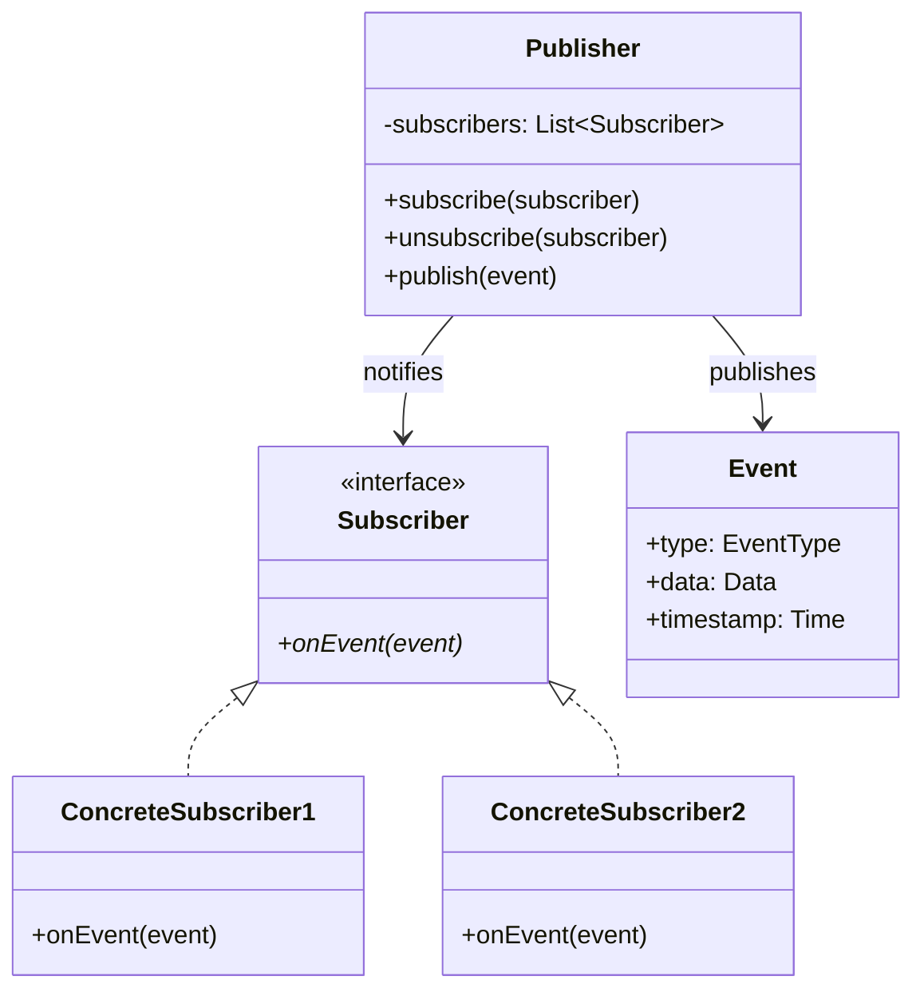
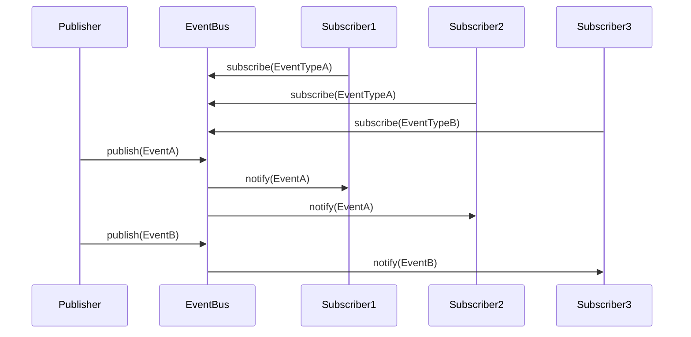
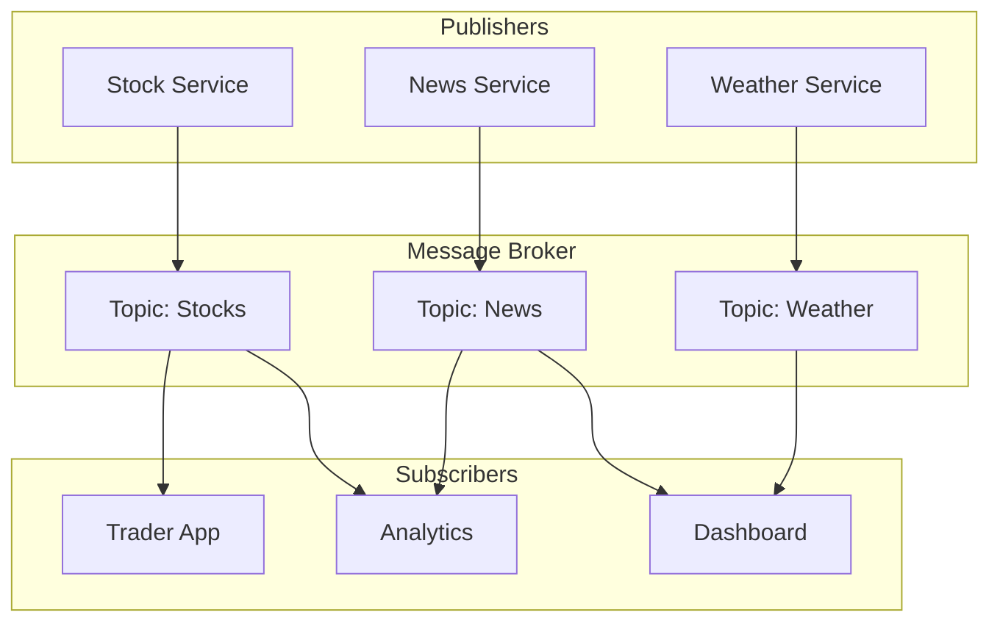

# Publish-Subscribe Pattern

## Intent
Define a one-to-many dependency between objects where a publisher notifies multiple subscribers about events or state changes without knowing their identities.

## When to Use
- Need event-driven architecture
- Want loose coupling between components
- Multiple consumers for events
- Dynamic subscription management
- Asynchronous message passing

## Structure



### Publish-Subscribe Communication Flow



### Topic-Based Architecture



### Filtered Subscription Model

```mermaid
graph LR
    subgraph "Event Stream"
        E1[Event Level=ERROR]
        E2[Event Level=INFO]
        E3[Event Level=ERROR]
        E4[Event Level=DEBUG]
    end
    
    subgraph "Filters"
        F1[Level >= WARNING]
        F2[Level == ERROR]
        F3[Source == "DB"]
    end
    
    subgraph "Subscribers"
        S1[Error Handler]
        S2[Logger]
        S3[DB Monitor]
    end
    
    E1 --> F1 --> S2
    E1 --> F2 --> S1
    E3 --> F1 --> S2
    E3 --> F2 --> S1
    E3 --> F3 --> S3
```

## Implementation Details

### Key Components
1. **Publisher**: Produces events/messages
2. **Subscriber**: Consumes events/messages
3. **Event Bus**: Manages subscriptions and routing
4. **Event/Message**: Data being published
5. **Subscription**: Publisher-subscriber relationship

### Algorithm
```
Subscription Process:
1. Subscriber registers with event bus
2. Specify event types or topics
3. Provide callback handler
4. Receive subscription ID
5. Store in subscriber list

Publishing Process:
1. Publisher creates event
2. Send to event bus
3. Event bus finds matching subscribers
4. Apply filters if any
5. Notify each subscriber
6. Handle delivery failures

Unsubscription:
1. Subscriber requests removal
2. Find subscription by ID
3. Remove from lists
4. Clean up resources
5. Confirm unsubscription
```

## Advantages
- Loose coupling
- Dynamic subscriptions
- Scalable architecture
- Event-driven design
- Supports broadcasting

## Disadvantages
- Debugging complexity
- Ordering guarantees difficult
- Memory leaks (dead subscribers)
- Performance overhead
- Error handling complexity

## Example Output
```
=== Publish-Subscribe Pattern Demo ===

=== Basic Publish-Subscribe ===
Subscriber 1 registered for struct BasicPubSub::UserLoginEvent
Subscriber 2 registered for struct BasicPubSub::UserLoginEvent
Subscriber 3 registered for struct BasicPubSub::UserLogoutEvent
Subscriber 4 registered for struct BasicPubSub::MessageEvent
Publishing struct BasicPubSub::UserLoginEvent to 2 subscribers
  Login handler: User 'alice' logged in from 192.168.1.100
  Security handler: Checking IP 192.168.1.100
Publishing struct BasicPubSub::MessageEvent to 1 subscribers
  Message from alice: Hello everyone!
Publishing struct BasicPubSub::UserLogoutEvent to 1 subscribers
  Logout handler: User 'alice' logged out
Subscriber 2 unregistered

After unsubscribing security handler:
Publishing struct BasicPubSub::UserLoginEvent to 1 subscribers
  Login handler: User 'bob' logged in from 192.168.1.101

=== Topic-Based Publish-Subscribe ===
Subscriber 'trader1' subscribed to topic 'stocks'
Subscriber 'newsReader' subscribed to topic 'news'
Subscriber 'analyst' subscribed to topic 'stocks'
Subscriber 'analyst' subscribed to topic 'news'
Publishing to topic 'stocks' (2 subscribers)
  Trader1: AAPL = $150.25
  Analyst received data on topic: stocks
Publishing to topic 'stocks' (2 subscribers)
  Trader1: GOOGL = $2750.8
  Analyst received data on topic: stocks
Publishing to topic 'news' (2 subscribers)
  NewsReader: [Finance] Tech stocks rally
  Analyst received data on topic: news
No subscribers for topic 'weather'

Broker Statistics:
  Topic 'stocks': 2 subscribers
  Topic 'news': 2 subscribers

=== Filtered Publish-Subscribe ===
Subscriber 'errorHandler' registered with priority 10
Subscriber 'warningHandler' registered with priority 5
Subscriber 'databaseLogger' registered with priority 0
Event delivered to 0 matching subscribers
Event delivered to 1 matching subscribers
  Warning+ Handler: High latency detected
Event delivered to 3 matching subscribers
  ERROR Handler: Connection failed
  Warning+ Handler: Connection failed
  DB Logger: [3] Connection failed
Event delivered to 1 matching subscribers
  DB Logger: [0] Query executed

=== Weak Reference Publish-Subscribe ===
New subscriber added (total: 1)
New subscriber added (total: 2)
Active subscribers: 2
Publishing: First message
  Observer1 received: First message
  Observer2 received: First message

After observer2 destroyed:
Active subscribers: 2
Publishing: Second message
  Observer1 received: Second message

=== Publish-Subscribe Benefits ===
1. Loose coupling between publishers and subscribers
2. Dynamic subscription/unsubscription
3. Multiple subscribers per event
4. Filtered/selective subscription
5. Asynchronous communication
```

## Common Variations
1. **Event Bus**: Central event dispatcher
2. **Topic-Based**: Subscribe to named topics
3. **Content-Based**: Filter by message content
4. **Priority-Based**: Handle by priority
5. **Weak Subscription**: Automatic cleanup

## Related Patterns
- **Observer**: Similar but more coupled
- **Mediator**: Central communication hub
- **Message Queue**: Async messaging
- **Event Sourcing**: Store events
- **Command**: Event as command

## Best Practices
1. Use weak references to prevent leaks
2. Handle subscriber failures gracefully
3. Consider thread safety
4. Document event contracts
5. Implement event filtering efficiently