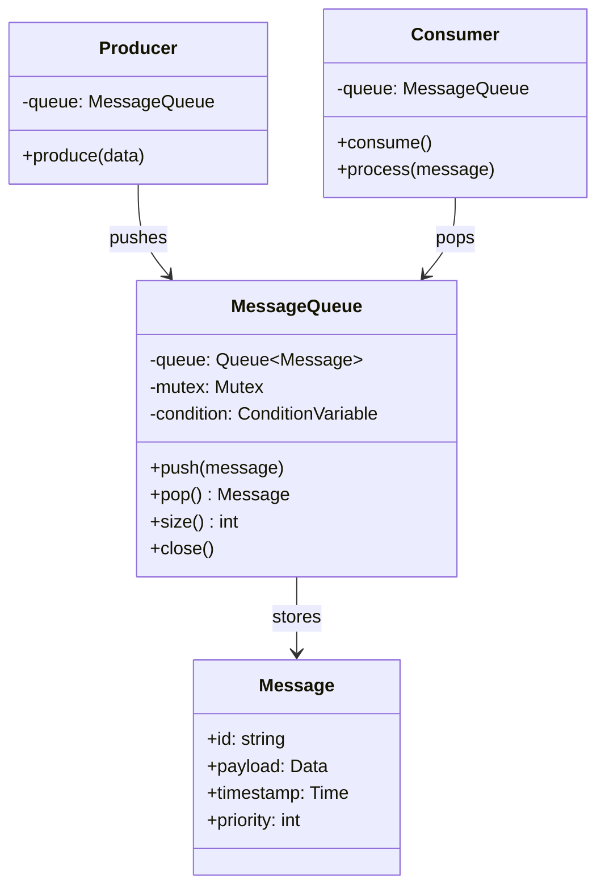
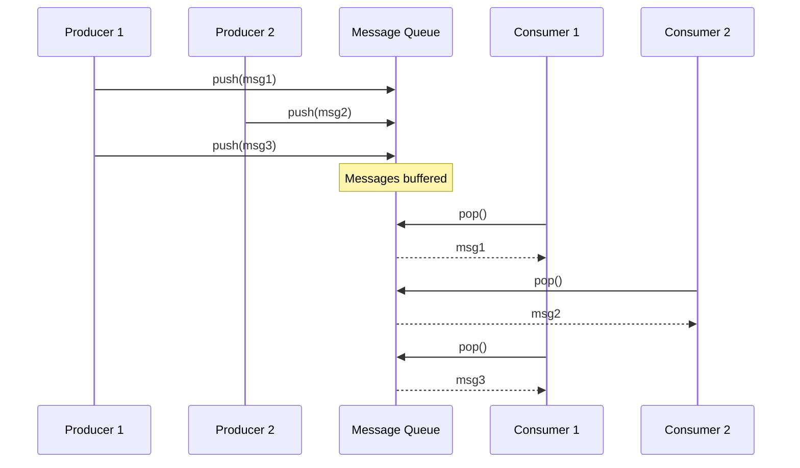
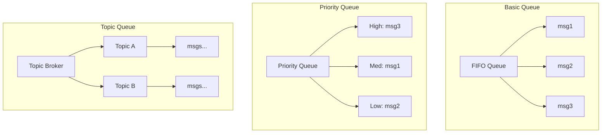
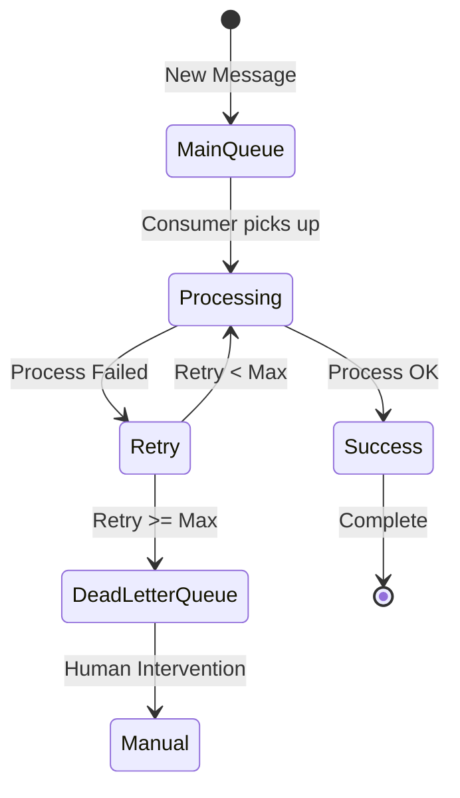

# Message Queue Pattern

## Intent
Provide asynchronous communication between components using a queue that stores messages until they can be processed, enabling decoupling of producers and consumers.

## When to Use
- Need asynchronous processing
- Want to decouple producers/consumers
- Handle load spikes
- Ensure reliable message delivery
- Implement work distribution

## Structure



### Message Flow Architecture



### Queue Types



### Dead Letter Queue Pattern



## Implementation Details

### Key Components
1. **Queue**: Thread-safe message storage
2. **Producer**: Pushes messages to queue
3. **Consumer**: Pops and processes messages
4. **Message**: Data with metadata
5. **Synchronization**: Thread safety

### Algorithm
```
Producer Algorithm:
1. Create message
2. Acquire lock
3. Wait if queue full
4. Push message
5. Notify consumers
6. Release lock

Consumer Algorithm:
1. Acquire lock
2. Wait for message
3. Pop message
4. Release lock
5. Process message
6. Handle success/failure

Dead Letter Queue:
1. Track retry count
2. Process message
3. If failed, increment retry
4. If retry < max, requeue
5. Else move to DLQ
```

## Advantages
- Asynchronous processing
- Load balancing
- Fault tolerance
- Scalability
- Decoupling

## Disadvantages
- Message ordering complexity
- Additional infrastructure
- Latency overhead
- Memory usage
- Debugging difficulty

## Example Output
```
=== Message Queue Pattern Demo ===

=== Basic Message Queue ===
Message pushed. Queue size: 1
Producer: Sent message 1
Message popped. Queue size: 0
Consumer: Received message 1: Message 1
Message pushed. Queue size: 1
Producer: Sent message 2
Message pushed. Queue size: 2
Producer: Sent message 3
Message popped. Queue size: 1
Consumer: Received message 2: Message 2
Message pushed. Queue size: 2
Producer: Sent message 4
Message pushed. Queue size: 3
Producer: Sent message 5
Message pushed. Queue size: 4
Producer: Sent message 6
Message popped. Queue size: 3
Consumer: Received message 3: Message 3
Producer: Sent message 7
Consumer: Queue closed
Producer: Queue closed

=== Priority Message Queue ===
Processing [Priority 3]: Urgent task
Processing [Priority 3]: Another urgent task
Processing [Priority 2]: High priority task
Processing [Priority 1]: Normal task
Processing [Priority 0]: Low priority task

=== Topic-Based Message Queue ===
Subscriber added to topic 'logs'
Subscriber added to topic 'metrics'
Subscriber added to topic 'alerts'
Published to topic 'logs'. Queue size: 1
Published to topic 'metrics'. Queue size: 1
Published to topic 'alerts'. Queue size: 1
Published to topic 'logs'. Queue size: 2
Published to topic 'metrics'. Queue size: 2
  Log handler: Application started
  Metric handler: 42
  Alert handler: High CPU usage
  Log handler: User logged in
  Metric handler: 85

=== Dead Letter Queue ===
Processing: Good message
  Successfully processed
Processing: Bad message
  Failed to process!
Message requeued. Retry 1/3
Processing: Another good message
  Successfully processed
Processing: Bad message
  Failed to process!
Message requeued. Retry 2/3
Processing: Bad message
  Failed to process!
Message moved to dead letter queue after 3 retries

Dead Letter Queue contains:
  Bad message

=== Pub-Sub Queue with Acknowledgment ===
Subscriber 'Worker1' registered
Subscriber 'Worker2' registered
Published message MSG1
Published message MSG2
Worker1 consumed: Task 1
Worker2 consumed: Task 1
Message MSG1 acknowledged by Worker1
Message MSG1 fully acknowledged and removed

Queue Status:
  Pending: 1
  In-flight: 0
  Subscribers: 2

=== Message Queue Benefits ===
1. Decouples producers and consumers
2. Handles load spikes
3. Enables async processing
4. Provides reliability
5. Supports various messaging patterns
```

## Common Variations
1. **FIFO Queue**: First in, first out
2. **Priority Queue**: Message priority ordering
3. **Topic Queue**: Publish-subscribe topics
4. **Dead Letter Queue**: Failed message handling
5. **Delayed Queue**: Scheduled delivery

## Related Patterns
- **Producer-Consumer**: Core pattern
- **Publish-Subscribe**: Topic-based messaging
- **Observer**: Event notification
- **Command**: Messages as commands
- **Async Method**: Async execution

## Best Practices
1. Handle queue full/empty conditions
2. Implement proper acknowledgment
3. Consider message persistence
4. Monitor queue metrics
5. Plan for error handling