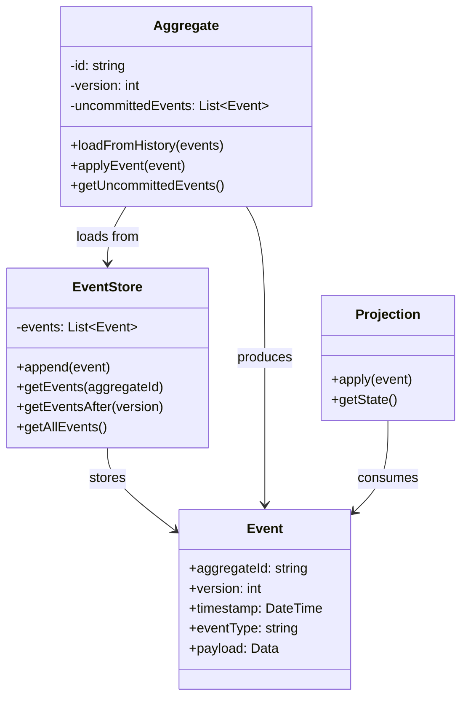
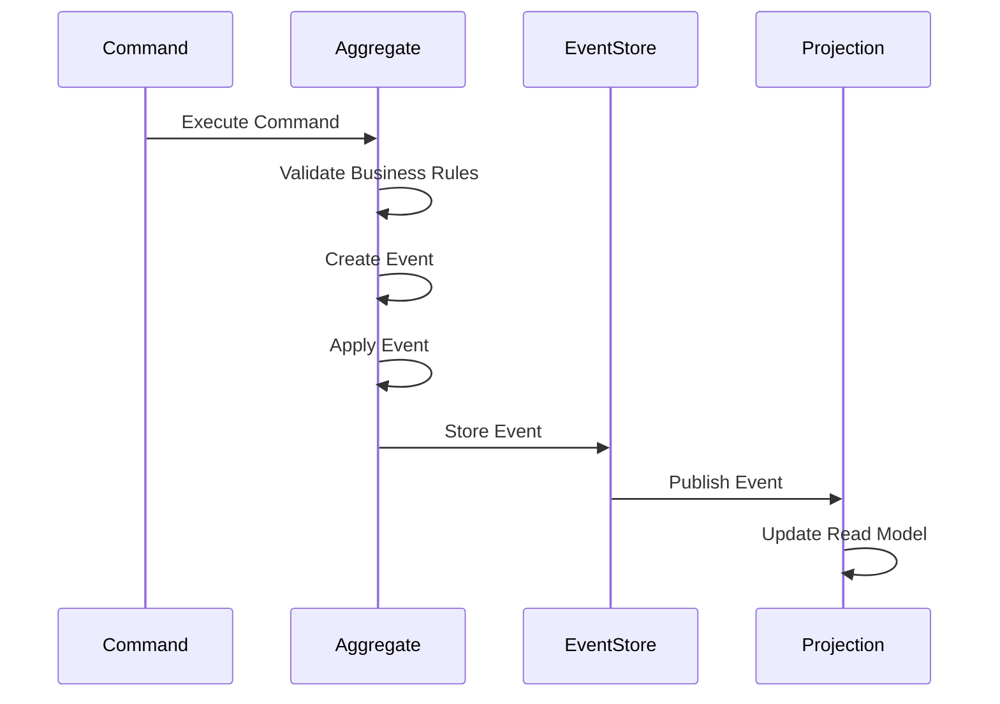
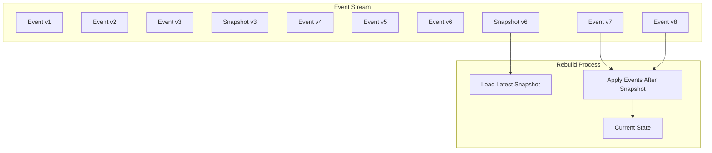
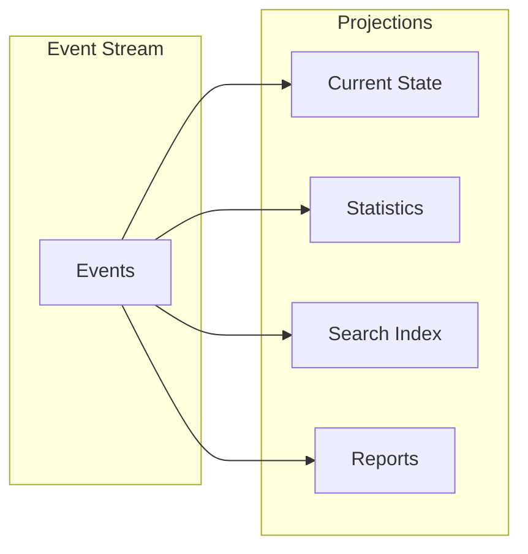

# Event Sourcing Pattern

## Intent
Store the state of an application as a sequence of events rather than just the current state, enabling complete audit trails and the ability to reconstruct past states.

## When to Use
- Need complete audit trail
- Want to replay events
- Require temporal queries
- Building CQRS systems
- Need event-driven architecture

## Structure



### Event Flow Architecture



### Event Store with Snapshots



### Projection Types



## Implementation Details

### Key Components
1. **Event**: Immutable record of state change
2. **Event Store**: Persistent event storage
3. **Aggregate**: Domain object that produces events
4. **Projection**: Read model built from events
5. **Snapshot**: Periodic state capture

### Algorithm
```
Command Processing:
1. Load aggregate from events
2. Execute command
3. Validate business rules
4. Create domain event
5. Apply event to aggregate
6. Store event in event store
7. Publish to projections

Event Replay:
1. Get all events for aggregate
2. Create new aggregate instance
3. Apply each event in order
4. Aggregate reaches current state

Snapshot Strategy:
1. Every N events, create snapshot
2. Store aggregate state
3. When rebuilding:
   - Load latest snapshot
   - Apply events after snapshot
```

## Advantages
- Complete audit trail
- Event replay capability
- Temporal queries
- Multiple projections
- Natural event-driven

## Disadvantages
- Storage overhead
- Eventual consistency
- Complex querying
- Schema evolution
- Performance considerations

## Example Output
```
=== Event Sourcing Pattern Demo ===

=== Basic Event Sourcing ===
Event stored: AccountCreated: John Doe with balance $1000 (v1)
Event stored: MoneyDeposited: $500 - Salary (v2)
Event stored: MoneyWithdrawn: $200 - Groceries (v3)
Event stored: MoneyDeposited: $100 - Gift (v4)
Event stored: MoneyWithdrawn: $50 - Gas (v5)

Current balance: $1350

Rebuilding account from event store:
Rebuilt account balance: $1350
Account holder: John Doe
Version: 5

=== Event Sourcing with Snapshots ===

Shopping Cart (v3):
  Laptop - $999.99 x 1 = $999.99
  Mouse - $29.99 x 2 = $59.98
  Keyboard - $79.99 x 1 = $79.99
Total: $1139.96

Snapshot created at version 3

Shopping Cart (v5):
  Laptop - $999.99 x 1 = $999.99
  Mouse - $29.99 x 1 = $29.99
  Keyboard - $79.99 x 1 = $79.99
  Monitor - $299.99 x 1 = $299.99
Total: $1409.96

Restoring from snapshot:

Shopping Cart (v3):
  Laptop - $999.99 x 1 = $999.99
  Mouse - $29.99 x 2 = $59.98
  Keyboard - $79.99 x 1 = $79.99
Total: $1139.96

=== Event Sourcing with Projections ===

Order Status Projection:
  Order ORD001 (Customer: CUST001) - Status: Delivered (Tracking: TRACK123)
  Order ORD002 (Customer: CUST002) - Status: Placed
  Order ORD003 (Customer: CUST001) - Status: Shipped (Tracking: TRACK456)

Customer Order Count Projection:
  Customer CUST001: 2 orders
  Customer CUST002: 1 orders

=== Event Replay ===

Replaying events until specified time:
  [15:30:45] User user1 LOGIN system - SUCCESS
  [15:30:45] User user1 READ document1 - SUCCESS
  [15:30:45] User user2 LOGIN system - SUCCESS

=== Event Sourcing Benefits ===
1. Complete audit trail
2. Time travel debugging
3. Event replay capability
4. Multiple projections
5. Natural fit for CQRS
```

## Common Variations
1. **Basic Event Sourcing**: Simple event storage
2. **Snapshot Event Sourcing**: Periodic state capture
3. **CQRS/ES**: Command Query Responsibility Segregation
4. **Event Store as Message Bus**: Pub/sub integration
5. **Retroactive Events**: Insert events in past

## Related Patterns
- **Command**: Commands trigger events
- **CQRS**: Often used together
- **Memento**: Similar state capture
- **Observer**: Event notification
- **Repository**: Event store interface

## Best Practices
1. Keep events immutable
2. Version events for evolution
3. Use snapshots for performance
4. Design meaningful event names
5. Consider event expiration