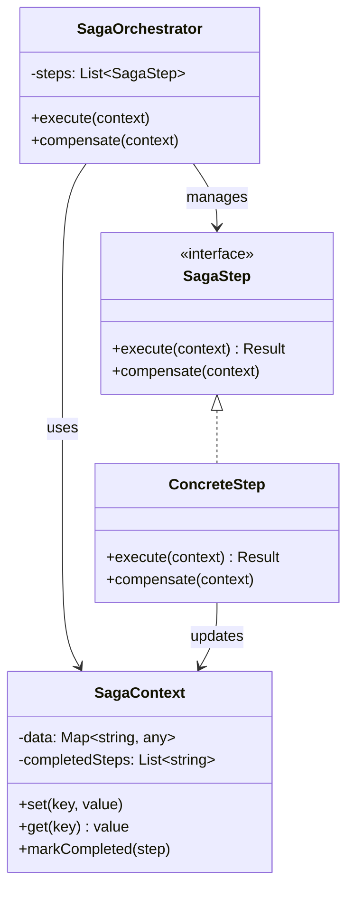
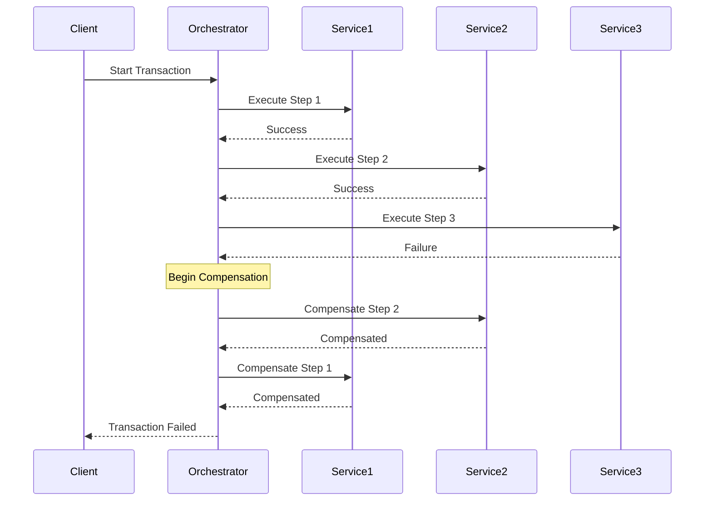
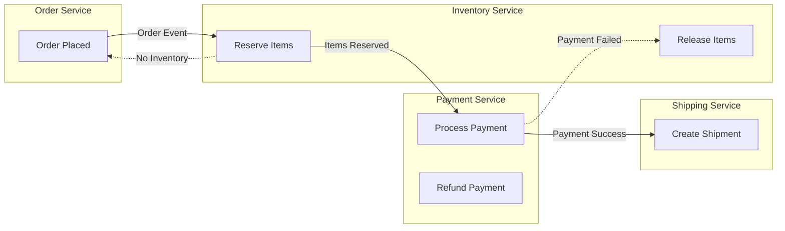
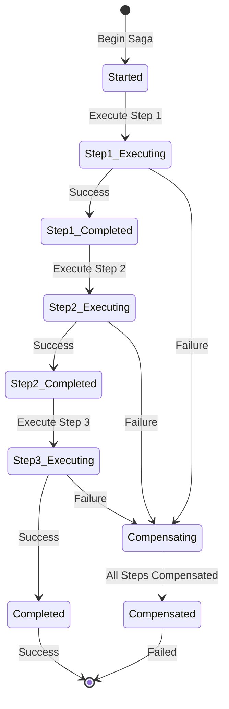

# Saga Pattern

## Intent
Manage distributed transactions across multiple services or components by breaking them into a series of local transactions, where each transaction updates data within a single service and publishes events to trigger the next transaction.

## When to Use
- Distributed transactions across services
- Microservices architecture
- Long-running business transactions
- Need for compensating actions
- Maintaining data consistency

## Structure



### Orchestration-Based Saga Flow



### Choreography-Based Saga



### Saga State Machine



## Implementation Details

### Key Components
1. **Saga Orchestrator**: Coordinates transaction steps
2. **Saga Step**: Individual transaction operation
3. **Compensation**: Undo operation for each step
4. **Saga Context**: Shared state between steps
5. **Event Bus**: For choreography-based sagas

### Algorithm
```
Orchestration-Based Saga:
1. Initialize saga context
2. For each step in sequence:
   a. Execute step
   b. If success, mark completed
   c. If failure, begin compensation
3. If compensation needed:
   a. For each completed step (reverse):
      - Execute compensation
   b. Mark saga as failed
4. Return final result

Choreography-Based Saga:
1. Service receives event
2. Process local transaction
3. If success:
   a. Publish success event
   b. Next service handles
4. If failure:
   a. Publish failure event
   b. Previous services compensate
```

## Advantages
- No distributed locks
- Fault tolerance
- Service autonomy
- Compensating actions
- Long-running support

## Disadvantages
- Complex error handling
- Eventual consistency
- Compensation complexity
- Debugging difficulty
- Business logic distribution

## Example Output
```
=== Saga Pattern Demo ===

=== Basic Saga Pattern (Orchestration) ===

--- Successful Order Processing ---

Starting saga execution...
==========================

Executing step: ReserveInventory
Reserving inventory for order ORDER-001 (3 items)
  Success: Inventory reserved

Executing step: ProcessPayment
Processing payment for order ORDER-001 ($150)
  Success: Payment processed

Executing step: CreateShipment
Creating shipment for order ORDER-001
  Success: Shipment created

Saga completed successfully!

--- Failed Order Processing (Payment Failure) ---

Starting saga execution...
==========================

Executing step: ReserveInventory
Reserving inventory for order ORDER-002 (2 items)
  Success: Inventory reserved

Executing step: ProcessPayment
Processing payment for order ORDER-002 ($1500)
  Failed: Payment declined

Step failed! Starting compensation...
===================================

Compensating step: ReserveInventory
Compensating: Releasing inventory for order ORDER-002

Compensation completed

=== Choreography-Based Saga ===

--- Successful Order Flow ---
Processing event: 0 for order ORDER-101
  InventoryService: Checking inventory for order ORDER-101
    Inventory available, reserving...
Processing event: 1 for order ORDER-101
  PaymentService: Processing payment for order ORDER-101
    Payment successful
Processing event: 3 for order ORDER-101
  ShippingService: Creating shipment for order ORDER-101
Processing event: 5 for order ORDER-101

--- Failed Order Flow (Insufficient Inventory) ---
Processing event: 0 for order ORDER-102
  InventoryService: Checking inventory for order ORDER-102
    Insufficient inventory!
Processing event: 2 for order ORDER-102

  SagaCoordinator: Handling failure for order ORDER-102
  Initiating compensation...
Processing event: 7 for order ORDER-102
  InventoryService: Releasing inventory for cancelled order ORDER-102
  PaymentService: Refunding payment for cancelled order ORDER-102

=== Saga with Timeout and Retry ===

--- External API Call with Retry ---
Executing External API Call (attempt 1/3)
  Timeout after 600ms
  Retrying...
Executing External API Call (attempt 2/3)
  Timeout after 600ms
  Retrying...
Executing External API Call (attempt 3/3)
  Success in 0ms
API call eventually succeeded!

--- Database Operation with Timeout ---
Executing Database Update (attempt 1/2)
  Timeout after 200ms
  Retrying...
Executing Database Update (attempt 2/2)
  Timeout after 200ms
  All attempts failed. Compensating...
  Compensating: Rolling back database changes

=== Distributed Saga with Logging ===

--- Successful Distributed Transaction ---
[SagaLog] SAGA-001 - SAGA_STARTED
[SagaLog] SAGA-001 - STEP_STARTED - Step1
  Updating user account...
[SagaLog] SAGA-001 - STEP_COMPLETED - Step1
[SagaLog] SAGA-001 - STEP_STARTED - Step2
  Charging credit card...
[SagaLog] SAGA-001 - STEP_COMPLETED - Step2
[SagaLog] SAGA-001 - STEP_STARTED - Step3
  Sending confirmation email...
[SagaLog] SAGA-001 - STEP_COMPLETED - Step3
[SagaLog] SAGA-001 - SAGA_COMPLETED

Saga History for SAGA-001:
================================
15:45:23 - 
15:45:23 - Step1
15:45:23 - Step1
15:45:23 - Step2
15:45:23 - Step2
15:45:23 - Step3
15:45:23 - Step3
15:45:23 - 

--- Failed Distributed Transaction ---
[SagaLog] SAGA-002 - SAGA_STARTED
[SagaLog] SAGA-002 - STEP_STARTED - Step1
  Creating order record...
[SagaLog] SAGA-002 - STEP_COMPLETED - Step1
[SagaLog] SAGA-002 - STEP_STARTED - Step2
  Reserving items...
[SagaLog] SAGA-002 - STEP_COMPLETED - Step2
[SagaLog] SAGA-002 - STEP_STARTED - Step3
  Processing payment...
    Payment gateway timeout!
[SagaLog] SAGA-002 - STEP_FAILED - Step3
[SagaLog] SAGA-002 - COMPENSATION_STARTED
  Releasing reserved items
[SagaLog] SAGA-002 - COMPENSATION_COMPLETED - Step2
  Deleting order record
[SagaLog] SAGA-002 - COMPENSATION_COMPLETED - Step1
[SagaLog] SAGA-002 - SAGA_ABORTED

=== Saga Pattern Benefits ===
1. Manages distributed transactions
2. Provides compensation mechanism
3. Maintains data consistency
4. Handles partial failures
5. Supports long-running transactions
```

## Common Variations
1. **Orchestration-Based**: Central coordinator
2. **Choreography-Based**: Event-driven coordination
3. **Hybrid Saga**: Mix of both approaches
4. **Timed Saga**: With timeout handling
5. **Persistent Saga**: With state durability

## Related Patterns
- **Command**: Commands as saga steps
- **Event Sourcing**: Store saga events
- **Compensating Transaction**: Undo operations
- **Process Manager**: Similar coordination
- **Unit of Work**: Transaction management

## Best Practices
1. Design idempotent operations
2. Log all saga state changes
3. Handle timeouts explicitly
4. Test compensation logic thoroughly
5. Monitor saga execution metrics