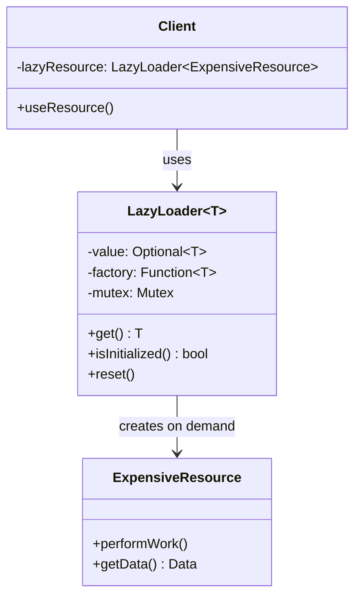
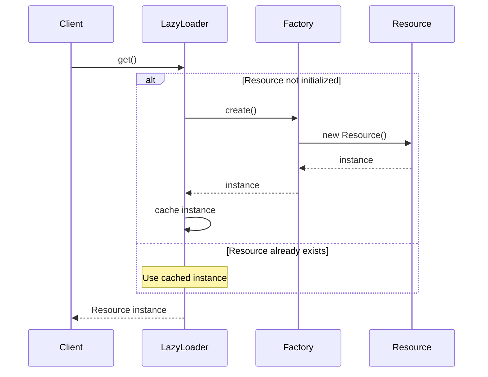
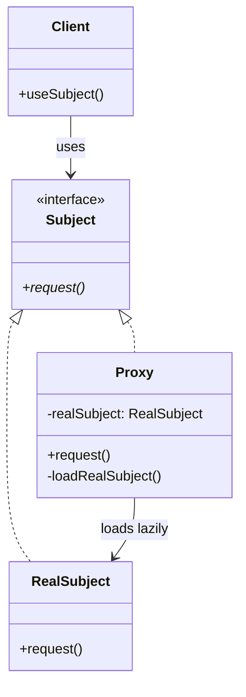
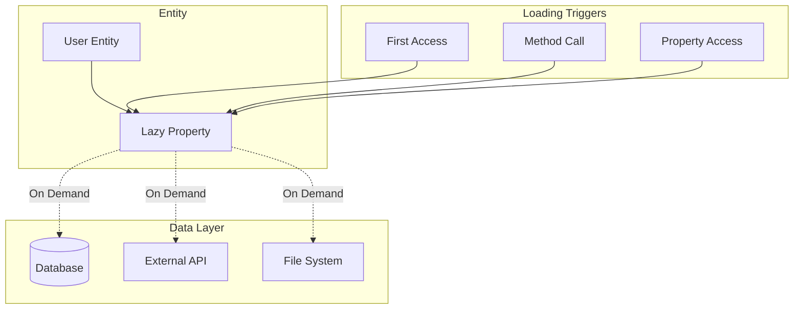

# Lazy Loading Pattern

## Intent
Defer the initialization or loading of an expensive resource until it's actually needed, improving performance and reducing memory usage by avoiding unnecessary work.

## When to Use
- Expensive resource creation
- Large data sets
- Network operations
- File I/O operations
- Memory optimization needed

## Structure



### Lazy Initialization Flow



### Virtual Proxy Pattern



### Lazy Collection Loading



## Implementation Details

### Key Components
1. **Lazy Container**: Holds optional value and factory
2. **Factory Function**: Creates the expensive resource
3. **Thread Safety**: Mutex for concurrent access
4. **Initialization Check**: Avoid duplicate creation
5. **Reset Mechanism**: Allow re-initialization

### Algorithm
```
Lazy Loading Process:
1. Check if resource is initialized
2. If not initialized:
   a. Acquire lock (thread safety)
   b. Double-check initialization
   c. Call factory function
   d. Store result
   e. Release lock
3. Return cached resource

Virtual Proxy:
1. Proxy created with minimal cost
2. On first method call:
   a. Create real object
   b. Delegate call to real object
3. Cache real object reference
4. Subsequent calls use cached object
```

## Advantages
- Improved startup performance
- Reduced memory usage
- Load-on-demand behavior
- Resource optimization
- Better responsiveness

## Disadvantages
- Unpredictable loading times
- Thread safety complexity
- Hidden dependencies
- Memory overhead for lazy containers
- Debugging complexity

## Example Output
```
=== Lazy Loading Pattern Demo ===

=== Basic Lazy Loading ===

Creating service (resource not loaded yet):
Resource loaded: 0

First access (triggers loading):
Lazy evaluation triggered
Creating expensive resource: DB-001
Data: Loaded data for DB-001
Resource loaded: 1

Second access (uses cached value):
Data: Loaded data for DB-001

=== Lazy Collection Loading ===

Creating user entity (orders not loaded yet):
Loading user 123 from database...
User: User123 (user123@example.com)
Orders loaded: 0

Accessing orders (triggers loading):
Lazy loading collection...
Loading orders for user 123 from database...
Total orders: 3
Orders loaded: 1

Calculating total spent (uses cached orders):
Total spent: $289.97

Order details:
  Order 1: Laptop - $99.99
  Order 2: Mouse - $29.99
  Order 3: Monitor - $159.99

=== Lazy Property Loading ===

Creating document (properties not loaded yet):
Loaded properties for design_patterns.txt:
  Content: No
  Word Count: No
  Keywords: No

Accessing content (triggers loading):
Loading lazy property: content
Reading file: design_patterns.txt
Content length: 84 characters
Loaded properties for design_patterns.txt:
  Content: Yes
  Word Count: No
  Keywords: No

Accessing word count (triggers loading):
Loading lazy property: wordCount
Calculating word count...
Word count: 14 words
Loaded properties for design_patterns.txt:
  Content: Yes
  Word Count: Yes
  Keywords: No

Accessing keywords (triggers loading):
Loading lazy property: keywords
Extracting keywords...
Keywords: design patterns lazy loading 
Loaded properties for design_patterns.txt:
  Content: Yes
  Word Count: Yes
  Keywords: Yes

=== Lazy Singleton ===

Creating user service (DB connection not created yet):

First database operation (triggers connection creation):
Establishing database connection: postgresql://localhost:5432/mydb
Executing query: INSERT INTO users (name) VALUES ('Alice')

Second database operation (reuses connection):
Executing query: DELETE FROM users WHERE id = 1

Third database operation (reuses connection):
Executing query: INSERT INTO users (name) VALUES ('Bob')

=== Virtual Proxy with Lazy Loading ===

Creating image gallery (images not loaded yet):
ImageProxy created for: photo1.jpg
ImageProxy created for: photo2.jpg
ImageProxy created for: photo3.jpg

Gallery contains 3 images:
  [0] photo1.jpg (loaded: No)
  [1] photo2.jpg (loaded: No)
  [2] photo3.jpg (loaded: No)

Displaying first image (triggers loading):
Proxy: Loading real image on demand
Loading image: photo1.jpg
Image loaded: 800x600
Displaying image: photo1.jpg (800x600)

Gallery contains 3 images:
  [0] photo1.jpg (loaded: Yes)
  [1] photo2.jpg (loaded: No)
  [2] photo3.jpg (loaded: No)

Displaying third image (triggers loading):
Proxy: Loading real image on demand
Loading image: photo3.jpg
Image loaded: 800x600
Displaying image: photo3.jpg (800x600)

Gallery contains 3 images:
  [0] photo1.jpg (loaded: Yes)
  [1] photo2.jpg (loaded: No)
  [2] photo3.jpg (loaded: Yes)

Displaying first image again (uses cached):
Displaying image: photo1.jpg (800x600)

=== Lazy Loading Benefits ===
1. Defers expensive operations
2. Improves initial load times
3. Saves memory and resources
4. Load-on-demand behavior
5. Better user experience
```

## Common Variations
1. **Basic Lazy Initialization**: Simple deferred creation
2. **Lazy Collections**: Load data sets on demand
3. **Lazy Properties**: Object properties loaded individually
4. **Virtual Proxy**: Proxy pattern with lazy loading
5. **Lazy Singleton**: Singleton with deferred initialization

## Related Patterns
- **Proxy**: Virtual proxy for lazy loading
- **Singleton**: Lazy singleton initialization
- **Factory**: Creates objects on demand
- **Observer**: Notify when loading completes
- **Strategy**: Different loading strategies

## Best Practices
1. Ensure thread safety in concurrent environments
2. Handle loading failures gracefully
3. Provide loading progress indicators
4. Consider memory implications of caching
5. Document lazy loading behavior clearly